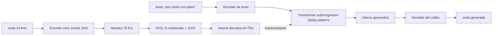

# 093 — Generación musical y de audio

> [← Clase anterior](../../../classes/part-07-generative-ai-across-media/092-control-estructural-y-edicion-generativa/README.md) · [Índice de la parte](../README.md) · [Clase siguiente →](../../../classes/part-07-generative-ai-across-media/094-sintesis-de-voz-y-derechos-de-identidad/README.md)

**Parte:** 07 — IA generativa para texto, imagen, audio, video y 3D  
**Nivel:** avanzado · **Horas estimadas:** 6  
**Laboratorio:** `generation` · **Estado:** `EXECUTABLE_CORE`

## 🎯 Propósito

Comprender **generación musical y de audio** dentro de la evolución de la inteligencia
artificial, implementar un experimento mínimo verificable y distinguir qué parte
constituye evidencia frente a una afirmación todavía no comprobada.

## 📚 Resultados de aprendizaje

Al finalizar podrás:

1. Explicar generación musical y de audio usando los conceptos `audio`, `música`, `codecs`, `difusión`.
2. Ejecutar el laboratorio con una semilla explícita y revisar su contrato JSON.
3. Identificar al menos un supuesto, una limitación y un riesgo de aplicación.
4. Comparar el enfoque con la etapa anterior de la ruta de aprendizaje.
5. Producir una evidencia reproducible y una conclusión que no exceda los datos.

## 🧩 Conceptos centrales

`audio`, `música`, `codecs`, `difusión`

## 🗺️ Ubicación en el mapa de la IA

El audio plantea un problema que la imagen no tiene: la escala temporal. Un segundo
de audio crudo son 24 000-48 000 muestras, así que generar un minuto muestra a
muestra (WaveNet, 2016) era prohibitivo. La solución moderna —códecs neuronales que
comprimen la onda a tokens discretos (SoundStream, EnCodec) sobre los que un
transformer autorregresivo genera como si fuera texto (AudioLM, MusicGen)— traslada
al audio las técnicas de las partes 05-06, y compite con la difusión sobre
espectrogramas. La clase 094 (síntesis de voz) reutiliza estas mismas
representaciones.

## 📖 Fundamentos

### 🎵 Tres representaciones del audio

- **Forma de onda**: la señal cruda x(t), una amplitud por muestra. PCM sin comprimir
  a 24 kHz y 16 bits son 384 000 bits/s. Máxima fidelidad, secuencias larguísimas.
- **Espectrograma mel**: magnitud de la STFT proyectada a ~80-128 bandas mel
  (escala perceptual de frecuencia), típicamente ~100 frames/s. Es una "imagen"
  tiempo×frecuencia: sirve para difusión estilo imagen, pero descarta la fase — hace
  falta un **vocoder** (HiFi-GAN, difusión) para volver a la onda.
- **Tokens neuronales**: un códec neuronal (encoder convolucional + cuantización +
  decoder) convierte la onda en una secuencia corta de índices discretos de
  vocabulario finito. Es la representación nativa para transformers.

### 🧊 Códecs neuronales y cuantización vectorial residual (RVQ)

SoundStream (Zeghidour et al., 2021) y EnCodec (Défossez et al., 2022) comprimen así:
el encoder reduce 24 000 muestras/s a ~75 vectores latentes/s (stride total 320). Cada
vector continuo se discretiza con **RVQ**: una cascada de Q codebooks donde cada uno
cuantiza el *residuo* que dejó el anterior:

```text
r₁ = z                      # vector latente del frame
para q = 1 … Q:
    kq = argmin_k ‖rq − C_q[k]‖    # entrada más cercana del codebook q
    r_{q+1} = rq − C_q[kq]         # el residuo pasa al siguiente codebook
z ≈ C_1[k1] + C_2[k2] + … + C_Q[kQ]
```

Cada frame queda representado por Q índices (uno por codebook). Con codebooks de K
entradas, cada índice cuesta log₂(K) bits. La primera capa captura lo grueso; las
siguientes refinan detalles: se puede truncar a menos codebooks para bajar el bitrate
a costa de calidad (bitrate escalable). El entrenamiento combina pérdida de
reconstrucción espectral, pérdida adversarial (discriminadores sobre STFT) y
compromiso de cuantización.

### 🔁 Dos familias de modelos generativos de audio

**Autorregresivos sobre tokens**: AudioLM y MusicGen tratan los índices RVQ como un
"idioma". MusicGen (Copet et al., 2023) condiciona por descripción de texto y genera
los Q streams de codebooks con un solo transformer usando un **patrón de retardo**
(delay pattern): en el paso t predice el codebook 1 del frame t, el 2 del frame t−1,
etc., evitando Q pasadas separadas. Ventajas: continuación natural de audio,
streaming. Costo: generación secuencial, un token cada vez.

**Difusión sobre espectrogramas**: aplicar el pipeline de la clase 090-088 tratando
el espectrograma mel como imagen (p. ej. Riffusion sobre Stable Diffusion) y
reconstruir la onda con un vocoder. Ventajas: hereda toda la maquinaria de imagen
(CFG, img2img sobre música). Costo: la fase se pierde, la duración es fija por
"lienzo", y la coherencia musical de largo plazo es más difícil.

```text
Pipeline autorregresivo (MusicGen):
texto → encoder T5 → transformer AR sobre tokens RVQ → decoder EnCodec → onda
```

## 🧮 Ejemplo trabajado

**Bitrate de un códec neuronal, a mano.** Audio a 24 kHz, códec a 75 frames/s con
Q = 8 codebooks de K = 1024 entradas:

```text
bits por índice   = log₂(1024) = 10
bits por frame    = 8 codebooks · 10 bits = 80
bitrate           = 75 frames/s · 80 bits = 6 000 bits/s = 6 kbps

PCM sin comprimir = 24 000 muestras/s · 16 bits = 384 000 bits/s = 384 kbps
factor de compresión = 384 000 / 6 000 = 64×
```

**Longitud de secuencia para el transformer.** 30 segundos de música:

```text
frames   = 30 s · 75 = 2 250
tokens   = 2 250 · 8 codebooks = 18 000 tokens (si se aplanara todo)
con delay pattern (MusicGen): ~2 250 + 7 pasos del transformer, con 8 cabezas
                              de salida en paralelo por paso
```

Aplanar los 8 codebooks daría 18 000 posiciones — inviable con atención cuadrática
para piezas largas. El patrón de retardo reduce la secuencia efectiva a ~2 257 pasos.
Comparación: modelar la onda cruda muestra a muestra serían 30 · 24 000 = 720 000
pasos autorregresivos, 320 veces más. La compresión del códec es lo que hace posible
la generación musical con transformers.

## 📊 Propiedades y comparación

| Enfoque | Representación | Secuencia (30 s) | Generación | Trade-off principal |
|---|---|---|---|---|
| WaveNet (2016) | onda cruda | 720 000 muestras | AR muestra a muestra | fidelidad alta, lentitud extrema |
| Difusión sobre mel + vocoder | espectrograma ~100 fr/s | lienzo fijo ~3 000 frames | paralela (T pasos) | pierde fase; duración rígida |
| **AR sobre tokens de códec (MusicGen, AudioLM)** | tokens RVQ 75 fr/s × Q | ~2 250 pasos (delay) | AR token a token | coherencia larga limitada por contexto |
| Códec solo (EnCodec/SoundStream) | tokens RVQ | — | no genera: comprime | calidad acotada por el bitrate elegido |



## ⚠️ Errores conceptuales frecuentes

1. **"El códec neuronal es como MP3."** MP3 usa psicoacústica y transformadas
   fijas; un códec neuronal aprende la compresión y produce **tokens discretos de un
   vocabulario**, que es justo lo que un transformer necesita como entrada. MP3 no da
   una secuencia modelable de ese modo.
2. **"Más codebooks = mejor música generada."** Más codebooks mejoran la
   *reconstrucción* del códec, pero multiplican los tokens a predecir: el modelo
   generativo puede empeorar porque la secuencia se alarga y los codebooks finos son
   casi ruido difícil de predecir.
3. **"El espectrograma es invertible."** El espectrograma de magnitud descarta la
   fase; recuperar la onda exige un vocoder o Griffin-Lim, y esa etapa introduce sus
   propios artefactos.
4. **"La generación AR de audio entiende estructura musical."** La coherencia surge
   de la ventana de contexto (segundos, no minutos): forma sonata o estribillos que
   regresan tras 2 minutos exceden el contexto típico y requieren condicionamiento
   jerárquico (como los tokens semánticos de AudioLM).
5. **"Se puede evaluar solo con métricas."** FAD (Fréchet Audio Distance) y CLAP
   score se correlacionan débilmente con juicio musical humano; la evaluación seria
   incluye pruebas de escucha ciegas.

## 🚀 Del aprendizaje a la operación

Un servicio real de generación musical añade: derechos sobre los datos de
entrenamiento (catálogos con licencia, no scraping), detección de imitación de
artistas concretos y filtros de voz clonada, marcas de agua acústicas y procedencia,
latencia de streaming (generar más rápido que tiempo real), y controles musicales
útiles (tonalidad, tempo, estructura) que el condicionamiento por texto libre no
garantiza.

## 🧪 Laboratorio

```bash
python lab.py
```

El laboratorio llama a `ai_evolution.labs.run_lab("generation")`. Esta
decisión evita 183 implementaciones divergentes: cada clase tiene un entrypoint
propio, pero los motores didácticos se prueban como una biblioteca común.

### 🔍 Evidencia esperada

- tipo de laboratorio y semilla;
- entradas o decisiones observables;
- resultado estructurado;
- lista `evidence` con hechos que pueden inspeccionarse;
- lista `limitations` que impide presentar la demo como producción.

## 📓 Notebooks

- [📓 `notebook.ipynb`](notebook.ipynb): recorrido guiado con la materia resumida.
- [✍️ `notebook_student.ipynb`](notebook_student.ipynb): ejercicios para resolver.
- [✅ `notebook_solution.ipynb`](notebook_solution.ipynb): solución de referencia explicada.

## 📝 Evaluación

| Criterio | Peso |
|---|---:|
| Comprensión conceptual | 25 % |
| Ejecución reproducible | 25 % |
| Interpretación basada en evidencia | 25 % |
| Riesgos, límites y mejora propuesta | 25 % |

Consulta [assessment.md](assessment.md) para preguntas y criterio de aceptación.

## ⚠️ Errores comunes

| Síntoma | Causa probable | Corrección |
|---|---|---|
| El código corre, pero no hay conclusión | Se confundió ejecución con aprendizaje | Explica qué demuestra y qué no demuestra |
| El resultado cambia sin explicación | No se registró semilla o configuración | Conserva semilla, versión y parámetros |
| Se promete uso real | Se extrapoló desde una demo educativa | Declara entorno, datos, límites y revisión humana |
| Se copia una métrica aislada | No existe baseline ni costo de error | Añade comparación y criterio de decisión |

## ❓ Preguntas frecuentes

**¿Debo usar una API comercial?**  
No. El núcleo funciona localmente. Las extensiones LIVE se documentan por separado.

**¿El laboratorio representa una implementación industrial?**  
No por sí solo. Enseña el contrato y el patrón; producción exige integración,
seguridad, observabilidad, pruebas y operación.

**¿Dónde profundizo?**  
Revisa las especializaciones enlazadas en el README raíz y la ruta siguiente.

## 🔗 Referencias

- Copet, J. et al. (2023). *Simple and Controllable Music Generation* (MusicGen). [arXiv:2306.05284](https://arxiv.org/abs/2306.05284) — uso: fuente primaria del mecanismo estudiado
- Défossez, A., Copet, J., Synnaeve, G. y Adi, Y. (2022). *High Fidelity Neural Audio Compression* (EnCodec). [arXiv:2210.13438](https://arxiv.org/abs/2210.13438) — uso: fuente primaria del mecanismo estudiado
- Zeghidour, N. et al. (2021). *SoundStream: An End-to-End Neural Audio Codec*. [arXiv:2107.03312](https://arxiv.org/abs/2107.03312) — uso: fuente primaria del mecanismo estudiado
- Borsos, Z. et al. (2022). *AudioLM: a Language Modeling Approach to Audio Generation*. [arXiv:2209.03143](https://arxiv.org/abs/2209.03143) — uso: fuente primaria del mecanismo estudiado
- van den Oord, A. et al. (2016). *WaveNet: A Generative Model for Raw Audio*. [arXiv:1609.03499](https://arxiv.org/abs/1609.03499) — uso: fuente primaria del mecanismo estudiado

<!-- papers:inicio -->

---

## 📜 Papers que fundamentan esta clase

> Bloque generado por `python scripts/link_papers_to_classes.py`. La fuente es [`papers/catalog/papers.json`](../../../papers/catalog/papers.json).

| Paper | Año | Qué desbloqueó | Miniatura |
|---|---:|---|---|
| [P127 · Jukebox: un modelo generativo de música](../../../papers/foundational/P127_jukebox/README.md) | 2020 | Genera canciones con voz cantada reconocible modelando códigos discretos en tres escalas temporales, en vez de la forma de onda directamente. | [notebook](../../../notebooks/papers/P127_jukebox.ipynb) |
| [P129 · MusicLM: generar música a partir de texto](../../../papers/foundational/P129_musiclm/README.md) | 2023 | Genera música coherente de varios minutos desde una descripción en lenguaje natural, y publica MusicCaps para que la tarea se pueda evaluar. | [notebook](../../../notebooks/papers/P129_musiclm.ipynb) |

Cada ficha explica el problema anterior, la matemática mínima, los límites y los errores de atribución más frecuentes. Para leerlas con método: [cómo leer un paper de IA](../../../papers/guides/COMO_LEER_UN_PAPER_DE_IA.md) · [anexos matemáticos](../../../papers/annexes/README.md).
<!-- papers:fin -->
---

## ⬅️ Clase anterior

[092 — Control estructural y edición generativa](../../part-07-generative-ai-across-media/092-control-estructural-y-edicion-generativa/README.md)

## ➡️ Siguiente clase

[094 — Síntesis de voz y derechos de identidad](../../part-07-generative-ai-across-media/094-sintesis-de-voz-y-derechos-de-identidad/README.md)
