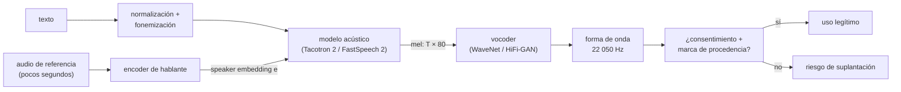

# 094 — Síntesis de voz y derechos de identidad

> [← Clase anterior](../../../classes/part-07-generative-ai-across-media/093-generacion-musical-y-de-audio/README.md) · [Índice de la parte](../README.md) · [Clase siguiente →](../../../classes/part-07-generative-ai-across-media/095-generacion-y-edicion-de-video/README.md)

**Parte:** 07 — IA generativa para texto, imagen, audio, video y 3D  
**Nivel:** avanzado · **Horas estimadas:** 6  
**Laboratorio:** `safety` · **Estado:** `EXECUTABLE_CORE`

## 🎯 Propósito

Comprender **síntesis de voz y derechos de identidad** dentro de la evolución de la inteligencia
artificial, implementar un experimento mínimo verificable y distinguir qué parte
constituye evidencia frente a una afirmación todavía no comprobada.

## 📚 Resultados de aprendizaje

Al finalizar podrás:

1. Explicar síntesis de voz y derechos de identidad usando los conceptos `TTS`, `identidad`, `consentimiento`, `abuso`.
2. Ejecutar el laboratorio con una semilla explícita y revisar su contrato JSON.
3. Identificar al menos un supuesto, una limitación y un riesgo de aplicación.
4. Comparar el enfoque con la etapa anterior de la ruta de aprendizaje.
5. Producir una evidencia reproducible y una conclusión que no exceda los datos.

## 🧩 Conceptos centrales

`TTS`, `identidad`, `consentimiento`, `abuso`

## 🗺️ Ubicación en el mapa de la IA

La síntesis de voz (TTS, *text-to-speech*) pasó de sistemas concatenativos —pegar
fragmentos grabados— a redes neuronales de extremo a extremo: Tacotron 2 (2017) demostró
que un modelo secuencia-a-secuencia más un vocoder neuronal alcanza naturalidad cercana a
la humana. Hereda directamente la generación de audio de la clase anterior (093) y añade
un problema que ningún otro medio plantea con la misma crudeza: la voz **es** un
identificador biométrico de una persona concreta. Por eso esta clase une arquitectura
técnica (mel-espectrogramas, vocoders, clonación zero-shot) con derechos de identidad y
consentimiento, y prepara la discusión de procedencia y autenticidad de la clase 098.

## 📖 Fundamentos

### 🔊 El pipeline TTS neuronal: texto → fonemas → mel → onda

Un sistema TTS moderno se descompone en tres etapas con representaciones intermedias
bien definidas:

```text
texto  ──normalización──▶  fonemas / grafemas
fonemas ──modelo acústico──▶ mel-espectrograma  (T frames × 80 bandas mel)
mel    ──vocoder──▶  forma de onda  (samples a 22 050 o 24 000 Hz)
```

1. **Front-end lingüístico**: normaliza el texto ("Dr." → "doctor", "1984" → año o
   número según contexto) y lo convierte en fonemas. Los errores aquí producen
   pronunciaciones absurdas aunque el resto del sistema sea perfecto.
2. **Modelo acústico**: predice un **mel-espectrograma** — una matriz tiempo × frecuencia
   donde cada columna (frame) resume una ventana corta de audio (típicamente 50 ms con
   salto o *hop* de 256 muestras) y cada fila es una banda de frecuencia en escala mel,
   perceptualmente uniforme. Es una representación compacta: 80 números por frame en
   lugar de 256 muestras de onda.
3. **Vocoder**: convierte el mel-espectrograma en forma de onda. El mel descarta la fase,
   así que el vocoder debe *inventarla* de forma plausible.

### 🏗️ Modelos acústicos: autorregresivo vs paralelo

**Tacotron 2** (Shen et al., 2018) es autorregresivo: un encoder procesa los caracteres,
un decoder con atención genera el mel frame a frame, condicionado en los frames previos.
Ventaja: prosodia natural aprendida de los datos. Desventajas: velocidad lineal en la
longitud, y fallos de atención (palabras repetidas u omitidas) cuando la alineación
texto-audio se pierde.

**FastSpeech 2** (Ren et al., 2020) es no autorregresivo: predice explícitamente la
**duración de cada fonema** (con un *duration predictor* entrenado con alineaciones),
expande la secuencia de fonemas a la longitud del mel y genera todos los frames en
paralelo, añadiendo predictores de tono (F0) y energía como condicionamiento. Elimina
los fallos de atención y acelera la inferencia en más de un orden de magnitud, a costa
de una prosodia algo más plana si los predictores son pobres.

### 🎛️ Vocoders: WaveNet vs HiFi-GAN

- **WaveNet** (van den Oord et al., 2016): autorregresivo a nivel de muestra — genera
  las 22 050 muestras de cada segundo *una por una*, cada una condicionada en las
  anteriores mediante convoluciones dilatadas. Calidad excelente, pero inferencia
  extremadamente lenta (miles de pasos secuenciales por segundo de audio).
- **HiFi-GAN** (Kong et al., 2020): generador convolucional entrenado adversarialmente
  con discriminadores multi-escala y multi-período que vigilan la estructura periódica
  de la voz. Genera toda la onda en paralelo: cientos de veces más rápido que tiempo
  real en GPU, con calidad comparable.

La métrica operativa es el **factor de tiempo real** (RTF): segundos de cómputo por
segundo de audio generado. RTF < 1 permite aplicaciones interactivas; un vocoder
autorregresivo puro suele tener RTF ≫ 1 sin optimizaciones dedicadas.

### 🧬 Clonación de voz zero-shot y speaker embeddings

SV2TTS (Jia et al., 2018) demostró que se puede clonar una voz **sin reentrenar**:

```text
audio de referencia (segundos) ──encoder de hablante──▶ speaker embedding e ∈ R^256
TTS(texto, e) ──▶ voz sintética con el timbre del hablante de referencia
```

El encoder de hablante se entrena en una tarea distinta (verificación de locutor, con
miles de hablantes) para que su embedding capture el timbre y no el contenido. El TTS,
condicionado en ese embedding, generaliza a hablantes **nunca vistos**: basta un clip de
pocos segundos. Esta es exactamente la capacidad que habilita tanto usos legítimos
(voces protésicas para pacientes de ELA, doblaje consentido) como abusos (suplantación
telefónica, fraude a familiares, deepfakes de figuras públicas).

### ⚖️ Derechos de identidad y consentimiento

La voz clonada plantea tres capas de problema jurídico-técnico:

1. **Consentimiento**: ¿autorizó la persona el uso de su voz para entrenar o clonar?
   El consentimiento debe ser específico (para qué usos), revocable y verificable.
2. **Suplantación**: usar la voz clonada para hacerse pasar por la persona (fraude,
   ingeniería social). Es delito en la mayoría de jurisdicciones con independencia de
   cómo se generó el audio.
3. **Procedencia**: sin marcas técnicas (watermarking de audio, credenciales C2PA), un
   oyente no puede distinguir voz real de sintética; la defensa se desplaza a la
   verificación de origen, no del contenido (clase 098).

## 🧮 Ejemplo trabajado

**Dimensiones de un mel-espectrograma.** Audio de 3 s muestreado a 22 050 Hz, con
hop de 256 muestras y 80 bandas mel:

```text
muestras totales:  3 × 22 050 = 66 150
frames:            66 150 / 256 ≈ 258.4  →  ~259 frames (con padding de borde)
mel-espectrograma: 259 frames × 80 bandas = 20 720 valores
forma de onda:     66 150 valores
compresión:        66 150 / 20 720 ≈ 3.2× (y además sin fase)
```

**Factor de tiempo real (RTF) de vocoders.** Supongamos que un vocoder autorregresivo
genera 500 muestras por segundo de cómputo y uno paralelo procesa el clip entero en
0.05 s de GPU:

```text
autorregresivo: 66 150 muestras / 500 muestras·s⁻¹ = 132.3 s de cómputo
                RTF = 132.3 / 3 = 44.1   (44× más lento que tiempo real)
paralelo:       RTF = 0.05 / 3 ≈ 0.017  (60× más rápido que tiempo real)
razón:          44.1 / 0.017 ≈ 2 600×
```

La diferencia no es una constante de implementación: es estructural. El autorregresivo
tiene 66 150 pasos secuenciales irreducibles; el paralelo, unas decenas de capas.

## 📊 Propiedades y comparación

| Sistema | Tipo | Velocidad (RTF típico) | Riesgo característico | Control de prosodia |
|---|---|---|---|---|
| Tacotron 2 + WaveNet | autorregresivo × 2 | ≫ 1 (lento) | fallos de atención (repeticiones/omisiones) | implícito (aprendido) |
| FastSpeech 2 + HiFi-GAN | paralelo × 2 | ≪ 1 (interactivo) | prosodia plana si los predictores fallan | explícito (duración, F0, energía) |
| Clonación zero-shot (SV2TTS) | condicionado por embedding | según backbone | suplantación de identidad | hereda del backbone |
| Concatenativo clásico | unidades grabadas | ≪ 1 | juntas audibles, sin flexibilidad | casi nulo |



## ⚠️ Errores conceptuales frecuentes

1. **"El mel-espectrograma contiene toda la información del audio."** No: descarta la
   fase. Por eso el vocoder es un modelo generativo (debe inventar una fase plausible)
   y no un simple inversor de la transformada.
2. **"Más rápido implica peor calidad."** HiFi-GAN paralelo iguala en escucha ciega a
   WaveNet autorregresivo siendo órdenes de magnitud más rápido; el cuello de botella
   histórico era estructural (secuencialidad), no de capacidad.
3. **"Clonar una voz requiere horas de grabación del objetivo."** La clonación
   zero-shot con speaker embeddings funciona con segundos de audio; asumir lo contrario
   subestima gravemente el riesgo de suplantación.
4. **"Si el audio suena natural, es indetectable."** Naturalidad perceptual y
   detectabilidad forense son ejes distintos: artefactos espectrales, marcas de agua y
   metadatos de procedencia pueden delatar audio que el oído acepta.
5. **"El consentimiento para grabar equivale al consentimiento para clonar."** Son
   permisos distintos: ceder una grabación para un podcast no autoriza entrenar un
   clon que diga frases nuevas con tu timbre.

## 🚀 Del aprendizaje a la operación

Entre este núcleo educativo y un producto real de TTS faltan: un front-end lingüístico
robusto para el idioma objetivo (normalización de números, siglas y extranjerismos),
datos de estudio con licencia y consentimiento documentado por hablante, streaming de
baja latencia (generar audio antes de terminar la frase), watermarking y credenciales
de procedencia integrados en el pipeline de salida, y un proceso de verificación de
identidad antes de habilitar clonación de voz de terceros.

## 🧪 Laboratorio

```bash
python lab.py
```

El laboratorio llama a `ai_evolution.labs.run_lab("safety")`. Esta
decisión evita 183 implementaciones divergentes: cada clase tiene un entrypoint
propio, pero los motores didácticos se prueban como una biblioteca común.

### 🔍 Evidencia esperada

- tipo de laboratorio y semilla;
- entradas o decisiones observables;
- resultado estructurado;
- lista `evidence` con hechos que pueden inspeccionarse;
- lista `limitations` que impide presentar la demo como producción.

## 📓 Notebooks

- [📓 `notebook.ipynb`](notebook.ipynb): recorrido guiado con la materia resumida.
- [✍️ `notebook_student.ipynb`](notebook_student.ipynb): ejercicios para resolver.
- [✅ `notebook_solution.ipynb`](notebook_solution.ipynb): solución de referencia explicada.

## 📝 Evaluación

| Criterio | Peso |
|---|---:|
| Comprensión conceptual | 25 % |
| Ejecución reproducible | 25 % |
| Interpretación basada en evidencia | 25 % |
| Riesgos, límites y mejora propuesta | 25 % |

Consulta [assessment.md](assessment.md) para preguntas y criterio de aceptación.

## ⚠️ Errores comunes

| Síntoma | Causa probable | Corrección |
|---|---|---|
| El código corre, pero no hay conclusión | Se confundió ejecución con aprendizaje | Explica qué demuestra y qué no demuestra |
| El resultado cambia sin explicación | No se registró semilla o configuración | Conserva semilla, versión y parámetros |
| Se promete uso real | Se extrapoló desde una demo educativa | Declara entorno, datos, límites y revisión humana |
| Se copia una métrica aislada | No existe baseline ni costo de error | Añade comparación y criterio de decisión |

## ❓ Preguntas frecuentes

**¿Debo usar una API comercial?**  
No. El núcleo funciona localmente. Las extensiones LIVE se documentan por separado.

**¿El laboratorio representa una implementación industrial?**  
No por sí solo. Enseña el contrato y el patrón; producción exige integración,
seguridad, observabilidad, pruebas y operación.

**¿Dónde profundizo?**  
Revisa las especializaciones enlazadas en el README raíz y la ruta siguiente.

## 🔗 Referencias

- Shen, J. et al. (2018). *Natural TTS Synthesis by Conditioning WaveNet on Mel Spectrogram Predictions* (Tacotron 2). [arXiv:1712.05884](https://arxiv.org/abs/1712.05884) — uso: fuente primaria del mecanismo estudiado
- Ren, Y. et al. (2020). *FastSpeech 2: Fast and High-Quality End-to-End Text to Speech*. [arXiv:2006.04558](https://arxiv.org/abs/2006.04558) — uso: fuente primaria del mecanismo estudiado
- Kong, J., Kim, J. y Bae, J. (2020). *HiFi-GAN: Generative Adversarial Networks for Efficient and High Fidelity Speech Synthesis*. [arXiv:2010.05646](https://arxiv.org/abs/2010.05646) — uso: fuente primaria del mecanismo estudiado
- van den Oord, A. et al. (2016). *WaveNet: A Generative Model for Raw Audio*. [arXiv:1609.03499](https://arxiv.org/abs/1609.03499) — uso: fuente primaria del mecanismo estudiado
- Jia, Y. et al. (2018). *Transfer Learning from Speaker Verification to Multispeaker Text-To-Speech Synthesis* (SV2TTS). [arXiv:1806.04558](https://arxiv.org/abs/1806.04558) — uso: fuente primaria del mecanismo estudiado
- C2PA. *Content Credentials: C2PA Technical Specification*. [c2pa.org/specifications](https://c2pa.org/specifications/specifications/2.2/index.html) — uso: marco normativo de referencia

<!-- papers:inicio -->

---

## 📜 Papers que fundamentan esta clase

> Bloque generado por `python scripts/link_papers_to_classes.py`. La fuente es [`papers/catalog/papers.json`](../../../papers/catalog/papers.json).

| Paper | Año | Qué desbloqueó | Miniatura |
|---|---:|---|---|
| [P130 · Los modelos de lenguaje sobre códecs neuronales sintetizan voz sin ejemplos previos](../../../papers/foundational/P130_vall_e/README.md) | 2023 | Convierte la síntesis de voz en modelado de lenguaje sobre códigos de audio, y clona una voz con tres segundos de muestra sin entrenar nada. | [notebook](../../../notebooks/papers/P130_vall_e.ipynb) |

Cada ficha explica el problema anterior, la matemática mínima, los límites y los errores de atribución más frecuentes. Para leerlas con método: [cómo leer un paper de IA](../../../papers/guides/COMO_LEER_UN_PAPER_DE_IA.md) · [anexos matemáticos](../../../papers/annexes/README.md).
<!-- papers:fin -->
---

## ⬅️ Clase anterior

[093 — Generación musical y de audio](../../part-07-generative-ai-across-media/093-generacion-musical-y-de-audio/README.md)

## ➡️ Siguiente clase

[095 — Generación y edición de video](../../part-07-generative-ai-across-media/095-generacion-y-edicion-de-video/README.md)
