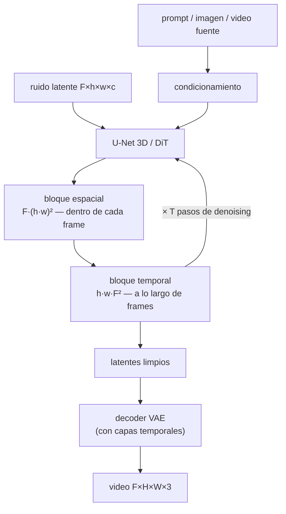

# 095 — Generación y edición de video

> [← Clase anterior](../../../classes/part-07-generative-ai-across-media/094-sintesis-de-voz-y-derechos-de-identidad/README.md) · [Índice de la parte](../README.md) · [Clase siguiente →](../../../classes/part-07-generative-ai-across-media/096-generacion-3d-y-mundos-sinteticos/README.md)

**Parte:** 07 — IA generativa para texto, imagen, audio, video y 3D  
**Nivel:** avanzado · **Horas estimadas:** 6  
**Laboratorio:** `generation` · **Estado:** `EXECUTABLE_CORE`

## 🎯 Propósito

Comprender **generación y edición de video** dentro de la evolución de la inteligencia
artificial, implementar un experimento mínimo verificable y distinguir qué parte
constituye evidencia frente a una afirmación todavía no comprobada.

## 📚 Resultados de aprendizaje

Al finalizar podrás:

1. Explicar generación y edición de video usando los conceptos `video`, `temporalidad`, `consistencia`, `edición`.
2. Ejecutar el laboratorio con una semilla explícita y revisar su contrato JSON.
3. Identificar al menos un supuesto, una limitación y un riesgo de aplicación.
4. Comparar el enfoque con la etapa anterior de la ruta de aprendizaje.
5. Producir una evidencia reproducible y una conclusión que no exceda los datos.

## 🧩 Conceptos centrales

`video`, `temporalidad`, `consistencia`, `edición`

## 🗺️ Ubicación en el mapa de la IA

La generación de video hereda toda la maquinaria de los modelos de difusión de imagen
(clases 090-091) y añade la dimensión que las imágenes no tienen: el **tiempo**. Un
video no es una lista de imágenes independientes — exige consistencia de identidad,
iluminación y física entre frames. Video Diffusion Models (Ho et al., 2022) extendió la
difusión al eje temporal; Make-A-Video y Stable Video Diffusion la llevaron a escala
con difusión latente. Esta clase cierra la progresión imagen → audio → video y prepara
la generación 3D (clase 096), donde la consistencia deja de ser temporal y pasa a ser
geométrica.

## 📖 Fundamentos

### 🎞️ El problema: una dimensión más lo cambia todo

Un video de F frames de H×W píxeles es un tensor `F × H × W × 3`. Tratarlo como F
imágenes independientes produce *parpadeo*: cada frame es plausible por separado, pero
la identidad del sujeto, la textura y la iluminación cambian entre frames. El modelo
debe aprender **dependencias temporales**: qué se mueve, qué permanece y cómo.

Dos costos explotan con la dimensión temporal:

- **Memoria/cómputo**: la atención completa sobre todos los tokens espacio-temporales
  es O(n²) con n = F·h·w tokens (h, w en el espacio latente).
- **Datos**: el video etiquetado escasea; Make-A-Video mostró que se puede aprender
  apariencia de pares texto-imagen y movimiento de video **sin texto**.

### 🧊 Difusión de video latente

Igual que en imagen (Stable Diffusion), se trabaja en un espacio latente comprimido:

```text
video F×H×W×3 ──VAE──▶ latentes F×h×w×c   (p. ej. h = H/8, w = W/8)
difusión: aprender a revertir el ruido sobre el tensor latente completo
decodificación: VAE⁻¹ frame a frame (o con decoder temporal para evitar parpadeo)
```

Stable Video Diffusion (2023) parte de un modelo de imagen preentrenado, **infla** la
U-Net insertando capas temporales (convoluciones 1D y atención sobre el eje F) y la
ajusta en tres etapas: preentrenamiento de imagen, preentrenamiento de video con datos
masivos filtrados, y afinado de alta calidad. La lección empírica: la curación del
dataset de video pesa tanto como la arquitectura.

### 🧠 Atención espacio-temporal: completa vs factorizada

Con F frames de h×w latentes hay n = F·h·w tokens. Opciones:

```text
1. Atención completa 3D:   cada token atiende a todos → O((F·h·w)²)
   máxima expresividad, costo prohibitivo al crecer F o la resolución.

2. Atención factorizada:   espacial + temporal por separado
   - espacial:  F bloques independientes de h·w tokens → F·(h·w)²
   - temporal:  h·w posiciones que atienden a lo largo de F frames → h·w·F²
   costo total F·(h·w)² + h·w·F² ≪ (F·h·w)²
```

La factorizada es el estándar en 3D U-Nets y en muchos DiT de video: alterna bloques
espaciales (consistencia dentro del frame) y temporales (consistencia entre frames).
El precio: ningún token ve *directamente* otro token en otro frame y otra posición —
la información viaja en dos saltos, lo que puede degradar movimientos complejos.

### ✂️ Edición: video2video y propagación de ediciones

- **Video2video**: en lugar de partir de ruido puro, se parte del video original
  ruidificado hasta un nivel intermedio y se elimina el ruido condicionando en la nueva
  instrucción (cambiar estilo, sustituir un objeto). El nivel de ruido controla el
  trade-off fidelidad ↔ libertad de edición.
- **Propagación de ediciones**: se edita un frame clave (con herramientas de imagen,
  más maduras) y la edición se propaga al resto usando correspondencias temporales
  (flujo óptico o atención cruzada entre frames). Falla cuando hay oclusiones o
  cambios de plano: la correspondencia deja de existir.
- **Inversión**: para editar fielmente hace falta recuperar el ruido que "genera" el
  video original (inversión DDIM); los errores de inversión se acumulan por frame y
  son la fuente típica de deriva de identidad en ediciones largas.

### 📏 Métricas y evaluación

No hay una métrica única de calidad de video. Se combinan: FVD (distancia de Fréchet
sobre features de video, sensible a la dinámica), consistencia temporal (similitud
entre frames alineados por flujo), fidelidad al prompt (CLIP score por frame) y
evaluación humana. Un modelo puede ganar en frames individuales y perder en FVD por
movimiento incoherente: las métricas por frame no capturan la temporalidad.

## 🧮 Ejemplo trabajado

**Costo de atención completa vs factorizada.** 16 frames con latentes de 32×32
(h·w = 1024 tokens por frame):

```text
n = 16 × 1024 = 16 384 tokens espacio-temporales

Atención completa:    n² = 16 384² = 268 435 456 ≈ 2.7 × 10⁸ pares

Factorizada:
  espacial:  16 · (1024²) = 16 · 1 048 576 = 16 777 216
  temporal:  1024 · (16²) = 1024 · 256    =    262 144
  total:     16 777 216 + 262 144         = 17 039 360 ≈ 1.7 × 10⁷ pares

Razón: 268 435 456 / 17 039 360 ≈ 15.8×
```

La factorización ahorra ~16× aquí, y el ahorro **crece** con la longitud: con 64
frames, la completa escala ×16 (n² con n×4) mientras la parte espacial factorizada
solo escala ×4. Comprueba: 64·1024² + 1024·64² = 67 108 864 + 4 194 304 ≈ 7.1 × 10⁷
frente a (64·1024)² ≈ 4.3 × 10⁹ — razón ≈ 60×.

## 📊 Propiedades y comparación

| Enfoque | Consistencia temporal | Costo | Datos que exige | Limitación característica |
|---|---|---|---|---|
| Frames independientes (t2i por frame) | ninguna (parpadeo) | bajo | solo imagen | inutilizable como video |
| Difusión de video con atención completa 3D | máxima | O((F·h·w)²) | video masivo | prohibitivo en clips largos |
| Difusión latente + atención factorizada | alta | F·(hw)² + hw·F² | imagen + video | interacciones espacio-temporales indirectas |
| Video2video / propagación de ediciones | hereda del video fuente | medio | un video fuente | oclusiones y cambios de plano |



## ⚠️ Errores conceptuales frecuentes

1. **"Generar video es generar muchas imágenes."** Sin acoplamiento temporal cada
   frame es plausible pero el conjunto parpadea: la identidad y la física se rompen
   entre frames. La temporalidad es una restricción adicional, no un bucle for.
2. **"La atención factorizada es equivalente a la completa, solo más barata."** No:
   restringe qué tokens se ven directamente. Es una aproximación que funciona bien
   empíricamente, pero movimientos que acoplan posición y tiempo de forma compleja
   pueden degradarse.
3. **"Más frames por segundo = mejor modelo."** La tasa de frames se puede interpolar
   a posteriori; lo difícil es la coherencia de largo plazo (segundos), no la densidad
   temporal local.
4. **"Editar un video es editar su primer frame."** La propagación exige
   correspondencias válidas entre frames; oclusiones, apariciones de objetos nuevos y
   cortes de plano rompen la propagación y exigen re-anclar la edición.
5. **"Un buen FVD garantiza un buen video."** FVD compara distribuciones de features,
   no verifica física ni causalidad; un modelo puede lograr FVD bajo y aun así generar
   manos imposibles o relojes que giran al revés.

## 🚀 Del aprendizaje a la operación

Entre este núcleo educativo y un producto real de video generativo faltan: un pipeline
de curación de datos con licencias y filtrado de contenido, infraestructura de
inferencia con presupuesto de GPU realista (minutos de cómputo por segundos de video),
control de identidad persistente entre tomas (personajes consistentes), integración de
marcas de procedencia (C2PA) en el contenedor de video exportado, y revisión humana
del material generado antes de cualquier publicación.

## 🧪 Laboratorio

```bash
python lab.py
```

El laboratorio llama a `ai_evolution.labs.run_lab("generation")`. Esta
decisión evita 183 implementaciones divergentes: cada clase tiene un entrypoint
propio, pero los motores didácticos se prueban como una biblioteca común.

### 🔍 Evidencia esperada

- tipo de laboratorio y semilla;
- entradas o decisiones observables;
- resultado estructurado;
- lista `evidence` con hechos que pueden inspeccionarse;
- lista `limitations` que impide presentar la demo como producción.

## 📓 Notebooks

- [📓 `notebook.ipynb`](notebook.ipynb): recorrido guiado con la materia resumida.
- [✍️ `notebook_student.ipynb`](notebook_student.ipynb): ejercicios para resolver.
- [✅ `notebook_solution.ipynb`](notebook_solution.ipynb): solución de referencia explicada.

## 📝 Evaluación

| Criterio | Peso |
|---|---:|
| Comprensión conceptual | 25 % |
| Ejecución reproducible | 25 % |
| Interpretación basada en evidencia | 25 % |
| Riesgos, límites y mejora propuesta | 25 % |

Consulta [assessment.md](assessment.md) para preguntas y criterio de aceptación.

## ⚠️ Errores comunes

| Síntoma | Causa probable | Corrección |
|---|---|---|
| El código corre, pero no hay conclusión | Se confundió ejecución con aprendizaje | Explica qué demuestra y qué no demuestra |
| El resultado cambia sin explicación | No se registró semilla o configuración | Conserva semilla, versión y parámetros |
| Se promete uso real | Se extrapoló desde una demo educativa | Declara entorno, datos, límites y revisión humana |
| Se copia una métrica aislada | No existe baseline ni costo de error | Añade comparación y criterio de decisión |

## ❓ Preguntas frecuentes

**¿Debo usar una API comercial?**  
No. El núcleo funciona localmente. Las extensiones LIVE se documentan por separado.

**¿El laboratorio representa una implementación industrial?**  
No por sí solo. Enseña el contrato y el patrón; producción exige integración,
seguridad, observabilidad, pruebas y operación.

**¿Dónde profundizo?**  
Revisa las especializaciones enlazadas en el README raíz y la ruta siguiente.

## 🔗 Referencias

- Ho, J. et al. (2022). *Video Diffusion Models*. [arXiv:2204.03458](https://arxiv.org/abs/2204.03458) — uso: fuente primaria del mecanismo estudiado
- Singer, U. et al. (2022). *Make-A-Video: Text-to-Video Generation without Text-Video Data*. [arXiv:2209.14792](https://arxiv.org/abs/2209.14792) — uso: fuente primaria del mecanismo estudiado
- Blattmann, A. et al. (2023). *Stable Video Diffusion: Scaling Latent Video Diffusion Models to Large Datasets*. [arXiv:2311.15127](https://arxiv.org/abs/2311.15127) — uso: fuente primaria del mecanismo estudiado
- Rombach, R. et al. (2022). *High-Resolution Image Synthesis with Latent Diffusion Models*. [arXiv:2112.10752](https://arxiv.org/abs/2112.10752) — uso: fuente primaria del mecanismo estudiado
- Ho, J., Jain, A. y Abbeel, P. (2020). *Denoising Diffusion Probabilistic Models*. [arXiv:2006.11239](https://arxiv.org/abs/2006.11239) — uso: fuente primaria del mecanismo estudiado

<!-- papers:inicio -->

---

## 📜 Papers que fundamentan esta clase

> Bloque generado por `python scripts/link_papers_to_classes.py`. La fuente es [`papers/catalog/papers.json`](../../../papers/catalog/papers.json).

| Paper | Año | Qué desbloqueó | Miniatura |
|---|---:|---|---|
| [P17 · Modelos probabilísticos de difusión con eliminación de ruido](../../../papers/foundational/P17_diffusion/README.md) | 2020 | La generación deja de ser un salto en la oscuridad: se aprende a deshacer, paso a paso, un proceso de ruido conocido. | [notebook](../../../notebooks/papers/P17_diffusion.ipynb) |

Cada ficha explica el problema anterior, la matemática mínima, los límites y los errores de atribución más frecuentes. Para leerlas con método: [cómo leer un paper de IA](../../../papers/guides/COMO_LEER_UN_PAPER_DE_IA.md) · [anexos matemáticos](../../../papers/annexes/README.md).
<!-- papers:fin -->
<!-- bibliografia:inicio -->

---

## 📚 Bibliografía de apoyo

> Bloque generado por `python scripts/link_sources_to_classes.py`. Cada obra lleva su localizador verificado en [`sources/bibliography.json`](../../../sources/bibliography.json).

Los papers dicen **de dónde salió** el mecanismo. Estas obras lo **desarrollan** con el espacio que una clase no tiene: teoría completa, demostraciones y ejercicios.

| Obra | Edición | Localizador | Papel en esta clase |
|---|---|---|---|
| Goodfellow, Ian, Bengio, Yoshua y Courville, Aaron — *Deep Learning* | 2016 | [ISBN 9780262035613](https://openlibrary.org/isbn/9780262035613) · [web de la obra](https://www.deeplearningbook.org/) | obra de referencia de la parte 07 · capítulos de modelos generativos |
<!-- bibliografia:fin -->

---

## ⬅️ Clase anterior

[094 — Síntesis de voz y derechos de identidad](../../part-07-generative-ai-across-media/094-sintesis-de-voz-y-derechos-de-identidad/README.md)

## ➡️ Siguiente clase

[096 — Generación 3D y mundos sintéticos](../../part-07-generative-ai-across-media/096-generacion-3d-y-mundos-sinteticos/README.md)
