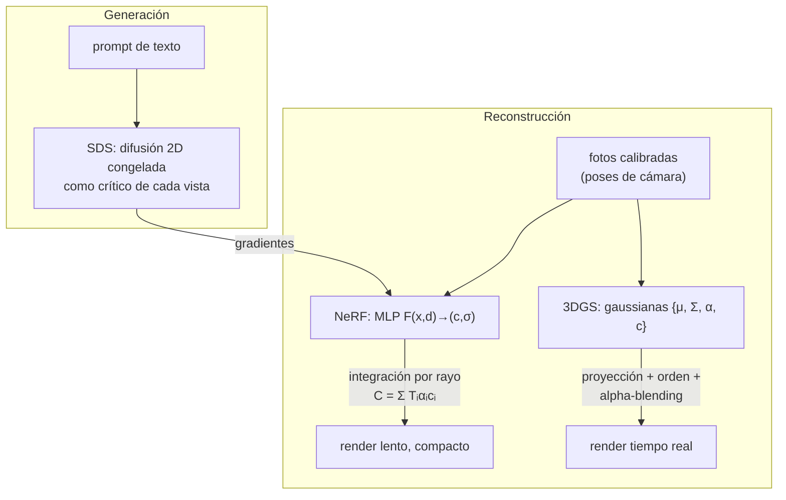

# 096 — Generación 3D y mundos sintéticos

> [← Clase anterior](../../../classes/part-07-generative-ai-across-media/095-generacion-y-edicion-de-video/README.md) · [Índice de la parte](../README.md) · [Clase siguiente →](../../../classes/part-07-generative-ai-across-media/097-datos-sinteticos-utilidad-y-contaminacion/README.md)

**Parte:** 07 — IA generativa para texto, imagen, audio, video y 3D  
**Nivel:** avanzado · **Horas estimadas:** 6  
**Laboratorio:** `generation` · **Estado:** `EXECUTABLE_CORE`

## 🎯 Propósito

Comprender **generación 3d y mundos sintéticos** dentro de la evolución de la inteligencia
artificial, implementar un experimento mínimo verificable y distinguir qué parte
constituye evidencia frente a una afirmación todavía no comprobada.

## 📚 Resultados de aprendizaje

Al finalizar podrás:

1. Explicar generación 3d y mundos sintéticos usando los conceptos `3D`, `NeRF`, `gaussian splatting`, `assets`.
2. Ejecutar el laboratorio con una semilla explícita y revisar su contrato JSON.
3. Identificar al menos un supuesto, una limitación y un riesgo de aplicación.
4. Comparar el enfoque con la etapa anterior de la ruta de aprendizaje.
5. Producir una evidencia reproducible y una conclusión que no exceda los datos.

## 🧩 Conceptos centrales

`3D`, `NeRF`, `gaussian splatting`, `assets`

## 🗺️ Ubicación en el mapa de la IA

La generación 3D cierra el arco de esta parte: tras texto, imagen, audio y video, el
objetivo es sintetizar **escenas** con geometría consistente desde cualquier punto de
vista. NeRF (2020) reformuló la reconstrucción 3D como aprender un campo continuo con
una red neuronal; 3D Gaussian Splatting (2023) recuperó las primitivas explícitas para
lograr render en tiempo real; y DreamFusion (2022) conectó ambos mundos con los modelos
de difusión de imagen (clase 090) para generar 3D a partir de texto **sin datos 3D**.
Estas técnicas alimentan mundos sintéticos para simulación, robótica y datos de
entrenamiento (clase 097).

## 📖 Fundamentos

### 🌫️ NeRF: la escena como campo de radiancia

Un *Neural Radiance Field* representa la escena como una función continua aprendida
por un MLP:

```text
F(x, d) → (c, σ)
  x = (x, y, z)   posición en el espacio
  d = (θ, φ)      dirección de vista
  c = (r, g, b)   color emitido en x visto desde d
  σ ≥ 0           densidad volumétrica en x (opacidad diferencial)
```

La densidad σ depende solo de la posición (la geometría no cambia con el observador);
el color depende también de la dirección, lo que permite reflejos y brillos especulares.
Las coordenadas se pasan por un *positional encoding* (senos y cosenos a frecuencias
crecientes) porque un MLP crudo no representa bien detalles de alta frecuencia.

### 🎥 Render volumétrico: de campo a píxel

Para pintar un píxel se lanza un rayo r(t) = o + t·d desde la cámara y se integra el
campo a lo largo del rayo. En forma discreta, con N muestras a distancias δᵢ entre
muestras consecutivas:

```text
αᵢ = 1 − exp(−σᵢ·δᵢ)                    opacidad del segmento i
Tᵢ = exp(−Σ_{j<i} σⱼ·δⱼ)                transmitancia: luz que llega hasta i
wᵢ = Tᵢ · αᵢ                            peso de la muestra i
C  = Σᵢ wᵢ · cᵢ                          color final del píxel
```

La transmitancia Tᵢ decae a medida que el rayo atraviesa materia: una muestra detrás
de una superficie densa contribuye poco aunque su σ sea alto. Todo el proceso es
diferenciable, así que se entrena minimizando el error fotométrico entre el píxel
renderizado y la fotografía real, con decenas de imágenes calibradas de la escena.
Costo característico: cientos de evaluaciones del MLP **por píxel** — entrenamiento en
horas y render lejos del tiempo real en el NeRF original.

### 💎 3D Gaussian Splatting: primitivas explícitas y rasterización

3DGS (Kerbl et al., 2023) sustituye el campo implícito por millones de **gaussianas 3D
explícitas**, cada una con: posición μ, covarianza Σ (forma y orientación del
elipsoide), opacidad α y color dependiente de la vista (armónicos esféricos). El render
no integra a lo largo de rayos: **proyecta** cada gaussiana al plano de imagen
(*splatting*), la ordena por profundidad y compone con alpha-blending — el mismo
principio de composición que NeRF, pero rasterizado en GPU. Resultado: entrenamiento en
minutos y render a >100 fps con calidad comparable. El precio: una nube de millones de
primitivas (memoria), y una densificación/poda heurística durante el entrenamiento que
hay que ajustar.

### ✨ Text-to-3D: DreamFusion y Score Distillation Sampling

DreamFusion (Poole et al., 2022) genera un objeto 3D a partir de texto **sin ningún
dataset 3D**. La idea, *Score Distillation Sampling* (SDS):

```text
repetir:
  1. renderizar el NeRF desde una cámara aleatoria → imagen I
  2. añadir ruido a I y pedir a un modelo de difusión texto-imagen congelado
     que estime ese ruido, condicionado en el prompt
  3. usar (ruido_estimado − ruido_real) como gradiente sobre los parámetros del NeRF
```

El modelo de difusión actúa como crítico: empuja cada vista renderizada hacia la
distribución de imágenes que corresponde al prompt. Como todas las vistas comparten la
misma escena 3D, la consistencia geométrica emerge. Limitaciones conocidas: saturación
de color y sobre-suavizado (el guidance alto promedia modos), y el problema *Janus* —
caras repetidas en varios lados del objeto, porque el crítico 2D no sabe desde dónde
está mirando.

## 🧮 Ejemplo trabajado

Render volumétrico a mano con **3 muestras** a lo largo de un rayo, todas con
δᵢ = 1.0, densidades σ = (0.5, 1.0, 2.0) y colores RGB
c₁ = (1, 0, 0), c₂ = (0, 1, 0), c₃ = (0, 0, 1):

```text
Opacidades:      α₁ = 1 − e^(−0.5) = 0.3935
                 α₂ = 1 − e^(−1.0) = 0.6321
                 α₃ = 1 − e^(−2.0) = 0.8647

Transmitancias:  T₁ = e^0        = 1.0000   (nada delante)
                 T₂ = e^(−0.5)   = 0.6065
                 T₃ = e^(−1.5)   = 0.2231   (0.5 + 1.0 acumulado)

Pesos:           w₁ = 1.0000 · 0.3935 = 0.3935
                 w₂ = 0.6065 · 0.6321 = 0.3834
                 w₃ = 0.2231 · 0.8647 = 0.1929
                 Σw = 0.9698  →  1 − Σw = 0.0302 llega al fondo

Color final:     C = 0.3935·(1,0,0) + 0.3834·(0,1,0) + 0.1929·(0,0,1)
                   = (0.394, 0.383, 0.193)
```

Lectura: aunque la tercera muestra es la más densa (σ = 2), pesa **menos** que las dos
primeras porque la materia que tiene delante ya absorbió el 78 % de la luz del rayo.
Si duplicas σ₁ a 1.0, verás que T₂ y T₃ caen y el rojo domina aún más: la oclusión es
multiplicativa, no aditiva.

## 📊 Propiedades y comparación

| Método | Representación | Entrenamiento | Render | Memoria | Limitación típica |
|---|---|---|---|---|---|
| NeRF | implícita (MLP) | horas | segundos/frame | MB (pesos) | lento; no editable directamente |
| 3D Gaussian Splatting | explícita (gaussianas) | minutos | >100 fps | cientos de MB-GB | heurísticas de densificación; escenas enormes |
| DreamFusion (SDS) | NeRF guiado por difusión 2D | horas por objeto | el del NeRF | MB | Janus, sobre-saturación; sin datos 3D reales |
| Fotogrametría clásica (SfM+MVS) | malla + textura | horas | tiempo real | según malla | falla en superficies brillantes/sin textura |



## ⚠️ Errores conceptuales frecuentes

1. **"NeRF almacena una malla o vóxeles."** No almacena geometría explícita: la escena
   *es* los pesos del MLP. La superficie solo existe implícitamente donde σ es alta, y
   extraer una malla requiere un paso adicional (p. ej. marching cubes).
2. **"Más densidad σ implica más contribución al píxel."** Solo si la muestra está
   delante: el peso es Tᵢ·αᵢ, y la transmitancia castiga todo lo que queda detrás de
   materia densa — como muestra el ejemplo trabajado.
3. **"Gaussian Splatting es un NeRF más rápido."** Cambia la representación (explícita
   vs implícita) y el algoritmo de render (rasterización vs integración por rayo);
   comparten la composición alpha, no la arquitectura.
4. **"DreamFusion aprende de un dataset 3D."** Precisamente no: destila un modelo de
   difusión 2D. Esa es su fortaleza (no necesita 3D) y su debilidad (el crítico 2D
   ignora la vista, de ahí el problema Janus).
5. **"Si cada vista renderizada se ve bien, la geometría es correcta."** Vistas
   plausibles pueden esconder geometría degenerada ("floaters", superficies huecas);
   la calidad 3D se evalúa con vistas *no vistas* en entrenamiento y con la geometría
   extraída, no con las vistas de ajuste.

## 🚀 Del aprendizaje a la operación

Entre este núcleo educativo y un pipeline 3D real faltan: captura calibrada (poses de
cámara vía SfM, que falla en escenas sin textura), conversión de la representación a
assets utilizables (mallas con topología limpia, UVs y LODs para un motor de juego),
presupuestos de memoria y streaming para escenas grandes, control de derechos sobre
las escenas y objetos capturados (propiedad y privacidad de espacios reales), y
validación geométrica independiente cuando el 3D alimenta simulación o robótica.

## 🧪 Laboratorio

```bash
python lab.py
```

El laboratorio llama a `ai_evolution.labs.run_lab("generation")`. Esta
decisión evita 183 implementaciones divergentes: cada clase tiene un entrypoint
propio, pero los motores didácticos se prueban como una biblioteca común.

### 🔍 Evidencia esperada

- tipo de laboratorio y semilla;
- entradas o decisiones observables;
- resultado estructurado;
- lista `evidence` con hechos que pueden inspeccionarse;
- lista `limitations` que impide presentar la demo como producción.

## 📓 Notebooks

- [📓 `notebook.ipynb`](notebook.ipynb): recorrido guiado con la materia resumida.
- [✍️ `notebook_student.ipynb`](notebook_student.ipynb): ejercicios para resolver.
- [✅ `notebook_solution.ipynb`](notebook_solution.ipynb): solución de referencia explicada.

## 📝 Evaluación

| Criterio | Peso |
|---|---:|
| Comprensión conceptual | 25 % |
| Ejecución reproducible | 25 % |
| Interpretación basada en evidencia | 25 % |
| Riesgos, límites y mejora propuesta | 25 % |

Consulta [assessment.md](assessment.md) para preguntas y criterio de aceptación.

## ⚠️ Errores comunes

| Síntoma | Causa probable | Corrección |
|---|---|---|
| El código corre, pero no hay conclusión | Se confundió ejecución con aprendizaje | Explica qué demuestra y qué no demuestra |
| El resultado cambia sin explicación | No se registró semilla o configuración | Conserva semilla, versión y parámetros |
| Se promete uso real | Se extrapoló desde una demo educativa | Declara entorno, datos, límites y revisión humana |
| Se copia una métrica aislada | No existe baseline ni costo de error | Añade comparación y criterio de decisión |

## ❓ Preguntas frecuentes

**¿Debo usar una API comercial?**  
No. El núcleo funciona localmente. Las extensiones LIVE se documentan por separado.

**¿El laboratorio representa una implementación industrial?**  
No por sí solo. Enseña el contrato y el patrón; producción exige integración,
seguridad, observabilidad, pruebas y operación.

**¿Dónde profundizo?**  
Revisa las especializaciones enlazadas en el README raíz y la ruta siguiente.

## 🔗 Referencias

- Mildenhall, B. et al. (2020). *NeRF: Representing Scenes as Neural Radiance Fields for View Synthesis*. [arXiv:2003.08934](https://arxiv.org/abs/2003.08934) — uso: fuente primaria del mecanismo estudiado
- Kerbl, B., Kopanas, G., Leimkühler, T. y Drettakis, G. (2023). *3D Gaussian Splatting for Real-Time Radiance Field Rendering*. [arXiv:2308.04079](https://arxiv.org/abs/2308.04079) — uso: fuente primaria del mecanismo estudiado
- Poole, B., Jain, A., Barron, J. T. y Mildenhall, B. (2022). *DreamFusion: Text-to-3D using 2D Diffusion*. [arXiv:2209.14988](https://arxiv.org/abs/2209.14988) — uso: fuente primaria del mecanismo estudiado
- Müller, T. et al. (2022). *Instant Neural Graphics Primitives with a Multiresolution Hash Encoding* (Instant-NGP). [arXiv:2201.05989](https://arxiv.org/abs/2201.05989) — uso: fuente primaria del mecanismo estudiado
- Rombach, R. et al. (2022). *High-Resolution Image Synthesis with Latent Diffusion Models*. [arXiv:2112.10752](https://arxiv.org/abs/2112.10752) — uso: fuente primaria del mecanismo estudiado

<!-- papers:inicio -->

---

## 📜 Papers que fundamentan esta clase

> Bloque generado por `python scripts/link_papers_to_classes.py`. La fuente es [`papers/catalog/papers.json`](../../../papers/catalog/papers.json).

| Paper | Año | Qué desbloqueó | Miniatura |
|---|---:|---|---|
| [P128 · NeRF: representar escenas como campos de radiancia neuronal](../../../papers/foundational/P128_nerf/README.md) | 2020 | Sustituye la escena explícita por una función continua que un perceptrón representa, y sintetiza vistas nuevas con una fidelidad que no se había visto. | [notebook](../../../notebooks/papers/P128_nerf.ipynb) |
| [P132 · Splatting de gaussianas 3D para renderizado de campos de radiancia en tiempo real](../../../papers/foundational/P132_gaussian_splatting/README.md) | 2023 | Alcanza calidad de campo de radiancia a velocidad de tiempo real cambiando la función continua por millones de primitivas explícitas que se rasterizan. | [notebook](../../../notebooks/papers/P132_gaussian_splatting.ipynb) |

Cada ficha explica el problema anterior, la matemática mínima, los límites y los errores de atribución más frecuentes. Para leerlas con método: [cómo leer un paper de IA](../../../papers/guides/COMO_LEER_UN_PAPER_DE_IA.md) · [anexos matemáticos](../../../papers/annexes/README.md).
<!-- papers:fin -->
<!-- bibliografia:inicio -->

---

## 📚 Bibliografía de apoyo

> Bloque generado por `python scripts/link_sources_to_classes.py`. Cada obra lleva su localizador verificado en [`sources/bibliography.json`](../../../sources/bibliography.json).

Los papers dicen **de dónde salió** el mecanismo. Estas obras lo **desarrollan** con el espacio que una clase no tiene: teoría completa, demostraciones y ejercicios.

| Obra | Edición | Localizador | Papel en esta clase |
|---|---|---|---|
| Goodfellow, Ian, Bengio, Yoshua y Courville, Aaron — *Deep Learning* | 2016 | [ISBN 9780262035613](https://openlibrary.org/isbn/9780262035613) · [web de la obra](https://www.deeplearningbook.org/) | obra de referencia de la parte 07 · capítulos de modelos generativos |
<!-- bibliografia:fin -->

---

## ⬅️ Clase anterior

[095 — Generación y edición de video](../../part-07-generative-ai-across-media/095-generacion-y-edicion-de-video/README.md)

## ➡️ Siguiente clase

[097 — Datos sintéticos: utilidad y contaminación](../../part-07-generative-ai-across-media/097-datos-sinteticos-utilidad-y-contaminacion/README.md)
