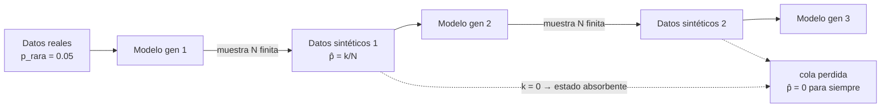

# 097 — Datos sintéticos: utilidad y contaminación

> [← Clase anterior](../../../classes/part-07-generative-ai-across-media/096-generacion-3d-y-mundos-sinteticos/README.md) · [Índice de la parte](../README.md) · [Clase siguiente →](../../../classes/part-07-generative-ai-across-media/098-procedencia-marcas-y-autenticidad/README.md)

**Parte:** 07 — IA generativa para texto, imagen, audio, video y 3D  
**Nivel:** avanzado · **Horas estimadas:** 6  
**Laboratorio:** `evaluation` · **Estado:** `EXECUTABLE_CORE`

## 🎯 Propósito

Comprender **datos sintéticos: utilidad y contaminación** dentro de la evolución de la inteligencia
artificial, implementar un experimento mínimo verificable y distinguir qué parte
constituye evidencia frente a una afirmación todavía no comprobada.

## 📚 Resultados de aprendizaje

Al finalizar podrás:

1. Explicar datos sintéticos: utilidad y contaminación usando los conceptos `synthetic data`, `leakage`, `collapse`, `calidad`.
2. Ejecutar el laboratorio con una semilla explícita y revisar su contrato JSON.
3. Identificar al menos un supuesto, una limitación y un riesgo de aplicación.
4. Comparar el enfoque con la etapa anterior de la ruta de aprendizaje.
5. Producir una evidencia reproducible y una conclusión que no exceda los datos.

## 🧩 Conceptos centrales

`synthetic data`, `leakage`, `collapse`, `calidad`

## 🗺️ Ubicación en el mapa de la IA

Las clases 088–096 mostraron cómo generar texto, imagen, audio, video y 3D. Esta clase
cierra el círculo: esas salidas generadas vuelven a entrar como *datos de entrenamiento*.
Los datos sintéticos son hoy un insumo estándar (aumento, privacidad, balanceo), pero
desde 2023–2024 sabemos que el ciclo tiene un modo de fallo propio —el *model collapse*
demostrado por Shumailov et al. en *Nature*— que convierte la procedencia de los datos
(clase 098) en un problema de ingeniería, no solo de ética.

## 📖 Fundamentos

### 🏭 Qué son los datos sintéticos y para qué se usan

**Datos sintéticos** son ejemplos producidos por un modelo generativo o un procedimiento
estadístico, no recolectados del fenómeno real. Tres usos legítimos y bien delimitados:

1. **Aumento de datos (augmentation):** ampliar un conjunto pequeño con variantes
   plausibles (rotaciones, paráfrasis, muestras de un generador) para reducir sobreajuste.
2. **Privacidad:** publicar un sustituto sintético de un dataset sensible (salud,
   finanzas) que preserve estadísticas agregadas sin exponer registros individuales.
   Ojo: sin garantías formales (p. ej. privacidad diferencial), "sintético" no implica "anónimo".
3. **Balanceo de clases:** generar ejemplos de la clase minoritaria. El método clásico
   es **SMOTE** (Chawla et al., 2002): interpola entre una instancia minoritaria y uno
   de sus k vecinos más cercanos:

```text
x_nuevo = x_i + λ · (x_vecino − x_i),   λ ~ Uniforme(0, 1)
```

### 📏 Medir la utilidad: TSTR

La fidelidad visual o estadística no basta: la pregunta operativa es si los datos
sintéticos *sirven para entrenar*. El protocolo estándar es **TSTR**
(*Train on Synthetic, Test on Real*):

```text
1. Entrena el modelo M_s con datos sintéticos.
2. Entrena el modelo M_r con datos reales (baseline).
3. Evalúa AMBOS sobre un conjunto de prueba REAL nunca visto.
4. Utilidad ≈ métrica(M_s) / métrica(M_r)   (idealmente cercana a 1)
```

Un TSTR alto exige que el generador capture la relación entre features y etiqueta,
no solo las distribuciones marginales. El protocolo inverso (TRTS: entrenar con real,
evaluar con sintético) mide otra cosa —si lo sintético es *reconocible* por un modelo
real— y no debe confundirse con utilidad.

### ☣️ Contaminación de corpus y model collapse

**Contaminación** (leakage generativo): el contenido generado se publica en la web, se
recolecta en el siguiente crawl y termina en el corpus de entrenamiento de la próxima
generación de modelos, sin marca que lo distinga. **Model collapse** (Shumailov et al.,
*Nature* 2024) es la degeneración que aparece al entrenar generaciones sucesivas sobre
salidas de la generación anterior. El mecanismo combina tres errores que se acumulan:

- **Error de aproximación estadística:** cada generación aprende de una *muestra finita*
  de la anterior; los eventos raros (colas de la distribución) pueden no aparecer en la
  muestra y, si no aparecen, el nuevo modelo les asigna probabilidad ≈ 0.
- **Error de expresividad:** el modelo no puede representar exactamente la distribución
  objetivo, y el sesgo se hereda.
- **Error de aprendizaje:** el procedimiento de optimización añade su propio sesgo
  (p. ej. hacia salidas de alta probabilidad).

El resultado tiene dos fases: **colapso temprano** (se pierden las colas: lo raro
desaparece) y **colapso tardío** (la distribución converge a una versión estrecha y de
baja varianza, poco parecida a la original). La propiedad clave es que la pérdida de
una cola es un **estado absorbente**: si en una generación la clase rara no se muestrea,
ninguna generación posterior puede recuperarla a partir de esos datos.

## 🧮 Ejemplo trabajado

Simulemos a mano el colapso con una distribución discreta de dos clases:
`común` con p = 0.95 y `rara` con p = 0.05. Cada generación muestrea **N = 20**
ejemplos de la generación anterior y reestima las probabilidades por frecuencia.

**Generación 0 → 1.** Con p_rara = 0.05 y N = 20, el número esperado de ejemplos raros
es 20 · 0.05 = 1. Pero la probabilidad de obtener **cero** ejemplos raros es:

```text
P(0 raros) = (1 − 0.05)²⁰ = 0.95²⁰ ≈ 0.358
```

Es decir: en ~36 % de los mundos posibles, la clase rara desaparece en una sola
generación y la nueva estimación es p̂_rara = 0/20 = 0.

**Generación 1 → 2.** Si sobrevivió con 1/20 (p̂ = 0.05), el riesgo se repite:
otra vez ≈ 35.8 % de extinción. Si murió, p̂ = 0 es absorbente: se muestrea solo `común`.

**Generación 2 → 3.** Probabilidad de que la cola siga viva tras 3 generaciones
(aproximando p̂ ≈ 0.05 mientras sobreviva):

```text
P(sobrevive 3 gen) ≈ (1 − 0.358)³ ≈ 0.642³ ≈ 0.265
```

Con solo tres generaciones recursivas, en ~3 de cada 4 corridas la clase rara ya no
existe y el "modelo" final asigna p = 0 a algo que en la realidad ocurre el 5 % de las
veces. Con distribuciones continuas el efecto es análogo: la varianza estimada se
contrae generación tras generación.

## 📊 Propiedades y comparación

| Fuente de datos | Utilidad (TSTR) | Riesgo de privacidad | Riesgo de colapso | Costo |
|---|---|---|---|---|
| Reales curados | referencia (≈ 1) | alto si son sensibles | ninguno | alto (recolección, licencias) |
| SMOTE / interpolación | media (solo clases minoritarias) | medio (interpola registros reales) | bajo (una sola pasada) | muy bajo |
| Generador profundo (1 generación) | media-alta si el generador es bueno | medio (memorización posible) | bajo | medio |
| Recursivo (gen n sobre gen n−1) | decreciente con n | bajo | **alto: pérdida de colas** | bajo (y por eso tentador) |



## ⚠️ Errores conceptuales frecuentes

1. **"Si los datos sintéticos se ven realistas, sirven para entrenar."** Fidelidad
   perceptual ≠ utilidad. TSTR puede ser pobre aunque las muestras engañen al ojo,
   porque la relación feature–etiqueta no se preservó.
2. **"Sintético = anónimo."** Los generadores memorizan: un modelo entrenado con datos
   sensibles puede reproducir registros casi idénticos. Sin garantías formales
   (privacidad diferencial), no hay anonimato.
3. **"El colapso es un problema de modelos malos."** Es un problema de *muestreo
   finito*: incluso un estimador perfecto pierde las colas con probabilidad positiva
   en cada generación, y la pérdida es irreversible dentro del ciclo.
4. **"Mezclar un poco de dato real lo arregla todo."** Conservar una fracción de datos
   reales frescos mitiga el colapso (lo muestra el propio paper de Shumailov et al.),
   pero exige saber *cuáles* datos son reales: sin procedencia (clase 098) no puedes
   aplicar la mitigación.
5. **"SMOTE genera información nueva."** SMOTE interpola entre puntos existentes: no
   añade información sobre regiones no observadas y puede crear ejemplos irreales si
   la clase minoritaria no es convexa.

## 🚀 Del aprendizaje a la operación

Entre esta simulación y un pipeline real de datos sintéticos faltan: un protocolo TSTR
con validación cruzada y varios modelos downstream, auditoría de memorización (búsqueda
de vecinos casi idénticos entre sintético y real), etiquetado de procedencia de cada
lote (¿qué fracción del corpus es generada y por qué modelo?), y una política explícita
de mezcla real/sintético con presupuesto de datos frescos por generación. La detección
de contaminación en corpus web abiertos sigue siendo un problema abierto.

## 🧪 Laboratorio

```bash
python lab.py
```

El laboratorio llama a `ai_evolution.labs.run_lab("evaluation")`. Esta
decisión evita 183 implementaciones divergentes: cada clase tiene un entrypoint
propio, pero los motores didácticos se prueban como una biblioteca común.

### 🔍 Evidencia esperada

- tipo de laboratorio y semilla;
- entradas o decisiones observables;
- resultado estructurado;
- lista `evidence` con hechos que pueden inspeccionarse;
- lista `limitations` que impide presentar la demo como producción.

## 📓 Notebooks

- [📓 `notebook.ipynb`](notebook.ipynb): recorrido guiado con la materia resumida.
- [✍️ `notebook_student.ipynb`](notebook_student.ipynb): ejercicios para resolver.
- [✅ `notebook_solution.ipynb`](notebook_solution.ipynb): solución de referencia explicada.

## 📝 Evaluación

| Criterio | Peso |
|---|---:|
| Comprensión conceptual | 25 % |
| Ejecución reproducible | 25 % |
| Interpretación basada en evidencia | 25 % |
| Riesgos, límites y mejora propuesta | 25 % |

Consulta [assessment.md](assessment.md) para preguntas y criterio de aceptación.

## ⚠️ Errores comunes

| Síntoma | Causa probable | Corrección |
|---|---|---|
| El código corre, pero no hay conclusión | Se confundió ejecución con aprendizaje | Explica qué demuestra y qué no demuestra |
| El resultado cambia sin explicación | No se registró semilla o configuración | Conserva semilla, versión y parámetros |
| Se promete uso real | Se extrapoló desde una demo educativa | Declara entorno, datos, límites y revisión humana |
| Se copia una métrica aislada | No existe baseline ni costo de error | Añade comparación y criterio de decisión |

## ❓ Preguntas frecuentes

**¿Debo usar una API comercial?**  
No. El núcleo funciona localmente. Las extensiones LIVE se documentan por separado.

**¿El laboratorio representa una implementación industrial?**  
No por sí solo. Enseña el contrato y el patrón; producción exige integración,
seguridad, observabilidad, pruebas y operación.

**¿Dónde profundizo?**  
Revisa las especializaciones enlazadas en el README raíz y la ruta siguiente.

## 🔗 Referencias

- Shumailov, I. et al. (2024). *AI models collapse when trained on recursively generated data*. Nature, 631. [doi:10.1038/s41586-024-07566-y](https://doi.org/10.1038/s41586-024-07566-y) · [versión arXiv](https://arxiv.org/abs/2305.17493)
- Chawla, N. et al. (2002). *SMOTE: Synthetic Minority Over-sampling Technique*. JAIR, 16. [doi:10.1613/jair.953](https://doi.org/10.1613/jair.953)
- Goodfellow, I., Bengio, Y. y Courville, A. (2016). *Deep Learning*, cap. 20 (Deep Generative Models). [deeplearningbook.org/contents/generative_models.html](https://www.deeplearningbook.org/contents/generative_models.html)
- Goodfellow, I. et al. (2014). *Generative Adversarial Networks*. [arXiv:1406.2661](https://arxiv.org/abs/1406.2661)
- C2PA (procedencia como mitigación de contaminación, ver clase 098): [especificación 2.2](https://c2pa.org/specifications/specifications/2.2/index.html)

---

## ⬅️ Clase anterior

[096 — Generación 3D y mundos sintéticos](../../part-07-generative-ai-across-media/096-generacion-3d-y-mundos-sinteticos/README.md)

## ➡️ Siguiente clase

[098 — Procedencia, marcas y autenticidad](../../part-07-generative-ai-across-media/098-procedencia-marcas-y-autenticidad/README.md)
