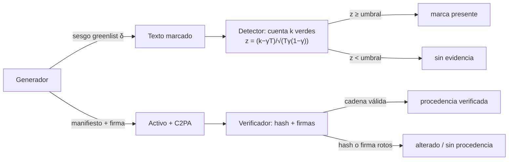

# 098 — Procedencia, marcas y autenticidad

> [← Clase anterior](../../../classes/part-07-generative-ai-across-media/097-datos-sinteticos-utilidad-y-contaminacion/README.md) · [Índice de la parte](../README.md) · [Clase siguiente →](../../../classes/part-07-generative-ai-across-media/099-proyecto-pipeline-creativo-trazable/README.md)

**Parte:** 07 — IA generativa para texto, imagen, audio, video y 3D  
**Nivel:** avanzado · **Horas estimadas:** 6  
**Laboratorio:** `safety` · **Estado:** `EXECUTABLE_CORE`

## 🎯 Propósito

Comprender **procedencia, marcas y autenticidad** dentro de la evolución de la inteligencia
artificial, implementar un experimento mínimo verificable y distinguir qué parte
constituye evidencia frente a una afirmación todavía no comprobada.

## 📚 Resultados de aprendizaje

Al finalizar podrás:

1. Explicar procedencia, marcas y autenticidad usando los conceptos `C2PA`, `watermark`, `provenance`, `autenticidad`.
2. Ejecutar el laboratorio con una semilla explícita y revisar su contrato JSON.
3. Identificar al menos un supuesto, una limitación y un riesgo de aplicación.
4. Comparar el enfoque con la etapa anterior de la ruta de aprendizaje.
5. Producir una evidencia reproducible y una conclusión que no exceda los datos.

## 🧩 Conceptos centrales

`C2PA`, `watermark`, `provenance`, `autenticidad`

## 🗺️ Ubicación en el mapa de la IA

Cuando los generadores de las clases 088–096 producen contenido indistinguible del
humano, la pregunta "¿quién hizo esto y cómo?" deja de poder responderse mirando el
contenido. Esta clase estudia las dos respuestas de la ingeniería: **procedencia
activa** (C2PA: metadatos firmados criptográficamente que viajan con el activo) y
**marcas de agua estadísticas** (SynthID, esquemas tipo Kirchenbauer: sesgos
imperceptibles insertados durante la generación). Ambas alimentan directamente el
pipeline trazable del proyecto integrador (clase 099) y la mitigación de la
contaminación de corpus (clase 097).

## 📖 Fundamentos

### 📜 Procedencia activa: C2PA

**C2PA** (Coalition for Content Provenance and Authenticity) define un formato de
**manifiesto** que se adjunta al activo (imagen, video, audio, PDF) y registra su
historia. La estructura esencial:

- **Aserciones (assertions):** hechos sobre el activo — qué herramienta lo creó, qué
  modelo generativo intervino, qué ediciones se aplicaron, miniaturas, EXIF.
- **Reclamo (claim):** agrupa las aserciones y contiene el **hard binding**: un hash
  criptográfico del contenido del activo que liga el manifiesto a *esos bytes exactos*.
- **Firma del reclamo (claim signature):** firma digital del reclamo con el certificado
  X.509 del firmante (fabricante de cámara, editor de software, servicio de IA).

Cada edición añade un nuevo manifiesto que referencia (y contiene el hash de) el
manifiesto anterior, formando una **cadena de procedencia**. Verificar = recalcular el
hash del activo, compararlo con el hard binding, y validar las firmas de toda la
cadena. Cualquier alteración de los bytes rompe el hash; cualquier alteración del
manifiesto rompe la firma.

```text
verificar(activo):
    m ← extraer_manifiesto(activo)
    si hash(contenido) ≠ m.hard_binding → INVÁLIDO (contenido alterado)
    para cada eslabón de la cadena:
        si no verifica_firma(eslabón) → INVÁLIDO (manifiesto alterado)
        si hash(eslabón_previo) ≠ referencia → INVÁLIDO (cadena rota)
    devolver cadena de procedencia verificada
```

Importante: C2PA acredita **quién firmó y qué proceso declaró**, no que el contenido
sea "verdadero". Y su ausencia no prueba nada: la mayoría del contenido legítimo no
lleva manifiesto.

### 💧 Marcas de agua estadísticas para texto

Un LLM genera token a token muestreando de una distribución. El esquema de
**Kirchenbauer et al. (2023)** inserta una marca invisible sesgando ese muestreo:

1. Antes de emitir el token t, se usa un hash del token anterior como semilla para
   partir el vocabulario en una **lista verde** (fracción γ) y una **lista roja** (1−γ).
2. Se suma un sesgo δ > 0 al logit de todos los tokens verdes y se muestrea normalmente.
3. El texto resultante contiene *más tokens verdes de lo esperable por azar*, sin que
   un lector lo note.

**Detección** = test de hipótesis. Bajo H₀ (texto sin marca), cada token es verde con
probabilidad γ, así que el conteo de verdes k en T tokens sigue Binomial(T, γ). El
estadístico:

```text
z = (k − γT) / sqrt(T · γ · (1 − γ))
```

Un z grande (p. ej. ≥ 4) hace H₀ insostenible. El detector solo necesita la clave del
hash, no el modelo. **SynthID-Text** (Dathathri et al., *Nature* 2024) generaliza la
idea con *tournament sampling* y está desplegado en producción en Gemini; SynthID
también cubre imagen y audio con perturbaciones imperceptibles decodificables.

### 🔍 Detección pasiva vs procedencia activa

- **Detección pasiva:** clasificadores que buscan artefactos estadísticos del contenido
  generado *sin cooperación del generador*. Frágil: los artefactos cambian con cada
  modelo nuevo y las tasas de falso positivo penalizan textos atípicos (p. ej. hablantes
  no nativos).
- **Procedencia activa (C2PA) y marcas de agua:** requieren cooperación del generador,
  pero dan garantías verificables (firma) o estadísticas (z-score).

**Limitaciones reales de todas las vías:** el recorte y la recompresión destruyen
metadatos no anclados; parafrasear o traducir un texto marcado diluye la señal verde;
el **lavado de marca** (regenerar el contenido con otro modelo sin marca) la elimina;
y quitar un manifiesto C2PA es trivial — la garantía es unidireccional: presencia
válida ⇒ procedencia verificada; ausencia ⇏ contenido humano.

## 🧮 Ejemplo trabajado

Test de una marca tipo greenlist con γ = 0.5 sobre un texto de **T = 100 tokens** en el
que el detector cuenta **k = 70 tokens verdes**.

```text
Esperado bajo H₀:      γT = 0.5 · 100 = 50 verdes
Varianza bajo H₀:      T·γ·(1−γ) = 100 · 0.5 · 0.5 = 25   →  σ = 5
Estadístico:           z = (70 − 50) / 5 = 4.0
```

Un z = 4.0 corresponde a un p-valor unilateral ≈ 3.2 × 10⁻⁵: si el texto no tuviera
marca, ver 70+ verdes ocurriría unas 3 veces en 100 000 textos. Se rechaza H₀ y se
declara la marca presente. Contraste: con k = 55 verdes, z = 1.0 — perfectamente
compatible con el azar; y si un parafraseador reescribe la mitad del texto llevando
los verdes de 70 a ~60, z cae a 2.0 y la evidencia se vuelve débil. La detección es
un *continuo de confianza*, no un sello binario.

## 📊 Propiedades y comparación

| Mecanismo | Cooperación del generador | Garantía | Sobrevive a recompresión | Sobrevive a paráfrasis/lavado | Falsos positivos |
|---|---|---|---|---|---|
| C2PA (manifiesto firmado) | sí (firma en origen) | criptográfica | no (si se eliminan metadatos) | no (se elimina el manifiesto) | ≈ 0 (firma inválida es detectable) |
| Marca de agua en texto (greenlist) | sí (sesgo al muestrear) | estadística (z-score) | sí (el texto es la señal) | parcial: se diluye | controlables vía umbral z |
| SynthID imagen/audio | sí (perturbación decodificable) | estadística | parcial (robusta a compresión moderada) | no ante regeneración | bajos, medidos |
| Detección pasiva | no | heurística | depende del artefacto | no | altos y sesgados |



## ⚠️ Errores conceptuales frecuentes

1. **"C2PA demuestra que una imagen es real."** No: demuestra quién firmó qué proceso.
   Una imagen generada por IA puede llevar un manifiesto C2PA perfectamente válido que
   declara, honestamente, que fue generada.
2. **"Sin marca de agua ⇒ escrito por un humano."** La ausencia de señal no es evidencia
   de origen humano: la mayoría de los generadores no marcan, y las marcas se pueden lavar.
3. **"La marca de agua está en las palabras elegidas 'raras'."** El texto marcado es
   fluido y natural; la señal es un sesgo estadístico agregado sobre cientos de tokens,
   invisible token a token.
4. **"Un detector pasivo de 'texto de IA' con 95 % de accuracy es fiable."** Con
   prevalencia baja y costo alto del falso positivo (acusar a un estudiante), esa cifra
   es inutilizable; además el sesgo contra hablantes no nativos está documentado.
5. **"El hash del manifiesto protege contra el recorte."** El hard binding detecta la
   alteración, pero no la impide ni la revierte: un activo recortado simplemente queda
   *sin* procedencia verificable.

## 🚀 Del aprendizaje a la operación

Para operar esto de verdad faltan: una PKI con emisión y revocación de certificados de
firmante (¿quién decide qué firmas son confiables?), umbrales de z calibrados sobre la
tasa de falsos positivos tolerable por caso de uso, medición de robustez de la marca
frente a paráfrasis y traducción con corpus adversarios, y una política de visualización
para el usuario final (Content Credentials) que no sobreinterprete la ausencia de
manifiesto. La estandarización (C2PA 2.x) avanza más rápido que la adopción.

## 🧪 Laboratorio

```bash
python lab.py
```

El laboratorio llama a `ai_evolution.labs.run_lab("safety")`. Esta
decisión evita 183 implementaciones divergentes: cada clase tiene un entrypoint
propio, pero los motores didácticos se prueban como una biblioteca común.

### 🔍 Evidencia esperada

- tipo de laboratorio y semilla;
- entradas o decisiones observables;
- resultado estructurado;
- lista `evidence` con hechos que pueden inspeccionarse;
- lista `limitations` que impide presentar la demo como producción.

## 📓 Notebooks

- [📓 `notebook.ipynb`](notebook.ipynb): recorrido guiado con la materia resumida.
- [✍️ `notebook_student.ipynb`](notebook_student.ipynb): ejercicios para resolver.
- [✅ `notebook_solution.ipynb`](notebook_solution.ipynb): solución de referencia explicada.

## 📝 Evaluación

| Criterio | Peso |
|---|---:|
| Comprensión conceptual | 25 % |
| Ejecución reproducible | 25 % |
| Interpretación basada en evidencia | 25 % |
| Riesgos, límites y mejora propuesta | 25 % |

Consulta [assessment.md](assessment.md) para preguntas y criterio de aceptación.

## ⚠️ Errores comunes

| Síntoma | Causa probable | Corrección |
|---|---|---|
| El código corre, pero no hay conclusión | Se confundió ejecución con aprendizaje | Explica qué demuestra y qué no demuestra |
| El resultado cambia sin explicación | No se registró semilla o configuración | Conserva semilla, versión y parámetros |
| Se promete uso real | Se extrapoló desde una demo educativa | Declara entorno, datos, límites y revisión humana |
| Se copia una métrica aislada | No existe baseline ni costo de error | Añade comparación y criterio de decisión |

## ❓ Preguntas frecuentes

**¿Debo usar una API comercial?**  
No. El núcleo funciona localmente. Las extensiones LIVE se documentan por separado.

**¿El laboratorio representa una implementación industrial?**  
No por sí solo. Enseña el contrato y el patrón; producción exige integración,
seguridad, observabilidad, pruebas y operación.

**¿Dónde profundizo?**  
Revisa las especializaciones enlazadas en el README raíz y la ruta siguiente.

## 🔗 Referencias

- C2PA. *Content Credentials: C2PA Technical Specification 2.2*. [c2pa.org/specifications/specifications/2.2/index.html](https://c2pa.org/specifications/specifications/2.2/index.html) — uso: marco normativo de referencia
- Kirchenbauer, J. et al. (2023). *A Watermark for Large Language Models*. ICML 2023. [arXiv:2301.10226](https://arxiv.org/abs/2301.10226) — uso: fuente primaria del mecanismo estudiado
- Dathathri, S. et al. (2024). *Scalable watermarking for identifying large language model outputs* (SynthID-Text). Nature, 634. [doi:10.1038/s41586-024-08025-4](https://doi.org/10.1038/s41586-024-08025-4) — uso: fuente primaria del mecanismo estudiado
- Content Credentials (implementación de C2PA para usuarios finales): [contentcredentials.org](https://contentcredentials.org/) — uso: referencia consultada en su fuente original

<!-- papers:inicio -->

---

## 📜 Papers que fundamentan esta clase

> Bloque generado por `python scripts/link_papers_to_classes.py`. La fuente es [`papers/catalog/papers.json`](../../../papers/catalog/papers.json).

| Paper | Año | Qué desbloqueó | Miniatura |
|---|---:|---|---|
| [P131 · Una marca de agua para modelos de lenguaje grandes](../../../papers/foundational/P131_marcas_de_agua/README.md) | 2023 | Deja una firma estadística verificable en el texto generado sesgando qué tokens se eligen, sin degradar apreciablemente la calidad ni necesitar el modelo para detectarla. | [notebook](../../../notebooks/papers/P131_marcas_de_agua.ipynb) |

Cada ficha explica el problema anterior, la matemática mínima, los límites y los errores de atribución más frecuentes. Para leerlas con método: [cómo leer un paper de IA](../../../papers/guides/COMO_LEER_UN_PAPER_DE_IA.md) · [anexos matemáticos](../../../papers/annexes/README.md).
<!-- papers:fin -->
<!-- bibliografia:inicio -->

---

## 📚 Bibliografía de apoyo

> Bloque generado por `python scripts/link_sources_to_classes.py`. Cada obra lleva su localizador verificado en [`sources/bibliography.json`](../../../sources/bibliography.json).

Los papers dicen **de dónde salió** el mecanismo. Estas obras lo **desarrollan** con el espacio que una clase no tiene: teoría completa, demostraciones y ejercicios.

| Obra | Edición | Localizador | Papel en esta clase |
|---|---|---|---|
| Goodfellow, Ian, Bengio, Yoshua y Courville, Aaron — *Deep Learning* | 2016 | [ISBN 9780262035613](https://openlibrary.org/isbn/9780262035613) · [web de la obra](https://www.deeplearningbook.org/) | obra de referencia de la parte 07 · capítulos de modelos generativos |

**Normas y documentación oficial que aplica esta clase:** [c2pa.org/specifications](https://c2pa.org/specifications/specifications/2.2/index.html)
<!-- bibliografia:fin -->

---

## ⬅️ Clase anterior

[097 — Datos sintéticos: utilidad y contaminación](../../part-07-generative-ai-across-media/097-datos-sinteticos-utilidad-y-contaminacion/README.md)

## ➡️ Siguiente clase

[099 — Proyecto: pipeline creativo trazable](../../part-07-generative-ai-across-media/099-proyecto-pipeline-creativo-trazable/README.md)
