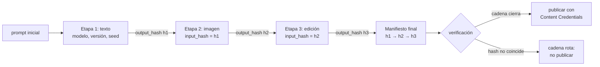

# 099 — Proyecto: pipeline creativo trazable

> [← Clase anterior](../../../classes/part-07-generative-ai-across-media/098-procedencia-marcas-y-autenticidad/README.md) · [Índice de la parte](../README.md) · [Clase siguiente →](../../../classes/part-08-retrieval-context-memory-and-knowledge/100-embeddings-y-busqueda-vectorial/README.md)

**Parte:** 07 — IA generativa para texto, imagen, audio, video y 3D  
**Nivel:** avanzado · **Horas estimadas:** 10  
**Laboratorio:** `capstone` · **Estado:** `EXECUTABLE_CORE`

## 🎯 Propósito

Comprender **proyecto: pipeline creativo trazable** dentro de la evolución de la inteligencia
artificial, implementar un experimento mínimo verificable y distinguir qué parte
constituye evidencia frente a una afirmación todavía no comprobada.

## 📚 Resultados de aprendizaje

Al finalizar podrás:

1. Explicar proyecto: pipeline creativo trazable usando los conceptos `multimedia`, `provenance`, `evaluación`, `publicación`.
2. Ejecutar el laboratorio con una semilla explícita y revisar su contrato JSON.
3. Identificar al menos un supuesto, una limitación y un riesgo de aplicación.
4. Comparar el enfoque con la etapa anterior de la ruta de aprendizaje.
5. Producir una evidencia reproducible y una conclusión que no exceda los datos.

## 🧩 Conceptos centrales

`multimedia`, `provenance`, `evaluación`, `publicación`

## 🗺️ Ubicación en el mapa de la IA

Este proyecto integra la parte 07 completa: la generación multimedia (clases 088–096)
aporta las etapas creativas, la clase 097 aporta la disciplina sobre datos sintéticos
y la 095 aporta procedencia y marcas. El resultado —un pipeline donde cada activo
publicado puede responder "quién, con qué modelo, con qué semilla y a partir de qué"—
es el patrón que exigen los marcos de gobernanza (NIST AI RMF, C2PA) y el que
reutilizarás en las partes siguientes para pipelines de recuperación y agentes.

## 📖 Fundamentos

### 🧱 Diseño por etapas con contratos JSON

Un pipeline creativo trazable es una secuencia de etapas donde cada una consume y
produce un **contrato JSON explícito**. Contrato mínimo por etapa:

```text
{
  "stage": "texto|imagen|edición|...",
  "model": "nombre",  "version": "x.y",
  "seed": 42,
  "prompt_o_params": "...",
  "input_hash":  "hash de la salida de la etapa anterior",
  "output_hash": "hash de la salida propia",
  "timestamp": "ISO-8601",
  "licencia_y_consentimiento": {"fuente": "...", "licencia": "..."}
}
```

Tres decisiones de diseño sostienen la trazabilidad:

1. **Determinismo declarado:** modelo + versión + semilla + parámetros registrados.
   No garantiza reproducción bit a bit entre hardwares, pero sí auditabilidad: se sabe
   exactamente qué se pidió y con qué configuración.
2. **Hashes encadenados:** el `input_hash` de la etapa n debe ser igual al
   `output_hash` de la etapa n−1. Así, el manifiesto final encadena todo el linaje,
   al estilo de la cadena de manifiestos C2PA.
3. **Registro append-only:** los manifiestos de etapa no se editan; una re-ejecución
   crea entradas nuevas. Corregir borrando historia destruye la evidencia.

### 📋 Registro de procedencia por etapa

Cada etapa registra: **modelo y versión** (¿qué generador?), **semilla** (¿qué
muestra del espacio de salidas?), **prompt/parámetros** (¿qué se pidió?), **hash de
entrada y de salida** (¿sobre qué bytes exactos?). Con eso, el manifiesto final es
verificable con el mismo algoritmo de la clase 098: recalcular hashes y recorrer la
cadena. Si el pipeline usa datos sintéticos como insumo (clase 097), el manifiesto
debe declararlo: fracción sintética, generador de origen y protocolo de utilidad
aplicado (TSTR), para no contaminar silenciosamente entrenamientos futuros.

### 📐 Evaluación y gobernanza

- **Utilidad:** ¿el activo cumple la especificación creativa? Métricas automáticas
  cuando existan (p. ej. similitud prompt–imagen) + revisión humana registrada.
- **Autenticidad verificable:** la cadena de hashes cierra y, si se publica, el
  manifiesto viaja con el activo (C2PA / Content Credentials).
- **Gobernanza:** consentimiento y licencia de cada insumo (¿el material de la etapa 1
  permitía uso derivado?), atribución, y un mapa de riesgos al estilo NIST AI RMF:
  identificar (¿qué puede salir mal?), medir (¿con qué métrica?), gestionar (¿quién
  aprueba la publicación?).

## 🧮 Ejemplo trabajado

Pipeline de 3 etapas: **texto → imagen → edición**. Usamos un hash simulado de 8 bits
(didáctico, no criptográfico): `h(s) = suma de los códigos de los caracteres mod 256`,
en hexadecimal.

```text
Etapa 1 (texto):    salida  s1 = "un faro al amanecer"
                    h(s1) = 0xF4            → output_hash = F4

Etapa 2 (imagen):   input_hash = F4  ✔ (coincide con la etapa 1)
                    salida  s2 = "IMG[faro,amanecer,seed=7]"
                    h(s2) = 0xE6            → output_hash = E6

Etapa 3 (edición):  input_hash = E6  ✔
                    salida  s3 = "IMG[faro,amanecer,seed=7]+recorte"
                    h(s3) = 0x05            → output_hash = 05

Manifiesto final:   cadena F4 → E6 → 05   → VERIFICA
```

Ahora alguien "retoca" la etapa 2 sin registrarlo: regenera con `seed=8`. La nueva
salida s2' produce `h(s2') = 0xE7 ≠ E6`. Al verificar:

```text
Etapa 3 declara input_hash = E6, pero h(s2') = E7  → CADENA ROTA en 2→3
```

La verificación no dice *qué* cambió ni *por qué* —solo que los bytes que la etapa 3
declaró consumir ya no existen. Ese es exactamente el comportamiento del hard binding
C2PA: detecta la alteración, no la repara. Un hash real (SHA-256) hace además
computacionalmente inviable fabricar una s2' con el mismo hash.

## 📊 Propiedades y comparación

| Enfoque de pipeline | Reproducibilidad | Detección de alteraciones | Costo operativo | Riesgo principal |
|---|---|---|---|---|
| Ad hoc (sin registro) | ninguna | ninguna | cero | imposible auditar o corregir |
| Log de texto libre | baja (ambigua) | ninguna | bajo | el log se edita sin dejar rastro |
| Contratos JSON + hashes encadenados | alta (auditable) | sí (cadena rota) | medio | disciplina de registro por etapa |
| C2PA firmado end-to-end | alta + no repudio | sí, con garantía criptográfica | alto (PKI) | gestión de certificados |



## ⚠️ Errores conceptuales frecuentes

1. **"Registrar la semilla garantiza reproducir el mismo activo."** La semilla fija la
   muestra *dado* modelo, versión, hardware y librerías; un cambio de versión del
   modelo produce otra salida con la misma semilla. Por eso el contrato registra ambos.
2. **"La cadena de hashes protege el contenido."** Solo lo *vincula*: detecta
   alteraciones a posteriori. La protección (quién puede escribir en el registro)
   es un problema de control de acceso, no de hashing.
3. **"Trazabilidad = burocracia que se añade al final."** Un manifiesto reconstruido
   retrospectivamente no es evidencia: la procedencia solo vale si se registra en el
   momento de la generación, dentro del pipeline.
4. **"Si cada etapa es de un proveedor confiable, el pipeline es confiable."** La
   confianza no compone automáticamente: el eslabón sin registrar (una edición manual
   entre etapas) rompe el linaje aunque todas las etapas firmadas sean honestas.
5. **"El proyecto es sobre generar contenido bonito."** El entregable evaluable es el
   *manifiesto verificable*; la calidad creativa sin trazabilidad no aprueba la parte
   de gobernanza.

## 🚀 Del aprendizaje a la operación

Para llevar este patrón a producción faltan: hashes criptográficos reales (SHA-256) y
firmas con una PKI gestionada en lugar del hash didáctico de 8 bits; un almacén de
manifiestos append-only con control de acceso; integración C2PA real en los formatos
de salida (JPEG, MP4) con Content Credentials; revisión legal de licencias y
consentimiento por jurisdicción; y un proceso de aprobación humana previo a la
publicación alineado con NIST AI RMF (govern–map–measure–manage).

## 🧪 Laboratorio

```bash
python lab.py
```

El laboratorio llama a `ai_evolution.labs.run_lab("capstone")`. Esta
decisión evita 183 implementaciones divergentes: cada clase tiene un entrypoint
propio, pero los motores didácticos se prueban como una biblioteca común.

### 🔍 Evidencia esperada

- tipo de laboratorio y semilla;
- entradas o decisiones observables;
- resultado estructurado;
- lista `evidence` con hechos que pueden inspeccionarse;
- lista `limitations` que impide presentar la demo como producción.

## 📓 Notebooks

- [📓 `notebook.ipynb`](notebook.ipynb): recorrido guiado con la materia resumida.
- [✍️ `notebook_student.ipynb`](notebook_student.ipynb): ejercicios para resolver.
- [✅ `notebook_solution.ipynb`](notebook_solution.ipynb): solución de referencia explicada.

## 📝 Evaluación

| Criterio | Peso |
|---|---:|
| Comprensión conceptual | 25 % |
| Ejecución reproducible | 25 % |
| Interpretación basada en evidencia | 25 % |
| Riesgos, límites y mejora propuesta | 25 % |

Consulta [assessment.md](assessment.md) para preguntas y criterio de aceptación.

## ⚠️ Errores comunes

| Síntoma | Causa probable | Corrección |
|---|---|---|
| El código corre, pero no hay conclusión | Se confundió ejecución con aprendizaje | Explica qué demuestra y qué no demuestra |
| El resultado cambia sin explicación | No se registró semilla o configuración | Conserva semilla, versión y parámetros |
| Se promete uso real | Se extrapoló desde una demo educativa | Declara entorno, datos, límites y revisión humana |
| Se copia una métrica aislada | No existe baseline ni costo de error | Añade comparación y criterio de decisión |

## ❓ Preguntas frecuentes

**¿Debo usar una API comercial?**  
No. El núcleo funciona localmente. Las extensiones LIVE se documentan por separado.

**¿El laboratorio representa una implementación industrial?**  
No por sí solo. Enseña el contrato y el patrón; producción exige integración,
seguridad, observabilidad, pruebas y operación.

**¿Dónde profundizo?**  
Revisa las especializaciones enlazadas en el README raíz y la ruta siguiente.

## 🔗 Referencias

- C2PA. *Content Credentials: C2PA Technical Specification 2.2*. [c2pa.org/specifications/specifications/2.2/index.html](https://c2pa.org/specifications/specifications/2.2/index.html) — uso: marco normativo de referencia
- NIST. *AI Risk Management Framework (AI RMF 1.0)*. [nist.gov/itl/ai-risk-management-framework](https://www.nist.gov/itl/ai-risk-management-framework) — uso: marco normativo de referencia
- Ho, J., Jain, A. y Abbeel, P. (2020). *Denoising Diffusion Probabilistic Models*. [arXiv:2006.11239](https://arxiv.org/abs/2006.11239) — uso: fuente primaria del mecanismo estudiado
- Rombach, R. et al. (2022). *High-Resolution Image Synthesis with Latent Diffusion Models*. [arXiv:2112.10752](https://arxiv.org/abs/2112.10752) — uso: fuente primaria del mecanismo estudiado
- Content Credentials: [contentcredentials.org](https://contentcredentials.org/) — uso: referencia consultada en su fuente original

<!-- bibliografia:inicio -->

---

## 📚 Bibliografía de apoyo

> Bloque generado por `python scripts/link_sources_to_classes.py`. Cada obra lleva su localizador verificado en [`sources/bibliography.json`](../../../sources/bibliography.json).

Los papers dicen **de dónde salió** el mecanismo. Estas obras lo **desarrollan** con el espacio que una clase no tiene: teoría completa, demostraciones y ejercicios.

| Obra | Edición | Localizador | Papel en esta clase |
|---|---|---|---|
| Goodfellow, Ian, Bengio, Yoshua y Courville, Aaron — *Deep Learning* | 2016 | [ISBN 9780262035613](https://openlibrary.org/isbn/9780262035613) · [web de la obra](https://www.deeplearningbook.org/) | obra de referencia de la parte 07 · capítulos de modelos generativos |

**Normas y documentación oficial que aplica esta clase:** [c2pa.org/specifications](https://c2pa.org/specifications/specifications/2.2/index.html) · [AI Risk Management Framework](https://www.nist.gov/itl/ai-risk-management-framework)
<!-- bibliografia:fin -->

---

## ⬅️ Clase anterior

[098 — Procedencia, marcas y autenticidad](../../part-07-generative-ai-across-media/098-procedencia-marcas-y-autenticidad/README.md)

## ➡️ Siguiente clase

[100 — Embeddings y búsqueda vectorial](../../part-08-retrieval-context-memory-and-knowledge/100-embeddings-y-busqueda-vectorial/README.md)
