# 🎨 Parte 07 — IA generativa para texto, imagen, audio, video y 3D

**Nivel:** avanzado · **Duración sugerida:** 5–6 semanas ·
**Clases:** 12

Cubre la generación multimodal y sus pipelines creativos, incluyendo control, procedencia, consentimiento y evaluación de calidad.

## 🧭 Secuencia de la parte

```mermaid
flowchart LR
    L085["085<br/>Espacios latentes y<br/>autoencoders variacionales"]
    L086["086<br/>GAN y entrenamiento<br/>adversarial"]
    L087["087<br/>Modelos de difusión"]
    L088["088<br/>Texto a imagen<br/>y condicionamiento"]
    L089["089<br/>Control estructural y<br/>edición generativa"]
    L090["090<br/>Generación musical y<br/>de audio"]
    L091["091<br/>Síntesis de voz<br/>y derechos de<br/>identidad"]
    L092["092<br/>Generación y edición<br/>de video"]
    L093["093<br/>Generación 3D y<br/>mundos sintéticos"]
    L094["094<br/>Datos sintéticos: utilidad<br/>y contaminación"]
    L095["095<br/>Procedencia, marcas y<br/>autenticidad"]
    L096["096<br/>Proyecto: pipeline creativo<br/>trazable"]
    L085 --> L086
    L086 --> L087
    L087 --> L088
    L088 --> L089
    L089 --> L090
    L090 --> L091
    L091 --> L092
    L092 --> L093
    L093 --> L094
    L094 --> L095
    L095 --> L096
```

## 📚 Clases

| ID | Tema | Laboratorio | Horas |
|---:|---|---|---:|
| 085 | [Espacios latentes y autoencoders variacionales](085-espacios-latentes-y-autoencoders-variacionales/README.md) | `generation` | 6 |
| 086 | [GAN y entrenamiento adversarial](086-gan-y-entrenamiento-adversarial/README.md) | `generation` | 6 |
| 087 | [Modelos de difusión](087-modelos-de-difusion/README.md) | `generation` | 6 |
| 088 | [Texto a imagen y condicionamiento](088-texto-a-imagen-y-condicionamiento/README.md) | `generation` | 6 |
| 089 | [Control estructural y edición generativa](089-control-estructural-y-edicion-generativa/README.md) | `generation` | 6 |
| 090 | [Generación musical y de audio](090-generacion-musical-y-de-audio/README.md) | `generation` | 6 |
| 091 | [Síntesis de voz y derechos de identidad](091-sintesis-de-voz-y-derechos-de-identidad/README.md) | `safety` | 6 |
| 092 | [Generación y edición de video](092-generacion-y-edicion-de-video/README.md) | `generation` | 6 |
| 093 | [Generación 3D y mundos sintéticos](093-generacion-3d-y-mundos-sinteticos/README.md) | `generation` | 6 |
| 094 | [Datos sintéticos: utilidad y contaminación](094-datos-sinteticos-utilidad-y-contaminacion/README.md) | `evaluation` | 6 |
| 095 | [Procedencia, marcas y autenticidad](095-procedencia-marcas-y-autenticidad/README.md) | `safety` | 6 |
| 096 | [Proyecto: pipeline creativo trazable](096-proyecto-pipeline-creativo-trazable/README.md) | `capstone` | 10 |

## 📝 Evaluación de la parte

- 40 % laboratorios y notebooks.
- 25 % explicaciones y comparación de enfoques.
- 20 % evaluación de riesgos y limitaciones.
- 15 % mini-proyecto o integración.

[⬅️ Parte 06 — Modelos fundacionales e ingeniería de LLM](../part-06-foundation-models-and-llm-engineering/README.md) · [🏠 Volver al programa](../../README.md) · [➡️ Parte 08 — Recuperación, contexto, memoria y conocimiento](../part-08-retrieval-context-memory-and-knowledge/README.md)
