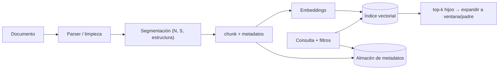

# 098 — Segmentación, metadatos y ventanas

> [← Clase anterior](../../../classes/part-08-retrieval-context-memory-and-knowledge/097-embeddings-y-busqueda-vectorial/README.md) · [Índice de la parte](../README.md) · [Clase siguiente →](../../../classes/part-08-retrieval-context-memory-and-knowledge/099-busqueda-lexica-y-bm25/README.md)

**Parte:** 08 — Recuperación, contexto, memoria y conocimiento  
**Nivel:** avanzado · **Horas estimadas:** 6  
**Laboratorio:** `retrieval` · **Estado:** `EXECUTABLE_CORE`

## 🎯 Propósito

Comprender **segmentación, metadatos y ventanas** dentro de la evolución de la inteligencia
artificial, implementar un experimento mínimo verificable y distinguir qué parte
constituye evidencia frente a una afirmación todavía no comprobada.

## 📚 Resultados de aprendizaje

Al finalizar podrás:

1. Explicar segmentación, metadatos y ventanas usando los conceptos `chunking`, `metadata`, `overlap`, `estructura`.
2. Ejecutar el laboratorio con una semilla explícita y revisar su contrato JSON.
3. Identificar al menos un supuesto, una limitación y un riesgo de aplicación.
4. Comparar el enfoque con la etapa anterior de la ruta de aprendizaje.
5. Producir una evidencia reproducible y una conclusión que no exceda los datos.

## 🧩 Conceptos centrales

`chunking`, `metadata`, `overlap`, `estructura`

## 🗺️ Ubicación en el mapa de la IA

Un índice vectorial (clase 097) no busca documentos: busca fragmentos. Cómo se corta un
documento en unidades indexables —el *chunking*— determina qué puede recuperarse y qué
se pierde antes de que ninguna consulta exista. Esta clase aporta la capa de ingesta que
todo sistema RAG (clases 102-108) presupone: segmentación, metadatos que permiten
filtrar y atribuir, y ventanas que reconcilian "recuperar preciso" con "leer con contexto".

## 📖 Fundamentos

### ✂️ El problema del chunking

Los modelos de embeddings y los LLM tienen ventanas finitas, y un embedding de un
documento entero diluye sus temas en un solo vector. Por eso se indexan **chunks**:
fragmentos de tamaño acotado. El diseño enfrenta una tensión central:

- **Chunks pequeños** → embeddings más nítidos (un tema por vector), mejor precisión de
  recuperación, pero fragmentos ilegibles sin su entorno.
- **Chunks grandes** → más contexto autocontenido, pero embeddings "promedio" que
  recuperan peor y llenan la ventana del LLM con ruido.

### 🧩 Estrategias de segmentación

```text
1. Tamaño fijo:        cortar cada N tokens (con solape S). Simple, ignora estructura.
2. Recursiva:          intentar cortar por separadores jerárquicos
                       (secciones → párrafos → oraciones → tokens) hasta caber en N.
3. Estructural:        respetar la estructura del formato (encabezados Markdown,
                       celdas de tabla, bloques de código) como fronteras duras.
4. Semántica:          cortar donde la similitud entre oraciones consecutivas cae
                       por debajo de un umbral (cambio de tema detectado con embeddings).
```

El **solape** (*overlap*) repite `S` tokens entre chunks consecutivos para que una idea
que cruza la frontera exista completa en al menos un chunk. Coste: almacenamiento e
indexación redundantes (factor `N/(N−S)`).

### 🪟 Ventanas: separar unidad de búsqueda y unidad de lectura

Dos patrones desacoplan el vector que se busca del texto que se entrega al LLM:

- **Sentence-window**: se indexa cada oración (búsqueda precisa) pero se devuelve la
  oración ± k vecinas (lectura con contexto).
- **Parent-document / chunk jerárquico**: se indexan chunks hijos pequeños; al
  recuperar un hijo se entrega su chunk padre (sección completa). La búsqueda apunta
  fino; la generación lee ancho.

### 🏷️ Metadatos

Cada chunk viaja con metadatos estructurados: `doc_id`, título, sección, posición,
fecha, autor, idioma, permisos de acceso. Sirven para tres cosas que el vector no puede
hacer: **filtrar** (solo documentos de 2024, solo los que este usuario puede ver),
**atribuir** (citar fuente y sección exactas, clase 102) y **depurar** (rastrear por qué
un chunk apareció). El filtrado puede ser *pre-filter* (el índice restringe el espacio
antes de buscar, exacto pero exige soporte del motor) o *post-filter* (se recuperan más
candidatos y se filtran después, simple pero puede quedarse corto de resultados).

## 🧮 Ejemplo trabajado

Documento de **900 tokens**, chunking de tamaño fijo con `N = 300` y solape `S = 50`.
Cada chunk empieza donde el anterior avanzó `N − S = 250` tokens:

```text
chunk 0: tokens [0, 300)      inicio = 0·250 = 0
chunk 1: tokens [250, 550)    inicio = 1·250 = 250   (repite 250-300 del chunk 0)
chunk 2: tokens [500, 800)    inicio = 2·250 = 500
chunk 3: tokens [750, 900)    inicio = 3·250 = 750   (parcial, 150 tokens)

Número de chunks: ⌈(900 − 50) / 250⌉ = ⌈3.4⌉ = 4
Tokens almacenados: 300+300+300+150 = 1050 → sobrecoste 1050/900 ≈ 1.17×
```

Una afirmación que ocupe los tokens 240-310 quedaría cortada en un esquema sin solape
(frontera en 300); con `S = 50` vive completa dentro del chunk 1 `[250, 550)`... salvo
sus primeros 10 tokens. Moraleja: el solape reduce el riesgo de corte, no lo elimina;
solo las fronteras estructurales (párrafo, sección) lo evitan por construcción.

## 📊 Propiedades y comparación

| Estrategia | Respeta estructura | Coste de ingesta | Riesgo de cortar ideas | Cuándo usarla |
|---|---|---|---|---|
| Tamaño fijo + solape | No | Mínimo | Medio (mitigado por solape) | baseline, texto homogéneo |
| Recursiva | Parcial | Bajo | Bajo-medio | documentos con párrafos claros |
| Estructural (Markdown/HTML) | Sí | Medio (parser) | Bajo | documentación técnica, wikis |
| Semántica | Implícita | Alto (embeddings en ingesta) | Bajo | texto largo sin estructura |
| Sentence-window / parent-doc | Sí (2 niveles) | Medio | Muy bajo en lectura | RAG con citas precisas |



## ⚠️ Errores conceptuales frecuentes

1. **"Existe un tamaño de chunk óptimo universal"**. El óptimo depende del corpus, del
   modelo de embeddings y de la tarea; se elige midiendo recall sobre consultas propias
   (clase 107), no copiando un número de un tutorial.
2. **Chunking sin metadatos**. Un chunk sin `doc_id` ni posición no puede citarse ni
   deduplicarse; la atribución de la clase 102 se vuelve imposible de reconstruir a posteriori.
3. **Confundir unidad de búsqueda con unidad de lectura**. Optimizar un único tamaño
   para ambas cosas sacrifica una; sentence-window y parent-document existen
   precisamente para separarlas.
4. **Ignorar tablas y código**. Cortar una tabla por la mitad o un bloque de código por
   una línea arbitraria produce chunks sintácticamente inválidos que el embedding
   representa mal y el LLM malinterpreta.
5. **Solape como solución mágica**. El solape duplica contenido (sesga el top-k hacia
   documentos con más chunks casi idénticos) y no protege las ideas más largas que `S`.

## 🚀 Del aprendizaje a la operación

En producción el chunking es un pipeline versionado: cambiar `N`, `S` o la estrategia
obliga a reindexar y a invalidar caches, así que cada chunk guarda la versión de su
receta de segmentación. Faltan además: deduplicación entre documentos casi idénticos,
manejo de PDFs con layout complejo (tablas, columnas), propagación de permisos del
documento a cada chunk (seguridad a nivel de fila) y métricas de ingesta (chunks vacíos,
demasiado cortos, sin metadatos) antes de que ninguna consulta los delate.

## 🧪 Laboratorio

```bash
python lab.py
```

El laboratorio llama a `ai_evolution.labs.run_lab("retrieval")`. Esta
decisión evita 180 implementaciones divergentes: cada clase tiene un entrypoint
propio, pero los motores didácticos se prueban como una biblioteca común.

### 🔍 Evidencia esperada

- tipo de laboratorio y semilla;
- entradas o decisiones observables;
- resultado estructurado;
- lista `evidence` con hechos que pueden inspeccionarse;
- lista `limitations` que impide presentar la demo como producción.

## 📓 Notebooks

- [📓 `notebook.ipynb`](notebook.ipynb): recorrido guiado con la materia resumida.
- [✍️ `notebook_student.ipynb`](notebook_student.ipynb): ejercicios para resolver.
- [✅ `notebook_solution.ipynb`](notebook_solution.ipynb): solución de referencia explicada.

## 📝 Evaluación

| Criterio | Peso |
|---|---:|
| Comprensión conceptual | 25 % |
| Ejecución reproducible | 25 % |
| Interpretación basada en evidencia | 25 % |
| Riesgos, límites y mejora propuesta | 25 % |

Consulta [assessment.md](assessment.md) para preguntas y criterio de aceptación.

## ⚠️ Errores comunes

| Síntoma | Causa probable | Corrección |
|---|---|---|
| El código corre, pero no hay conclusión | Se confundió ejecución con aprendizaje | Explica qué demuestra y qué no demuestra |
| El resultado cambia sin explicación | No se registró semilla o configuración | Conserva semilla, versión y parámetros |
| Se promete uso real | Se extrapoló desde una demo educativa | Declara entorno, datos, límites y revisión humana |
| Se copia una métrica aislada | No existe baseline ni costo de error | Añade comparación y criterio de decisión |

## ❓ Preguntas frecuentes

**¿Debo usar una API comercial?**  
No. El núcleo funciona localmente. Las extensiones LIVE se documentan por separado.

**¿El laboratorio representa una implementación industrial?**  
No por sí solo. Enseña el contrato y el patrón; producción exige integración,
seguridad, observabilidad, pruebas y operación.

**¿Dónde profundizo?**  
Revisa las especializaciones enlazadas en el README raíz y la ruta siguiente.

## 🔗 Referencias

- Lewis, P. et al. (2020). *Retrieval-Augmented Generation for Knowledge-Intensive NLP Tasks* (los documentos se indexan como pasajes de ~100 palabras). [arXiv:2005.11401](https://arxiv.org/abs/2005.11401)
- Karpukhin, V. et al. (2020). *Dense Passage Retrieval for Open-Domain Question Answering*. [arXiv:2004.04906](https://arxiv.org/abs/2004.04906)
- Jurafsky, D. & Martin, J. H. *Speech and Language Processing* (3.ª ed., borrador), cap. sobre recuperación y RAG. [https://web.stanford.edu/~jurafsky/slp3/](https://web.stanford.edu/~jurafsky/slp3/)
- Documentación oficial de Qdrant — payloads y filtrado: [https://qdrant.tech/documentation/concepts/payload/](https://qdrant.tech/documentation/concepts/payload/)
- Documentación oficial de LangChain — text splitters: [https://python.langchain.com/docs/concepts/text_splitters/](https://python.langchain.com/docs/concepts/text_splitters/)

---

## ⬅️ Clase anterior

[097 — Embeddings y búsqueda vectorial](../../part-08-retrieval-context-memory-and-knowledge/097-embeddings-y-busqueda-vectorial/README.md)

## ➡️ Siguiente clase

[099 — Búsqueda léxica y BM25](../../part-08-retrieval-context-memory-and-knowledge/099-busqueda-lexica-y-bm25/README.md)
