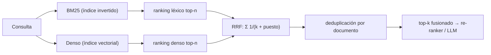

# 100 — Búsqueda híbrida y fusión de rankings

> [← Clase anterior](../../../classes/part-08-retrieval-context-memory-and-knowledge/099-busqueda-lexica-y-bm25/README.md) · [Índice de la parte](../README.md) · [Clase siguiente →](../../../classes/part-08-retrieval-context-memory-and-knowledge/101-re-ranking-y-filtros-de-evidencia/README.md)

**Parte:** 08 — Recuperación, contexto, memoria y conocimiento  
**Nivel:** avanzado · **Horas estimadas:** 6  
**Laboratorio:** `retrieval` · **Estado:** `EXECUTABLE_CORE`

## 🎯 Propósito

Comprender **búsqueda híbrida y fusión de rankings** dentro de la evolución de la inteligencia
artificial, implementar un experimento mínimo verificable y distinguir qué parte
constituye evidencia frente a una afirmación todavía no comprobada.

## 📚 Resultados de aprendizaje

Al finalizar podrás:

1. Explicar búsqueda híbrida y fusión de rankings usando los conceptos `hybrid`, `RRF`, `sparse`, `dense`.
2. Ejecutar el laboratorio con una semilla explícita y revisar su contrato JSON.
3. Identificar al menos un supuesto, una limitación y un riesgo de aplicación.
4. Comparar el enfoque con la etapa anterior de la ruta de aprendizaje.
5. Producir una evidencia reproducible y una conclusión que no exceda los datos.

## 🧩 Conceptos centrales

`hybrid`, `RRF`, `sparse`, `dense`

## 🗺️ Ubicación en el mapa de la IA

Las clases 097 y 099 dejaron dos recuperadores con fallos complementarios: el denso
resuelve sinónimos pero difumina identificadores; BM25 clava lo literal pero sufre el
desajuste de vocabulario. La búsqueda híbrida los ejecuta en paralelo y **fusiona sus
rankings**, y es hoy el punto de partida estándar de los sistemas RAG serios. El
obstáculo técnico —scores incomparables entre motores— se resuelve con fusión por
posiciones (RRF), la técnica central de esta clase; la 101 refinará el resultado con
re-ranking.

## 📖 Fundamentos

### 🔀 Por qué fusionar rankings y no scores

Un score BM25 no está acotado y depende de la colección; un coseno vive en `[−1, 1]`.
Sumarlos directamente es sumar peras con manzanas: el motor con la escala más grande
domina. Dos familias de solución:

- **Normalizar y combinar** (*score fusion*): llevar cada score a `[0,1]`
  (min-max sobre el top-k) y combinar `s = α·s_denso + (1−α)·s_léxico`. Funciona, pero
  `α` y la normalización dependen de cada consulta y colección: frágil.
- **Fusión por posiciones** (*rank fusion*): descartar los scores y usar solo el
  **puesto** de cada documento en cada ranking. Robusta, sin calibración.

### 🧮 Reciprocal Rank Fusion (RRF)

Propuesta por Cormack, Clarke y Büttcher (SIGIR 2009):

```text
RRF(d) = Σ_r∈rankings  1 / (k + rank_r(d))
```

donde `rank_r(d)` es la posición (1 = primero) del documento `d` en el ranking `r`, y
`k` es una constante de suavizado (típicamente **60**). Un documento ausente de un
ranking simplemente no suma ese término. Los porqués:

- El **recíproco** concentra el crédito en las primeras posiciones: pasar del puesto 1
  al 2 pesa más que del 50 al 51.
- La constante `k` amortigua esa cima: sin ella (`k = 0`), estar 1.º en un solo ranking
  (1/1 = 1.0) aplastaría cualquier consenso. Con `k = 60`, el puesto 1 vale 1/61 y el
  10 vale 1/70: la diferencia existe pero no dicta sola el resultado. `k` grande →
  fusión más "democrática" entre posiciones.
- Al usar solo posiciones, RRF es inmune a escalas, outliers y calibraciones de score:
  puede fusionar BM25, denso, e incluso motores de terceros de los que solo se conoce el orden.

```text
fusion_rrf(rankings, k=60):
    puntaje = defaultdict(0)
    para r en rankings:
        para (puesto, doc) en enumerate(r, desde=1):
            puntaje[doc] += 1 / (k + puesto)
    return documentos ordenados por puntaje desc
```

### 🎛️ Diseño de un recuperador híbrido

Decisiones habituales: cuántos candidatos pide cada rama (p. ej. top-50 de cada una),
si alguna rama lleva peso extra (RRF ponderado: `w_r/(k + rank)`), cómo se deduplican
chunks del mismo documento, y qué presupuesto final pasa al re-ranker o al LLM. La
evaluación (clase 107) compara siempre híbrido contra cada rama sola: la fusión debe
ganar o no se justifica su coste doble.

## 🧮 Ejemplo trabajado

Dos rankings sobre la misma consulta, `k = 60`:

```text
BM25:      [A, B, C, D]         Denso:     [C, A, E, B]

RRF(A) = 1/(60+1) + 1/(60+2) = 0.01639 + 0.01613 = 0.03252
RRF(B) = 1/(60+2) + 1/(60+4) = 0.01613 + 0.01563 = 0.03175
RRF(C) = 1/(60+3) + 1/(60+1) = 0.01587 + 0.01639 = 0.03227
RRF(D) = 1/(60+4)            = 0.01563              (solo aparece en BM25)
RRF(E) = 1/(60+3)            = 0.01587              (solo aparece en denso)

Fusión: A (0.03252) > C (0.03227) > B (0.03175) > E (0.01587) > D (0.01563)
```

Lectura: **A** gana sin ser 1.º en ningún ranking, porque está en el top-2 de ambos:
RRF premia el consenso. **C**, primero en el denso pero tercero en BM25, queda segundo.
Los documentos vistos por un solo motor (D, E) caen al fondo — aparecer en ambas ramas
es una señal fuerte de relevancia.

## 📊 Propiedades y comparación

| Método de fusión | Usa scores | Necesita calibración | Robustez entre motores | Ajustables |
|---|---|---|---|---|
| Suma de scores crudos | Sí | — | muy baja (escalas dispares) | ninguno |
| Min-max + combinación convexa | Sí | por consulta/colección | media | α, normalización |
| RRF | No (solo posiciones) | no | alta | k (y pesos w_r opcionales) |
| Re-ranking neuronal (clase 101) | recalcula | modelo entrenado | alta | modelo, presupuesto |



## ⚠️ Errores conceptuales frecuentes

1. **Sumar scores BM25 y cosenos directamente**. Escalas incomparables: el resultado lo
   decide la aritmética de las magnitudes, no la relevancia. Normaliza o usa posiciones.
2. **"RRF necesita los scores"**. Al contrario: solo necesita el orden. Esa es su
   ventaja operativa — funciona con cualquier motor que devuelva una lista ordenada.
3. **Tratar k = 60 como ley**. Es un valor empírico razonable del paper original; con
   rankings muy cortos o muchas ramas, conviene validarlo con consultas etiquetadas.
4. **Fusionar sin deduplicar**. Si ambos motores devuelven chunks distintos del mismo
   documento, la fusión puede llenar el top-k con un solo documento repetido.
5. **Asumir que híbrido siempre gana**. Si una rama es mala (índice desactualizado,
   embeddings fuera de dominio), la fusión puede degradar a la rama buena; la
   comparación contra cada rama sola es parte del contrato de evaluación.

## 🚀 Del aprendizaje a la operación

En producción la hibridación añade: ejecución en paralelo con presupuestos de latencia
por rama (y qué hacer si una rama expira), pesos por tipo de consulta (una consulta con
comillas o códigos puede inclinar hacia BM25), RRF ponderado ajustado con datos de
clics o juicios, y monitoreo separado de cada rama para detectar cuál se degrada.
Motores como OpenSearch, Qdrant o Vespa ya traen fusión híbrida nativa; la decisión de
diseño sigue siendo qué ramas, cuántos candidatos y cómo se evalúa la ganancia.

## 🧪 Laboratorio

```bash
python lab.py
```

El laboratorio llama a `ai_evolution.labs.run_lab("retrieval")`. Esta
decisión evita 180 implementaciones divergentes: cada clase tiene un entrypoint
propio, pero los motores didácticos se prueban como una biblioteca común.

### 🔍 Evidencia esperada

- tipo de laboratorio y semilla;
- entradas o decisiones observables;
- resultado estructurado;
- lista `evidence` con hechos que pueden inspeccionarse;
- lista `limitations` que impide presentar la demo como producción.

## 📓 Notebooks

- [📓 `notebook.ipynb`](notebook.ipynb): recorrido guiado con la materia resumida.
- [✍️ `notebook_student.ipynb`](notebook_student.ipynb): ejercicios para resolver.
- [✅ `notebook_solution.ipynb`](notebook_solution.ipynb): solución de referencia explicada.

## 📝 Evaluación

| Criterio | Peso |
|---|---:|
| Comprensión conceptual | 25 % |
| Ejecución reproducible | 25 % |
| Interpretación basada en evidencia | 25 % |
| Riesgos, límites y mejora propuesta | 25 % |

Consulta [assessment.md](assessment.md) para preguntas y criterio de aceptación.

## ⚠️ Errores comunes

| Síntoma | Causa probable | Corrección |
|---|---|---|
| El código corre, pero no hay conclusión | Se confundió ejecución con aprendizaje | Explica qué demuestra y qué no demuestra |
| El resultado cambia sin explicación | No se registró semilla o configuración | Conserva semilla, versión y parámetros |
| Se promete uso real | Se extrapoló desde una demo educativa | Declara entorno, datos, límites y revisión humana |
| Se copia una métrica aislada | No existe baseline ni costo de error | Añade comparación y criterio de decisión |

## ❓ Preguntas frecuentes

**¿Debo usar una API comercial?**  
No. El núcleo funciona localmente. Las extensiones LIVE se documentan por separado.

**¿El laboratorio representa una implementación industrial?**  
No por sí solo. Enseña el contrato y el patrón; producción exige integración,
seguridad, observabilidad, pruebas y operación.

**¿Dónde profundizo?**  
Revisa las especializaciones enlazadas en el README raíz y la ruta siguiente.

## 🔗 Referencias

- Cormack, G., Clarke, C. & Büttcher, S. (2009). *Reciprocal Rank Fusion outperforms Condorcet and individual Rank Learning Methods*. SIGIR 2009. [DOI 10.1145/1571941.1572114](https://doi.org/10.1145/1571941.1572114)
- Robertson, S. & Zaragoza, H. (2009). *The Probabilistic Relevance Framework: BM25 and Beyond*. [DOI 10.1561/1500000019](https://doi.org/10.1561/1500000019)
- Karpukhin, V. et al. (2020). *Dense Passage Retrieval for Open-Domain Question Answering*. [arXiv:2004.04906](https://arxiv.org/abs/2004.04906)
- Manning, C., Raghavan, P. & Schütze, H. *Introduction to Information Retrieval*: [https://nlp.stanford.edu/IR-book/](https://nlp.stanford.edu/IR-book/)
- Documentación oficial de Qdrant — búsqueda híbrida: [https://qdrant.tech/documentation/concepts/hybrid-queries/](https://qdrant.tech/documentation/concepts/hybrid-queries/)

---

## ⬅️ Clase anterior

[099 — Búsqueda léxica y BM25](../../part-08-retrieval-context-memory-and-knowledge/099-busqueda-lexica-y-bm25/README.md)

## ➡️ Siguiente clase

[101 — Re-ranking y filtros de evidencia](../../part-08-retrieval-context-memory-and-knowledge/101-re-ranking-y-filtros-de-evidencia/README.md)
