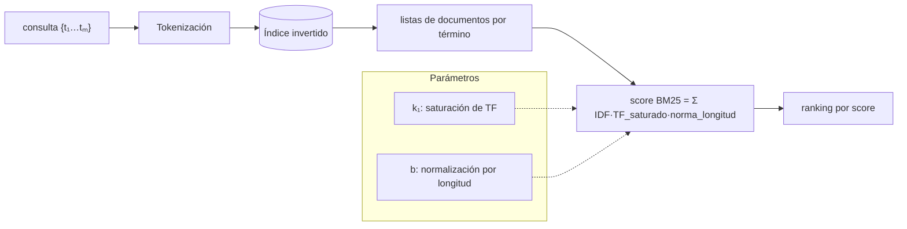

# 102 — Búsqueda léxica y BM25

> [← Clase anterior](../../../classes/part-08-retrieval-context-memory-and-knowledge/101-segmentacion-metadatos-y-ventanas/README.md) · [Índice de la parte](../README.md) · [Clase siguiente →](../../../classes/part-08-retrieval-context-memory-and-knowledge/103-busqueda-hibrida-y-fusion-de-rankings/README.md)

**Parte:** 08 — Recuperación, contexto, memoria y conocimiento  
**Nivel:** avanzado · **Horas estimadas:** 6  
**Laboratorio:** `retrieval` · **Estado:** `EXECUTABLE_CORE`

## 🎯 Propósito

Comprender **búsqueda léxica y bm25** dentro de la evolución de la inteligencia
artificial, implementar un experimento mínimo verificable y distinguir qué parte
constituye evidencia frente a una afirmación todavía no comprobada.

## 📚 Resultados de aprendizaje

Al finalizar podrás:

1. Explicar búsqueda léxica y bm25 usando los conceptos `BM25`, `inverted index`, `sparse`, `tokens`.
2. Ejecutar el laboratorio con una semilla explícita y revisar su contrato JSON.
3. Identificar al menos un supuesto, una limitación y un riesgo de aplicación.
4. Comparar el enfoque con la etapa anterior de la ruta de aprendizaje.
5. Producir una evidencia reproducible y una conclusión que no exceda los datos.

## 🧩 Conceptos centrales

`BM25`, `inverted index`, `sparse`, `tokens`

## 🗺️ Ubicación en el mapa de la IA

Antes de los embeddings, la recuperación de información se construyó sobre estadísticas
de términos: TF-IDF en los años 70 y su refinamiento probabilístico BM25 en los 90
(Robertson et al., proyecto Okapi). Lejos de quedar obsoleta, la búsqueda léxica sigue
siendo el complemento exacto de la vectorial (clase 100): encuentra identificadores,
nombres propios y términos raros que los embeddings difuminan. La clase 103 fusionará
ambas; esta clase da la mitad léxica con su fórmula y sus porqués.

## 📖 Fundamentos

### 📚 Índice invertido y modelo de bolsa de palabras

La búsqueda léxica trata documento y consulta como **bolsas de términos** (sin orden) y
se apoya en un **índice invertido**: para cada término, la lista de documentos donde
aparece con su frecuencia. Buscar no recorre documentos: interseca listas de términos,
por eso escala a colecciones enormes.

### 🧮 La fórmula BM25

Para una consulta `Q = {t₁…tₘ}` y un documento `D` (Robertson & Zaragoza, 2009):

```text
score(D, Q) = Σₜ∈Q  IDF(t) · ( f(t,D) · (k₁ + 1) ) / ( f(t,D) + k₁ · (1 − b + b · |D|/avgdl) )

IDF(t) = ln( 1 + (N − df(t) + 0.5) / (df(t) + 0.5) )
```

donde `f(t,D)` es la frecuencia del término en el documento, `|D|` la longitud del
documento en tokens, `avgdl` la longitud media de la colección, `N` el número de
documentos y `df(t)` en cuántos aparece el término. Cada pieza tiene un motivo:

- **IDF**: los términos raros discriminan más. Un término presente en casi todos los
  documentos (`df ≈ N`) aporta casi cero; uno raro aporta mucho.
- **Saturación de TF** (parámetro `k₁ ≈ 1.2-2.0`): la ganancia de repetir un término
  crece cóncavamente y se aplana en `k₁ + 1`. La décima aparición de "gato" vale mucho
  menos que la primera: repetir palabras no debe dominar el ranking.
- **Normalización por longitud** (parámetro `b ∈ [0,1]`, típico 0.75): un documento
  largo acumula términos por puro volumen; el factor `1 − b + b·|D|/avgdl` penaliza a
  los más largos que la media y premia a los más cortos. Con `b = 0` no se normaliza;
  con `b = 1`, normalización completa.

BM25 proviene del **marco probabilístico de relevancia** (Probability Ranking
Principle): ordenar por probabilidad estimada de relevancia. La fórmula es una
aproximación práctica de ese principio con supuestos de independencia entre términos.

### ⚖️ Fortalezas y límites frente a lo denso

BM25 es exacto con lo literal: códigos de error, números de pieza, apellidos, siglas.
No requiere entrenamiento, es interpretable (se puede descomponer el score término a
término) y barato. Su límite es el **desajuste de vocabulario** (*vocabulary
mismatch*): "coche" no recupera "automóvil". Justo donde los embeddings brillan; de ahí
la hibridación de la clase 103.

## 🧮 Ejemplo trabajado

Colección de `N = 3` documentos, consulta `Q = {gato, negro}`, con `k₁ = 1.2`, `b = 0.75`:

```text
D1: "el gato negro duerme"                      |D1| = 4   f(gato)=1  f(negro)=1
D2: "el gato blanco y el gato gris juegan"      |D2| = 8   f(gato)=2  f(negro)=0
D3: "el perro negro corre y ladra"              |D3| = 6   f(gato)=0  f(negro)=1

avgdl = (4+8+6)/3 = 6
df(gato) = 2, df(negro) = 2  →  IDF = ln(1 + (3−2+0.5)/(2+0.5)) = ln(1.6) ≈ 0.470

D1: factor de longitud = 1.2·(1−0.75 + 0.75·4/6) = 1.2·0.75 = 0.9
    gato:  0.470 · (1·2.2)/(1+0.9)  = 0.470·1.158 ≈ 0.544
    negro: idéntico                              ≈ 0.544     score(D1) ≈ 1.088

D2: factor = 1.2·(0.25 + 0.75·8/6) = 1.5
    gato:  0.470 · (2·2.2)/(2+1.5)  = 0.470·1.257 ≈ 0.591    score(D2) ≈ 0.591

D3: factor = 1.2·(0.25 + 0.75·6/6) = 1.2
    negro: 0.470 · (1·2.2)/(1+1.2)  = 0.470·1.000 = 0.470    score(D3) ≈ 0.470

Ranking: D1 (1.088) > D2 (0.591) > D3 (0.470)
```

Lección del ejemplo: D2 contiene "gato" **dos veces** y aun así pierde contra D1, que
cubre **ambos** términos una vez. La saturación de TF hace que cubrir más términos de la
consulta valga más que repetir uno; además D2 paga su longitud (8 > avgdl).

## 📊 Propiedades y comparación

| Propiedad | BM25 (léxico) | Embeddings (denso) |
|---|---|---|
| Coincidencia | literal, término exacto | semántica, sinónimos y paráfrasis |
| Términos raros / IDs / siglas | excelente | débil (se difuminan en el vector) |
| Vocabulary mismatch | falla | resuelve |
| Entrenamiento | ninguno | modelo preentrenado (y su versionado) |
| Interpretabilidad | score descomponible por término | opaco (vector denso) |
| Coste de índice | invertido, compacto | vectorial (memoria + ANN) |
| Multilingüe / dominio nuevo | funciona de inmediato | depende del modelo |



## ⚠️ Errores conceptuales frecuentes

1. **"BM25 está obsoleto; lo denso siempre gana"**. En dominios con jerga, códigos o
   consultas cortas y literales, BM25 sigue siendo un baseline durísimo de batir; los
   sistemas serios lo combinan, no lo descartan.
2. **Confundir BM25 con TF-IDF**. TF-IDF crece linealmente con la frecuencia; BM25
   satura la TF y normaliza por longitud con parámetros ajustables. No son la misma fórmula.
3. **Ignorar `k₁` y `b`**. Los valores por defecto (1.2, 0.75) provienen de colecciones
   TREC; en corpus con longitudes atípicas (tuits, contratos) ajustarlos cambia el ranking.
4. **Olvidar la tokenización**. BM25 opera sobre términos: sin minúsculas, *stemming* o
   manejo de acentos coherentes entre índice y consulta, "Gato" y "gato" son términos distintos.
5. **Leer el score como probabilidad**. El score BM25 no está acotado ni calibrado; solo
   ordena dentro de una misma consulta. Comparar scores entre consultas distintas es
   incorrecto (esto motiva RRF en la clase 103).

## 🚀 Del aprendizaje a la operación

Un BM25 de producción vive en un motor (Lucene/Elasticsearch/OpenSearch) con analizadores
por idioma, sinónimos gestionados, *boosting* por campos (título > cuerpo) y ajuste de
`k₁`/`b` validado con consultas etiquetadas. Faltan además la actualización incremental
del índice, la coherencia de tokenización entre ingesta y consulta, y la decisión de
cuándo BM25 actúa solo, cuándo como candidato para re-ranking (clase 104) y cuándo
fusionado con lo denso (clase 103).

## 🧪 Laboratorio

```bash
python lab.py
```

El laboratorio llama a `ai_evolution.labs.run_lab("retrieval")`. Esta
decisión evita 183 implementaciones divergentes: cada clase tiene un entrypoint
propio, pero los motores didácticos se prueban como una biblioteca común.

### 🔍 Evidencia esperada

- tipo de laboratorio y semilla;
- entradas o decisiones observables;
- resultado estructurado;
- lista `evidence` con hechos que pueden inspeccionarse;
- lista `limitations` que impide presentar la demo como producción.

## 📓 Notebooks

- [📓 `notebook.ipynb`](notebook.ipynb): recorrido guiado con la materia resumida.
- [✍️ `notebook_student.ipynb`](notebook_student.ipynb): ejercicios para resolver.
- [✅ `notebook_solution.ipynb`](notebook_solution.ipynb): solución de referencia explicada.

## 📝 Evaluación

| Criterio | Peso |
|---|---:|
| Comprensión conceptual | 25 % |
| Ejecución reproducible | 25 % |
| Interpretación basada en evidencia | 25 % |
| Riesgos, límites y mejora propuesta | 25 % |

Consulta [assessment.md](assessment.md) para preguntas y criterio de aceptación.

## ⚠️ Errores comunes

| Síntoma | Causa probable | Corrección |
|---|---|---|
| El código corre, pero no hay conclusión | Se confundió ejecución con aprendizaje | Explica qué demuestra y qué no demuestra |
| El resultado cambia sin explicación | No se registró semilla o configuración | Conserva semilla, versión y parámetros |
| Se promete uso real | Se extrapoló desde una demo educativa | Declara entorno, datos, límites y revisión humana |
| Se copia una métrica aislada | No existe baseline ni costo de error | Añade comparación y criterio de decisión |

## ❓ Preguntas frecuentes

**¿Debo usar una API comercial?**  
No. El núcleo funciona localmente. Las extensiones LIVE se documentan por separado.

**¿El laboratorio representa una implementación industrial?**  
No por sí solo. Enseña el contrato y el patrón; producción exige integración,
seguridad, observabilidad, pruebas y operación.

**¿Dónde profundizo?**  
Revisa las especializaciones enlazadas en el README raíz y la ruta siguiente.

## 🔗 Referencias

- Robertson, S. & Zaragoza, H. (2009). *The Probabilistic Relevance Framework: BM25 and Beyond*. Foundations and Trends in Information Retrieval, 3(4). [DOI 10.1561/1500000019](https://doi.org/10.1561/1500000019) — uso: fuente primaria del mecanismo estudiado
- Robertson, S. et al. (1994). *Okapi at TREC-3* — origen del esquema BM25 en las campañas TREC: [https://trec.nist.gov/pubs/trec3/t3_proceedings.html](https://trec.nist.gov/pubs/trec3/t3_proceedings.html) — uso: referencia consultada en su fuente original
- Jurafsky, D. & Martin, J. H. *Speech and Language Processing* (3.ª ed., borrador), cap. de recuperación de información. [https://web.stanford.edu/~jurafsky/slp3/](https://web.stanford.edu/~jurafsky/slp3/) — uso: desarrollo extendido del tema
- Manning, C., Raghavan, P. & Schütze, H. *Introduction to Information Retrieval* (libro gratuito oficial): [https://nlp.stanford.edu/IR-book/](https://nlp.stanford.edu/IR-book/) — uso: referencia consultada en su fuente original
- Documentación oficial de Apache Lucene (implementación de referencia de BM25): [https://lucene.apache.org/core/](https://lucene.apache.org/core/) — uso: referencia consultada en su fuente original

<!-- papers:inicio -->

---

## 📜 Papers que fundamentan esta clase

> Bloque generado por `python scripts/link_papers_to_classes.py`. La fuente es [`papers/catalog/papers.json`](../../../papers/catalog/papers.json).

| Paper | Año | Qué desbloqueó | Miniatura |
|---|---:|---|---|
| [P11 · Generación aumentada por recuperación para tareas de PLN intensivas en conocimiento](../../../papers/foundational/P11_rag/README.md) | 2020 | Separa el conocimiento (índice consultable y actualizable) del razonamiento (parámetros del modelo). | [notebook](../../../notebooks/papers/P11_rag.ipynb) |

Cada ficha explica el problema anterior, la matemática mínima, los límites y los errores de atribución más frecuentes. Para leerlas con método: [cómo leer un paper de IA](../../../papers/guides/COMO_LEER_UN_PAPER_DE_IA.md) · [anexos matemáticos](../../../papers/annexes/README.md).
<!-- papers:fin -->
<!-- bibliografia:inicio -->

---

## 📚 Bibliografía de apoyo

> Bloque generado por `python scripts/link_sources_to_classes.py`. Cada obra lleva su localizador verificado en [`sources/bibliography.json`](../../../sources/bibliography.json).

Los papers dicen **de dónde salió** el mecanismo. Estas obras lo **desarrollan** con el espacio que una clase no tiene: teoría completa, demostraciones y ejercicios.

| Obra | Edición | Localizador | Papel en esta clase |
|---|---|---|---|
| Jurafsky, Daniel y Martin, James H. — *Speech and Language Processing* | 2.ª (la 3.ª circula como borrador abierto sin ISBN) · 2009 | [ISBN 9780131873216](https://openlibrary.org/isbn/9780131873216) · [web de la obra](https://web.stanford.edu/~jurafsky/slp3/) | citada en las referencias de esta clase · obra de referencia de la parte 08 |
| Manning, Christopher D., Raghavan, Prabhakar y Schütze, Hinrich — *Introduction to Information Retrieval* | 2008 | [ISBN 9780521865715](https://openlibrary.org/isbn/9780521865715) · [web de la obra](https://nlp.stanford.edu/IR-book/) | citada en las referencias de esta clase · obra de referencia de la parte 08 |
<!-- bibliografia:fin -->

---

## ⬅️ Clase anterior

[101 — Segmentación, metadatos y ventanas](../../part-08-retrieval-context-memory-and-knowledge/101-segmentacion-metadatos-y-ventanas/README.md)

## ➡️ Siguiente clase

[103 — Búsqueda híbrida y fusión de rankings](../../part-08-retrieval-context-memory-and-knowledge/103-busqueda-hibrida-y-fusion-de-rankings/README.md)
