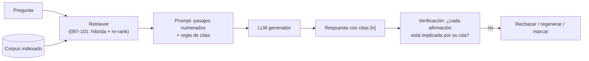

# 105 — RAG básico con citas

> [← Clase anterior](../../../classes/part-08-retrieval-context-memory-and-knowledge/104-re-ranking-y-filtros-de-evidencia/README.md) · [Índice de la parte](../README.md) · [Clase siguiente →](../../../classes/part-08-retrieval-context-memory-and-knowledge/106-transformacion-y-descomposicion-de-consultas/README.md)

**Parte:** 08 — Recuperación, contexto, memoria y conocimiento  
**Nivel:** avanzado · **Horas estimadas:** 6  
**Laboratorio:** `retrieval` · **Estado:** `EXECUTABLE_CORE`

## 🎯 Propósito

Comprender **rag básico con citas** dentro de la evolución de la inteligencia
artificial, implementar un experimento mínimo verificable y distinguir qué parte
constituye evidencia frente a una afirmación todavía no comprobada.

## 📚 Resultados de aprendizaje

Al finalizar podrás:

1. Explicar rag básico con citas usando los conceptos `RAG`, `citas`, `grounding`, `corpus`.
2. Ejecutar el laboratorio con una semilla explícita y revisar su contrato JSON.
3. Identificar al menos un supuesto, una limitación y un riesgo de aplicación.
4. Comparar el enfoque con la etapa anterior de la ruta de aprendizaje.
5. Producir una evidencia reproducible y una conclusión que no exceda los datos.

## 🧩 Conceptos centrales

`RAG`, `citas`, `grounding`, `corpus`

## 🗺️ Ubicación en el mapa de la IA

RAG (*Retrieval-Augmented Generation*, Lewis et al., 2020) une las dos ramas que este
programa venía desarrollando por separado: la recuperación de información (clases
097-101) y la generación con LLMs (parte 06). Nació para dar a los modelos acceso a
conocimiento actualizable sin reentrenar, y se convirtió en el patrón dominante para
reducir alucinaciones y dar trazabilidad a las respuestas. Todo lo que sigue en esta
parte —consultas transformadas, grafos, memoria, evaluación— son refinamientos de este
esqueleto.

## 📖 Fundamentos

### 🔗 Qué es RAG

**RAG** condiciona la generación de un LLM sobre documentos recuperados en tiempo de
consulta. El paper original ([arXiv:2005.11401](https://arxiv.org/abs/2005.11401))
formuló la probabilidad de la respuesta `y` dada la consulta `x` marginalizando sobre
documentos `z` recuperados por un retriever denso (DPR):

```text
p(y | x) = Σ_z  p_retriever(z | x) · p_generator(y | x, z)
```

- **RAG-Sequence**: un mismo documento condiciona toda la secuencia generada.
- **RAG-Token**: cada token puede apoyarse en un documento distinto.

El RAG moderno con LLMs congela ambos componentes y opera por *prompting*: recuperar
top-k pasajes, insertarlos en el prompt con identificadores, y pedir la respuesta.
La distinción clave frente al conocimiento **paramétrico** (lo memorizado en los pesos):
el conocimiento recuperado es **actualizable** (reindexar, no reentrenar), **inspeccionable**
(se sabe qué se le mostró al modelo) y **atribuible** (se puede citar).

### 📎 Groundedness y citas

Una respuesta está **fundamentada** (*grounded*) si cada afirmación que contiene se
sustenta en el contexto recuperado. El mecanismo estándar:

1. Numerar los pasajes en el prompt: `[1] texto…`, `[2] texto…`.
2. Instruir: "responde solo con la información de los pasajes y cita cada afirmación
   con su identificador `[n]`; si la información no está, dilo".
3. Verificar después (clase 110): descomponer la respuesta en afirmaciones y comprobar
   que cada `[n]` citado realmente **implica** la afirmación que acompaña.

Una cita es una **afirmación verificable de procedencia**, no una decoración: citar un
pasaje que no sostiene la frase es peor que no citar, porque fabrica confianza.

### 🧱 Anatomía del prompt RAG

```text
[Sistema]  Eres un asistente que responde SOLO con el contexto dado.
[Contexto] [1] "La ley entró en vigor en marzo de 2021…"
           [2] "El plazo de apelación es de 30 días hábiles…"
[Pregunta] ¿Cuándo entró en vigor la ley y cuál es el plazo de apelación?
[Regla]    Cita cada dato como [n]. Si falta información, responde "no consta en el contexto".
```

Decisiones de diseño que cambian el resultado: cuántos pasajes (k), en qué orden (los
LLMs atienden mejor a los extremos del contexto — "lost in the middle"), qué hacer si
la recuperación viene vacía (rechazar es una respuesta válida), y cómo separar la
instrucción del contenido recuperado para resistir instrucciones inyectadas en los
documentos.

## 🧮 Ejemplo trabajado

Corpus mínimo de 3 pasajes y una pregunta:

```text
[1] "El telescopio espacial James Webb se lanzó el 25 de diciembre de 2021."
[2] "El Webb observa principalmente en el infrarrojo, a diferencia del Hubble."
[3] "El Hubble se lanzó en 1990 a bordo del transbordador Discovery."

Pregunta: ¿Cuándo se lanzó el James Webb y en qué rango observa?

Respuesta generada:
"El James Webb se lanzó el 25 de diciembre de 2021 [1] y observa
principalmente en el infrarrojo [2]."

Verificación afirmación por afirmación:
  A1 "se lanzó el 25-12-2021"  → ¿[1] la implica?  SÍ
  A2 "observa en el infrarrojo" → ¿[2] la implica?  SÍ
  → groundedness = 2/2 = 1.0
```

Contraejemplo: si la respuesta añadiera "…y costó 10 000 millones de dólares [3]",
la afirmación A3 no está en ningún pasaje (y [3] habla del Hubble): es una
**alucinación con cita falsa**, groundedness = 2/3 ≈ 0.67. El dato puede ser cierto
en el mundo; sigue siendo infundado respecto al corpus, que es lo que RAG promete.

## 📊 Propiedades y comparación

| Estrategia | Conocimiento | Actualización | Atribución | Coste dominante | Riesgo principal |
|---|---|---|---|---|---|
| Solo paramétrico | en los pesos | reentrenar/fine-tune | imposible | entrenamiento | alucinación inverificable |
| RAG | corpus indexado | reindexar | por pasaje citado | recuperación + contexto | contexto irrelevante o ruidoso |
| Fine-tuning + RAG | ambos | mixta | parcial | ambos | atribuir al corpus lo que vino de los pesos |
| Contexto largo (sin índice) | documentos en el prompt | por consulta | difusa | tokens por consulta | coste y "lost in the middle" |



## ⚠️ Errores conceptuales frecuentes

1. **"RAG elimina las alucinaciones"**. Las reduce y las vuelve auditables. El modelo
   puede ignorar el contexto, mezclarlo con memoria paramétrica o citar mal; sin
   verificación posterior no hay garantía.
2. **"La cita prueba la afirmación"**. La cita es una hipótesis de procedencia que hay
   que verificar: los modelos generan identificadores `[n]` sintácticamente correctos y
   semánticamente falsos.
3. **"Más pasajes = mejor respuesta"**. Pasado cierto k, el contexto extra diluye la
   señal y sube el coste; la posición media del contexto es la peor atendida
   (arXiv:2307.03172).
4. **Confundir "correcto" con "fundamentado"**. Una respuesta verdadera pero ausente
   del corpus es un fallo de RAG: la promesa del sistema es "esto sale de estas
   fuentes", no "esto es verdad".
5. **Tratar el corpus como confiable por defecto**. Los documentos recuperados pueden
   contener errores o instrucciones maliciosas (inyección indirecta); el generador los
   leerá con la misma autoridad que el resto del prompt si no se aísla.

## 🚀 Del aprendizaje a la operación

Entre este núcleo y un RAG operativo faltan: la ingesta continua con detección de
documentos modificados y reindexado incremental, control de acceso por documento (el
usuario no debe recibir citas de fuentes que no puede leer), defensa contra inyección
indirecta en el corpus, política explícita de rechazo cuando la evidencia es
insuficiente, evaluación continua de fidelidad y cobertura (clase 110) y trazas que
permitan auditar meses después qué pasajes exactos produjeron cada respuesta (clase 111).

## 🧪 Laboratorio

```bash
python lab.py
```

El laboratorio llama a `ai_evolution.labs.run_lab("retrieval")`. Esta
decisión evita 183 implementaciones divergentes: cada clase tiene un entrypoint
propio, pero los motores didácticos se prueban como una biblioteca común.

### 🔍 Evidencia esperada

- tipo de laboratorio y semilla;
- entradas o decisiones observables;
- resultado estructurado;
- lista `evidence` con hechos que pueden inspeccionarse;
- lista `limitations` que impide presentar la demo como producción.

## 📓 Notebooks

- [📓 `notebook.ipynb`](notebook.ipynb): recorrido guiado con la materia resumida.
- [✍️ `notebook_student.ipynb`](notebook_student.ipynb): ejercicios para resolver.
- [✅ `notebook_solution.ipynb`](notebook_solution.ipynb): solución de referencia explicada.

## 📝 Evaluación

| Criterio | Peso |
|---|---:|
| Comprensión conceptual | 25 % |
| Ejecución reproducible | 25 % |
| Interpretación basada en evidencia | 25 % |
| Riesgos, límites y mejora propuesta | 25 % |

Consulta [assessment.md](assessment.md) para preguntas y criterio de aceptación.

## ⚠️ Errores comunes

| Síntoma | Causa probable | Corrección |
|---|---|---|
| El código corre, pero no hay conclusión | Se confundió ejecución con aprendizaje | Explica qué demuestra y qué no demuestra |
| El resultado cambia sin explicación | No se registró semilla o configuración | Conserva semilla, versión y parámetros |
| Se promete uso real | Se extrapoló desde una demo educativa | Declara entorno, datos, límites y revisión humana |
| Se copia una métrica aislada | No existe baseline ni costo de error | Añade comparación y criterio de decisión |

## ❓ Preguntas frecuentes

**¿Debo usar una API comercial?**  
No. El núcleo funciona localmente. Las extensiones LIVE se documentan por separado.

**¿El laboratorio representa una implementación industrial?**  
No por sí solo. Enseña el contrato y el patrón; producción exige integración,
seguridad, observabilidad, pruebas y operación.

**¿Dónde profundizo?**  
Revisa las especializaciones enlazadas en el README raíz y la ruta siguiente.

## 🔗 Referencias

- Lewis, P. et al. (2020). *Retrieval-Augmented Generation for Knowledge-Intensive NLP Tasks*. [arXiv:2005.11401](https://arxiv.org/abs/2005.11401)
- Karpukhin, V. et al. (2020). *Dense Passage Retrieval for Open-Domain Question Answering*. [arXiv:2004.04906](https://arxiv.org/abs/2004.04906)
- Izacard, G. & Grave, E. (2020). *Leveraging Passage Retrieval with Generative Models for Open Domain Question Answering* (Fusion-in-Decoder). [arXiv:2007.01282](https://arxiv.org/abs/2007.01282)
- Liu, N. et al. (2023). *Lost in the Middle: How Language Models Use Long Contexts*. [arXiv:2307.03172](https://arxiv.org/abs/2307.03172)
- Gao, Y. et al. (2023). *Retrieval-Augmented Generation for Large Language Models: A Survey*. [arXiv:2312.10997](https://arxiv.org/abs/2312.10997)
- Gao, T. et al. (2023). *Enabling Large Language Models to Generate Text with Citations* (ALCE). [arXiv:2305.14627](https://arxiv.org/abs/2305.14627)

<!-- papers:inicio -->

---

## 📜 Papers que fundamentan esta clase

> Bloque generado por `python scripts/link_papers_to_classes.py`. La fuente es [`papers/catalog/papers.json`](../../../papers/catalog/papers.json).

| Paper | Año | Qué desbloqueó | Miniatura |
|---|---:|---|---|
| [P11 · Generación aumentada por recuperación para tareas de PLN intensivas en conocimiento](../../../papers/foundational/P11_rag/README.md) | 2020 | Separa el conocimiento (índice consultable y actualizable) del razonamiento (parámetros del modelo). | [notebook](../../../notebooks/papers/P11_rag.ipynb) |

Cada ficha explica el problema anterior, la matemática mínima, los límites y los errores de atribución más frecuentes. Para leerlas con método: [cómo leer un paper de IA](../../../papers/guides/COMO_LEER_UN_PAPER_DE_IA.md) · [anexos matemáticos](../../../papers/annexes/README.md).
<!-- papers:fin -->
---

## ⬅️ Clase anterior

[104 — Re-ranking y filtros de evidencia](../../part-08-retrieval-context-memory-and-knowledge/104-re-ranking-y-filtros-de-evidencia/README.md)

## ➡️ Siguiente clase

[106 — Transformación y descomposición de consultas](../../part-08-retrieval-context-memory-and-knowledge/106-transformacion-y-descomposicion-de-consultas/README.md)
