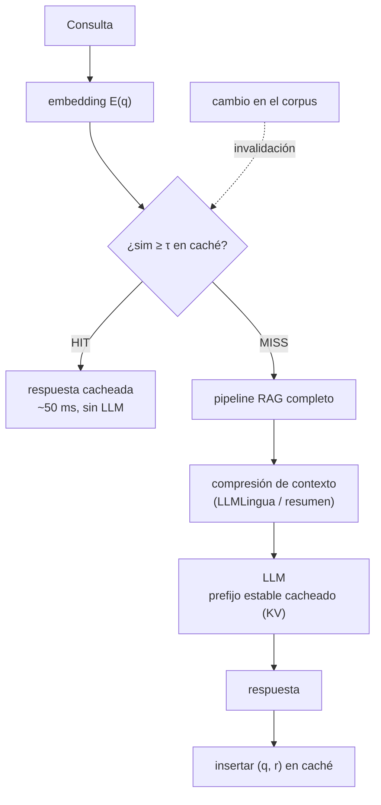

# 106 — Compresión de contexto y cachés semánticos

> [← Clase anterior](../../../classes/part-08-retrieval-context-memory-and-knowledge/105-memoria-de-corto-y-largo-plazo/README.md) · [Índice de la parte](../README.md) · [Clase siguiente →](../../../classes/part-08-retrieval-context-memory-and-knowledge/107-evaluacion-de-fidelidad-cobertura-y-atribucion/README.md)

**Parte:** 08 — Recuperación, contexto, memoria y conocimiento  
**Nivel:** avanzado · **Horas estimadas:** 6  
**Laboratorio:** `retrieval` · **Estado:** `EXECUTABLE_CORE`

## 🎯 Propósito

Comprender **compresión de contexto y cachés semánticos** dentro de la evolución de la inteligencia
artificial, implementar un experimento mínimo verificable y distinguir qué parte
constituye evidencia frente a una afirmación todavía no comprobada.

## 📚 Resultados de aprendizaje

Al finalizar podrás:

1. Explicar compresión de contexto y cachés semánticos usando los conceptos `compression`, `cache`, `context`, `budget`.
2. Ejecutar el laboratorio con una semilla explícita y revisar su contrato JSON.
3. Identificar al menos un supuesto, una limitación y un riesgo de aplicación.
4. Comparar el enfoque con la etapa anterior de la ruta de aprendizaje.
5. Producir una evidencia reproducible y una conclusión que no exceda los datos.

## 🧩 Conceptos centrales

`compression`, `cache`, `context`, `budget`

## 🗺️ Ubicación en el mapa de la IA

Cuando RAG y memoria (102-105) funcionan, el problema pasa a ser económico: cada token
del contexto cuesta dinero y latencia en **cada** llamada, y los pipelines maduros
repiten una enorme fracción de su contexto (instrucciones, documentos, historial). Esta
clase aplica dos ideas clásicas de sistemas —compresión y caché— al contexto de los
LLMs. Son las técnicas que separan un prototipo que funciona de un servicio cuyo coste
por consulta permite operarlo, y preparan la evaluación coste/calidad de las clases
107-108.

## 📖 Fundamentos

### 💰 El presupuesto de contexto

Cada llamada paga `O(tokens de entrada)` en coste y latencia (el *prefill* procesa todo
el prompt antes del primer token de salida). Un **presupuesto de contexto** reparte la
ventana entre partes con valor desigual:

```text
contexto = instrucciones (fijas) + herramientas + memoria + top-k recuperado + turno
prioridad: lo que cambia la respuesta > lo que la decora
```

La pregunta de diseño no es "¿cuánto cabe?" sino "¿qué aporta cada token a la calidad
de la respuesta?" — y medirla (clase 107) es lo único que legitima recortar.

### 🗜️ Compresión de contexto

Dos familias:

- **Compresión dura (extractiva)**: eliminar tokens de baja información conservando los
  demás. **LLMLingua** ([arXiv:2310.05736](https://arxiv.org/abs/2310.05736)) usa un
  modelo de lenguaje pequeño para estimar la perplejidad de cada token y descarta los
  más predecibles (artículos, redundancias): ratios de 2-10× con degradación pequeña en
  tareas de QA. **LongLLMLingua** ([arXiv:2310.06839](https://arxiv.org/abs/2310.06839))
  añade compresión guiada por la pregunta: conserva lo relevante *para esta consulta*.
- **Compresión blanda (abstractiva)**: resumir con un LLM (la compactación de la clase
  105 es el caso conversacional). Más fluida, pero puede parafrasear mal un dato crítico
  y es más cara de producir.

En RAG, comprimir los pasajes recuperados ataca además el problema "lost in the middle"
(arXiv:2307.03172): menos tokens irrelevantes entre la pregunta y la evidencia.

### ⚡ Prompt caching (caché exacto de prefijos)

Los proveedores de LLM cachean el **estado de atención (KV-cache) de un prefijo
exacto** del prompt: si la siguiente llamada comparte ese prefijo token a token, el
prefill se salta esa parte (en la API de Anthropic, la lectura de caché cuesta ~10 % del
token normal). Consecuencia arquitectónica directa: el prompt se ordena de **estable a
volátil** — instrucciones y herramientas primero, documentos después, el turno del
usuario al final. Un solo token cambiado invalida todo lo que le sigue.

### 🧲 Caché semántico (aproximado, por similitud)

Un **caché semántico** reutiliza la **respuesta final** cuando llega una consulta
*equivalente*, no idéntica: se embebe la consulta (clase 097) y se busca en el caché por
similitud; si `sim ≥ τ`, se devuelve la respuesta almacenada sin llamar al LLM
(GPTCache implementa este patrón).

```text
consulta q:
  v ← E(q);  (q', r', s) ← vecino más cercano en caché
  si s ≥ τ:  return r'                 # HIT: coste ≈ un embedding
  si no:     r ← pipeline_completo(q); insertar (q, r); return r
```

El umbral `τ` gobierna el trade-off: bajo → más aciertos pero **falsos aciertos**
(responder otra pregunta, el peor fallo posible); alto → caché casi inútil. Además exige
**invalidación**: si el corpus cambió, las respuestas cacheadas quedan obsoletas aunque
la consulta sea idéntica.

## 🧮 Ejemplo trabajado

Caché semántico con `τ = 0.92`. En caché: `q' = "¿cómo reinicio mi contraseña?"` con su
respuesta `r'`.

```text
Llegan tres consultas (similitud coseno con q'):
  q1 "¿cómo restablezco mi contraseña?"        sim = 0.96 ≥ 0.92 → HIT correcto
  q2 "¿cómo cambio mi contraseña?"             sim = 0.93 ≥ 0.92 → HIT ¿correcto?
  q3 "¿cómo reinicio mi router?"               sim = 0.85 < 0.92 → MISS → pipeline

q2 es el caso frontera: "cambiar" (conociendo la actual) y "restablecer" (olvidada)
pueden tener procedimientos distintos → falso acierto potencial que τ = 0.92 no detecta.

Economía con 10 000 consultas/día, 40 % hit-rate, 0.9 s y $0.004 por llamada LLM:
  ahorro diario ≈ 10 000 · 0.40 · $0.004 = $16/día  (~$480/mes)
  latencia en hit: ~50 ms (embedding + búsqueda) frente a ~900 ms.
Coste del error: si el 2 % de los hits son falsos → 80 respuestas equivocadas/día.
¿Vale $480/mes ese riesgo? Esa es la decisión real, y depende del dominio.
```

## 📊 Propiedades y comparación

| Técnica | Qué reutiliza/reduce | Ahorro típico | Condición de validez | Riesgo principal |
|---|---|---|---|---|
| Presupuesto de contexto | tokens de entrada | proporcional al recorte | medir calidad tras recortar | recortar señal, no ruido |
| LLMLingua (dura) | tokens poco informativos | 2-10× en contexto | tarea tolerante a texto no fluido | perder el dato crítico |
| Resumen (blanda) | historial/documentos | variable | el resumen preserva lo consultado | paráfrasis errónea |
| Prompt caching | prefill de prefijo exacto | ~90 % del coste del prefijo | prefijo idéntico token a token | ordenar mal el prompt |
| Caché semántico | la llamada completa | hit-rate × coste por llamada | `sim ≥ τ` implica misma intención | falso acierto |



## ⚠️ Errores conceptuales frecuentes

1. **Confundir prompt caching con caché semántico**. El primero es exacto, por prefijo,
   ahorra *prefill* y lo gestiona el proveedor; el segundo es aproximado, por similitud,
   ahorra la llamada entera y lo gestiona tu sistema. Resuelven problemas distintos y
   conviven.
2. **"Comprimir no pierde información"**. Toda compresión de contexto es con pérdida;
   la pregunta es si lo perdido afectaba la respuesta, y eso solo lo dice una evaluación
   antes/después (clase 107).
3. **Elegir τ sin medir falsos aciertos**. Un hit-rate de 60 % es inútil si incluye 5 %
   de respuestas a otra pregunta; τ se calibra sobre pares etiquetados
   (equivalente/no equivalente), no a ojo.
4. **Cachear sin invalidación**. Corpus actualizado + caché viejo = respuestas obsoletas
   servidas con confianza y a máxima velocidad.
5. **Poner lo volátil al principio del prompt**. Un timestamp o el nombre del usuario en
   la primera línea invalida el KV-cache de todo lo que sigue en cada llamada.

## 🚀 Del aprendizaje a la operación

Entre este núcleo y una capa de eficiencia operativa faltan: métricas por segmento
(hit-rate, tasa de falsos aciertos muestreada por humanos, ahorro neto tras el coste de
embeddings y almacenamiento), invalidación conectada al pipeline de ingesta (qué
entradas del caché tocan qué documentos), aislamiento del caché por usuario/tenant
cuando las respuestas dependen de permisos, calibración periódica de τ con deriva de
consultas, y pruebas de regresión de calidad cada vez que se ajusta el ratio de
compresión.

## 🧪 Laboratorio

```bash
python lab.py
```

El laboratorio llama a `ai_evolution.labs.run_lab("retrieval")`. Esta
decisión evita 180 implementaciones divergentes: cada clase tiene un entrypoint
propio, pero los motores didácticos se prueban como una biblioteca común.

### 🔍 Evidencia esperada

- tipo de laboratorio y semilla;
- entradas o decisiones observables;
- resultado estructurado;
- lista `evidence` con hechos que pueden inspeccionarse;
- lista `limitations` que impide presentar la demo como producción.

## 📓 Notebooks

- [📓 `notebook.ipynb`](notebook.ipynb): recorrido guiado con la materia resumida.
- [✍️ `notebook_student.ipynb`](notebook_student.ipynb): ejercicios para resolver.
- [✅ `notebook_solution.ipynb`](notebook_solution.ipynb): solución de referencia explicada.

## 📝 Evaluación

| Criterio | Peso |
|---|---:|
| Comprensión conceptual | 25 % |
| Ejecución reproducible | 25 % |
| Interpretación basada en evidencia | 25 % |
| Riesgos, límites y mejora propuesta | 25 % |

Consulta [assessment.md](assessment.md) para preguntas y criterio de aceptación.

## ⚠️ Errores comunes

| Síntoma | Causa probable | Corrección |
|---|---|---|
| El código corre, pero no hay conclusión | Se confundió ejecución con aprendizaje | Explica qué demuestra y qué no demuestra |
| El resultado cambia sin explicación | No se registró semilla o configuración | Conserva semilla, versión y parámetros |
| Se promete uso real | Se extrapoló desde una demo educativa | Declara entorno, datos, límites y revisión humana |
| Se copia una métrica aislada | No existe baseline ni costo de error | Añade comparación y criterio de decisión |

## ❓ Preguntas frecuentes

**¿Debo usar una API comercial?**  
No. El núcleo funciona localmente. Las extensiones LIVE se documentan por separado.

**¿El laboratorio representa una implementación industrial?**  
No por sí solo. Enseña el contrato y el patrón; producción exige integración,
seguridad, observabilidad, pruebas y operación.

**¿Dónde profundizo?**  
Revisa las especializaciones enlazadas en el README raíz y la ruta siguiente.

## 🔗 Referencias

- Jiang, H. et al. (2023). *LLMLingua: Compressing Prompts for Accelerated Inference of Large Language Models*. [arXiv:2310.05736](https://arxiv.org/abs/2310.05736)
- Jiang, H. et al. (2023). *LongLLMLingua: Accelerating and Enhancing LLMs in Long Context Scenarios via Prompt Compression*. [arXiv:2310.06839](https://arxiv.org/abs/2310.06839)
- Liu, N. et al. (2023). *Lost in the Middle: How Language Models Use Long Contexts*. [arXiv:2307.03172](https://arxiv.org/abs/2307.03172)
- Documentación de Anthropic, *Prompt caching*: [https://docs.anthropic.com/en/docs/build-with-claude/prompt-caching](https://docs.anthropic.com/en/docs/build-with-claude/prompt-caching)
- Documentación de GPTCache: [https://gptcache.readthedocs.io/](https://gptcache.readthedocs.io/)

---

## ⬅️ Clase anterior

[105 — Memoria de corto y largo plazo](../../part-08-retrieval-context-memory-and-knowledge/105-memoria-de-corto-y-largo-plazo/README.md)

## ➡️ Siguiente clase

[107 — Evaluación de fidelidad, cobertura y atribución](../../part-08-retrieval-context-memory-and-knowledge/107-evaluacion-de-fidelidad-cobertura-y-atribucion/README.md)
