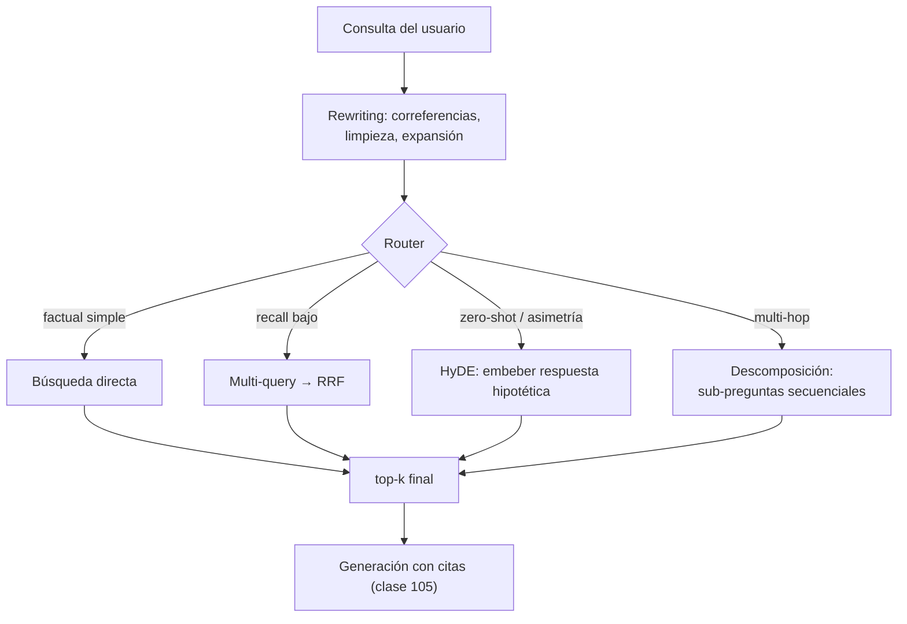

# 106 — Transformación y descomposición de consultas

> [← Clase anterior](../../../classes/part-08-retrieval-context-memory-and-knowledge/105-rag-basico-con-citas/README.md) · [Índice de la parte](../README.md) · [Clase siguiente →](../../../classes/part-08-retrieval-context-memory-and-knowledge/107-knowledge-graphs-y-graphrag/README.md)

**Parte:** 08 — Recuperación, contexto, memoria y conocimiento  
**Nivel:** avanzado · **Horas estimadas:** 6  
**Laboratorio:** `workflow` · **Estado:** `EXECUTABLE_CORE`

## 🎯 Propósito

Comprender **transformación y descomposición de consultas** dentro de la evolución de la inteligencia
artificial, implementar un experimento mínimo verificable y distinguir qué parte
constituye evidencia frente a una afirmación todavía no comprobada.

## 📚 Resultados de aprendizaje

Al finalizar podrás:

1. Explicar transformación y descomposición de consultas usando los conceptos `query rewrite`, `decomposition`, `routing`, `retrieval`.
2. Ejecutar el laboratorio con una semilla explícita y revisar su contrato JSON.
3. Identificar al menos un supuesto, una limitación y un riesgo de aplicación.
4. Comparar el enfoque con la etapa anterior de la ruta de aprendizaje.
5. Producir una evidencia reproducible y una conclusión que no exceda los datos.

## 🧩 Conceptos centrales

`query rewrite`, `decomposition`, `routing`, `retrieval`

## 🗺️ Ubicación en el mapa de la IA

Las clases 100-105 asumen que la consulta del usuario es una buena consulta de
recuperación. Casi nunca lo es: es ambigua, coloquial, multi-hop o depende del historial
de la conversación. Esta clase inserta una capa de **transformación de consultas** entre
el usuario y el retriever — la misma idea que la expansión de consultas de la IR clásica,
pero ejecutada ahora por un LLM. Es el precedente directo del *agentic RAG*: cuando la
transformación se vuelve iterativa y decide qué buscar a continuación, el pipeline se
convierte en agente (parte 09).

## 📖 Fundamentos

### ✍️ Reescritura (query rewriting)

El primer problema es el desajuste entre cómo pregunta el usuario y cómo está escrito el
corpus. Un LLM reescribe la consulta antes de recuperar: resolver correferencias con el
historial ("¿y en 2023?" → "ingresos de la empresa X en 2023"), eliminar cortesías y
ruido, expandir siglas. El esquema *rewrite-retrieve-read*
([arXiv:2305.14283](https://arxiv.org/abs/2305.14283)) demostró que entrenar/ajustar el
reescritor mejora el resultado final más que tocar el retriever.

### 🔀 Multi-query y fusión

Una sola formulación puede caer en una región pobre del espacio de embeddings. La técnica
**multi-query** genera `m` paráfrasis de la consulta, recupera con cada una y **fusiona**
los rankings (típicamente con RRF, clase 103):

```text
q → LLM → {q1, q2, q3}          # paráfrasis con vocabulario distinto
top-k(q1) ∪ top-k(q2) ∪ top-k(q3) → RRF → top-k final
```

Aumenta el recall a cambio de `m` recuperaciones y el coste de generar las variantes.

### 📄 HyDE: documentos hipotéticos

**HyDE** (*Hypothetical Document Embeddings*,
[arXiv:2212.10496](https://arxiv.org/abs/2212.10496)) ataca la asimetría
pregunta-documento: una pregunta corta y un pasaje de respuesta viven en regiones
distintas del espacio vectorial. En lugar de embeber la pregunta, se pide al LLM que
**escriba una respuesta hipotética** (que puede contener errores factuales) y se embebe
ese texto: lo que importa no es su veracidad sino su **forma** — se parece a los
documentos reales que responden la pregunta, y el vecindario del embedding captura eso.

```text
HyDE(q):
  h ← LLM("escribe un pasaje que responda: " + q)   # hipotético, puede ser falso
  v ← E(h)                                          # embedding del pasaje, no de q
  return top-k del índice para v                    # documentos reales similares a h
```

### 🧩 Descomposición y step-back

- **Descomposición**: una pregunta multi-hop ("¿qué director dirigió la película más
  taquillera del estudio que produjo Alien?") se divide en sub-preguntas secuenciales,
  cada una recuperable por separado; la respuesta de una alimenta la siguiente. Es la
  aplicación a retrieval del *least-to-most prompting*
  ([arXiv:2205.10625](https://arxiv.org/abs/2205.10625)).
- **Step-back prompting** ([arXiv:2310.06117](https://arxiv.org/abs/2310.06117)):
  antes de la pregunta específica se formula su versión más general ("¿qué principios
  regulan X?") y se recupera para ambas; el contexto de principios generales mejora el
  razonamiento sobre el caso concreto.

### 🚦 Enrutamiento (routing)

Con varias fuentes (índice vectorial, base SQL, grafo, API), un **router** —un
clasificador o un LLM con salida estructurada— decide a qué fuente(s) va cada consulta
y con qué técnica. El router es un punto único de fallo: si clasifica mal, todo lo
posterior recupera en el lugar equivocado.

## 🧮 Ejemplo trabajado

Descomposición de una consulta multi-hop:

```text
Q: "¿Qué edad tenía el fundador de la empresa que compró Instagram
    cuando lanzó su primer producto?"

Paso 1: "¿Qué empresa compró Instagram?"           → recupera → "Facebook (2012)"
Paso 2: "¿Quién fundó Facebook?"                   → recupera → "Mark Zuckerberg"
Paso 3: "¿Cuándo lanzó Zuckerberg su primer producto (Facebook)?" → "2004"
Paso 4: "¿En qué año nació Zuckerberg?"            → recupera → "1984"
Síntesis: 2004 − 1984 = 20 años.
```

Con la consulta original sin descomponer, el retriever busca un único pasaje que
contenga *toda* la cadena — que probablemente no existe en el corpus. La descomposición
convierte una pregunta sin documento soporte en cuatro preguntas con soporte directo.
El coste: 4 recuperaciones + 4 llamadas al LLM, y los errores se **propagan** — si el
paso 1 devuelve la empresa equivocada, todo lo demás es coherentemente erróneo.

## 📊 Propiedades y comparación

| Técnica | Ataca | Coste extra | Riesgo | Cuándo usarla |
|---|---|---|---|---|
| Rewriting | consultas mal formuladas / correferencia | 1 llamada LLM | sobre-reescribir la intención | conversacional, siempre barato |
| Multi-query + RRF | vocabulario / recall | m llamadas + m búsquedas | variantes redundantes | recall bajo con consulta única |
| HyDE | asimetría pregunta-documento | 1 llamada + 1 búsqueda | el hipotético desvía el tema | zero-shot, corpus técnico |
| Descomposición | preguntas multi-hop | n pasos secuenciales | propagación de errores | la respuesta cruza documentos |
| Step-back | falta de contexto general | 1 llamada + 2 búsquedas | contexto genérico irrelevante | preguntas específicas con principios detrás |
| Routing | múltiples fuentes | 1 clasificación | enrutar mal (fallo total) | arquitecturas con varias fuentes |



## ⚠️ Errores conceptuales frecuentes

1. **"HyDE necesita que el LLM sepa la respuesta"**. No: el documento hipotético puede
   ser factualmente falso y funcionar, porque lo que se aprovecha es su forma y
   vocabulario, no su contenido. Falla cuando el hipotético se desvía de tema, no
   cuando se equivoca en datos.
2. **Aplicar todas las técnicas a la vez**. Cada capa añade latencia, coste y varianza.
   Se parte de la búsqueda directa medida (baseline) y se añade una técnica solo si una
   métrica lo justifica.
3. **Descomponer preguntas simples**. Una pregunta de un salto descompuesta en tres
   sub-preguntas multiplica el coste y las oportunidades de error sin ganancia.
4. **Ignorar la propagación de errores**. En descomposición secuencial el error del
   paso 1 contamina todo; los pasos deben validar sus premisas o el sistema debe poder
   retroceder.
5. **Router opaco**. Si no se registra qué ruta tomó cada consulta, los fallos de
   recuperación son indiagnosticables: no se sabe si falló la técnica o la elección de
   técnica.

## 🚀 Del aprendizaje a la operación

Entre este núcleo y una capa de consultas operativa faltan: un conjunto de consultas
reales etiquetadas para medir qué técnica aporta y a qué coste (la mayoría de las
consultas de producción son simples y no necesitan nada), presupuestos de latencia por
ruta (multi-query y descomposición multiplican llamadas), *fallbacks* cuando el LLM
reescritor falla o devuelve formato inválido, y registro por consulta de la ruta elegida
y las sub-consultas generadas para poder auditar y mejorar el router con datos.

## 🧪 Laboratorio

```bash
python lab.py
```

El laboratorio llama a `ai_evolution.labs.run_lab("workflow")`. Esta
decisión evita 183 implementaciones divergentes: cada clase tiene un entrypoint
propio, pero los motores didácticos se prueban como una biblioteca común.

### 🔍 Evidencia esperada

- tipo de laboratorio y semilla;
- entradas o decisiones observables;
- resultado estructurado;
- lista `evidence` con hechos que pueden inspeccionarse;
- lista `limitations` que impide presentar la demo como producción.

## 📓 Notebooks

- [📓 `notebook.ipynb`](notebook.ipynb): recorrido guiado con la materia resumida.
- [✍️ `notebook_student.ipynb`](notebook_student.ipynb): ejercicios para resolver.
- [✅ `notebook_solution.ipynb`](notebook_solution.ipynb): solución de referencia explicada.

## 📝 Evaluación

| Criterio | Peso |
|---|---:|
| Comprensión conceptual | 25 % |
| Ejecución reproducible | 25 % |
| Interpretación basada en evidencia | 25 % |
| Riesgos, límites y mejora propuesta | 25 % |

Consulta [assessment.md](assessment.md) para preguntas y criterio de aceptación.

## ⚠️ Errores comunes

| Síntoma | Causa probable | Corrección |
|---|---|---|
| El código corre, pero no hay conclusión | Se confundió ejecución con aprendizaje | Explica qué demuestra y qué no demuestra |
| El resultado cambia sin explicación | No se registró semilla o configuración | Conserva semilla, versión y parámetros |
| Se promete uso real | Se extrapoló desde una demo educativa | Declara entorno, datos, límites y revisión humana |
| Se copia una métrica aislada | No existe baseline ni costo de error | Añade comparación y criterio de decisión |

## ❓ Preguntas frecuentes

**¿Debo usar una API comercial?**  
No. El núcleo funciona localmente. Las extensiones LIVE se documentan por separado.

**¿El laboratorio representa una implementación industrial?**  
No por sí solo. Enseña el contrato y el patrón; producción exige integración,
seguridad, observabilidad, pruebas y operación.

**¿Dónde profundizo?**  
Revisa las especializaciones enlazadas en el README raíz y la ruta siguiente.

## 🔗 Referencias

- Gao, L. et al. (2022). *Precise Zero-Shot Dense Retrieval without Relevance Labels* (HyDE). [arXiv:2212.10496](https://arxiv.org/abs/2212.10496) — uso: fuente primaria del mecanismo estudiado
- Ma, X. et al. (2023). *Query Rewriting for Retrieval-Augmented Large Language Models*. [arXiv:2305.14283](https://arxiv.org/abs/2305.14283) — uso: fuente primaria del mecanismo estudiado
- Zheng, H. et al. (2023). *Take a Step Back: Evoking Reasoning via Abstraction in Large Language Models*. [arXiv:2310.06117](https://arxiv.org/abs/2310.06117) — uso: fuente primaria del mecanismo estudiado
- Zhou, D. et al. (2022). *Least-to-Most Prompting Enables Complex Reasoning in Large Language Models*. [arXiv:2205.10625](https://arxiv.org/abs/2205.10625) — uso: fuente primaria del mecanismo estudiado
- Cormack, G., Clarke, C. & Buettcher, S. (2009). *Reciprocal Rank Fusion outperforms Condorcet and individual Rank Learning Methods*. SIGIR '09. [DOI 10.1145/1571941.1572114](https://doi.org/10.1145/1571941.1572114) — uso: fuente primaria del mecanismo estudiado
- Documentación de LangChain, *MultiQueryRetriever*: [https://python.langchain.com/docs/how_to/MultiQueryRetriever/](https://python.langchain.com/docs/how_to/MultiQueryRetriever/) — uso: referencia consultada en su fuente original

<!-- papers:inicio -->

---

## 📜 Papers que fundamentan esta clase

> Bloque generado por `python scripts/link_papers_to_classes.py`. La fuente es [`papers/catalog/papers.json`](../../../papers/catalog/papers.json).

| Paper | Año | Qué desbloqueó | Miniatura |
|---|---:|---|---|
| [P11 · Generación aumentada por recuperación para tareas de PLN intensivas en conocimiento](../../../papers/foundational/P11_rag/README.md) | 2020 | Separa el conocimiento (índice consultable y actualizable) del razonamiento (parámetros del modelo). | [notebook](../../../notebooks/papers/P11_rag.ipynb) |

Cada ficha explica el problema anterior, la matemática mínima, los límites y los errores de atribución más frecuentes. Para leerlas con método: [cómo leer un paper de IA](../../../papers/guides/COMO_LEER_UN_PAPER_DE_IA.md) · [anexos matemáticos](../../../papers/annexes/README.md).
<!-- papers:fin -->
<!-- bibliografia:inicio -->

---

## 📚 Bibliografía de apoyo

> Bloque generado por `python scripts/link_sources_to_classes.py`. Cada obra lleva su localizador verificado en [`sources/bibliography.json`](../../../sources/bibliography.json).

Los papers dicen **de dónde salió** el mecanismo. Estas obras lo **desarrollan** con el espacio que una clase no tiene: teoría completa, demostraciones y ejercicios.

| Obra | Edición | Localizador | Papel en esta clase |
|---|---|---|---|
| Manning, Christopher D., Raghavan, Prabhakar y Schütze, Hinrich — *Introduction to Information Retrieval* | 2008 | [ISBN 9780521865715](https://openlibrary.org/isbn/9780521865715) · [web de la obra](https://nlp.stanford.edu/IR-book/) | obra de referencia de la parte 08 · toda la parte |
| Jurafsky, Daniel y Martin, James H. — *Speech and Language Processing* | 2.ª (la 3.ª circula como borrador abierto sin ISBN) · 2009 | [ISBN 9780131873216](https://openlibrary.org/isbn/9780131873216) · [web de la obra](https://web.stanford.edu/~jurafsky/slp3/) | obra de referencia de la parte 08 · representaciones vectoriales de significado |
<!-- bibliografia:fin -->

---

## ⬅️ Clase anterior

[105 — RAG básico con citas](../../part-08-retrieval-context-memory-and-knowledge/105-rag-basico-con-citas/README.md)

## ➡️ Siguiente clase

[107 — Knowledge graphs y GraphRAG](../../part-08-retrieval-context-memory-and-knowledge/107-knowledge-graphs-y-graphrag/README.md)
