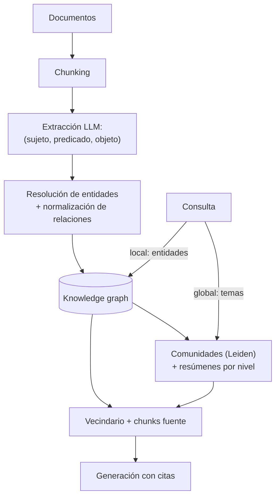

# 107 — Knowledge graphs y GraphRAG

> [← Clase anterior](../../../classes/part-08-retrieval-context-memory-and-knowledge/106-transformacion-y-descomposicion-de-consultas/README.md) · [Índice de la parte](../README.md) · [Clase siguiente →](../../../classes/part-08-retrieval-context-memory-and-knowledge/108-memoria-de-corto-y-largo-plazo/README.md)

**Parte:** 08 — Recuperación, contexto, memoria y conocimiento  
**Nivel:** avanzado · **Horas estimadas:** 6  
**Laboratorio:** `logic` · **Estado:** `EXECUTABLE_CORE`

## 🎯 Propósito

Comprender **knowledge graphs y graphrag** dentro de la evolución de la inteligencia
artificial, implementar un experimento mínimo verificable y distinguir qué parte
constituye evidencia frente a una afirmación todavía no comprobada.

## 📚 Resultados de aprendizaje

Al finalizar podrás:

1. Explicar knowledge graphs y graphrag usando los conceptos `knowledge graph`, `entidades`, `relaciones`, `GraphRAG`.
2. Ejecutar el laboratorio con una semilla explícita y revisar su contrato JSON.
3. Identificar al menos un supuesto, una limitación y un riesgo de aplicación.
4. Comparar el enfoque con la etapa anterior de la ruta de aprendizaje.
5. Producir una evidencia reproducible y una conclusión que no exceda los datos.

## 🧩 Conceptos centrales

`knowledge graph`, `entidades`, `relaciones`, `GraphRAG`

## 🗺️ Ubicación en el mapa de la IA

Los knowledge graphs son la herencia de la IA simbólica (redes semánticas, lógica de
descripción, la Web Semántica) dentro de la era neuronal: conocimiento como **entidades
y relaciones explícitas** en vez de vectores opacos. El RAG vectorial (097-103) recupera
pasajes similares; falla cuando la respuesta exige **conectar** hechos dispersos o
**agregar** sobre todo el corpus. GraphRAG (Microsoft, 2024) cierra el círculo: usa LLMs
para construir el grafo y el grafo para estructurar lo que el LLM lee — neuro-simbólico
en la práctica.

## 📖 Fundamentos

### 🔺 Tripletas: la unidad del conocimiento explícito

Un **knowledge graph** representa el conocimiento como tripletas
**(sujeto, predicado, objeto)**: nodos = entidades, aristas = relaciones tipadas y
dirigidas. En el estándar RDF del W3C toda afirmación tiene esa forma; en los **grafos
de propiedades** (Neo4j) nodos y aristas llevan además atributos clave-valor
(`fecha`, `fuente`, `confianza`). Frente al texto, el grafo aporta:

- **Composicionalidad**: los hechos se conectan por entidades compartidas; responder
  "multi-hop" es recorrer caminos, no esperar que exista un pasaje con toda la cadena.
- **Agregación**: contar, agrupar y resumir sobre relaciones ("todos los proveedores
  de X") es una consulta, no una lectura de todo el corpus.
- **Procedencia por hecho**: cada tripleta puede llevar su fuente, no solo cada documento.

### 🔎 Consultar el grafo: Cypher conceptual

Cypher (Neo4j) expresa patrones de caminos con sintaxis "ASCII-art": `(nodo)` y
`-[relación]->`. No hace falta memorizarla; hace falta leer el patrón:

```text
MATCH (p:Persona)-[:FUNDÓ]->(e:Empresa)-[:ADQUIRIÓ]->(x:Empresa {nombre: "Instagram"})
RETURN p.nombre
```

"Encuentra la persona que fundó la empresa que adquirió Instagram": los dos saltos que
en la clase 106 exigían descomposición secuencial son aquí **un solo patrón declarativo**
resuelto por el motor del grafo.

### 🧠 Extracción de tripletas con LLM

Construir el grafo a mano no escala; los LLMs extraen tripletas de texto con un prompt
de extracción (entidades → relaciones → normalización). Los dos problemas duros no son
la extracción sino después:

- **Resolución de entidades**: "IBM", "International Business Machines" y "la compañía"
  deben colapsar en un solo nodo, o el grafo se fragmenta.
- **Normalización de relaciones**: "fundó", "creó", "estableció" deben mapear a un
  esquema finito de predicados, o cada hecho queda en su propio dialecto.

### 🌐 GraphRAG (Microsoft, arXiv:2404.16130)

GraphRAG ataca las preguntas **globales** ("¿cuáles son los temas dominantes en este
corpus?") que el RAG vectorial no puede responder — ningún top-k local las cubre.
Pipeline de indexación:

```text
1. Extraer entidades y relaciones de cada chunk con un LLM  → grafo del corpus
2. Detectar comunidades jerárquicas (algoritmo de Leiden)   → clusters de entidades
3. Resumir cada comunidad con un LLM                        → resúmenes por nivel
Consulta global: map-reduce sobre resúmenes de comunidades → respuesta agregada
Consulta local:  entidades de la consulta → vecindario del grafo + chunks asociados
```

El grafo funciona como un índice temático jerárquico construido una vez (coste alto de
indexación en llamadas LLM) y consultado muchas veces.

## 🧮 Ejemplo trabajado

Extracción de tripletas del párrafo:

> "Marie Curie descubrió el polonio en 1898 junto a su esposo Pierre. Por sus
> investigaciones sobre la radiactividad recibió el Premio Nobel de Física en 1903,
> compartido con Pierre y Henri Becquerel."

```text
(Marie Curie,  DESCUBRIÓ,        polonio)         {año: 1898}
(Pierre Curie, DESCUBRIÓ,        polonio)         {año: 1898}   ← "junto a su esposo"
(Marie Curie,  CASADA_CON,       Pierre Curie)
(Marie Curie,  RECIBIÓ,          Nobel de Física) {año: 1903}
(Pierre Curie, RECIBIÓ,          Nobel de Física) {año: 1903}
(H. Becquerel, RECIBIÓ,          Nobel de Física) {año: 1903}
(Marie Curie,  INVESTIGÓ,        radiactividad)
```

Decisiones no triviales que el ejemplo esconde: "su esposo Pierre" exige resolver la
correferencia al nodo `Pierre Curie`; el "compartido con" genera tres tripletas
`RECIBIÓ` distintas, no una; y el año va como **propiedad** de la arista, no como nodo.
Con el grafo, "¿quién compartió un Nobel con un descubridor del polonio?" es un patrón
de dos saltos; en texto plano exigiría reunir frases dispersas.

## 📊 Propiedades y comparación

| Dimensión | RAG vectorial | GraphRAG / KG |
|---|---|---|
| Unidad recuperada | chunk de texto | entidades, caminos, resúmenes de comunidad |
| Preguntas multi-hop | frágil (requiere descomposición) | naturales (patrón de camino) |
| Preguntas globales/agregadas | no alcanzables por top-k | resúmenes jerárquicos (map-reduce) |
| Coste de indexación | embeddings: bajo | extracción LLM + comunidades: alto |
| Actualización | añadir chunk e indexar | insertar tripletas + rehacer comunidades afectadas |
| Fallos típicos | contexto irrelevante | entidades sin resolver, esquema inconsistente |
| Procedencia | por chunk | por hecho (tripleta) |



## ⚠️ Errores conceptuales frecuentes

1. **"El grafo reemplaza al índice vectorial"**. Son complementarios: el grafo responde
   estructura y agregación; el vectorial, similitud semántica sobre texto libre. GraphRAG
   usa ambos (búsqueda local parte de embeddings de entidades).
2. **Confundir esquema con datos**. Definir predicados (`FUNDÓ`, `ADQUIRIÓ`) es diseño
   de esquema; poblarlos es extracción. Saltarse el esquema produce un grafo donde cada
   hecho usa su propio predicado y nada conecta.
3. **Asumir que la extracción LLM es fiable**. Las tripletas extraídas heredan las
   alucinaciones y omisiones del modelo; sin muestreo de verificación contra el texto
   fuente, el grafo institucionaliza errores con apariencia de base de datos.
4. **Ignorar la resolución de entidades**. Es el fallo silencioso más común: el grafo
   "funciona" pero cada mención es una isla y los caminos multi-hop no existen.
5. **Usar GraphRAG para preguntas locales simples**. Si la respuesta vive en un pasaje,
   el RAG vectorial la encuentra por una fracción del coste; GraphRAG se justifica en
   preguntas globales o relacionales.

## 🚀 Del aprendizaje a la operación

Entre este núcleo y un GraphRAG operativo faltan: el coste real de indexación (miles de
llamadas LLM por corpus mediano, que se repiten al re-extraer), un proceso de calidad
para la resolución de entidades (muestreo, métricas de duplicación), el versionado del
esquema de predicados cuando el dominio evoluciona, la actualización incremental de
comunidades sin reconstruir el grafo entero, y la decisión operativa de qué preguntas
enrutar al grafo y cuáles al índice vectorial (clase 106, routing).

## 🧪 Laboratorio

```bash
python lab.py
```

El laboratorio llama a `ai_evolution.labs.run_lab("logic")`. Esta
decisión evita 183 implementaciones divergentes: cada clase tiene un entrypoint
propio, pero los motores didácticos se prueban como una biblioteca común.

### 🔍 Evidencia esperada

- tipo de laboratorio y semilla;
- entradas o decisiones observables;
- resultado estructurado;
- lista `evidence` con hechos que pueden inspeccionarse;
- lista `limitations` que impide presentar la demo como producción.

## 📓 Notebooks

- [📓 `notebook.ipynb`](notebook.ipynb): recorrido guiado con la materia resumida.
- [✍️ `notebook_student.ipynb`](notebook_student.ipynb): ejercicios para resolver.
- [✅ `notebook_solution.ipynb`](notebook_solution.ipynb): solución de referencia explicada.

## 📝 Evaluación

| Criterio | Peso |
|---|---:|
| Comprensión conceptual | 25 % |
| Ejecución reproducible | 25 % |
| Interpretación basada en evidencia | 25 % |
| Riesgos, límites y mejora propuesta | 25 % |

Consulta [assessment.md](assessment.md) para preguntas y criterio de aceptación.

## ⚠️ Errores comunes

| Síntoma | Causa probable | Corrección |
|---|---|---|
| El código corre, pero no hay conclusión | Se confundió ejecución con aprendizaje | Explica qué demuestra y qué no demuestra |
| El resultado cambia sin explicación | No se registró semilla o configuración | Conserva semilla, versión y parámetros |
| Se promete uso real | Se extrapoló desde una demo educativa | Declara entorno, datos, límites y revisión humana |
| Se copia una métrica aislada | No existe baseline ni costo de error | Añade comparación y criterio de decisión |

## ❓ Preguntas frecuentes

**¿Debo usar una API comercial?**  
No. El núcleo funciona localmente. Las extensiones LIVE se documentan por separado.

**¿El laboratorio representa una implementación industrial?**  
No por sí solo. Enseña el contrato y el patrón; producción exige integración,
seguridad, observabilidad, pruebas y operación.

**¿Dónde profundizo?**  
Revisa las especializaciones enlazadas en el README raíz y la ruta siguiente.

## 🔗 Referencias

- Edge, D. et al. (2024). *From Local to Global: A Graph RAG Approach to Query-Focused Summarization*. [arXiv:2404.16130](https://arxiv.org/abs/2404.16130) — uso: fuente primaria del mecanismo estudiado
- Hogan, A. et al. (2021). *Knowledge Graphs*. ACM Computing Surveys. [arXiv:2003.02320](https://arxiv.org/abs/2003.02320) — uso: fuente primaria del mecanismo estudiado
- Traag, V., Waltman, L. & van Eck, N. (2019). *From Louvain to Leiden: guaranteeing well-connected communities*. [arXiv:1810.08473](https://arxiv.org/abs/1810.08473) — uso: fuente primaria del mecanismo estudiado
- Documentación oficial de Microsoft GraphRAG: [https://microsoft.github.io/graphrag/](https://microsoft.github.io/graphrag/) — uso: referencia consultada en su fuente original
- W3C (2014). *RDF 1.1 Concepts and Abstract Syntax*: [https://www.w3.org/TR/rdf11-concepts/](https://www.w3.org/TR/rdf11-concepts/) — uso: marco normativo de referencia
- Documentación de Cypher (Neo4j): [https://neo4j.com/docs/cypher-manual/current/](https://neo4j.com/docs/cypher-manual/current/) — uso: referencia consultada en su fuente original

<!-- papers:inicio -->

---

## 📜 Papers que fundamentan esta clase

> Bloque generado por `python scripts/link_papers_to_classes.py`. La fuente es [`papers/catalog/papers.json`](../../../papers/catalog/papers.json).

| Paper | Año | Qué desbloqueó | Miniatura |
|---|---:|---|---|
| [P31 · Agentes generativos: simulacros interactivos de comportamiento humano](../../../papers/foundational/P31_generative_agents/README.md) | 2023 | Resuelve la memoria de un agente que vive mucho tiempo: qué recordar, cuándo y por qué, cuando el contexto no da para todo. | [notebook](../../../notebooks/papers/P31_generative_agents.ipynb) |

Cada ficha explica el problema anterior, la matemática mínima, los límites y los errores de atribución más frecuentes. Para leerlas con método: [cómo leer un paper de IA](../../../papers/guides/COMO_LEER_UN_PAPER_DE_IA.md) · [anexos matemáticos](../../../papers/annexes/README.md).
<!-- papers:fin -->
<!-- bibliografia:inicio -->

---

## 📚 Bibliografía de apoyo

> Bloque generado por `python scripts/link_sources_to_classes.py`. Cada obra lleva su localizador verificado en [`sources/bibliography.json`](../../../sources/bibliography.json).

Los papers dicen **de dónde salió** el mecanismo. Estas obras lo **desarrollan** con el espacio que una clase no tiene: teoría completa, demostraciones y ejercicios.

| Obra | Edición | Localizador | Papel en esta clase |
|---|---|---|---|
| Manning, Christopher D., Raghavan, Prabhakar y Schütze, Hinrich — *Introduction to Information Retrieval* | 2008 | [ISBN 9780521865715](https://openlibrary.org/isbn/9780521865715) · [web de la obra](https://nlp.stanford.edu/IR-book/) | obra de referencia de la parte 08 · toda la parte |
| Jurafsky, Daniel y Martin, James H. — *Speech and Language Processing* | 2.ª (la 3.ª circula como borrador abierto sin ISBN) · 2009 | [ISBN 9780131873216](https://openlibrary.org/isbn/9780131873216) · [web de la obra](https://web.stanford.edu/~jurafsky/slp3/) | obra de referencia de la parte 08 · representaciones vectoriales de significado |

**Normas y documentación oficial que aplica esta clase:** [https://www.w3.org/TR/rdf11-concepts/](https://www.w3.org/TR/rdf11-concepts/)
<!-- bibliografia:fin -->

---

## ⬅️ Clase anterior

[106 — Transformación y descomposición de consultas](../../part-08-retrieval-context-memory-and-knowledge/106-transformacion-y-descomposicion-de-consultas/README.md)

## ➡️ Siguiente clase

[108 — Memoria de corto y largo plazo](../../part-08-retrieval-context-memory-and-knowledge/108-memoria-de-corto-y-largo-plazo/README.md)
