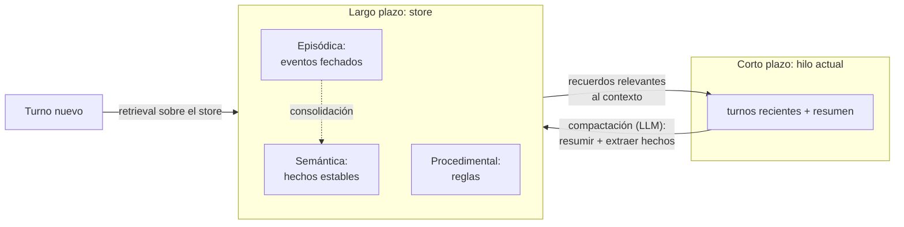

# 108 — Memoria de corto y largo plazo

> [← Clase anterior](../../../classes/part-08-retrieval-context-memory-and-knowledge/107-knowledge-graphs-y-graphrag/README.md) · [Índice de la parte](../README.md) · [Clase siguiente →](../../../classes/part-08-retrieval-context-memory-and-knowledge/109-compresion-de-contexto-y-caches-semanticos/README.md)

**Parte:** 08 — Recuperación, contexto, memoria y conocimiento  
**Nivel:** avanzado · **Horas estimadas:** 6  
**Laboratorio:** `agent` · **Estado:** `EXECUTABLE_CORE`

## 🎯 Propósito

Comprender **memoria de corto y largo plazo** dentro de la evolución de la inteligencia
artificial, implementar un experimento mínimo verificable y distinguir qué parte
constituye evidencia frente a una afirmación todavía no comprobada.

## 📚 Resultados de aprendizaje

Al finalizar podrás:

1. Explicar memoria de corto y largo plazo usando los conceptos `memory`, `thread`, `store`, `episodic`, `semantic`.
2. Ejecutar el laboratorio con una semilla explícita y revisar su contrato JSON.
3. Identificar al menos un supuesto, una limitación y un riesgo de aplicación.
4. Comparar el enfoque con la etapa anterior de la ruta de aprendizaje.
5. Producir una evidencia reproducible y una conclusión que no exceda los datos.

## 🧩 Conceptos centrales

`memory`, `thread`, `store`, `episodic`, `semantic`

## 🗺️ Ubicación en el mapa de la IA

Un LLM es amnésico por construcción: cada llamada parte de cero y solo "recuerda" lo que
cabe en su ventana de contexto. La memoria de los sistemas de IA no está en el modelo
sino **alrededor** de él: es ingeniería de recuperación aplicada al propio historial del
sistema. Esta clase toma la taxonomía de la psicología cognitiva (Tulving: memoria
episódica, semántica, procedimental), la traduce a arquitectura de software, y prepara
el terreno de los agentes con estado persistente (parte 09) — Generative Agents y MemGPT
demostraron que la gestión de memoria es lo que separa un chatbot de un agente coherente
en el tiempo.

## 📖 Fundamentos

### ⏱️ Memoria de corto plazo: la ventana de contexto

La memoria de corto plazo de un sistema LLM es el **hilo actual** (*thread*): los
mensajes que se reenvían en cada llamada. Propiedades: capacidad finita (la ventana),
coste lineal en tokens por llamada, y desaparece al cerrar el hilo. Gestionarla es
decidir **qué se reenvía**: todo el historial (caro y eventualmente imposible), una
ventana deslizante de los últimos n turnos (barato, olvida lo antiguo), o un resumen
acumulado más los turnos recientes.

### 🗄️ Memoria de largo plazo: el store

La memoria de largo plazo es un **almacén externo** (*store*) que sobrevive a los hilos,
con dos operaciones: **escribir** (qué merece persistir, con qué esquema) y **leer**
(recuperar lo relevante para el turno actual — exactamente el retrieval de las clases
097-101, aplicado sobre los recuerdos). Taxonomía funcional, heredada de la psicología
cognitiva:

- **Episódica** — eventos con tiempo y contexto: "el 12 de mayo el usuario reportó el
  bug X y lo resolvimos con Y". Soporta preguntas sobre el pasado y aprendizaje por
  ejemplos (few-shot desde experiencias propias).
- **Semántica** — hechos estables destilados de los episodios: "el usuario prefiere
  respuestas breves", "el proyecto usa PostgreSQL". Es la que se consulta en casi todos
  los turnos; se representa como perfil estructurado o colección de hechos indexados.
- **Procedimental** — cómo actuar: las instrucciones del sistema, reglas aprendidas
  ("nunca desplegar en viernes"). Modificarla cambia el comportamiento en todos los
  hilos futuros; es la más delicada.

### 🔁 Compactación: de episodios a semántica

El puente entre corto y largo plazo es la **compactación** (*consolidación*): cuando el
hilo crece o termina, un LLM resume lo ocurrido, extrae hechos estables y los escribe al
store. Decisiones críticas:

```text
compactar(hilo):
  resumen   ← LLM("resume decisiones, hechos y pendientes": hilo)
  hechos    ← LLM("extrae hechos estables sobre el usuario/dominio": hilo)
  para cada hecho:
      si contradice el store → política: ¿sobrescribir, versionar, preguntar?
      si no → upsert(store, hecho, {fuente: hilo_id, fecha})
  hilo ← [resumen] + últimos_n_turnos          # el hilo se acorta, no se pierde todo
```

- La compactación es **con pérdida**: lo que el resumen omite deja de existir para el
  sistema. Qué se pierde es una decisión de diseño, no un accidente.
- El **olvido** es una función, no un fallo: memoria que caduca (TTL), se sobrescribe
  (el hecho nuevo reemplaza al viejo) o decae por falta de uso evita que el store
  acumule contradicciones y ruido.

### 📏 Memory engineering: de heurística a disciplina medible

Hacia 2026 la memoria de agentes dejó de ser un cajón de heurísticas y se convirtió en
**memory engineering**: una práctica con benchmarks estandarizados que permiten comparar
arquitecturas de memoria *distintas* (grafo de hechos, vector store, resumen jerárquico,
archivos planos) sobre el mismo conjunto de evaluación — preguntas cuya respuesta exige
recordar información de sesiones anteriores, actualizar hechos que cambiaron y abstenerse
cuando el recuerdo no existe (p. ej. LongMemEval). La consecuencia práctica para esta
clase: cualquier decisión de diseño del store (esquema, política de olvido, umbral de
compactación) debe justificarse con una métrica sobre un conjunto de recuerdo, no con la
intuición de que "recordar más es mejor" — recordar de más introduce contradicciones y
contexto muerto que degradan la respuesta tanto como olvidar de menos.

## 🧮 Ejemplo trabajado

Hilo de soporte técnico con presupuesto de contexto de 4 000 tokens:

```text
Estado: 12 turnos, ~5 200 tokens → excede el presupuesto.

Compactación:
  resumen (180 tokens): "Usuaria Ana, error 502 en el despliegue del servicio pagos
    tras actualizar a v2.3.1; causa: variable DB_POOL sin migrar; pendiente: verificar
    en staging."
  hechos → memoria semántica:
    {usuario: Ana, rol: DevOps}                        {fuente: hilo-88, 2026-07-30}
    {servicio: pagos, versión: v2.3.1}                 {fuente: hilo-88, 2026-07-30}
  episodio → memoria episódica:
    "2026-07-30: error 502 resuelto migrando DB_POOL"

Hilo nuevo = resumen (183) + últimos 4 turnos (~900) ≈ 1 080 tokens  (de 5 200)

Turno siguiente: "¿me confirmas lo de staging?"
  lectura del store: nada nuevo necesario — el pendiente está en el resumen → responde.
Tres semanas después, otro hilo: "otra vez un 502 en pagos"
  lectura episódica por similitud: recupera el episodio del 30-07 → propone revisar
  DB_POOL antes de diagnosticar de cero.
```

La compresión fue 5 200 → 1 080 tokens (~79 %) y el sistema conservó exactamente lo que
las consultas posteriores necesitaron. Si el resumen hubiera omitido "pendiente:
staging", la primera pregunta habría fallado: la calidad de la compactación **es** la
calidad de la memoria.

## 📊 Propiedades y comparación

| Dimensión | Corto plazo (thread) | Episódica (store) | Semántica (store) | Procedimental |
|---|---|---|---|---|
| Contenido | turnos del hilo actual | eventos con fecha y contexto | hechos estables destilados | reglas e instrucciones |
| Alcance | un hilo | entre hilos | entre hilos | global |
| Escritura | automática (append) | al cerrar hilo / por evento | por compactación o explícita | deliberada, con revisión |
| Lectura | se reenvía entera/resumida | por similitud o fecha | en casi cada turno | en cada llamada (system) |
| Riesgo dominante | desbordar la ventana | crecer sin límite | hechos obsoletos o contradictorios | corromper el comportamiento global |



## ⚠️ Errores conceptuales frecuentes

1. **"El modelo recuerda la conversación"**. No: el modelo es sin estado; recuerda el
   *sistema* que reenvía el historial en cada llamada. Confundirlos lleva a "memorias"
   que desaparecen al cambiar de hilo.
2. **"Contexto más largo elimina la necesidad de memoria"**. Una ventana de 1M tokens
   sigue siendo un hilo: cara por llamada, sin persistencia entre hilos, y con atención
   degradada en el medio (arXiv:2307.03172). La memoria de largo plazo es selección,
   no capacidad.
3. **Guardarlo todo**. Un store sin criterio de escritura ni olvido acumula hechos
   obsoletos y contradicciones; la recuperación devuelve ruido con confianza. Escribir
   poco y estable supera a escribir todo.
4. **Compactar sin política de conflictos**. Si el hecho nuevo ("prefiere respuestas
   detalladas") contradice al almacenado ("prefiere brevedad") y el upsert sobrescribe a
   ciegas, la memoria oscila con el último humor del usuario.
5. **Tratar la memoria procedimental como una más**. Un hecho episódico erróneo afecta
   una respuesta; una regla procedimental errónea corrompe todos los hilos futuros. Su
   escritura exige revisión (humana o con validación) proporcional a ese radio de daño.

## 🚀 Del aprendizaje a la operación

Entre este núcleo y una memoria en producción faltan: aislamiento por usuario y por
tenant (la memoria de uno no puede filtrarse al hilo de otro), cumplimiento del derecho
de supresión (borrar de verdad, incluidos los resúmenes derivados), cifrado y control de
acceso del store, evaluación de la compactación (¿qué preguntas posteriores fallan por
información perdida?), límites de crecimiento con TTL y decaimiento, y trazabilidad de
qué recuerdo influyó en qué respuesta — sin eso, depurar un agente con memoria es
imposible.

## 🧪 Laboratorio

```bash
python lab.py
```

El laboratorio llama a `ai_evolution.labs.run_lab("agent")`. Esta
decisión evita 183 implementaciones divergentes: cada clase tiene un entrypoint
propio, pero los motores didácticos se prueban como una biblioteca común.

### 🔍 Evidencia esperada

- tipo de laboratorio y semilla;
- entradas o decisiones observables;
- resultado estructurado;
- lista `evidence` con hechos que pueden inspeccionarse;
- lista `limitations` que impide presentar la demo como producción.

## 📓 Notebooks

- [📓 `notebook.ipynb`](notebook.ipynb): recorrido guiado con la materia resumida.
- [✍️ `notebook_student.ipynb`](notebook_student.ipynb): ejercicios para resolver.
- [✅ `notebook_solution.ipynb`](notebook_solution.ipynb): solución de referencia explicada.

## 📝 Evaluación

| Criterio | Peso |
|---|---:|
| Comprensión conceptual | 25 % |
| Ejecución reproducible | 25 % |
| Interpretación basada en evidencia | 25 % |
| Riesgos, límites y mejora propuesta | 25 % |

Consulta [assessment.md](assessment.md) para preguntas y criterio de aceptación.

## ⚠️ Errores comunes

| Síntoma | Causa probable | Corrección |
|---|---|---|
| El código corre, pero no hay conclusión | Se confundió ejecución con aprendizaje | Explica qué demuestra y qué no demuestra |
| El resultado cambia sin explicación | No se registró semilla o configuración | Conserva semilla, versión y parámetros |
| Se promete uso real | Se extrapoló desde una demo educativa | Declara entorno, datos, límites y revisión humana |
| Se copia una métrica aislada | No existe baseline ni costo de error | Añade comparación y criterio de decisión |

## ❓ Preguntas frecuentes

**¿Debo usar una API comercial?**  
No. El núcleo funciona localmente. Las extensiones LIVE se documentan por separado.

**¿El laboratorio representa una implementación industrial?**  
No por sí solo. Enseña el contrato y el patrón; producción exige integración,
seguridad, observabilidad, pruebas y operación.

**¿Dónde profundizo?**  
Revisa las especializaciones enlazadas en el README raíz y la ruta siguiente.

## 🔗 Referencias

- Park, J. S. et al. (2023). *Generative Agents: Interactive Simulacra of Human Behavior*. [arXiv:2304.03442](https://arxiv.org/abs/2304.03442)
- Packer, C. et al. (2023). *MemGPT: Towards LLMs as Operating Systems*. [arXiv:2310.08560](https://arxiv.org/abs/2310.08560)
- Liu, N. et al. (2023). *Lost in the Middle: How Language Models Use Long Contexts*. [arXiv:2307.03172](https://arxiv.org/abs/2307.03172)
- Documentación de LangGraph, *Memory*: [https://langchain-ai.github.io/langgraph/concepts/memory/](https://langchain-ai.github.io/langgraph/concepts/memory/)
- Russell, S. & Norvig, P. *Artificial Intelligence: A Modern Approach* (4.ª ed.), cap. 2 (agentes y estado interno). [https://aima.cs.berkeley.edu/](https://aima.cs.berkeley.edu/)
- Wu, D. et al. (2024). *LongMemEval: Benchmarking Chat Assistants on Long-Term Interactive Memory*. [arXiv:2410.10813](https://arxiv.org/abs/2410.10813)
- Mem0 — *State of AI Agent Memory 2026* (panorama de benchmarks y arquitecturas de memoria): [https://mem0.ai/blog/state-of-ai-agent-memory-2026](https://mem0.ai/blog/state-of-ai-agent-memory-2026)

---

## ⬅️ Clase anterior

[107 — Knowledge graphs y GraphRAG](../../part-08-retrieval-context-memory-and-knowledge/107-knowledge-graphs-y-graphrag/README.md)

## ➡️ Siguiente clase

[109 — Compresión de contexto y cachés semánticos](../../part-08-retrieval-context-memory-and-knowledge/109-compresion-de-contexto-y-caches-semanticos/README.md)
