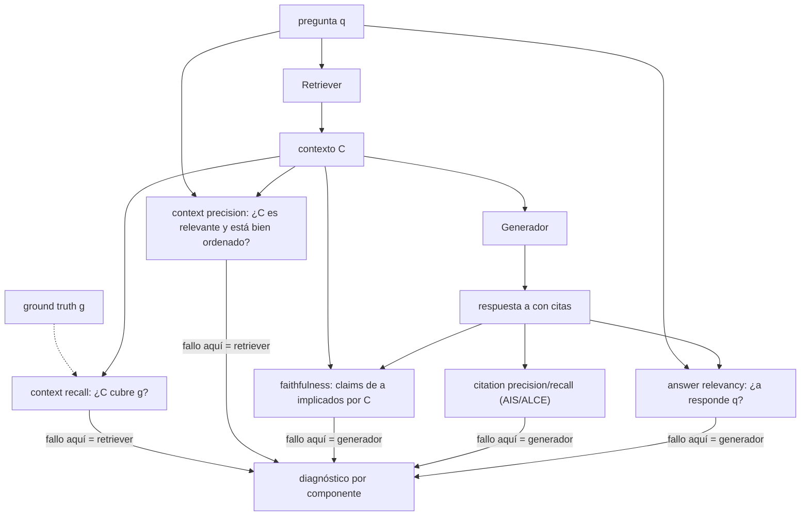

# 110 — Evaluación de fidelidad, cobertura y atribución

> [← Clase anterior](../../../classes/part-08-retrieval-context-memory-and-knowledge/109-compresion-de-contexto-y-caches-semanticos/README.md) · [Índice de la parte](../README.md) · [Clase siguiente →](../../../classes/part-08-retrieval-context-memory-and-knowledge/111-proyecto-rag-productivo-y-auditable/README.md)

**Parte:** 08 — Recuperación, contexto, memoria y conocimiento  
**Nivel:** avanzado · **Horas estimadas:** 6  
**Laboratorio:** `evaluation` · **Estado:** `EXECUTABLE_CORE`

## 🎯 Propósito

Comprender **evaluación de fidelidad, cobertura y atribución** dentro de la evolución de la inteligencia
artificial, implementar un experimento mínimo verificable y distinguir qué parte
constituye evidencia frente a una afirmación todavía no comprobada.

## 📚 Resultados de aprendizaje

Al finalizar podrás:

1. Explicar evaluación de fidelidad, cobertura y atribución usando los conceptos `faithfulness`, `recall`, `attribution`, `citations`.
2. Ejecutar el laboratorio con una semilla explícita y revisar su contrato JSON.
3. Identificar al menos un supuesto, una limitación y un riesgo de aplicación.
4. Comparar el enfoque con la etapa anterior de la ruta de aprendizaje.
5. Producir una evidencia reproducible y una conclusión que no exceda los datos.

## 🧩 Conceptos centrales

`faithfulness`, `recall`, `attribution`, `citations`

## 🗺️ Ubicación en el mapa de la IA

Un pipeline RAG tiene dos componentes que fallan de formas distintas: el retriever puede
traer contexto equivocado y el generador puede desviarse del contexto correcto. La
evaluación clásica de IR (precision/recall, clase 102) mide lo primero; la evaluación de
generación clásica (BLEU, ROUGE) no mide lo segundo. Esta clase presenta el marco que
llenó ese hueco —métricas de fidelidad y atribución, con RAGAS como referencia— y el
patrón *LLM-as-judge* que las hace computables sin anotación humana exhaustiva. Es el
prerrequisito del proyecto auditable de la clase 111: sin estas métricas, "funciona
bien" es una opinión.

## 📖 Fundamentos

### 🧭 Qué se evalúa y contra qué

Una interacción RAG tiene cuatro elementos: pregunta `q`, contexto recuperado `C`,
respuesta generada `a`, y (en evaluación) la referencia *ground truth* `g`. Cada métrica
compara un par distinto — confundirlos es el error más común:

| Métrica (RAGAS, [arXiv:2309.15217](https://arxiv.org/abs/2309.15217)) | Compara | Pregunta que responde | ¿Necesita ground truth? |
|---|---|---|---|
| **Faithfulness** | `a` vs `C` | ¿la respuesta se sostiene en el contexto? | no |
| **Answer relevancy** | `a` vs `q` | ¿responde a lo que se preguntó? | no |
| **Context precision** | `C` vs `q`/`g` | ¿lo recuperado es relevante (y bien ordenado)? | idealmente |
| **Context recall** | `C` vs `g` | ¿el contexto cubre lo necesario para responder? | sí |

### 📏 Fidelidad (faithfulness)

Se computa en dos pasos con un LLM evaluador (*LLM-as-judge*):

```text
1. Descomponer a en afirmaciones atómicas s1..sn   (claims)
2. Para cada si: ¿C la implica? (entailment sí/no)
faithfulness = |afirmaciones implicadas| / n
```

Fidelidad baja = alucinación **respecto al contexto** (aunque el dato sea cierto en el
mundo). Es la métrica que no requiere referencia y por eso puede monitorearse en
producción sobre tráfico real.

### 🎯 Cobertura del retriever (context precision / recall)

- **Context recall**: fracción de las afirmaciones de la referencia `g` que el contexto
  recuperado respalda. Recall bajo = el retriever no trajo lo necesario; ningún
  generador lo compensa (clase 104: re-rankear no crea recall).
- **Context precision**: fracción del contexto que es realmente relevante, ponderando
  el orden (los pasajes útiles deben estar arriba). Precision baja = ruido que paga
  tokens y degrada la atención.

### 🔗 Atribución (citas verificables)

La atribución evalúa el vínculo afirmación→cita. El marco AIS
([arXiv:2112.12870](https://arxiv.org/abs/2112.12870)) define el criterio riguroso:
una cita es válida si el pasaje citado **implica** la afirmación ("attributable to
identified sources"). Sobre respuestas con citas (clase 105) se miden, siguiendo ALCE
([arXiv:2305.14627](https://arxiv.org/abs/2305.14627)):

- **Citation recall**: ¿cada afirmación tiene alguna cita que la respalda?
- **Citation precision**: ¿cada cita emitida respalda de verdad su afirmación?

### ⚖️ LLM-as-judge: potencia y sospecha

Usar un LLM para juzgar entailment escala a miles de ejemplos, pero el juez tiene sesgos
conocidos (posición, verbosidad, autopreferencia) y varianza. Regla del programa: el
juez se **calibra** contra una muestra anotada por humanos (¿qué % de acuerdo?) antes de
confiar en sus números, y se re-calibra al cambiar de modelo juez o de dominio.

## 🧮 Ejemplo trabajado

Caso completo, calculado a mano:

```text
q: "¿Cuándo se inauguró el museo y quién lo diseñó?"
C: [1] "El museo se inauguró en octubre de 1997."
   [2] "El edificio fue diseñado por Frank Gehry."
g: "Se inauguró en octubre de 1997 y lo diseñó Frank Gehry."

a: "El museo, diseñado por Frank Gehry [2], se inauguró en 1997 [1] y recibió
    un millón de visitantes en su primer año."

Afirmaciones de a:      ¿implicada por C?    ¿cita correcta?
  s1 diseñado por Gehry        SÍ            [2] la respalda → ✓
  s2 se inauguró en 1997       SÍ            [1] la respalda → ✓
  s3 un millón de visitantes   NO            sin cita        → ✗

faithfulness      = 2/3 ≈ 0.67     (s3 no está en el contexto)
citation recall   = 2/3 ≈ 0.67     (s3 carece de cita que la respalde)
citation precision= 2/2 = 1.00     (las citas emitidas son correctas)
context recall    = 2/2 = 1.00     (todo lo que g necesita está en C)
context precision = 2/2 = 1.00     (ambos pasajes son relevantes)
```

Diagnóstico: el retriever hizo su trabajo perfecto; el fallo es exclusivamente del
generador (s3 salió de la memoria paramétrica). Sin descomponer por métrica, solo se
vería "la respuesta tiene algo mal" sin saber qué componente arreglar.

## 📊 Propiedades y comparación



La tabla de la sección de fundamentos resume qué compara cada métrica; el diagrama
muestra la propiedad clave del marco: **cada métrica apunta a un componente**, y por eso
el conjunto es diagnóstico, no solo un número agregado.

## ⚠️ Errores conceptuales frecuentes

1. **"Fidelidad = veracidad"**. Fidelidad es coherencia con el contexto recuperado. Una
   respuesta puede ser fiel a un contexto erróneo (fidelidad 1.0, verdad 0) o infiel
   pero cierta (el modelo corrigió al corpus con su memoria — sigue siendo un fallo
   de RAG porque rompe la trazabilidad).
2. **Promediar todo en un solo score**. Un 0.8 global puede ser retriever perfecto +
   generador alucinando, o al revés; sin métricas por componente no hay acción
   correctiva posible.
3. **Evaluar solo con casos que tienen respuesta**. Un conjunto de evaluación sin
   preguntas *sin* respuesta en el corpus no mide la capacidad de rechazar — y el
   rechazo correcto es parte del contrato (clase 105).
4. **Confiar en el juez sin calibrarlo**. El acuerdo juez-humano varía por dominio e
   idioma; un juez no calibrado produce métricas precisas y sistemáticamente sesgadas.
5. **Optimizar citation recall forzando citas**. Instruir "cita siempre algo" sube el
   recall de citas y hunde su precisión: aparecen citas decorativas que no implican la
   afirmación. Las dos se reportan juntas o ninguna vale.

## 🚀 Del aprendizaje a la operación

Entre este núcleo y una evaluación operativa faltan: un conjunto de evaluación propio y
versionado (100-500 preguntas del dominio con referencias revisadas, incluyendo
preguntas sin respuesta y adversariales), la calibración documentada del juez contra
anotación humana, la integración en CI (una regresión de fidelidad bloquea el despliegue
igual que un test roto), el monitoreo en producción con faithfulness muestreado sobre
tráfico real, y el presupuesto: evaluar con LLM-juez cuesta dinero por ejecución y ese
coste condiciona cuántas veces se corre.

## 🧪 Laboratorio

```bash
python lab.py
```

El laboratorio llama a `ai_evolution.labs.run_lab("evaluation")`. Esta
decisión evita 183 implementaciones divergentes: cada clase tiene un entrypoint
propio, pero los motores didácticos se prueban como una biblioteca común.

### 🔍 Evidencia esperada

- tipo de laboratorio y semilla;
- entradas o decisiones observables;
- resultado estructurado;
- lista `evidence` con hechos que pueden inspeccionarse;
- lista `limitations` que impide presentar la demo como producción.

## 📓 Notebooks

- [📓 `notebook.ipynb`](notebook.ipynb): recorrido guiado con la materia resumida.
- [✍️ `notebook_student.ipynb`](notebook_student.ipynb): ejercicios para resolver.
- [✅ `notebook_solution.ipynb`](notebook_solution.ipynb): solución de referencia explicada.

## 📝 Evaluación

| Criterio | Peso |
|---|---:|
| Comprensión conceptual | 25 % |
| Ejecución reproducible | 25 % |
| Interpretación basada en evidencia | 25 % |
| Riesgos, límites y mejora propuesta | 25 % |

Consulta [assessment.md](assessment.md) para preguntas y criterio de aceptación.

## ⚠️ Errores comunes

| Síntoma | Causa probable | Corrección |
|---|---|---|
| El código corre, pero no hay conclusión | Se confundió ejecución con aprendizaje | Explica qué demuestra y qué no demuestra |
| El resultado cambia sin explicación | No se registró semilla o configuración | Conserva semilla, versión y parámetros |
| Se promete uso real | Se extrapoló desde una demo educativa | Declara entorno, datos, límites y revisión humana |
| Se copia una métrica aislada | No existe baseline ni costo de error | Añade comparación y criterio de decisión |

## ❓ Preguntas frecuentes

**¿Debo usar una API comercial?**  
No. El núcleo funciona localmente. Las extensiones LIVE se documentan por separado.

**¿El laboratorio representa una implementación industrial?**  
No por sí solo. Enseña el contrato y el patrón; producción exige integración,
seguridad, observabilidad, pruebas y operación.

**¿Dónde profundizo?**  
Revisa las especializaciones enlazadas en el README raíz y la ruta siguiente.

## 🔗 Referencias

- Es, S. et al. (2023). *RAGAS: Automated Evaluation of Retrieval Augmented Generation*. [arXiv:2309.15217](https://arxiv.org/abs/2309.15217) — uso: fuente primaria del mecanismo estudiado
- Rashkin, H. et al. (2021). *Measuring Attribution in Natural Language Generation Models* (AIS). [arXiv:2112.12870](https://arxiv.org/abs/2112.12870) — uso: fuente primaria del mecanismo estudiado
- Gao, T. et al. (2023). *Enabling Large Language Models to Generate Text with Citations* (ALCE). [arXiv:2305.14627](https://arxiv.org/abs/2305.14627) — uso: fuente primaria del mecanismo estudiado
- Zheng, L. et al. (2023). *Judging LLM-as-a-Judge with MT-Bench and Chatbot Arena*. [arXiv:2306.05685](https://arxiv.org/abs/2306.05685) — uso: fuente primaria del mecanismo estudiado
- Documentación oficial de RAGAS: [https://docs.ragas.io/](https://docs.ragas.io/) — uso: referencia consultada en su fuente original

<!-- papers:inicio -->

---

## 📜 Papers que fundamentan esta clase

> Bloque generado por `python scripts/link_papers_to_classes.py`. La fuente es [`papers/catalog/papers.json`](../../../papers/catalog/papers.json).

| Paper | Año | Qué desbloqueó | Miniatura |
|---|---:|---|---|
| [P11 · Generación aumentada por recuperación para tareas de PLN intensivas en conocimiento](../../../papers/foundational/P11_rag/README.md) | 2020 | Separa el conocimiento (índice consultable y actualizable) del razonamiento (parámetros del modelo). | [notebook](../../../notebooks/papers/P11_rag.ipynb) |
| [P36 · Perdidos en el medio: cómo usan los modelos de lenguaje los contextos largos](../../../papers/foundational/P36_lost_in_middle/README.md) | 2023 | Tener contexto largo no es usarlo: el rendimiento cae en forma de U cuando el dato relevante está en el medio. | [notebook](../../../notebooks/papers/P36_lost_in_middle.ipynb) |

Cada ficha explica el problema anterior, la matemática mínima, los límites y los errores de atribución más frecuentes. Para leerlas con método: [cómo leer un paper de IA](../../../papers/guides/COMO_LEER_UN_PAPER_DE_IA.md) · [anexos matemáticos](../../../papers/annexes/README.md).
<!-- papers:fin -->
<!-- bibliografia:inicio -->

---

## 📚 Bibliografía de apoyo

> Bloque generado por `python scripts/link_sources_to_classes.py`. Cada obra lleva su localizador verificado en [`sources/bibliography.json`](../../../sources/bibliography.json).

Los papers dicen **de dónde salió** el mecanismo. Estas obras lo **desarrollan** con el espacio que una clase no tiene: teoría completa, demostraciones y ejercicios.

| Obra | Edición | Localizador | Papel en esta clase |
|---|---|---|---|
| Manning, Christopher D., Raghavan, Prabhakar y Schütze, Hinrich — *Introduction to Information Retrieval* | 2008 | [ISBN 9780521865715](https://openlibrary.org/isbn/9780521865715) · [web de la obra](https://nlp.stanford.edu/IR-book/) | obra de referencia de la parte 08 · toda la parte |
| Jurafsky, Daniel y Martin, James H. — *Speech and Language Processing* | 2.ª (la 3.ª circula como borrador abierto sin ISBN) · 2009 | [ISBN 9780131873216](https://openlibrary.org/isbn/9780131873216) · [web de la obra](https://web.stanford.edu/~jurafsky/slp3/) | obra de referencia de la parte 08 · representaciones vectoriales de significado |
<!-- bibliografia:fin -->

---

## ⬅️ Clase anterior

[109 — Compresión de contexto y cachés semánticos](../../part-08-retrieval-context-memory-and-knowledge/109-compresion-de-contexto-y-caches-semanticos/README.md)

## ➡️ Siguiente clase

[111 — Proyecto: RAG productivo y auditable](../../part-08-retrieval-context-memory-and-knowledge/111-proyecto-rag-productivo-y-auditable/README.md)
