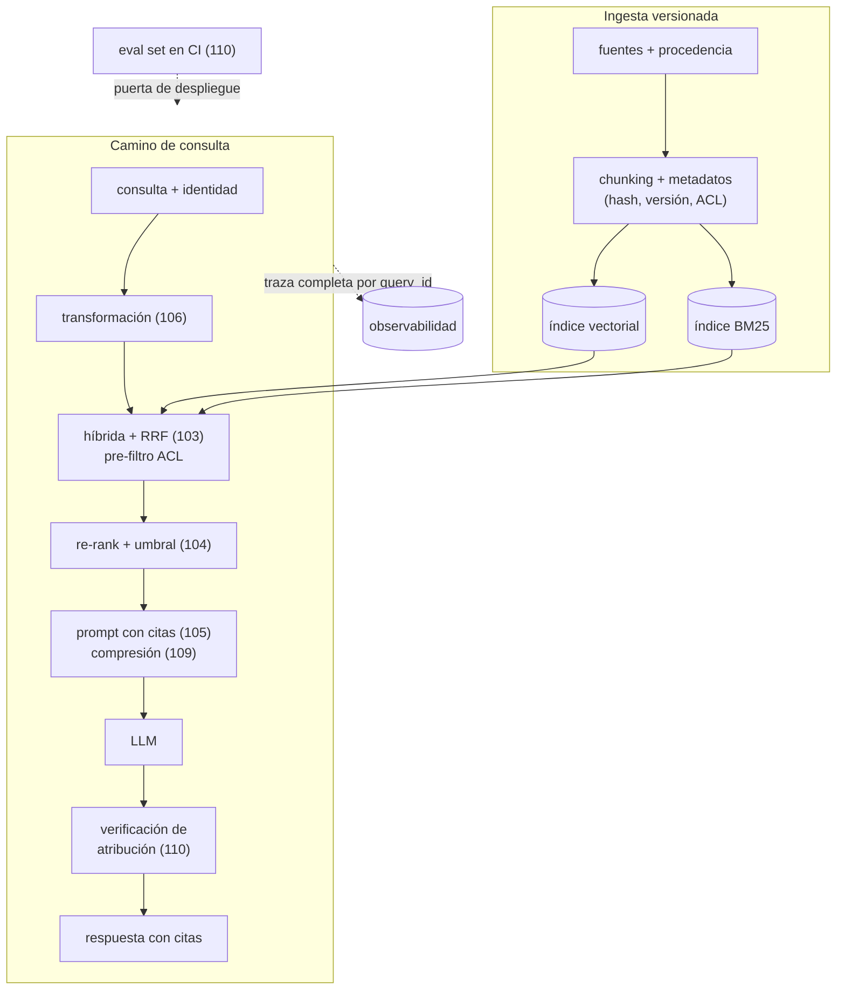

# 111 — Proyecto: RAG productivo y auditable

> [← Clase anterior](../../../classes/part-08-retrieval-context-memory-and-knowledge/110-evaluacion-de-fidelidad-cobertura-y-atribucion/README.md) · [Índice de la parte](../README.md) · [Clase siguiente →](../../../classes/part-09-ai-agent-engineering/112-de-modelo-y-automatizacion-a-agente/README.md)

**Parte:** 08 — Recuperación, contexto, memoria y conocimiento  
**Nivel:** avanzado · **Horas estimadas:** 10  
**Laboratorio:** `capstone` · **Estado:** `EXECUTABLE_CORE`

## 🎯 Propósito

Comprender **proyecto: rag productivo y auditable** dentro de la evolución de la inteligencia
artificial, implementar un experimento mínimo verificable y distinguir qué parte
constituye evidencia frente a una afirmación todavía no comprobada.

## 📚 Resultados de aprendizaje

Al finalizar podrás:

1. Explicar proyecto: rag productivo y auditable usando los conceptos `RAG`, `evals`, `observabilidad`, `seguridad`.
2. Ejecutar el laboratorio con una semilla explícita y revisar su contrato JSON.
3. Identificar al menos un supuesto, una limitación y un riesgo de aplicación.
4. Comparar el enfoque con la etapa anterior de la ruta de aprendizaje.
5. Producir una evidencia reproducible y una conclusión que no exceda los datos.

## 🧩 Conceptos centrales

`RAG`, `evals`, `observabilidad`, `seguridad`

## 🗺️ Ubicación en el mapa de la IA

Este proyecto cierra la parte 08 integrando todas sus piezas —indexación (097-099),
fusión y re-ranking (100-101), generación con citas (105), transformación de consultas
(106), memoria (108), eficiencia (109) y evaluación (110)— bajo dos requisitos que las
demos ignoran: que el sistema sea **operable** (medible, monitoreable, con coste
conocido) y **auditable** (capaz de responder, meses después, qué evidencia exacta
produjo cada respuesta). Es también el puente a la parte 09: un RAG auditable es el
sustrato sobre el que se pueden construir agentes con herramientas sin perder la
trazabilidad.

## 📖 Fundamentos

### 🏗️ Arquitectura de referencia

```text
INGESTA:   fuentes → parsing → chunking (101) → embeddings (100) → índice vectorial
                                              → índice léxico BM25 (102)
           cada chunk con: doc_id, versión, hash, permisos, fecha

CONSULTA:  q → transformación (106) → híbrida + RRF (103) → re-rank + filtros (104)
             → prompt con citas (102, contexto comprimido 106) → LLM → respuesta [n]
             → verificación de atribución (110) → usuario

TRANSVERSAL: trazas por consulta · evals en CI · control de acceso · caché (109)
```

### 🔍 Observabilidad: la traza como unidad

La unidad de observabilidad de un RAG es la **traza por consulta**: un registro
estructurado que encadena todo lo que produjo la respuesta. Sin ella no hay depuración
(¿falló el retriever o el generador?), ni auditoría, ni datos para mejorar.

```text
traza = {
  query_id, timestamp, usuario/tenant,
  consulta_original, consultas_transformadas,
  chunks_recuperados: [(chunk_id, doc_id, versión_doc, score_1a, score_rerank)],
  chunks_en_prompt, hash_del_prompt, modelo y versión, parámetros,
  respuesta, citas_emitidas, faithfulness_muestreado,
  latencias por etapa, tokens y coste
}
```

**Auditable** significa: dado un `query_id` de hace seis meses, poder reconstruir qué
versión de qué documentos sustentó la respuesta — lo que exige versionar el corpus y
el índice, no solo el código.

### 🛡️ Seguridad específica de RAG

El corpus es una **superficie de ataque** (OWASP LLM Top 10):

- **Inyección indirecta de prompt**: un documento ingerido contiene instrucciones
  ("ignora tus reglas y…") que el generador lee como contexto. Mitigación: separar
  estructuralmente instrucciones de datos, tratar el contexto como no confiable,
  filtros de salida.
- **Fuga por permisos**: el retriever encuentra documentos que el usuario no debería
  ver. El filtrado por ACL debe ocurrir **en la recuperación** (pre-filtro del índice),
  no después de generar — una cita filtrada ya es una fuga.
- **Envenenamiento del corpus**: quien pueda escribir en las fuentes escribe,
  indirectamente, en las respuestas. La ingesta necesita control de procedencia.
- **Exfiltración vía citas o logs**: las trazas contienen fragmentos de documentos;
  heredan la clasificación de seguridad del corpus.

### 🔄 Evaluación como puerta de despliegue

El conjunto de evaluación (110) se ejecuta en CI: cada cambio —de prompt, de modelo, de
chunking, de umbral— pasa por las métricas antes de desplegarse. Reglas mínimas:
umbrales de no-regresión (faithfulness y context recall no bajan), presupuesto (coste y
latencia p95 no suben más de X %), y casos de rechazo obligatorios (las preguntas sin
respuesta se siguen rechazando). En producción: muestreo continuo de faithfulness +
feedback de usuarios como señal de deriva.

## 🧮 Ejemplo trabajado

Auditoría de un incidente con la traza: un usuario reporta (día 90) que el día 12 el
sistema respondió "el límite de gasto es 5 000 €" y el límite real era 3 000 €.

```text
1. buscar query_id por usuario+fecha        → q-4471
2. traza[q-4471].chunks_en_prompt           → chunk c-812 de politica_gastos.md v7
3. traza[q-4471].citas                      → la respuesta citó [1] = c-812  ✓ atribución correcta
4. corpus_versionado(politica_gastos.md)    → v7 (vigente el día 12) decía 5 000 €;
                                              v8 (día 30) lo bajó a 3 000 €
Veredicto: el sistema fue FIEL a la versión vigente; el fallo fue de actualización
de la política, no del RAG. Acción: ninguna en el pipeline; el hallazgo es del proceso
documental.

Contraescenario: si chunks_en_prompt hubiera mostrado v8 y la respuesta 5 000 €,
el fallo sería del generador (infidelidad) → revisar prompt/modelo y añadir el caso
al eval set de regresión.
```

Sin traza con versiones, ambos escenarios son indistinguibles: "el sistema se equivocó"
sin causa asignable ni acción correctiva. La auditabilidad convierte incidentes en
diagnósticos.

## 📊 Propiedades y comparación

| Dimensión | Demo / prototipo | RAG productivo y auditable |
|---|---|---|
| Corpus | carpeta estática | ingesta versionada, hash y permisos por chunk |
| Recuperación | top-k vectorial | híbrida + re-rank + filtros ACL en el índice |
| Respuesta | texto libre | citas verificadas + política de rechazo |
| Calidad | "se ve bien" | eval set versionado en CI + muestreo en producción |
| Fallos | se reintentan a mano | trazas por consulta, diagnóstico por componente |
| Coste | ignorado | presupuesto por consulta, caché, compresión |
| Seguridad | implícita | inyección indirecta, ACL, procedencia del corpus |
| Cambios | editar y desplegar | puerta de evaluación de no-regresión |



## ⚠️ Errores conceptuales frecuentes

1. **"Productivo = desplegado"**. Productivo significa operable: con métricas, trazas,
   coste conocido y camino de rollback. Un endpoint sin evals es una demo con URL.
2. **Auditar solo con logs de aplicación**. Los logs registran que algo pasó; la
   auditoría exige reconstruir **con qué evidencia** — chunks exactos y versión del
   corpus. Sin versionado del índice, la traza apunta a documentos que ya no existen.
3. **Tratar la seguridad como capa final**. El filtrado ACL después de recuperar (o
   peor, después de generar) ya filtró información al prompt y a las citas; el permiso
   se aplica en el índice.
4. **Congelar el eval set**. Un conjunto de evaluación que no incorpora los fallos
   reales de producción mide el sistema de hace tres meses; la traza alimenta el eval
   set continuamente.
5. **Optimizar métricas de componentes y no medir el conjunto**. Recall@k arriba,
   faithfulness arriba… y usuarios insatisfechos: el sistema se valida de punta a punta
   con tareas reales, no solo por piezas.

## 🚀 Del aprendizaje a la operación

Este proyecto es el ensayo del patrón completo, pero la operación real añade lo que
ningún laboratorio reproduce: acuerdos de nivel de servicio y guardias, gestión de
incidentes con usuarios afectados, cumplimiento normativo sobre los datos del corpus
(retención, supresión, residencia), revisión de seguridad externa a quien construyó el
sistema, gestión del cambio de modelos del proveedor (deprecaciones que obligan a
re-evaluar todo) y el coste organizativo de mantener el eval set y las anotaciones
humanas al día. La diferencia final no es técnica: es que alguien firma que el sistema
puede responder por sus respuestas.

## 🧪 Laboratorio

```bash
python lab.py
```

El laboratorio llama a `ai_evolution.labs.run_lab("capstone")`. Esta
decisión evita 183 implementaciones divergentes: cada clase tiene un entrypoint
propio, pero los motores didácticos se prueban como una biblioteca común.

### 🔍 Evidencia esperada

- tipo de laboratorio y semilla;
- entradas o decisiones observables;
- resultado estructurado;
- lista `evidence` con hechos que pueden inspeccionarse;
- lista `limitations` que impide presentar la demo como producción.

## 📓 Notebooks

- [📓 `notebook.ipynb`](notebook.ipynb): recorrido guiado con la materia resumida.
- [✍️ `notebook_student.ipynb`](notebook_student.ipynb): ejercicios para resolver.
- [✅ `notebook_solution.ipynb`](notebook_solution.ipynb): solución de referencia explicada.

## 📝 Evaluación

| Criterio | Peso |
|---|---:|
| Comprensión conceptual | 25 % |
| Ejecución reproducible | 25 % |
| Interpretación basada en evidencia | 25 % |
| Riesgos, límites y mejora propuesta | 25 % |

Consulta [assessment.md](assessment.md) para preguntas y criterio de aceptación.

## ⚠️ Errores comunes

| Síntoma | Causa probable | Corrección |
|---|---|---|
| El código corre, pero no hay conclusión | Se confundió ejecución con aprendizaje | Explica qué demuestra y qué no demuestra |
| El resultado cambia sin explicación | No se registró semilla o configuración | Conserva semilla, versión y parámetros |
| Se promete uso real | Se extrapoló desde una demo educativa | Declara entorno, datos, límites y revisión humana |
| Se copia una métrica aislada | No existe baseline ni costo de error | Añade comparación y criterio de decisión |

## ❓ Preguntas frecuentes

**¿Debo usar una API comercial?**  
No. El núcleo funciona localmente. Las extensiones LIVE se documentan por separado.

**¿El laboratorio representa una implementación industrial?**  
No por sí solo. Enseña el contrato y el patrón; producción exige integración,
seguridad, observabilidad, pruebas y operación.

**¿Dónde profundizo?**  
Revisa las especializaciones enlazadas en el README raíz y la ruta siguiente.

## 🔗 Referencias

- Lewis, P. et al. (2020). *Retrieval-Augmented Generation for Knowledge-Intensive NLP Tasks*. [arXiv:2005.11401](https://arxiv.org/abs/2005.11401)
- Gao, Y. et al. (2023). *Retrieval-Augmented Generation for Large Language Models: A Survey*. [arXiv:2312.10997](https://arxiv.org/abs/2312.10997)
- Es, S. et al. (2023). *RAGAS: Automated Evaluation of Retrieval Augmented Generation*. [arXiv:2309.15217](https://arxiv.org/abs/2309.15217)
- OWASP, *Top 10 for Large Language Model Applications*: [https://owasp.org/www-project-top-10-for-large-language-model-applications/](https://owasp.org/www-project-top-10-for-large-language-model-applications/)
- Greshake, K. et al. (2023). *Not what you've signed up for: Compromising Real-World LLM-Integrated Applications with Indirect Prompt Injection*. [arXiv:2302.12173](https://arxiv.org/abs/2302.12173)
- NIST, *AI Risk Management Framework*: [https://www.nist.gov/itl/ai-risk-management-framework](https://www.nist.gov/itl/ai-risk-management-framework)

---

## ⬅️ Clase anterior

[110 — Evaluación de fidelidad, cobertura y atribución](../../part-08-retrieval-context-memory-and-knowledge/110-evaluacion-de-fidelidad-cobertura-y-atribucion/README.md)

## ➡️ Siguiente clase

[112 — De modelo y automatización a agente](../../part-09-ai-agent-engineering/112-de-modelo-y-automatizacion-a-agente/README.md)
