# 🔎 Parte 08 — Recuperación, contexto, memoria y conocimiento

**Nivel:** avanzado · **Duración sugerida:** 5–6 semanas ·
**Clases:** 12

Construye sistemas que conectan modelos con conocimiento verificable mediante búsqueda, RAG, grafos, memoria y evaluación de atribución.

## 🧭 Secuencia de la parte

```mermaid
flowchart LR
    L097["097<br/>Embeddings y búsqueda<br/>vectorial"]
    L098["098<br/>Segmentación, metadatos y<br/>ventanas"]
    L099["099<br/>Búsqueda léxica y<br/>BM25"]
    L100["100<br/>Búsqueda híbrida y<br/>fusión de rankings"]
    L101["101<br/>Re-ranking y filtros<br/>de evidencia"]
    L102["102<br/>RAG básico con<br/>citas"]
    L103["103<br/>Transformación y descomposición<br/>de consultas"]
    L104["104<br/>Knowledge graphs y<br/>GraphRAG"]
    L105["105<br/>Memoria de corto<br/>y largo plazo"]
    L106["106<br/>Compresión de contexto<br/>y cachés semánticos"]
    L107["107<br/>Evaluación de fidelidad,<br/>cobertura y atribución"]
    L108["108<br/>Proyecto: RAG productivo<br/>y auditable"]
    L097 --> L098
    L098 --> L099
    L099 --> L100
    L100 --> L101
    L101 --> L102
    L102 --> L103
    L103 --> L104
    L104 --> L105
    L105 --> L106
    L106 --> L107
    L107 --> L108
```

## 📚 Clases

| ID | Tema | Laboratorio | Horas |
|---:|---|---|---:|
| 097 | [Embeddings y búsqueda vectorial](097-embeddings-y-busqueda-vectorial/README.md) | `retrieval` | 6 |
| 098 | [Segmentación, metadatos y ventanas](098-segmentacion-metadatos-y-ventanas/README.md) | `retrieval` | 6 |
| 099 | [Búsqueda léxica y BM25](099-busqueda-lexica-y-bm25/README.md) | `retrieval` | 6 |
| 100 | [Búsqueda híbrida y fusión de rankings](100-busqueda-hibrida-y-fusion-de-rankings/README.md) | `retrieval` | 6 |
| 101 | [Re-ranking y filtros de evidencia](101-re-ranking-y-filtros-de-evidencia/README.md) | `retrieval` | 6 |
| 102 | [RAG básico con citas](102-rag-basico-con-citas/README.md) | `retrieval` | 6 |
| 103 | [Transformación y descomposición de consultas](103-transformacion-y-descomposicion-de-consultas/README.md) | `workflow` | 6 |
| 104 | [Knowledge graphs y GraphRAG](104-knowledge-graphs-y-graphrag/README.md) | `logic` | 6 |
| 105 | [Memoria de corto y largo plazo](105-memoria-de-corto-y-largo-plazo/README.md) | `agent` | 6 |
| 106 | [Compresión de contexto y cachés semánticos](106-compresion-de-contexto-y-caches-semanticos/README.md) | `retrieval` | 6 |
| 107 | [Evaluación de fidelidad, cobertura y atribución](107-evaluacion-de-fidelidad-cobertura-y-atribucion/README.md) | `evaluation` | 6 |
| 108 | [Proyecto: RAG productivo y auditable](108-proyecto-rag-productivo-y-auditable/README.md) | `capstone` | 10 |

## 📝 Evaluación de la parte

- 40 % laboratorios y notebooks.
- 25 % explicaciones y comparación de enfoques.
- 20 % evaluación de riesgos y limitaciones.
- 15 % mini-proyecto o integración.

[⬅️ Parte 07 — IA generativa para texto, imagen, audio, video y 3D](../part-07-generative-ai-across-media/README.md) · [🏠 Volver al programa](../../README.md) · [➡️ Parte 09 — Ingeniería de agentes de IA](../part-09-ai-agent-engineering/README.md)
