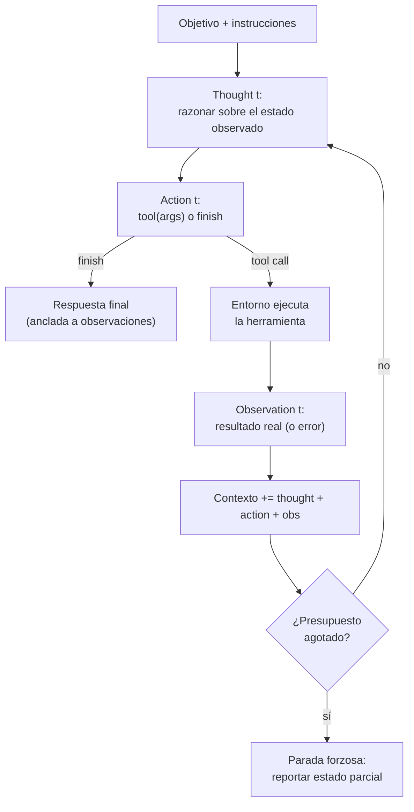

# 111 — Ciclo ReAct y observación del entorno

> [← Clase anterior](../../../classes/part-09-ai-agent-engineering/110-anatomia-instrucciones-herramientas-estado-y-salida/README.md) · [Índice de la parte](../README.md) · [Clase siguiente →](../../../classes/part-09-ai-agent-engineering/112-planificacion-y-descomposicion-de-tareas/README.md)

**Parte:** 09 — Ingeniería de agentes de IA  
**Nivel:** avanzado · **Horas estimadas:** 6  
**Laboratorio:** `agent` · **Estado:** `EXECUTABLE_CORE`

## 🎯 Propósito

Comprender **ciclo react y observación del entorno** dentro de la evolución de la inteligencia
artificial, implementar un experimento mínimo verificable y distinguir qué parte
constituye evidencia frente a una afirmación todavía no comprobada.

## 📚 Resultados de aprendizaje

Al finalizar podrás:

1. Explicar ciclo react y observación del entorno usando los conceptos `ReAct`, `thought-action`, `observation`, `loop`.
2. Ejecutar el laboratorio con una semilla explícita y revisar su contrato JSON.
3. Identificar al menos un supuesto, una limitación y un riesgo de aplicación.
4. Comparar el enfoque con la etapa anterior de la ruta de aprendizaje.
5. Producir una evidencia reproducible y una conclusión que no exceda los datos.

## 🧩 Conceptos centrales

`ReAct`, `thought-action`, `observation`, `loop`

## 🗺️ Ubicación en el mapa de la IA

ReAct (Yao et al., 2022) es el patrón que convirtió a los LLM en agentes prácticos: antes
de él, la literatura separaba el razonamiento en cadena (chain-of-thought, solo texto) de
la actuación (planes de acciones sin razonamiento intermedio). ReAct los entrelaza en un
único bucle pensamiento → acción → observación, y ese bucle es hoy el esqueleto de casi
todos los frameworks de agentes (LangGraph, OpenAI Agents SDK, Claude Code). La clase 109
definió qué es un agente; esta clase muestra **cómo** ejecuta su bucle, y prepara la
planificación explícita (112) y las herramientas tipadas (113).

## 📖 Fundamentos

### 🔄 El ciclo ReAct: definiciones

ReAct (*Reasoning + Acting*, arXiv:2210.03629) estructura cada iteración del agente en
tres elementos con roles distintos:

- **Thought (pensamiento):** texto libre donde el modelo razona sobre el estado actual —
  qué sabe, qué falta, qué acción conviene. No toca el entorno; sirve para inducir mejor
  la siguiente acción y para dejar traza auditable del porqué.
- **Action (acción):** invocación concreta de una herramienta con argumentos
  (`search[Colorado orogeny]`, `sum(left=7, right=5)`) o la acción especial de terminar
  (`finish[respuesta]`). Es lo único que tiene efectos sobre el entorno.
- **Observation (observación):** la respuesta **real** del entorno a la acción — el
  resultado de la búsqueda, el valor devuelto, el error. El modelo no la genera: la recibe.

El bucle concatena estas ternas en el contexto y vuelve a llamar al modelo:

```text
contexto_0 = instrucciones + objetivo
repetir hasta finish o presupuesto agotado:
    thought_t   = LLM(contexto_{t-1})            # razonar
    action_t    = LLM(contexto_{t-1} + thought_t)  # decidir acción + argumentos
    observation_t = entorno.ejecutar(action_t)     # el entorno responde
    contexto_t  = contexto_{t-1} + thought_t + action_t + observation_t
```

### 👁️ Por qué la observación es la pieza crítica

La observación es la única entrada de **información nueva y verificada** al bucle. Sin
ella el modelo solo puede alucinar el estado del mundo. Yao et al. muestran el efecto en
HotpotQA: el baseline chain-of-thought (razonar sin actuar) alucina hechos con fluidez;
el baseline act-only (actuar sin razonar) se pierde al componer pasos; ReAct reduce la
alucinación porque cada afirmación intermedia puede anclarse a una observación de la
API de Wikipedia. La lección de ingeniería: la calidad de un agente está acotada por la
calidad de sus observaciones — herramientas que devuelven errores mudos, texto truncado
o estados ambiguos degradan al agente aunque el modelo sea excelente.

### 🧷 Grounding, traza y condición de parada

Tres propiedades que el patrón garantiza si se implementa bien:

1. **Grounding:** cada decisión se toma sobre el último estado observado, no sobre el
   estado imaginado. Si una acción falla, la observación del fallo entra al contexto y
   el siguiente thought puede reaccionar (reintentar, cambiar de herramienta, abortar).
2. **Traza auditable:** la secuencia `(thought, action, observation)*` es un registro
   completo de la trayectoria. Depurar un agente ReAct es leer su traza (clase 119).
3. **Parada:** el bucle termina por decisión (`finish`) o por presupuesto (máximo de
   pasos, clase 118). La condición de éxito debe evaluarse contra observaciones, nunca
   contra la mera intención declarada en un thought.

### ⚖️ Variantes y límites del patrón

El ReAct original usaba few-shot prompting con trayectorias de ejemplo; hoy el mismo
bucle se implementa con *function calling* nativo, donde el thought puede ser implícito
o explícito. Límites conocidos: el contexto crece linealmente con los pasos (motiva la
gestión de memoria, clase 115); un thought erróneo temprano puede sesgar toda la
trayectoria (motiva planificación y replanteo, clase 112); y las observaciones que
contienen texto de terceros son un vector de inyección de instrucciones (motiva
permisos y sandboxing, clase 116; OWASP LLM01).

### 🔁 Loop engineering: el bucle como objeto de diseño

En 2026 la industria dio nombre a lo que esta clase enseña: **loop engineering** —
diseñar el bucle, no solo el prompt. El término se popularizó a partir de un debate
público entre practicantes (Steinberger, Cherny, Karpathy) y del post de Addy Osmani que
formalizó una arquitectura de cinco partes para bucles de agentes de código:

```text
1. DESCUBRIMIENTO    el agente explora el entorno antes de actuar (leer, buscar, medir)
2. DESCOMPOSICIÓN    la tarea se parte en unidades verificables
3. ORQUESTACIÓN      qué se hace en secuencia, qué en paralelo, qué se delega
4. VERIFICACIÓN      cada unidad se comprueba contra el entorno (tests, ejecución)
   antes de continuar — el equivalente industrial de "éxito ⇔ predicado observado"
5. MEMORIA           lo aprendido persiste entre iteraciones y sesiones (clase 115)
```

Nótese que ReAct ya contiene 1, 3 y 4 en miniatura (actuar → observar → decidir); loop
engineering lo extiende a tareas largas donde el bucle ingenuo degenera: contexto que
crece sin límite, verificación pospuesta al final, y ausencia de memoria entre sesiones.
La clase 112 (planificación) cubre la descomposición y la 121 muestra la alternativa:
cuando el bucle se formaliza como grafo explícito de estados (*graph engineering*).

## 🧮 Ejemplo trabajado

Traza completa de 3 pasos sobre el laboratorio `agent` (objetivo: *"verificar estado y
sumar 7 + 5"*; éxito ⇔ `healthy == true` y `sum == 12`):

```text
Thought 1: Necesito dos hechos: el estado del servicio y la suma 7+5.
           No tengo ninguno; empiezo por el estado.
Action 1:  status()
Obs 1:     {"service": "demo", "healthy": true}          ← entorno, no modelo

Thought 2: healthy == true queda verificado por observación.
           Falta la suma; la calculo con la herramienta, no de memoria.
Action 2:  sum(left=7, right=5)
Obs 2:     12                                            ← entorno, no modelo

Thought 3: healthy ✓ (Obs 1) y sum == 12 ✓ (Obs 2).
           Ambas condiciones del objetivo están ancladas a observaciones.
Action 3:  finish({"healthy": true, "sum": 12})
```

Contraste contrafactual: si Obs 1 hubiera sido `{"healthy": false}`, el Thought 2
correcto no avanza a la suma, sino que reacciona al estado observado (reintentar,
diagnosticar o terminar en fallo). Un script con dos llamadas fijas habría continuado
igual — esa sensibilidad a la observación es exactamente lo que ReAct añade.

## 📊 Propiedades y comparación

| Propiedad | CoT (solo razonar) | Act-only (solo actuar) | ReAct |
|---|---|---|---|
| Accede a información externa | no | sí | sí |
| Razona sobre pasos intermedios | sí | no | sí |
| Riesgo de alucinación factual | alto | medio | bajo (anclado a observaciones) |
| Traza auditable del porqué | parcial (sin verificación) | acciones sin motivo | completa (thought+action+obs) |
| Costo por tarea | 1 llamada | N llamadas | N llamadas + tokens de thought |
| Falla típica | inventa hechos | se pierde al componer pasos | thought temprano sesga la trayectoria |



## ⚠️ Errores conceptuales frecuentes

1. **"El thought es la respuesta."** El thought es hipótesis sin verificar; solo la
   observación aporta hechos. Un agente que concluye desde sus thoughts sin actuar
   reproduce el modo chain-of-thought y su tasa de alucinación.
2. **"La observación la escribe el modelo."** No: la produce el entorno. Si en una
   implementación el modelo puede rellenar el campo observation, el grounding
   desaparece y la traza deja de ser evidencia.
3. **"Más pasos = mejor razonamiento."** Cada paso añade costo y contexto; sin condición
   de parada verificable el bucle puede oscilar (buscar-resumir-buscar…). El presupuesto
   de pasos es parte del patrón, no un accesorio.
4. **"ReAct elimina los errores del modelo."** Reduce la alucinación factual, pero un
   thought erróneo temprano (mala descomposición, herramienta equivocada) sesga toda la
   trayectoria; en el paper esto aparece como error de *reasoning* aun con observaciones
   correctas.
5. **"Observar es leer la salida con éxito."** Los errores también son observaciones, y
   de las más valiosas: un timeout o un 404 informan al siguiente thought. Silenciar
   errores en las herramientas ciega al agente.

## 🚀 Del aprendizaje a la operación

El laboratorio cablea la política de decisión; en producción cada thought/action lo
genera un LLM con function calling, y aparecen los problemas reales: contexto que crece
por iteración (compactación, clase 115), observaciones con contenido no confiable que
deben tratarse como datos y no como instrucciones (clase 116, OWASP LLM01), presupuesto
de pasos y tokens por tarea (clase 118) y regresión de trayectorias al cambiar modelo o
prompt (clase 119). El patrón es el mismo; la ingeniería alrededor es lo que falta.

## 🧪 Laboratorio

```bash
python lab.py
```

El laboratorio llama a `ai_evolution.labs.run_lab("agent")`. Esta
decisión evita 180 implementaciones divergentes: cada clase tiene un entrypoint
propio, pero los motores didácticos se prueban como una biblioteca común.

### 🔍 Evidencia esperada

- tipo de laboratorio y semilla;
- entradas o decisiones observables;
- resultado estructurado;
- lista `evidence` con hechos que pueden inspeccionarse;
- lista `limitations` que impide presentar la demo como producción.

## 📓 Notebooks

- [📓 `notebook.ipynb`](notebook.ipynb): recorrido guiado con la materia resumida.
- [✍️ `notebook_student.ipynb`](notebook_student.ipynb): ejercicios para resolver.
- [✅ `notebook_solution.ipynb`](notebook_solution.ipynb): solución de referencia explicada.

## 📝 Evaluación

| Criterio | Peso |
|---|---:|
| Comprensión conceptual | 25 % |
| Ejecución reproducible | 25 % |
| Interpretación basada en evidencia | 25 % |
| Riesgos, límites y mejora propuesta | 25 % |

Consulta [assessment.md](assessment.md) para preguntas y criterio de aceptación.

## ⚠️ Errores comunes

| Síntoma | Causa probable | Corrección |
|---|---|---|
| El código corre, pero no hay conclusión | Se confundió ejecución con aprendizaje | Explica qué demuestra y qué no demuestra |
| El resultado cambia sin explicación | No se registró semilla o configuración | Conserva semilla, versión y parámetros |
| Se promete uso real | Se extrapoló desde una demo educativa | Declara entorno, datos, límites y revisión humana |
| Se copia una métrica aislada | No existe baseline ni costo de error | Añade comparación y criterio de decisión |

## ❓ Preguntas frecuentes

**¿Debo usar una API comercial?**  
No. El núcleo funciona localmente. Las extensiones LIVE se documentan por separado.

**¿El laboratorio representa una implementación industrial?**  
No por sí solo. Enseña el contrato y el patrón; producción exige integración,
seguridad, observabilidad, pruebas y operación.

**¿Dónde profundizo?**  
Revisa las especializaciones enlazadas en el README raíz y la ruta siguiente.

## 🔗 Referencias

- [Yao et al. (2022), "ReAct: Synergizing Reasoning and Acting in Language Models", arXiv:2210.03629 (paper seminal del patrón)](https://arxiv.org/abs/2210.03629)
- [Wei et al. (2022), "Chain-of-Thought Prompting Elicits Reasoning in Large Language Models", arXiv:2201.11903 (el baseline de solo razonamiento que ReAct extiende)](https://arxiv.org/abs/2201.11903)
- [Schick et al. (2023), "Toolformer: Language Models Can Teach Themselves to Use Tools", arXiv:2302.04761 (aprendizaje del uso de herramientas)](https://arxiv.org/abs/2302.04761)
- [Anthropic Engineering — "Building effective agents" (el bucle agéntico en la práctica)](https://www.anthropic.com/engineering/building-effective-agents)
- [Russell y Norvig — *AIMA* (4e), cap. 2 (agente, percepción, entorno, ciclo percibir-actuar)](https://aima.cs.berkeley.edu/)
- [OWASP Top 10 for LLM Applications (LLM01 Prompt Injection: observaciones como vector de ataque)](https://owasp.org/www-project-top-10-for-large-language-model-applications/)
- [Addy Osmani — "Loop Engineering" (arquitectura de cinco partes para bucles de agentes, 2026)](https://addyo.substack.com/p/loop-engineering)

---

## ⬅️ Clase anterior

[110 — Anatomía: instrucciones, herramientas, estado y salida](../../part-09-ai-agent-engineering/110-anatomia-instrucciones-herramientas-estado-y-salida/README.md)

## ➡️ Siguiente clase

[112 — Planificación y descomposición de tareas](../../part-09-ai-agent-engineering/112-planificacion-y-descomposicion-de-tareas/README.md)
