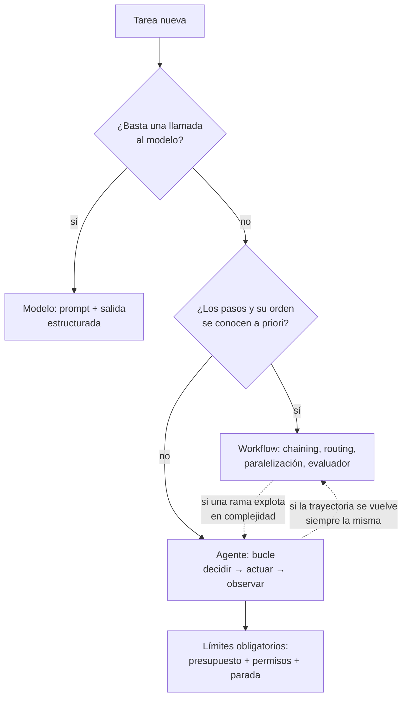

# 112 — De modelo y automatización a agente

> [← Clase anterior](../../../classes/part-08-retrieval-context-memory-and-knowledge/111-proyecto-rag-productivo-y-auditable/README.md) · [Índice de la parte](../README.md) · [Clase siguiente →](../../../classes/part-09-ai-agent-engineering/113-anatomia-instrucciones-herramientas-estado-y-salida/README.md)

**Parte:** 09 — Ingeniería de agentes de IA  
**Nivel:** avanzado · **Horas estimadas:** 6  
**Laboratorio:** `agent` · **Estado:** `EXECUTABLE_CORE`

## 🎯 Propósito

Comprender **de modelo y automatización a agente** dentro de la evolución de la inteligencia
artificial, implementar un experimento mínimo verificable y distinguir qué parte
constituye evidencia frente a una afirmación todavía no comprobada.

## 📚 Resultados de aprendizaje

Al finalizar podrás:

1. Explicar de modelo y automatización a agente usando los conceptos `modelo`, `workflow`, `autonomía`, `objetivos`.
2. Ejecutar el laboratorio con una semilla explícita y revisar su contrato JSON.
3. Identificar al menos un supuesto, una limitación y un riesgo de aplicación.
4. Comparar el enfoque con la etapa anterior de la ruta de aprendizaje.
5. Producir una evidencia reproducible y una conclusión que no exceda los datos.

## 🧩 Conceptos centrales

`modelo`, `workflow`, `autonomía`, `objetivos`

## 🗺️ Ubicación en el mapa de la IA

Esta clase abre la ingeniería de agentes: hasta la parte 08 el modelo de lenguaje era una
función que se llama una vez (o dentro de un pipeline RAG fijo); aquí se convierte en el
componente de decisión de un sistema que **elige sus propios pasos** para alcanzar un
objetivo. La distinción modelo → workflow → agente que se establece aquí gobierna todas las
clases siguientes: anatomía (113), ciclo ReAct (114), planificación (115) y los controles de
seguridad, presupuesto y evaluación que un sistema autónomo exige (116-119).

## 🧰 El mapa de las ingenierías de IA

Entre 2024 y 2026 la industria consolidó, bajo el paraguas de **agent engineering**, un
conjunto de sub-disciplinas con nombre propio. Este programa las enseña todas, en muchos
casos antes de que tuvieran nombre; esta tabla traduce el vocabulario 2026 al temario para
que puedas conversar con la industria sin perderte:

| Disciplina (término 2026) | Qué diseña | Dónde se enseña aquí |
|---|---|---|
| **Prompt engineering** | La instrucción de una llamada individual | Parte 06 · clase 155 (gestión y versionado) |
| **Context engineering** | Qué tokens entran a la ventana en cada paso: el menor conjunto de alta señal | Clases 106, 115, 118 |
| **Harness engineering** | La capa determinista que valida, autoriza, ejecuta y registra cada acción propuesta por el modelo (**Agente = Modelo + Harness**) | Clases 110, 113, 116-118 |
| **Loop engineering** | El bucle decidir → actuar → observar → verificar y sus condiciones de parada | Clases 111-112 |
| **Graph / flow engineering** | El control de flujo como grafo explícito de estados con aristas condicionales, en vez de bucle imperativo | Clases 121-125 |
| **Memory engineering** | Qué se persiste entre sesiones, cómo se recupera y cómo se mide | Clases 105, 115, 127 |
| **Eval engineering** | Evaluaciones como gate de despliegue (*evaluation-driven development*) | Clases 119, 151, 157-158 |
| **Spec-driven development** | Especificaciones ejecutables como contrato entre humano y agente de código | Clases 110, 175 |
| **AgentOps** | Observabilidad, gobernanza, registros de skills y personas de agente en operación | Parte 12 · clases 150, 166 |

Dos advertencias. Primera: los nombres cambian más rápido que las prácticas — "harness",
"loop" y "graph engineering" describen capas de un mismo sistema, no tecnologías rivales.
Segunda: la ecuación **Agente = Modelo + Harness** implica que la mayoría de los fallos de
producción no son fallos del modelo sino del arnés que lo rodea; por eso este programa
dedica más clases al arnés (110-119) que al modelo.

## 📖 Fundamentos

### 🤖 Definición operativa de agente

AIMA (cap. 2) define agente como *cualquier entidad que percibe su entorno mediante sensores
y actúa sobre él mediante actuadores*, evaluada por una **medida de desempeño** sobre las
consecuencias de sus acciones. Trasladado a sistemas con LLM, la definición operativa que
usa este programa es:

```text
agente = LLM que, en un bucle, decide QUÉ acción ejecutar a continuación
         (incluida la de terminar), observa el resultado real de esa acción
         y usa esa observación para decidir el siguiente paso,
         al servicio de un objetivo declarado y bajo límites explícitos.
```

Los cuatro componentes son necesarios: **objetivo** (qué cuenta como éxito), **acciones**
(herramientas con efectos verificables), **observación** (el entorno responde y esa
respuesta entra al contexto) y **bucle de decisión** (el control de flujo lo elige el
modelo, no un grafo escrito a mano).

### 📊 Los tres regímenes: modelo, workflow, agente

- **Modelo (llamada única):** entrada → LLM → salida. No hay acciones ni entorno. El control
  de flujo es trivial: una invocación. Ejemplos: clasificar un ticket, resumir un documento.
- **Workflow (automatización orquestada):** el LLM ocupa casillas dentro de un grafo de
  pasos **escrito por el ingeniero**: cadenas (prompt chaining), enrutamiento (routing),
  paralelización, evaluador-optimizador. El orden y las ramas están decididos de antemano;
  el modelo rellena contenido, no decide la estructura. Anthropic (*Building effective
  agents*) recomienda este régimen siempre que el problema lo permita: es más barato,
  más predecible y más fácil de depurar.
- **Agente:** el LLM decide dinámicamente qué herramienta invocar, con qué argumentos,
  cuántas veces y cuándo detenerse. La trayectoria no está escrita en ningún grafo: emerge
  de la interacción con el entorno. Se justifica cuando el número de pasos y su orden **no
  se conocen a priori** (depurar un error, investigar una pregunta abierta, operar una UI).

### 🎚️ Espectro de autonomía

La autonomía no es binaria; es un dial con al menos estos niveles:

```text
L0  Modelo puro               sin acciones; solo texto
L1  Workflow con LLM          pasos fijos; el modelo rellena casillas
L2  Router                    el modelo elige UNA rama de un menú cerrado
L3  Agente acotado            bucle libre, pero con herramientas de solo lectura
                              o bajo aprobación humana para cada efecto
L4  Agente con efectos        ejecuta acciones que modifican el entorno,
                              con presupuesto, permisos y auditoría
L5  Autonomía extendida       objetivos de largo plazo, memoria persistente,
                              delegación en sub-agentes (parte de investigación abierta)
```

Cada nivel añade capacidad y, simétricamente, superficie de fallo: a mayor autonomía, más
importan los límites (presupuestos, clase 121; permisos, clase 119; aprobaciones, clase 120).

### 🧭 Racionalidad limitada por el objetivo declarado

Un agente es **racional** si maximiza su medida de desempeño dada la evidencia disponible
(AIMA). En agentes LLM la medida de desempeño es el objetivo declarado en las instrucciones,
y ahí vive el riesgo central: un objetivo mal especificado se optimiza literalmente
("cierra todos los tickets" → cerrarlos sin resolverlos). Por eso la definición operativa
exige objetivo **verificable** — un predicado sobre el estado del entorno, no una frase
ambigua — y condición de parada explícita.

## 🧮 Ejemplo trabajado

El laboratorio ejecuta el caso mínimo que ya es agente y no workflow. Objetivo declarado:
*"verificar estado y sumar 7 + 5"* — éxito ⇔ `healthy == true` y `sum == 12` en el estado
final. Herramientas: `status()` y `sum(left, right)`.

| Paso | Decisión (acción) | Observación del entorno | Estado del objetivo |
|---|---|---|---|
| 1 | `status()` | `{"service": "demo", "healthy": true}` | healthy ✓, sum pendiente |
| 2 | `sum(left=7, right=5)` | `12` | healthy ✓, sum ✓ |
| 3 | **terminar** (ambas condiciones verificadas) | — | éxito |

Dos propiedades separan esto de un script: (a) la condición de parada se evalúa contra
**observaciones**, no contra "ya ejecuté mis pasos" — si `status()` devolviera
`healthy: false`, el bucle no terminaría en éxito; (b) cada elemento de `trace` conserva
la acción con sus argumentos y la observación literal, de modo que un tercero puede
auditar por qué el agente concluyó lo que concluyó. La limitación declarada por el
laboratorio ("el plan es determinista") marca exactamente lo que falta para el caso
general: aquí la política de decisión está cableada; en un agente LLM la elige el modelo
en cada iteración, con la incertidumbre que eso introduce.

## 📊 Propiedades y comparación

| Propiedad | Modelo (1 llamada) | Workflow | Agente |
|---|---|---|---|
| Control de flujo | trivial | grafo escrito a mano | lo decide el modelo por iteración |
| Pasos conocidos a priori | sí (uno) | sí | no |
| Costo por tarea | mínimo y fijo | acotado y predecible | variable, requiere presupuesto |
| Depuración | comparar entrada/salida | inspeccionar cada nodo | reconstruir la trayectoria completa |
| Riesgo operacional | bajo | medio (efectos previstos) | alto (efectos elegidos en runtime) |
| Cuándo elegirlo | tarea de un paso | proceso repetible y estable | pasos y orden desconocidos a priori |



Las flechas punteadas importan: un agente cuya trayectoria se estabiliza debe *degradarse*
a workflow (más barato y predecible), y un workflow con ramas explosivas puede ceder esa
rama a un agente.

## ⚠️ Errores conceptuales frecuentes

1. **"Le puse herramientas al modelo, ya es un agente."** Sin bucle de decisión sobre
   observaciones no hay agencia: una llamada con function calling que ejecuta una tool y
   devuelve texto es un modelo con acceso a funciones (L1-L2 del espectro).
2. **"Agente es mejor que workflow."** Es más caro, más lento y más difícil de auditar.
   La recomendación de la literatura de ingeniería (Anthropic, 2024) es explícita: usar la
   solución más simple que resuelva la tarea, y eso casi siempre es un workflow.
3. **"El agente entiende el objetivo."** El agente optimiza el texto del objetivo tal como
   quedó escrito. Si el éxito no es un predicado verificable sobre el entorno, el sistema
   puede declarar victoria sin haberla conseguido.
4. **"La autonomía elimina la supervisión."** Es al revés: cada nivel del espectro añade
   requisitos de control (límites de pasos, permisos, aprobación humana). Autonomía sin
   contención no es un nivel superior; es un incidente pendiente.
5. **"El bucle termina solo."** La terminación es una decisión de diseño: condición de éxito
   verificable + presupuesto máximo de pasos. Sin ambas, el agente puede iterar
   indefinidamente o detenerse antes de tiempo sin que nadie lo note.

## 🚀 Del aprendizaje a la operación

El laboratorio usa una política determinista y dos herramientas puras; un agente real
sustituye esa política por un LLM (no determinista, falible) y herramientas con efectos
sobre sistemas vivos. El salto exige: telemetría de cada iteración del bucle (clase 121),
matriz de permisos por herramienta (clase 119), aprobación humana para acciones
irreversibles (clase 120) y un conjunto de evaluación de trayectorias que detecte
regresiones cuando cambie el modelo o el prompt (clase 122). Sin esas cuatro piezas, el
espectro de autonomía se recorre solo de palabra.

## 🧪 Laboratorio

```bash
python lab.py
```

El laboratorio llama a `ai_evolution.labs.run_lab("agent")`. Esta
decisión evita 183 implementaciones divergentes: cada clase tiene un entrypoint
propio, pero los motores didácticos se prueban como una biblioteca común.

### 🔍 Evidencia esperada

- tipo de laboratorio y semilla;
- entradas o decisiones observables;
- resultado estructurado;
- lista `evidence` con hechos que pueden inspeccionarse;
- lista `limitations` que impide presentar la demo como producción.

## 📓 Notebooks

- [📓 `notebook.ipynb`](notebook.ipynb): recorrido guiado con la materia resumida.
- [✍️ `notebook_student.ipynb`](notebook_student.ipynb): ejercicios para resolver.
- [✅ `notebook_solution.ipynb`](notebook_solution.ipynb): solución de referencia explicada.

## 📝 Evaluación

| Criterio | Peso |
|---|---:|
| Comprensión conceptual | 25 % |
| Ejecución reproducible | 25 % |
| Interpretación basada en evidencia | 25 % |
| Riesgos, límites y mejora propuesta | 25 % |

Consulta [assessment.md](assessment.md) para preguntas y criterio de aceptación.

## ⚠️ Errores comunes

| Síntoma | Causa probable | Corrección |
|---|---|---|
| El código corre, pero no hay conclusión | Se confundió ejecución con aprendizaje | Explica qué demuestra y qué no demuestra |
| El resultado cambia sin explicación | No se registró semilla o configuración | Conserva semilla, versión y parámetros |
| Se promete uso real | Se extrapoló desde una demo educativa | Declara entorno, datos, límites y revisión humana |
| Se copia una métrica aislada | No existe baseline ni costo de error | Añade comparación y criterio de decisión |

## ❓ Preguntas frecuentes

**¿Debo usar una API comercial?**  
No. El núcleo funciona localmente. Las extensiones LIVE se documentan por separado.

**¿El laboratorio representa una implementación industrial?**  
No por sí solo. Enseña el contrato y el patrón; producción exige integración,
seguridad, observabilidad, pruebas y operación.

**¿Dónde profundizo?**  
Revisa las especializaciones enlazadas en el README raíz y la ruta siguiente.

## 🔗 Referencias

- [Russell y Norvig — *Artificial Intelligence: A Modern Approach* (4e), cap. 2 "Intelligent Agents" (agente, entorno, medida de desempeño, racionalidad)](https://aima.cs.berkeley.edu/)
- [Anthropic Engineering — "Building effective agents" (workflows vs agents, cuándo usar cada uno)](https://www.anthropic.com/engineering/building-effective-agents)
- [Yao et al. (2022), "ReAct: Synergizing Reasoning and Acting in Language Models", arXiv:2210.03629](https://arxiv.org/abs/2210.03629)
- [Schick et al. (2023), "Toolformer: Language Models Can Teach Themselves to Use Tools", arXiv:2302.04761](https://arxiv.org/abs/2302.04761)
- [Anthropic — documentación oficial de agentes y herramientas](https://docs.claude.com)
- [LangGraph — Overview (grafos de control para workflows y agentes)](https://docs.langchain.com/oss/python/langgraph/overview)
- [OpenAI — "Harness engineering: leveraging Codex in an agent-first world" (2026)](https://openai.com/index/harness-engineering/)
- [Anthropic Engineering — "Effective context engineering for AI agents"](https://www.anthropic.com/engineering/effective-context-engineering-for-ai-agents)

---

## ⬅️ Clase anterior

[111 — Proyecto: RAG productivo y auditable](../../part-08-retrieval-context-memory-and-knowledge/111-proyecto-rag-productivo-y-auditable/README.md)

## ➡️ Siguiente clase

[113 — Anatomía: instrucciones, herramientas, estado y salida](../../part-09-ai-agent-engineering/113-anatomia-instrucciones-herramientas-estado-y-salida/README.md)
