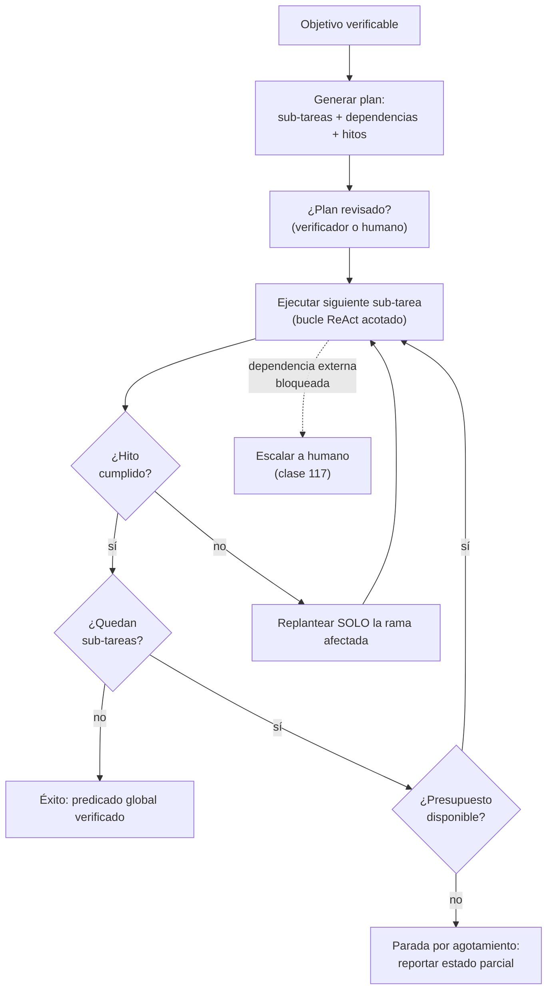

# 112 — Planificación y descomposición de tareas

> [← Clase anterior](../../../classes/part-09-ai-agent-engineering/111-ciclo-react-y-observacion-del-entorno/README.md) · [Índice de la parte](../README.md) · [Clase siguiente →](../../../classes/part-09-ai-agent-engineering/113-herramientas-tipadas-y-efectos-laterales/README.md)

**Parte:** 09 — Ingeniería de agentes de IA  
**Nivel:** avanzado · **Horas estimadas:** 6  
**Laboratorio:** `workflow` · **Estado:** `EXECUTABLE_CORE`

## 🎯 Propósito

Comprender **planificación y descomposición de tareas** dentro de la evolución de la inteligencia
artificial, implementar un experimento mínimo verificable y distinguir qué parte
constituye evidencia frente a una afirmación todavía no comprobada.

## 📚 Resultados de aprendizaje

Al finalizar podrás:

1. Explicar planificación y descomposición de tareas usando los conceptos `planning`, `decomposition`, `milestones`, `stop`.
2. Ejecutar el laboratorio con una semilla explícita y revisar su contrato JSON.
3. Identificar al menos un supuesto, una limitación y un riesgo de aplicación.
4. Comparar el enfoque con la etapa anterior de la ruta de aprendizaje.
5. Producir una evidencia reproducible y una conclusión que no exceda los datos.

## 🧩 Conceptos centrales

`planning`, `decomposition`, `milestones`, `stop`

## 🗺️ Ubicación en el mapa de la IA

La planificación es uno de los problemas fundacionales de la IA (STRIPS, 1971, ya
formulaba estados, acciones y metas), y reaparece en los agentes LLM con otra forma: en
lugar de buscar en un espacio de estados formal, el modelo genera y revisa planes en
lenguaje natural. Se apoya en el ciclo ReAct de la clase 111 (el plan orienta los
thoughts) y habilita todo lo que sigue: sin descomposición no hay presupuesto asignable
(118), ni puntos de aprobación humana bien colocados (117), ni evaluación por hitos (119).

## 📖 Fundamentos

### 🧭 Definiciones

- **Plan:** secuencia (o grafo) de sub-tareas propuesta *antes* de actuar, con un estado
  final que satisface el objetivo. En agentes LLM es un artefacto de texto revisable.
- **Descomposición:** partir una tarea en sub-tareas con tres propiedades: cada una es
  **verificable** por sí misma, sus **dependencias** están explícitas, y la composición
  de todas implica el objetivo (sin huecos ni solapes).
- **Hito (milestone):** punto de control observable entre sub-tareas — un predicado
  sobre el entorno ("los tests pasan", "el archivo existe") que confirma progreso real.
- **Condición de parada:** predicado de éxito global + presupuesto máximo. Un plan sin
  parada definida no es un plan; es una intención.

### 🔀 Planificar-luego-actuar vs planificación entrelazada

Dos estrategias dominan en agentes LLM:

1. **Plan-then-execute:** el modelo genera el plan completo y luego lo ejecuta paso a
   paso. Ventajas: el plan puede revisarse (por un humano o un verificador) antes de
   tocar el entorno; el costo es predecible. Riesgo: el mundo cambia o una observación
   invalida un supuesto, y el plan queda obsoleto.
2. **Planificación entrelazada (interleaved):** el plan se revisa tras cada observación
   (el estilo ReAct). Ventaja: reacciona a lo imprevisto. Riesgo: perder el rumbo global
   optimizando pasos locales.

La práctica de ingeniería combina ambas: plan explícito inicial + replanteo *solo*
cuando una observación contradice un supuesto del plan (replan-on-failure), no en cada
paso. El plan vive en el contexto como lista de sub-tareas con estado
(`pendiente / en curso / hecha / bloqueada`).

```text
plan   = LLM(objetivo)                      # lista de sub-tareas verificables
para cada sub_tarea en orden topológico:
    resultado = ejecutar_con_react(sub_tarea)   # bucle 111 acotado a la sub-tarea
    si hito(sub_tarea) no se cumple:
        plan = replan(plan, observaciones)      # revisar, no improvisar
    si presupuesto agotado: parar y reportar estado parcial
```

### 🧱 Criterios de una buena descomposición

- **Verificabilidad por sub-tarea:** cada hito es un predicado observable, no una frase
  ("mejorar X" no es hito; "la función Y pasa los 3 tests nuevos" sí).
- **Acoplamiento mínimo:** las sub-tareas comparten lo menos posible; las dependencias
  reales se declaran como aristas, lo que habilita paralelización segura.
- **Granularidad presupuestable:** cada sub-tarea cabe en un presupuesto de pasos/tokens
  estimable; si no puedes estimarla, descompónla otra vez.
- **Fallo local contenible:** si una sub-tarea falla, el plan indica qué se conserva y
  qué se re-hace — no se descarta todo el progreso.

### 🛑 La parada como decisión de diseño

Hay tres formas legítimas de terminar: **éxito** (predicado global verificado),
**agotamiento** (presupuesto consumido → reportar estado parcial y qué falta) y
**bloqueo** (una dependencia externa impide avanzar → escalar a humano, clase 117).
Diseñar la parada incluye decidir qué se reporta en cada caso; un agente que solo sabe
terminar en éxito oculta sus fallos.

## 🧮 Ejemplo trabajado

Objetivo: *"publicar el informe mensual de ventas"*. Descomposición con dependencias e
hitos verificables:

| # | Sub-tarea | Depende de | Hito verificable | Presupuesto |
|---|---|---|---|---|
| 1 | Extraer ventas del mes de la base | — | CSV con >0 filas y columnas esperadas | 2 pasos |
| 2 | Validar totales contra contabilidad | 1 | diferencia < 0,5 % documentada | 3 pasos |
| 3 | Generar tablas y gráficos | 1 | 4 archivos PNG/tabla existen | 4 pasos |
| 4 | Redactar resumen ejecutivo | 2, 3 | borrador ≤ 1 página con 3 cifras clave | 3 pasos |
| 5 | Aprobación humana | 4 | visto bueno registrado | bloqueante |
| 6 | Publicar en el portal | 5 | URL responde 200 con el contenido | 2 pasos |

Ejecución simulada: la sub-tarea 2 observa una diferencia de 2,1 % (> 0,5 %) → el hito
falla → replanteo local: se inserta la sub-tarea 2b "identificar transacciones
discrepantes" sin tocar 3 (que depende solo de 1 y puede avanzar en paralelo). El plan
global sobrevive; solo se revisó la rama afectada. Nótese que 5 es un hito **bloqueante**
por diseño: ningún presupuesto autoriza saltárselo. El laboratorio `workflow` muestra la
versión mínima: transiciones `received → validated → waiting_approval → completed`, donde
`completed` es inalcanzable sin pasar por la aprobación.

## 📊 Propiedades y comparación

| Propiedad | Sin plan (ReAct puro) | Plan-then-execute | Entrelazado con replanteo |
|---|---|---|---|
| Revisable antes de actuar | no | sí (plan completo) | parcial (plan inicial) |
| Reacciona a lo imprevisto | sí, paso a paso | no (plan rígido) | sí, por hitos |
| Riesgo de perder el rumbo global | alto en tareas largas | bajo | medio |
| Costo de planificación | 0 | 1 llamada grande | inicial + replanteos |
| Presupuesto asignable por partes | no | sí | sí |
| Adecuado para | tareas cortas (<5 pasos) | entorno estable | tareas largas en entorno cambiante |



## ⚠️ Errores conceptuales frecuentes

1. **"El plan del LLM es el plan de STRIPS."** No: no hay garantía formal de completitud
   ni consistencia; es una hipótesis en texto que exige hitos verificables para
   detectar sus huecos durante la ejecución.
2. **"Descomponer es hacer una lista de pasos."** Una lista sin hitos verificables ni
   dependencias explícitas no permite detectar el fallo de una parte ni paralelizar;
   es narración, no descomposición.
3. **"Replantear en cada paso es más adaptativo."** Replantear constantemente destruye
   la coherencia global y multiplica el costo; el disparador correcto es la
   contradicción entre observación y supuesto del plan.
4. **"Si una sub-tarea falla, el plan fracasó."** El valor de la descomposición es
   exactamente contener el fallo: se replantea la rama afectada y se conserva el
   progreso verificado del resto.
5. **"La parada por presupuesto es un fallo del agente."** Es un resultado de diseño
   correcto: estado parcial + qué falta + por qué, es mejor salida que un bucle
   infinito o un éxito fingido.

## 🚀 Del aprendizaje a la operación

El laboratorio ejecuta una máquina de estados con transiciones fijas; un planificador
real debe generar el plan con un LLM, validarlo (¿hitos verificables?, ¿dependencias
acíclicas?), persistirlo para sobrevivir a reinicios (clase 115), asignar presupuesto
por sub-tarea (clase 118) y colocar los hitos bloqueantes de aprobación donde el costo
del error lo exige (clase 117). La evaluación por trayectorias (clase 119) es la que
revela si los planes generados se cumplen o se abandonan en silencio.

## 🧪 Laboratorio

```bash
python lab.py
```

El laboratorio llama a `ai_evolution.labs.run_lab("workflow")`. Esta
decisión evita 180 implementaciones divergentes: cada clase tiene un entrypoint
propio, pero los motores didácticos se prueban como una biblioteca común.

### 🔍 Evidencia esperada

- tipo de laboratorio y semilla;
- entradas o decisiones observables;
- resultado estructurado;
- lista `evidence` con hechos que pueden inspeccionarse;
- lista `limitations` que impide presentar la demo como producción.

## 📓 Notebooks

- [📓 `notebook.ipynb`](notebook.ipynb): recorrido guiado con la materia resumida.
- [✍️ `notebook_student.ipynb`](notebook_student.ipynb): ejercicios para resolver.
- [✅ `notebook_solution.ipynb`](notebook_solution.ipynb): solución de referencia explicada.

## 📝 Evaluación

| Criterio | Peso |
|---|---:|
| Comprensión conceptual | 25 % |
| Ejecución reproducible | 25 % |
| Interpretación basada en evidencia | 25 % |
| Riesgos, límites y mejora propuesta | 25 % |

Consulta [assessment.md](assessment.md) para preguntas y criterio de aceptación.

## ⚠️ Errores comunes

| Síntoma | Causa probable | Corrección |
|---|---|---|
| El código corre, pero no hay conclusión | Se confundió ejecución con aprendizaje | Explica qué demuestra y qué no demuestra |
| El resultado cambia sin explicación | No se registró semilla o configuración | Conserva semilla, versión y parámetros |
| Se promete uso real | Se extrapoló desde una demo educativa | Declara entorno, datos, límites y revisión humana |
| Se copia una métrica aislada | No existe baseline ni costo de error | Añade comparación y criterio de decisión |

## ❓ Preguntas frecuentes

**¿Debo usar una API comercial?**  
No. El núcleo funciona localmente. Las extensiones LIVE se documentan por separado.

**¿El laboratorio representa una implementación industrial?**  
No por sí solo. Enseña el contrato y el patrón; producción exige integración,
seguridad, observabilidad, pruebas y operación.

**¿Dónde profundizo?**  
Revisa las especializaciones enlazadas en el README raíz y la ruta siguiente.

## 🔗 Referencias

- [Russell y Norvig — *AIMA* (4e), caps. sobre planificación clásica (STRIPS, espacio de estados, metas)](https://aima.cs.berkeley.edu/)
- [Fikes y Nilsson (1971), "STRIPS: A New Approach to the Application of Theorem Proving to Problem Solving", DOI:10.1016/0004-3702(71)90010-5 (formulación fundacional de la planificación)](https://doi.org/10.1016/0004-3702%2871%2990010-5)
- [Yao et al. (2022), "ReAct" arXiv:2210.03629 (planificación entrelazada con actuación)](https://arxiv.org/abs/2210.03629)
- [Wang et al. (2023), "Plan-and-Solve Prompting", arXiv:2305.04091 (plan-then-execute con LLMs)](https://arxiv.org/abs/2305.04091)
- [Anthropic Engineering — "Building effective agents" (orquestador-trabajadores, evaluador-optimizador)](https://www.anthropic.com/engineering/building-effective-agents)
- [LangGraph — Overview (grafos de control con estado para planes ejecutables)](https://docs.langchain.com/oss/python/langgraph/overview)

---

## ⬅️ Clase anterior

[111 — Ciclo ReAct y observación del entorno](../../part-09-ai-agent-engineering/111-ciclo-react-y-observacion-del-entorno/README.md)

## ➡️ Siguiente clase

[113 — Herramientas tipadas y efectos laterales](../../part-09-ai-agent-engineering/113-herramientas-tipadas-y-efectos-laterales/README.md)
