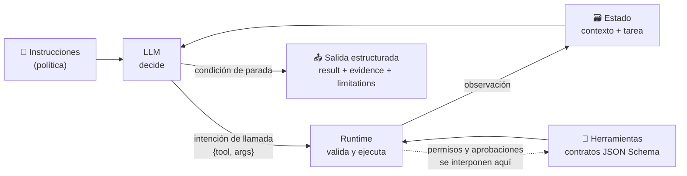

# 113 — Anatomía: instrucciones, herramientas, estado y salida

> [← Clase anterior](../../../classes/part-09-ai-agent-engineering/112-de-modelo-y-automatizacion-a-agente/README.md) · [Índice de la parte](../README.md) · [Clase siguiente →](../../../classes/part-09-ai-agent-engineering/114-ciclo-react-y-observacion-del-entorno/README.md)

**Parte:** 09 — Ingeniería de agentes de IA  
**Nivel:** avanzado · **Horas estimadas:** 6  
**Laboratorio:** `agent` · **Estado:** `EXECUTABLE_CORE`

## 🎯 Propósito

Comprender **anatomía: instrucciones, herramientas, estado y salida** dentro de la evolución de la inteligencia
artificial, implementar un experimento mínimo verificable y distinguir qué parte
constituye evidencia frente a una afirmación todavía no comprobada.

## 📚 Resultados de aprendizaje

Al finalizar podrás:

1. Explicar anatomía: instrucciones, herramientas, estado y salida usando los conceptos `instructions`, `tools`, `state`, `output`.
2. Ejecutar el laboratorio con una semilla explícita y revisar su contrato JSON.
3. Identificar al menos un supuesto, una limitación y un riesgo de aplicación.
4. Comparar el enfoque con la etapa anterior de la ruta de aprendizaje.
5. Producir una evidencia reproducible y una conclusión que no exceda los datos.

## 🧩 Conceptos centrales

`instructions`, `tools`, `state`, `output`

## 🗺️ Ubicación en el mapa de la IA

La clase anterior definió *qué* es un agente; esta define *de qué está hecho*. Toda
implementación seria — desde un script con function calling hasta los SDK de agentes de
Anthropic, OpenAI o LangGraph — se descompone en las mismas cuatro piezas: instrucciones,
herramientas, estado y salida estructurada. Dominar esta anatomía es prerequisito para el
ciclo ReAct (114), los contratos de herramientas (116) y la taxonomía de artefactos (117):
cada una de esas clases profundiza en una pieza de las que aquí se nombran.

## 📖 Fundamentos

### 📜 Instrucciones: la política del agente

Las instrucciones (system prompt) definen la **política**: objetivo, restricciones, estilo
de decisión y condiciones de parada. No son decoración; son la especificación ejecutable
del comportamiento. Una instrucción operativa tiene cuatro bloques:

```text
1. ROL Y OBJETIVO    qué es el agente y qué cuenta como éxito (predicado verificable)
2. RESTRICCIONES     qué no puede hacer nunca, qué requiere aprobación
3. PROCEDIMIENTO     heurísticas de decisión: cuándo usar cada herramienta,
                     cuándo pedir ayuda, cuándo rendirse
4. FORMATO DE SALIDA contrato del resultado final (esquema, campos obligatorios)
```

Regla práctica: todo lo que el ingeniero no escriba en las instrucciones queda a criterio
del modelo, y ese criterio cambia con cada versión del modelo.

### 🔧 Herramientas: el repertorio de acciones

Una herramienta es una función expuesta al modelo con un **contrato**: nombre, descripción,
esquema de parámetros (JSON Schema) y tipo de retorno. El modelo no ejecuta nada: **emite
una intención de llamada** (`{"tool": "sum", "args": {"left": 7, "right": 5}}`) y el
runtime la valida, la ejecuta y devuelve la observación. Esta separación intención/ejecución
es la que permite interponer validación, permisos y aprobaciones. Dos categorías con
tratamiento distinto:

- **Lectura** (consultar, buscar, medir): reintentables, componibles, baratas de autorizar.
- **Efecto** (escribir, enviar, borrar): modifican el entorno; exigen idempotencia o
  confirmación (clase 116) y permisos explícitos (clase 119).

### 🗃️ Estado: lo que el agente sabe en el paso t

El estado de un agente LLM tiene tres capas con vidas distintas:

```text
contexto de la conversación   la ventana del modelo: instrucciones + historial
                              de acciones y observaciones (volátil, cara, limitada)
estado de la tarea            variables estructuradas del run: plan, progreso,
                              presupuesto restante, resultados intermedios
memoria persistente           lo que sobrevive entre runs: archivos, bases de
                              datos, notas (clase 118)
```

El error de diseño más común es confundir las capas: meter todo al contexto (se agota la
ventana y el costo crece por token) o no registrar el estado de la tarea (imposible
reanudar ni auditar). El estado estructurado del run es, además, la fuente para los
checkpoints y la observabilidad.

### 📤 Salida estructurada: el contrato de resultado

Un agente cuyo producto final es prosa libre no se puede componer ni verificar
mecánicamente. La salida estructurada fija un esquema — el laboratorio usa
`{kind, seed, result, evidence, limitations}` — con dos campos que este programa trata
como obligatorios:

- **`evidence`:** hechos inspeccionables que sostienen la conclusión (qué se observó).
- **`limitations`:** qué NO demuestra el resultado (frontera de validez).

La validación del esquema debe ser mecánica (parseo + verificación de claves y tipos), y
el fallo de validación debe tratarse como cualquier otro error observado: se reintenta o
se reporta, nunca se acepta en silencio.

### 🔩 Cómo encajan las piezas

En cada iteración del bucle: las **instrucciones** condicionan la decisión; el modelo lee
el **estado** (contexto + tarea) y emite una intención sobre el repertorio de
**herramientas**; el runtime ejecuta y anexa la observación al estado; al terminar, el
agente materializa la **salida estructurada**. Cualquier framework de agentes es una
implementación opinada de este esqueleto.

### 🛡️ El harness: la pieza que envuelve a las otras cuatro

La industria bautizó en 2025-2026 como **harness engineering** al diseño de la capa
determinista que rodea al modelo: el runtime que valida cada intención de llamada contra
su contrato, la autoriza contra la matriz de permisos, la ejecuta, registra la observación
y decide qué entra de vuelta al contexto. La ecuación de trabajo es:

```text
Agente = Modelo + Harness
```

y su corolario, confirmado por la experiencia de producción: la mayoría de los agentes no
fallan porque el modelo sea débil, sino porque el harness es frágil, inseguro o
impredecible. Esta clase describe la anatomía del harness sin nombrarlo; las clases 113
(contratos), 116 (permisos), 117 (aprobaciones) y 118 (presupuestos) construyen sus
componentes uno a uno. Dos principios de diseño de la literatura reciente: construir sobre
herramientas y formatos que el modelo ya conoce (menos instrucción, menos error), y
**retirar supuestos del harness a medida que mejora la capacidad del modelo** — un harness
diseñado para un modelo de 2024 sobre-restringe a uno de 2026.

## 🧮 Ejemplo trabajado

Anatomía completa del agente del laboratorio, pieza por pieza:

| Pieza | Valor concreto en el laboratorio |
|---|---|
| Instrucciones (implícitas en el runner) | objetivo "verificar estado y sumar 7 + 5"; parar cuando ambas condiciones se verifiquen |
| Herramientas | `status()` → dict de salud (lectura); `sum(left, right)` → entero (pura) |
| Estado de la tarea | `trace` acumulada + condiciones verificadas (`healthy`, `sum`) |
| Salida estructurada | `{kind: "agent", seed, result: {objective, trace, final}, evidence, limitations}` |

Ejecución paso a paso: el estado inicial es `{healthy: ?, sum: ?}`. Iteración 1: la
política elige `status()` (condición pendiente más barata); observación
`{"healthy": true}`; el estado pasa a `{healthy: ✓, sum: ?}`. Iteración 2: elige
`sum(7, 5)`; observación `12`; estado `{healthy: ✓, sum: ✓}`. La condición de parada se
cumple y el runner materializa `final: {healthy: true, sum: 12}` más las dos listas del
contrato. Verificación mecánica de la salida: claves `{kind, seed, result, evidence,
limitations}` presentes, `evidence` no vacía, cada elemento de `trace` con la forma
`{action: {tool, args}, observation}` — todo comprobable con cinco `assert`.

## 📊 Propiedades y comparación

| Pieza | Quién la controla | Cuándo cambia | Fallo típico si falta |
|---|---|---|---|
| Instrucciones | ingeniero (versionadas) | por release | comportamiento a criterio del modelo |
| Herramientas | ingeniero (contratos) | por release | el agente "alucina" capacidades que no tiene |
| Estado del run | runtime | cada iteración | no se puede reanudar, auditar ni cobrar |
| Contexto | runtime + política de resumen | cada iteración | desborde de ventana, costo creciente |
| Salida estructurada | contrato compartido | por release | resultado no componible ni verificable |



## ⚠️ Errores conceptuales frecuentes

1. **"El modelo ejecuta las herramientas."** No: emite intenciones; el runtime ejecuta.
   Confundirlo lleva a diseñar sin punto de interposición para validar o denegar llamadas.
2. **"Más contexto es más estado."** El contexto es una capa del estado, volátil y cara.
   El estado de la tarea (plan, progreso, presupuesto) debe vivir estructurado fuera de la
   ventana, o el agente no es reanudable.
3. **"Las instrucciones son un texto motivacional."** Son la política versionable del
   sistema. Un cambio de una frase puede alterar qué herramientas se usan y cuándo se
   detiene el bucle; se revisan y testean como código.
4. **"La salida estructurada es formateo."** Es el contrato que permite componer el agente
   con otros sistemas y verificar éxito mecánicamente. Sin esquema no hay evals de
   resultado (clase 122).
5. **"Una herramienta más siempre suma."** Cada herramienta amplía la superficie de error
   y de decisión del modelo. Repertorios grandes y solapados degradan la selección; el
   criterio es un repertorio mínimo con contratos nítidos.

## 🚀 Del aprendizaje a la operación

En el laboratorio las cuatro piezas caben en un archivo; en producción cada una se vuelve
un artefacto gestionado: instrucciones versionadas con revisión y tests de regresión,
herramientas con contratos publicados y control de permisos por entorno, estado con
persistencia transaccional y checkpoints reanudables, y salida validada contra esquema en
la frontera de cada consumidor. Falta además lo transversal: telemetría por iteración,
límites de presupuesto y un registro de auditoría que una instrucciones + versión del
modelo + traza con cada resultado emitido.

## 🧪 Laboratorio

```bash
python lab.py
```

El laboratorio llama a `ai_evolution.labs.run_lab("agent")`. Esta
decisión evita 183 implementaciones divergentes: cada clase tiene un entrypoint
propio, pero los motores didácticos se prueban como una biblioteca común.

### 🔍 Evidencia esperada

- tipo de laboratorio y semilla;
- entradas o decisiones observables;
- resultado estructurado;
- lista `evidence` con hechos que pueden inspeccionarse;
- lista `limitations` que impide presentar la demo como producción.

## 📓 Notebooks

- [📓 `notebook.ipynb`](notebook.ipynb): recorrido guiado con la materia resumida.
- [✍️ `notebook_student.ipynb`](notebook_student.ipynb): ejercicios para resolver.
- [✅ `notebook_solution.ipynb`](notebook_solution.ipynb): solución de referencia explicada.

## 📝 Evaluación

| Criterio | Peso |
|---|---:|
| Comprensión conceptual | 25 % |
| Ejecución reproducible | 25 % |
| Interpretación basada en evidencia | 25 % |
| Riesgos, límites y mejora propuesta | 25 % |

Consulta [assessment.md](assessment.md) para preguntas y criterio de aceptación.

## ⚠️ Errores comunes

| Síntoma | Causa probable | Corrección |
|---|---|---|
| El código corre, pero no hay conclusión | Se confundió ejecución con aprendizaje | Explica qué demuestra y qué no demuestra |
| El resultado cambia sin explicación | No se registró semilla o configuración | Conserva semilla, versión y parámetros |
| Se promete uso real | Se extrapoló desde una demo educativa | Declara entorno, datos, límites y revisión humana |
| Se copia una métrica aislada | No existe baseline ni costo de error | Añade comparación y criterio de decisión |

## ❓ Preguntas frecuentes

**¿Debo usar una API comercial?**  
No. El núcleo funciona localmente. Las extensiones LIVE se documentan por separado.

**¿El laboratorio representa una implementación industrial?**  
No por sí solo. Enseña el contrato y el patrón; producción exige integración,
seguridad, observabilidad, pruebas y operación.

**¿Dónde profundizo?**  
Revisa las especializaciones enlazadas en el README raíz y la ruta siguiente.

## 🔗 Referencias

- [Anthropic Engineering — "Building effective agents" (bloques de construcción: augmented LLM, tools, memoria)](https://www.anthropic.com/engineering/building-effective-agents) — uso: referencia consultada en su fuente original
- [Anthropic — documentación oficial: agentes, tool use y salida estructurada](https://docs.claude.com) — uso: referencia consultada en su fuente original
- [Model Context Protocol — especificación (contratos de tools, resources y prompts)](https://modelcontextprotocol.io/) — uso: marco normativo de referencia
- [JSON Schema — especificación oficial (validación de parámetros y salidas)](https://json-schema.org/specification) — uso: marco normativo de referencia
- [Yao et al. (2022), "ReAct: Synergizing Reasoning and Acting in Language Models", arXiv:2210.03629](https://arxiv.org/abs/2210.03629) — uso: fuente primaria del mecanismo estudiado
- [Russell y Norvig — *AIMA* (4e), cap. 2 (estructura de agentes: programa + arquitectura)](https://aima.cs.berkeley.edu/) — uso: desarrollo extendido del tema
- [OpenAI — "Harness engineering: leveraging Codex in an agent-first world" (2026)](https://openai.com/index/harness-engineering/) — uso: referencia consultada en su fuente original
- ["Harness Engineering for Agentic AI Coding Tools: An Exploratory Study", arXiv:2602.14690](https://arxiv.org/abs/2602.14690) — uso: fuente primaria del mecanismo estudiado

<!-- papers:inicio -->

---

## 📜 Papers que fundamentan esta clase

> Bloque generado por `python scripts/link_papers_to_classes.py`. La fuente es [`papers/catalog/papers.json`](../../../papers/catalog/papers.json).

| Paper | Año | Qué desbloqueó | Miniatura |
|---|---:|---|---|
| [P14 · Toolformer: los modelos de lenguaje pueden enseñarse a sí mismos a usar herramientas](../../../papers/foundational/P14_toolformer/README.md) | 2023 | El uso de herramientas se aprende de forma autosupervisada: el criterio de utilidad es la propia pérdida del modelo. | [notebook](../../../notebooks/papers/P14_toolformer.ipynb) |

Cada ficha explica el problema anterior, la matemática mínima, los límites y los errores de atribución más frecuentes. Para leerlas con método: [cómo leer un paper de IA](../../../papers/guides/COMO_LEER_UN_PAPER_DE_IA.md) · [anexos matemáticos](../../../papers/annexes/README.md).
<!-- papers:fin -->
<!-- bibliografia:inicio -->

---

## 📚 Bibliografía de apoyo

> Bloque generado por `python scripts/link_sources_to_classes.py`. Cada obra lleva su localizador verificado en [`sources/bibliography.json`](../../../sources/bibliography.json).

Los papers dicen **de dónde salió** el mecanismo. Estas obras lo **desarrollan** con el espacio que una clase no tiene: teoría completa, demostraciones y ejercicios.

| Obra | Edición | Localizador | Papel en esta clase |
|---|---|---|---|
| Russell, Stuart J. y Norvig, Peter — *Artificial Intelligence: A Modern Approach* | 4.ª · 2020 | [ISBN 9780134610993](https://openlibrary.org/isbn/9780134610993) · [web de la obra](https://aima.cs.berkeley.edu/) | citada en las referencias de esta clase · cap. 2 · obra de referencia de la parte 09 |
| Michael J. Wooldridge — *An Introduction to MultiAgent Systems* | 2009 | [ISBN 9780471496915](https://openlibrary.org/isbn/9780471496915) | obra de referencia de la parte 09 · arquitecturas de agente |

**Normas y documentación oficial que aplica esta clase:** [Model Context Protocol](https://modelcontextprotocol.io) · [JSON Schema](https://json-schema.org/specification)
<!-- bibliografia:fin -->

---

## ⬅️ Clase anterior

[112 — De modelo y automatización a agente](../../part-09-ai-agent-engineering/112-de-modelo-y-automatizacion-a-agente/README.md)

## ➡️ Siguiente clase

[114 — Ciclo ReAct y observación del entorno](../../part-09-ai-agent-engineering/114-ciclo-react-y-observacion-del-entorno/README.md)
