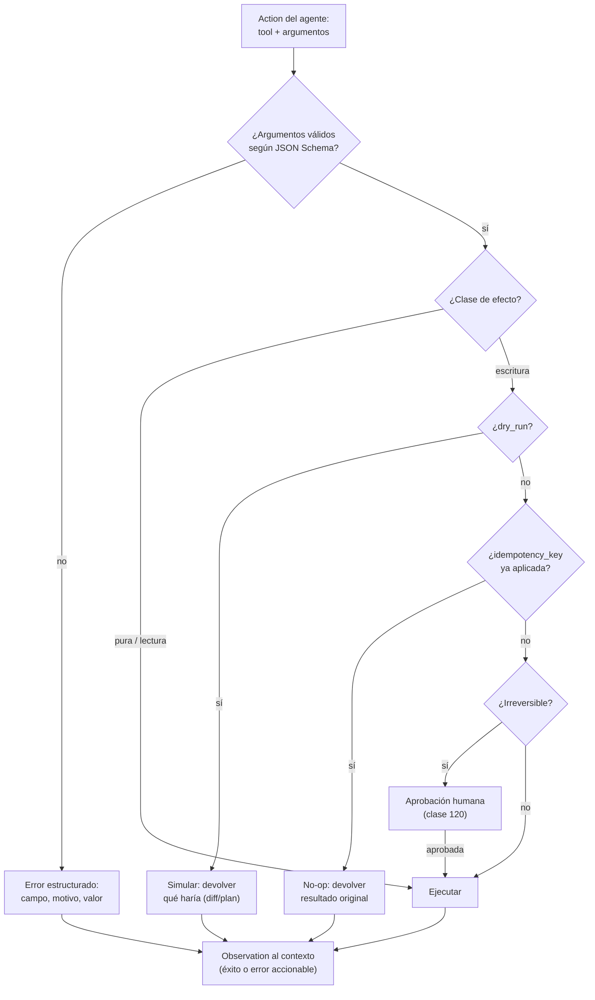

# 116 — Herramientas tipadas y efectos laterales

> [← Clase anterior](../../../classes/part-09-ai-agent-engineering/115-planificacion-y-descomposicion-de-tareas/README.md) · [Índice de la parte](../README.md) · [Clase siguiente →](../../../classes/part-09-ai-agent-engineering/117-prompt-recurso-tool-skill-workflow-y-agente/README.md)

**Parte:** 09 — Ingeniería de agentes de IA  
**Nivel:** avanzado · **Horas estimadas:** 6  
**Laboratorio:** `agent` · **Estado:** `EXECUTABLE_CORE`

## 🎯 Propósito

Comprender **herramientas tipadas y efectos laterales** dentro de la evolución de la inteligencia
artificial, implementar un experimento mínimo verificable y distinguir qué parte
constituye evidencia frente a una afirmación todavía no comprobada.

## 📚 Resultados de aprendizaje

Al finalizar podrás:

1. Explicar herramientas tipadas y efectos laterales usando los conceptos `tool schema`, `side effects`, `idempotencia`, `errores`.
2. Ejecutar el laboratorio con una semilla explícita y revisar su contrato JSON.
3. Identificar al menos un supuesto, una limitación y un riesgo de aplicación.
4. Comparar el enfoque con la etapa anterior de la ruta de aprendizaje.
5. Producir una evidencia reproducible y una conclusión que no exceda los datos.

## 🧩 Conceptos centrales

`tool schema`, `side effects`, `idempotencia`, `errores`

## 🗺️ Ubicación en el mapa de la IA

Las herramientas son el punto donde el texto del modelo se convierte en efectos sobre el
mundo, y por eso su diseño es la decisión de ingeniería más consecuente de un agente.
Toolformer (2023) demostró que los modelos pueden aprender *cuándo* invocar APIs; el
function calling y el Model Context Protocol (MCP) estandarizaron *cómo* declararlas con
JSON Schema. Esta clase toma el bucle ReAct (114) y el plan (115) y les da manos seguras;
los permisos (119) y las aprobaciones (120) se apoyan directamente en la clasificación de
efectos que se define aquí.

## 📖 Fundamentos

### 📝 Herramienta tipada: contrato en tres partes

Una herramienta bien definida es un contrato con tres componentes:

1. **Descripción semántica:** qué hace, cuándo usarla y cuándo NO — es lo que el modelo
   lee para decidir. Una descripción ambigua produce invocaciones erróneas aunque el
   schema sea perfecto.
2. **Schema de entrada (JSON Schema):** tipos, campos obligatorios, rangos y enums. El
   runtime lo valida ANTES de ejecutar: un argumento inválido se rechaza con error
   estructurado, nunca se "interpreta".
3. **Contrato de salida y de error:** qué devuelve en éxito y qué forma tienen los
   fallos. El error es parte de la interfaz: el agente lo observará y decidirá con él.

```json
{
  "name": "transfer_inventory",
  "description": "Mueve unidades de un almacén a otro. NO crea stock: falla si origin no tiene unidades suficientes.",
  "input_schema": {
    "type": "object",
    "properties": {
      "sku":     {"type": "string", "pattern": "^[A-Z]{3}-[0-9]{4}$"},
      "units":   {"type": "integer", "minimum": 1, "maximum": 1000},
      "origin":  {"type": "string", "enum": ["central", "norte", "sur"]},
      "dest":    {"type": "string", "enum": ["central", "norte", "sur"]},
      "dry_run": {"type": "boolean", "default": true}
    },
    "required": ["sku", "units", "origin", "dest"]
  }
}
```

### 💥 Taxonomía de efectos laterales

- **Pura / solo lectura:** no modifica nada (`sum`, `status`, `search`). Reintentable
  sin riesgo; candidata a ejecutarse sin aprobación.
- **Escritura reversible:** modifica estado con vuelta atrás razonable (crear rama,
  editar archivo versionado). Exige registro para poder revertir.
- **Escritura irreversible:** no hay deshacer completo (enviar un correo, borrar sin
  papelera, ejecutar un pago). Candidata obligada a aprobación humana (clase 120).
- **Efecto externo distribuido:** toca sistemas de terceros con sus propios estados
  (APIs de pago, mensajería). Además de irreversible, puede ser no consultable.

### 🔁 Idempotencia: la propiedad que salva reintentos

Una operación es **idempotente** si ejecutarla N veces produce el mismo estado que
ejecutarla una: `f(f(x)) = f(x)`. Importa porque los agentes **reintentan**: un timeout
no dice si la operación se aplicó, y el modelo puede repetir una llamada por error de
razonamiento.

- Idempotentes: `set_price(sku, 10)`, `delete_by_id(42)`, `upsert(key, value)`.
- No idempotentes: `add_units(sku, +5)`, `append(line)`, `send_email(...)`.

Técnica estándar: **clave de idempotencia** — el llamador envía un identificador único
por operación lógica (`idempotency_key`); el servidor registra las claves aplicadas y
convierte los duplicados en no-ops que devuelven el resultado original (así funcionan
las APIs de pago serias).

### 🧪 Dry-run: ensayar el efecto sin producirlo

Un parámetro `dry_run: true` hace que la herramienta valide argumentos, compruebe
precondiciones y devuelva **qué haría** (diff, plan de cambios, costo) sin aplicar
nada. Patrón operativo para efectos de riesgo: el agente ejecuta primero el dry-run,
la observación resultante se evalúa (o se muestra a un humano, clase 120), y solo
entonces se repite con `dry_run: false`. El valor didáctico: convierte un efecto
irreversible en dos pasos, uno observable y uno autorizado.

### 🚨 Errores como parte del contrato

Un error útil para un agente es estructurado y accionable:
`{"error": {"code": "INSUFFICIENT_STOCK", "available": 3, "requested": 10}}` permite al
siguiente thought decidir (reducir unidades, elegir otro origen, escalar). `"error 500"`
no permite nada. Regla: cada herramienta declara sus códigos de error posibles igual
que declara su schema; los errores silenciosos o genéricos ciegan el bucle de la 111.

## 🧮 Ejemplo trabajado

Transferencia de 10 unidades `ABC-1234` de `central` a `norte`, con stock real de 3.

```text
Paso 1  Action: transfer_inventory(sku="ABC-1234", units=10,
                                   origin="central", dest="norte", dry_run=true)
        Obs:    {"would_apply": false,
                 "error": {"code": "INSUFFICIENT_STOCK", "available": 3, "requested": 10}}
        → el dry-run detectó la precondición violada SIN tocar el inventario.

Paso 2  Thought: hay 3 disponibles; el objetivo permite transferencia parcial.
        Action: transfer_inventory(..., units=3, dry_run=true)
        Obs:    {"would_apply": true, "resulting": {"central": 0, "norte": 3}}

Paso 3  Action: transfer_inventory(..., units=3, dry_run=false,
                                   idempotency_key="tx-2026-07-30-ABC-1234-a")
        Obs:    {"applied": true, "resulting": {"central": 0, "norte": 3}}

Paso 4  (timeout de red simulado → el agente reintenta la MISMA llamada
         con la MISMA idempotency_key)
        Obs:    {"applied": false, "duplicate_of": "tx-2026-07-30-ABC-1234-a",
                 "resulting": {"central": 0, "norte": 3}}
        → sin la clave, el reintento habría movido 3 unidades DOS veces.
```

Cuatro mecanismos cooperando: schema (rechazaría `units=0` o un almacén inexistente),
dry-run (ensayo observable), error estructurado (el código `INSUFFICIENT_STOCK` guio el
replanteo) y clave de idempotencia (el reintento fue inofensivo).

## 📊 Propiedades y comparación

| Propiedad | Tool sin tipar (texto libre) | Tool tipada | Tool tipada + dry-run + idempotencia |
|---|---|---|---|
| Validación previa de argumentos | no (parsear y rezar) | sí (JSON Schema) | sí |
| Reintento seguro | no | solo si es pura | sí (clave de idempotencia) |
| Ensayo sin efecto | no | no | sí (`dry_run`) |
| Error accionable para el bucle | raro | si se diseñó | sí, por contrato |
| Costo de implementación | mínimo | medio | medio-alto |
| Apta para efectos irreversibles | nunca | con aprobación | con aprobación + auditoría |



## ⚠️ Errores conceptuales frecuentes

1. **"El schema garantiza la invocación correcta."** El schema valida la *forma*; la
   *pertinencia* (qué herramienta y cuándo) depende de la descripción semántica y del
   razonamiento del modelo. Ambas partes del contrato importan.
2. **"Reintentar es siempre seguro."** Solo con operaciones puras o idempotentes. Un
   reintento de `send_email` tras un timeout puede enviar dos correos: el timeout no
   informa de si el efecto se aplicó.
3. **"Idempotente significa sin efectos."** `delete_by_id(42)` tiene un efecto claro;
   lo idempotente es que repetirla no lo multiplica. Pura ⊂ idempotente, no al revés.
4. **"Dry-run es para depurar en desarrollo."** En agentes es un mecanismo de runtime:
   produce la observación que permite evaluar (o aprobar) un efecto antes de causarlo.
5. **"Los errores hay que ocultarlos al modelo para no confundirlo."** Al contrario:
   el error estructurado es la observación que permite replantear. Ocultarlo produce
   agentes que repiten la misma llamada fallida o alucinan que funcionó.

## 🚀 Del aprendizaje a la operación

El laboratorio usa dos herramientas puras donde nada puede salir mal; el mundo real
añade estado compartido, concurrencia y sistemas de terceros. Falta para operar:
registro append-only de cada invocación con argumentos y resultado (auditoría, clase
119), clasificación de cada herramienta en la matriz de permisos (clase 119), política
de reintentos con backoff y claves de idempotencia persistidas, y aprobación humana
cableada a la clase de efecto — no a la buena voluntad del prompt (clase 120). MCP
estandariza la declaración de herramientas entre procesos; la clasificación de efectos
sigue siendo responsabilidad del ingeniero.

## 🧪 Laboratorio

```bash
python lab.py
```

El laboratorio llama a `ai_evolution.labs.run_lab("agent")`. Esta
decisión evita 183 implementaciones divergentes: cada clase tiene un entrypoint
propio, pero los motores didácticos se prueban como una biblioteca común.

### 🔍 Evidencia esperada

- tipo de laboratorio y semilla;
- entradas o decisiones observables;
- resultado estructurado;
- lista `evidence` con hechos que pueden inspeccionarse;
- lista `limitations` que impide presentar la demo como producción.

## 📓 Notebooks

- [📓 `notebook.ipynb`](notebook.ipynb): recorrido guiado con la materia resumida.
- [✍️ `notebook_student.ipynb`](notebook_student.ipynb): ejercicios para resolver.
- [✅ `notebook_solution.ipynb`](notebook_solution.ipynb): solución de referencia explicada.

## 📝 Evaluación

| Criterio | Peso |
|---|---:|
| Comprensión conceptual | 25 % |
| Ejecución reproducible | 25 % |
| Interpretación basada en evidencia | 25 % |
| Riesgos, límites y mejora propuesta | 25 % |

Consulta [assessment.md](assessment.md) para preguntas y criterio de aceptación.

## ⚠️ Errores comunes

| Síntoma | Causa probable | Corrección |
|---|---|---|
| El código corre, pero no hay conclusión | Se confundió ejecución con aprendizaje | Explica qué demuestra y qué no demuestra |
| El resultado cambia sin explicación | No se registró semilla o configuración | Conserva semilla, versión y parámetros |
| Se promete uso real | Se extrapoló desde una demo educativa | Declara entorno, datos, límites y revisión humana |
| Se copia una métrica aislada | No existe baseline ni costo de error | Añade comparación y criterio de decisión |

## ❓ Preguntas frecuentes

**¿Debo usar una API comercial?**  
No. El núcleo funciona localmente. Las extensiones LIVE se documentan por separado.

**¿El laboratorio representa una implementación industrial?**  
No por sí solo. Enseña el contrato y el patrón; producción exige integración,
seguridad, observabilidad, pruebas y operación.

**¿Dónde profundizo?**  
Revisa las especializaciones enlazadas en el README raíz y la ruta siguiente.

## 🔗 Referencias

- [Schick et al. (2023), "Toolformer: Language Models Can Teach Themselves to Use Tools", arXiv:2302.04761 (paper seminal de uso de herramientas por LLMs)](https://arxiv.org/abs/2302.04761) — uso: fuente primaria del mecanismo estudiado
- [JSON Schema — especificación oficial (validación de argumentos de herramientas)](https://json-schema.org/specification) — uso: marco normativo de referencia
- [Model Context Protocol — especificación (declaración estándar de tools entre procesos)](https://modelcontextprotocol.io/) — uso: marco normativo de referencia
- [Anthropic Engineering — "Building effective agents" (apéndice: prompt engineering de tools)](https://www.anthropic.com/engineering/building-effective-agents) — uso: referencia consultada en su fuente original
- [RFC 9110 — HTTP Semantics, §9.2.2 "Idempotent Methods" (definición normativa de idempotencia)](https://www.rfc-editor.org/rfc/rfc9110.html#name-idempotent-methods) — uso: marco normativo de referencia
- [OWASP Top 10 for LLM Applications (LLM06 Excessive Agency: herramientas con más efecto del necesario)](https://owasp.org/www-project-top-10-for-large-language-model-applications/) — uso: marco normativo de referencia

<!-- papers:inicio -->

---

## 📜 Papers que fundamentan esta clase

> Bloque generado por `python scripts/link_papers_to_classes.py`. La fuente es [`papers/catalog/papers.json`](../../../papers/catalog/papers.json).

| Paper | Año | Qué desbloqueó | Miniatura |
|---|---:|---|---|
| [P13 · ReAct: sinergia entre razonar y actuar en modelos de lenguaje](../../../papers/foundational/P13_react/README.md) | 2022 | El modelo deja de ser solo un generador de texto y pasa a ser el controlador de un bucle que observa y actúa. | [notebook](../../../notebooks/papers/P13_react.ipynb) |

Cada ficha explica el problema anterior, la matemática mínima, los límites y los errores de atribución más frecuentes. Para leerlas con método: [cómo leer un paper de IA](../../../papers/guides/COMO_LEER_UN_PAPER_DE_IA.md) · [anexos matemáticos](../../../papers/annexes/README.md).
<!-- papers:fin -->
<!-- bibliografia:inicio -->

---

## 📚 Bibliografía de apoyo

> Bloque generado por `python scripts/link_sources_to_classes.py`. Cada obra lleva su localizador verificado en [`sources/bibliography.json`](../../../sources/bibliography.json).

Los papers dicen **de dónde salió** el mecanismo. Estas obras lo **desarrollan** con el espacio que una clase no tiene: teoría completa, demostraciones y ejercicios.

| Obra | Edición | Localizador | Papel en esta clase |
|---|---|---|---|
| Russell, Stuart J. y Norvig, Peter — *Artificial Intelligence: A Modern Approach* | 4.ª · 2020 | [ISBN 9780134610993](https://openlibrary.org/isbn/9780134610993) · [web de la obra](https://aima.cs.berkeley.edu/) | obra de referencia de la parte 09 · capítulo de agentes racionales |
| Michael J. Wooldridge — *An Introduction to MultiAgent Systems* | 2009 | [ISBN 9780471496915](https://openlibrary.org/isbn/9780471496915) | obra de referencia de la parte 09 · arquitecturas de agente |

**Normas y documentación oficial que aplica esta clase:** [JSON Schema](https://json-schema.org/specification) · [Model Context Protocol](https://modelcontextprotocol.io) · [Idempotent Methods](https://www.rfc-editor.org/rfc/rfc9110.html#name-idempotent-methods) · [OWASP Top 10 for LLM Applications](https://owasp.org/www-project-top-10-for-large-language-model-applications/)
<!-- bibliografia:fin -->

---

## ⬅️ Clase anterior

[115 — Planificación y descomposición de tareas](../../part-09-ai-agent-engineering/115-planificacion-y-descomposicion-de-tareas/README.md)

## ➡️ Siguiente clase

[117 — Prompt, recurso, tool, skill, workflow y agente](../../part-09-ai-agent-engineering/117-prompt-recurso-tool-skill-workflow-y-agente/README.md)
