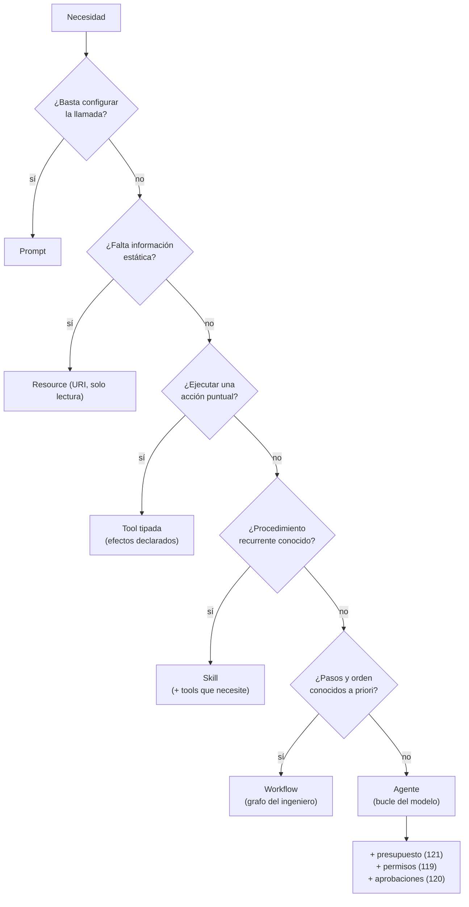

# 117 — Prompt, recurso, tool, skill, workflow y agente

> [← Clase anterior](../../../classes/part-09-ai-agent-engineering/116-herramientas-tipadas-y-efectos-laterales/README.md) · [Índice de la parte](../README.md) · [Clase siguiente →](../../../classes/part-09-ai-agent-engineering/118-memoria-contexto-y-continuidad/README.md)

**Parte:** 09 — Ingeniería de agentes de IA  
**Nivel:** avanzado · **Horas estimadas:** 6  
**Laboratorio:** `agent` · **Estado:** `EXECUTABLE_CORE`

## 🎯 Propósito

Comprender **prompt, recurso, tool, skill, workflow y agente** dentro de la evolución de la inteligencia
artificial, implementar un experimento mínimo verificable y distinguir qué parte
constituye evidencia frente a una afirmación todavía no comprobada.

## 📚 Resultados de aprendizaje

Al finalizar podrás:

1. Explicar prompt, recurso, tool, skill, workflow y agente usando los conceptos `prompt`, `resource`, `tool`, `skill`, `agent`.
2. Ejecutar el laboratorio con una semilla explícita y revisar su contrato JSON.
3. Identificar al menos un supuesto, una limitación y un riesgo de aplicación.
4. Comparar el enfoque con la etapa anterior de la ruta de aprendizaje.
5. Producir una evidencia reproducible y una conclusión que no exceda los datos.

## 🧩 Conceptos centrales

`prompt`, `resource`, `tool`, `skill`, `agent`

## 🗺️ Ubicación en el mapa de la IA

A medida que los sistemas con LLM maduraron, la palabra "agente" empezó a usarse para
cualquier cosa con un prompt, y esa confusión tiene costo real: elegir la abstracción
equivocada multiplica el precio, el riesgo o la fragilidad del sistema. El Model Context
Protocol (MCP) formalizó tres primitivas (prompts, resources, tools) precisamente para
separar responsabilidades, y la práctica de ingeniería añadió skills, workflows y agentes
como niveles de composición. Esta clase ordena la taxonomía sobre la que se montan la
memoria (118), los permisos (119) y el proyecto integrador (123).

## 📖 Fundamentos

### 🔤 Las seis abstracciones, definidas por su contrato

- **Prompt:** texto parametrizable que configura una invocación del modelo (plantilla +
  variables). No ejecuta nada; **quien decide usarlo es el usuario o el sistema**, no el
  modelo. En MCP, los prompts son plantillas expuestas por el servidor y elegidas por el
  usuario (*user-controlled*).
- **Recurso (resource):** datos de solo lectura direccionables por URI (un archivo, un
  esquema de base de datos, un log). Aporta contexto; no tiene efectos. En MCP es la
  aplicación quien decide qué recursos entran al contexto (*application-controlled*).
- **Tool:** función tipada invocable **por decisión del modelo** durante la generación
  (*model-controlled*), con JSON Schema y efectos declarados (clase 116). Es la única
  primitiva con capacidad de modificar el mundo.
- **Skill:** paquete de conocimiento procedimental — instrucciones, ejemplos, scripts y
  recursos empaquetados para una tarea recurrente ("cómo generar el informe mensual").
  No es código que corre solo: es experiencia reutilizable que el modelo carga cuando la
  tarea coincide. Se distingue del prompt por su alcance (procedimiento completo, a
  menudo con archivos auxiliares) y del tool por no ser una función tipada.
- **Workflow:** grafo de pasos **escrito por el ingeniero** donde modelo, tools y
  lógica clásica ocupan casillas (clase 112). El control de flujo es del código.
- **Agente:** bucle donde **el modelo decide** qué tool invocar, en qué orden y cuándo
  parar (clases 112-114). El control de flujo es del modelo, dentro de límites.

### 🎛️ El eje que ordena todo: quién controla qué

La taxonomía deja de ser un glosario cuando se lee sobre dos ejes:

```text
Eje 1 — ¿Quién decide su uso?
  usuario/aplicación:  prompt, resource
  ingeniero (código):  workflow
  modelo (runtime):    tool, skill (cargarla), agente (todo el bucle)

Eje 2 — ¿Puede causar efectos?
  nunca:               prompt, resource, skill (por sí misma)
  los que declare:     tool
  los de sus tools:    workflow, agente
```

Corolario de seguridad: los permisos (clase 119) se aplican sobre tools, porque es la
única primitiva con efectos propios; workflows y agentes heredan el riesgo de las tools
que contienen, más el riesgo de *composición* (orden y argumentos elegidos en runtime
en el caso del agente).

### 🧬 Composición: cómo se combinan

Las abstracciones se anidan: un prompt configura al modelo; los recursos le dan
contexto; las tools le dan manos; una skill le da el procedimiento probado; el workflow
fija la secuencia cuando se conoce; el agente la improvisa cuando no. Un sistema real
mezcla varias: p. ej., un agente de soporte usa una skill ("política de reembolsos"),
recursos (historial del cliente), tools (`refund_order`, `send_email`) y puede invocar
un workflow determinista para el caso estándar, reservando su autonomía para los casos
fuera de guion.

### 🧭 Regla de selección (de menor a mayor costo/riesgo)

1. ¿Basta configurar la llamada? → **prompt**.
2. ¿Falta información estática? → **resource**.
3. ¿Hay que ejecutar algo puntual? → **tool** (workflow de un paso).
4. ¿La tarea es recurrente con procedimiento conocido? → **skill** (+ tools).
5. ¿Los pasos y su orden se conocen a priori? → **workflow**.
6. ¿Ninguna de las anteriores? → **agente**, con presupuesto y permisos desde el día uno.

## 🧮 Ejemplo trabajado

Misma necesidad, seis materializaciones. Necesidad: *"responder tickets de soporte sobre
facturación"*.

| Abstracción | Materialización | Quién decide | Efectos |
|---|---|---|---|
| Prompt | plantilla "responde cortésmente usando {{politica}} y {{ticket}}" | usuario/app | ninguno |
| Resource | `billing://policies/2026.md` + historial del cliente | aplicación | ninguno |
| Tool | `lookup_invoice(customer_id, month)` tipada con schema | modelo | lectura |
| Skill | paquete "gestión de disputas": pasos, umbrales, plantillas de respuesta | modelo (la carga) | ninguno propio |
| Workflow | clasificar → si "duplicado": reembolso automático → notificar | ingeniero | los de sus tools |
| Agente | bucle que investiga el caso raro: consulta facturas, cruza pagos, propone resolución y pide aprobación | modelo | los de sus tools + composición |

El punto didáctico: el 80 % de los tickets (casos estándar) los resuelve el workflow con
costo fijo y auditoría trivial; el agente se reserva para el 20 % no estandarizable, y
aun ahí termina en un hito de aprobación (clase 120). Dimensionar al revés — un agente
para todo — multiplica costo y varianza sin ganar capacidad donde no hacía falta.

## 📊 Propiedades y comparación

| Propiedad | Prompt | Resource | Tool | Skill | Workflow | Agente |
|---|---|---|---|---|---|---|
| Control de uso | usuario/app | aplicación | modelo | modelo | ingeniero | modelo |
| Efectos propios | no | no | sí (declarados) | no | vía tools | vía tools |
| Estado entre usos | no | el dato | no | no | el del grafo | el del bucle |
| Costo marginal | mínimo | mínimo | por llamada | carga de contexto | fijo y predecible | variable |
| Auditoría | trivial | trivial | log de llamadas | qué skill se usó | por nodo | trayectoria completa |
| Falla típica | ambigüedad | dato obsoleto | mal schema/descripción | procedimiento desactualizado | rigidez | pérdida de rumbo/costo |



## ⚠️ Errores conceptuales frecuentes

1. **"Todo lo que usa un LLM es un agente."** Un clasificador con prompt es un modelo;
   un pipeline fijo es un workflow. Llamarlo agente infla expectativas y oculta que su
   auditoría es mucho más simple.
2. **"Skill y tool son lo mismo."** La tool es una función tipada con efectos; la skill
   es conocimiento procedimental que orienta al modelo (y puede usar tools). Confundirlas
   lleva a "skills" que ejecutan efectos sin pasar por la matriz de permisos.
3. **"Los prompts los elige el modelo."** En MCP los prompts son *user-controlled* y los
   resources *application-controlled*; solo las tools son *model-controlled*. Ese
   reparto de control es una decisión de seguridad, no un tecnicismo.
4. **"El agente sustituye al workflow."** Conviven: el workflow cubre el caso estándar
   con costo fijo; el agente, la cola larga. Los sistemas maduros *degradan* trayectorias
   de agente estabilizadas a workflows.
5. **"Un resource es inofensivo por ser de solo lectura."** No tiene efectos, pero sí
   riesgo de entrada: un resource con contenido no confiable puede inyectar
   instrucciones al contexto (OWASP LLM01). Solo lectura ≠ solo datos confiables.

## 🚀 Del aprendizaje a la operación

El laboratorio ejercita el nivel "agente" con tools puras; un sistema real combina las
seis abstracciones y exige gobernarlas: catálogo versionado de prompts y skills (qué
versión respondió qué), inventario de tools con su clase de efecto y permisos (119),
resources con control de acceso y procedencia, y métricas por abstracción para decidir
promociones (workflow → agente) y degradaciones (agente → workflow) con datos (122).
MCP aporta el protocolo para exponer prompts, resources y tools entre procesos; la
disciplina de clasificar y auditar sigue siendo del equipo.

## 🧪 Laboratorio

```bash
python lab.py
```

El laboratorio llama a `ai_evolution.labs.run_lab("agent")`. Esta
decisión evita 183 implementaciones divergentes: cada clase tiene un entrypoint
propio, pero los motores didácticos se prueban como una biblioteca común.

### 🔍 Evidencia esperada

- tipo de laboratorio y semilla;
- entradas o decisiones observables;
- resultado estructurado;
- lista `evidence` con hechos que pueden inspeccionarse;
- lista `limitations` que impide presentar la demo como producción.

## 📓 Notebooks

- [📓 `notebook.ipynb`](notebook.ipynb): recorrido guiado con la materia resumida.
- [✍️ `notebook_student.ipynb`](notebook_student.ipynb): ejercicios para resolver.
- [✅ `notebook_solution.ipynb`](notebook_solution.ipynb): solución de referencia explicada.

## 📝 Evaluación

| Criterio | Peso |
|---|---:|
| Comprensión conceptual | 25 % |
| Ejecución reproducible | 25 % |
| Interpretación basada en evidencia | 25 % |
| Riesgos, límites y mejora propuesta | 25 % |

Consulta [assessment.md](assessment.md) para preguntas y criterio de aceptación.

## ⚠️ Errores comunes

| Síntoma | Causa probable | Corrección |
|---|---|---|
| El código corre, pero no hay conclusión | Se confundió ejecución con aprendizaje | Explica qué demuestra y qué no demuestra |
| El resultado cambia sin explicación | No se registró semilla o configuración | Conserva semilla, versión y parámetros |
| Se promete uso real | Se extrapoló desde una demo educativa | Declara entorno, datos, límites y revisión humana |
| Se copia una métrica aislada | No existe baseline ni costo de error | Añade comparación y criterio de decisión |

## ❓ Preguntas frecuentes

**¿Debo usar una API comercial?**  
No. El núcleo funciona localmente. Las extensiones LIVE se documentan por separado.

**¿El laboratorio representa una implementación industrial?**  
No por sí solo. Enseña el contrato y el patrón; producción exige integración,
seguridad, observabilidad, pruebas y operación.

**¿Dónde profundizo?**  
Revisa las especializaciones enlazadas en el README raíz y la ruta siguiente.

## 🔗 Referencias

- [Model Context Protocol — especificación oficial (prompts, resources y tools como primitivas con control distinto)](https://modelcontextprotocol.io/) — uso: marco normativo de referencia
- [Anthropic Engineering — "Building effective agents" (workflows vs agentes, patrones de composición)](https://www.anthropic.com/engineering/building-effective-agents) — uso: referencia consultada en su fuente original
- [Yao et al. (2022), "ReAct", arXiv:2210.03629 (el bucle que define el nivel agente)](https://arxiv.org/abs/2210.03629) — uso: fuente primaria del mecanismo estudiado
- [Schick et al. (2023), "Toolformer", arXiv:2302.04761 (la tool como primitiva model-controlled)](https://arxiv.org/abs/2302.04761) — uso: fuente primaria del mecanismo estudiado
- [OWASP Top 10 for LLM Applications (LLM01: contenido de resources como vector de inyección)](https://owasp.org/www-project-top-10-for-large-language-model-applications/) — uso: marco normativo de referencia
- [LangGraph — Overview (materialización de workflows y agentes como grafos)](https://docs.langchain.com/oss/python/langgraph/overview) — uso: referencia consultada en su fuente original

<!-- papers:inicio -->

---

## 📜 Papers que fundamentan esta clase

> Bloque generado por `python scripts/link_papers_to_classes.py`. La fuente es [`papers/catalog/papers.json`](../../../papers/catalog/papers.json).

| Paper | Año | Qué desbloqueó | Miniatura |
|---|---:|---|---|
| [P16 · Sistemas agentic contemporáneos: memoria, reflexión, multiagente e interoperabilidad](../../../papers/foundational/P16_agentic_systems/README.md) | 2023 | El agente deja de ser un bucle y pasa a ser un sistema: memoria, reflexión, planificación, presupuesto, múltiples agentes y protocolos de interoperabilidad. | [notebook](../../../notebooks/papers/P16_agentic_systems.ipynb) |

Cada ficha explica el problema anterior, la matemática mínima, los límites y los errores de atribución más frecuentes. Para leerlas con método: [cómo leer un paper de IA](../../../papers/guides/COMO_LEER_UN_PAPER_DE_IA.md) · [anexos matemáticos](../../../papers/annexes/README.md).
<!-- papers:fin -->
<!-- bibliografia:inicio -->

---

## 📚 Bibliografía de apoyo

> Bloque generado por `python scripts/link_sources_to_classes.py`. Cada obra lleva su localizador verificado en [`sources/bibliography.json`](../../../sources/bibliography.json).

Los papers dicen **de dónde salió** el mecanismo. Estas obras lo **desarrollan** con el espacio que una clase no tiene: teoría completa, demostraciones y ejercicios.

| Obra | Edición | Localizador | Papel en esta clase |
|---|---|---|---|
| Russell, Stuart J. y Norvig, Peter — *Artificial Intelligence: A Modern Approach* | 4.ª · 2020 | [ISBN 9780134610993](https://openlibrary.org/isbn/9780134610993) · [web de la obra](https://aima.cs.berkeley.edu/) | obra de referencia de la parte 09 · capítulo de agentes racionales |
| Michael J. Wooldridge — *An Introduction to MultiAgent Systems* | 2009 | [ISBN 9780471496915](https://openlibrary.org/isbn/9780471496915) | obra de referencia de la parte 09 · arquitecturas de agente |

**Normas y documentación oficial que aplica esta clase:** [Model Context Protocol](https://modelcontextprotocol.io) · [OWASP Top 10 for LLM Applications](https://owasp.org/www-project-top-10-for-large-language-model-applications/)
<!-- bibliografia:fin -->

---

## ⬅️ Clase anterior

[116 — Herramientas tipadas y efectos laterales](../../part-09-ai-agent-engineering/116-herramientas-tipadas-y-efectos-laterales/README.md)

## ➡️ Siguiente clase

[118 — Memoria, contexto y continuidad](../../part-09-ai-agent-engineering/118-memoria-contexto-y-continuidad/README.md)
