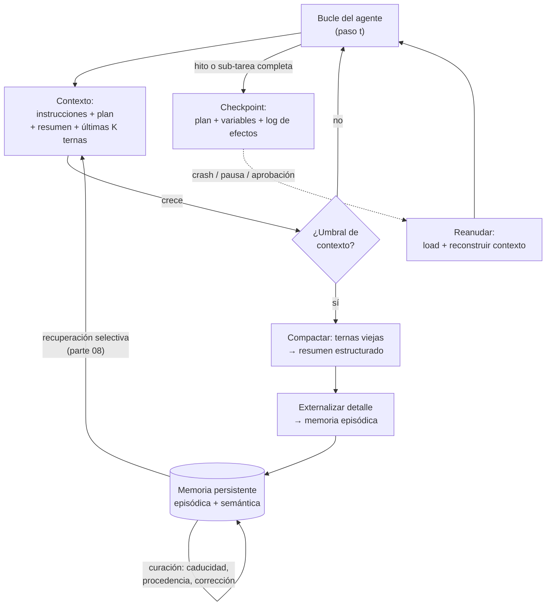

# 118 — Memoria, contexto y continuidad

> [← Clase anterior](../../../classes/part-09-ai-agent-engineering/117-prompt-recurso-tool-skill-workflow-y-agente/README.md) · [Índice de la parte](../README.md) · [Clase siguiente →](../../../classes/part-09-ai-agent-engineering/119-permisos-sandbox-y-minimo-privilegio/README.md)

**Parte:** 09 — Ingeniería de agentes de IA  
**Nivel:** avanzado · **Horas estimadas:** 6  
**Laboratorio:** `agent` · **Estado:** `EXECUTABLE_CORE`

## 🎯 Propósito

Comprender **memoria, contexto y continuidad** dentro de la evolución de la inteligencia
artificial, implementar un experimento mínimo verificable y distinguir qué parte
constituye evidencia frente a una afirmación todavía no comprobada.

## 📚 Resultados de aprendizaje

Al finalizar podrás:

1. Explicar memoria, contexto y continuidad usando los conceptos `memory`, `context`, `checkpoints`, `identity`.
2. Ejecutar el laboratorio con una semilla explícita y revisar su contrato JSON.
3. Identificar al menos un supuesto, una limitación y un riesgo de aplicación.
4. Comparar el enfoque con la etapa anterior de la ruta de aprendizaje.
5. Producir una evidencia reproducible y una conclusión que no exceda los datos.

## 🧩 Conceptos centrales

`memory`, `context`, `checkpoints`, `identity`

## 🗺️ Ubicación en el mapa de la IA

Un LLM es una función sin estado: cada llamada parte de cero y solo "recuerda" lo que
cabe en su ventana de contexto. Los agentes, en cambio, ejecutan tareas largas, se
interrumpen, se reinician y vuelven — la continuidad hay que **construirla** alrededor
del modelo. Esta clase toma el bucle (114) y el plan (115), cuyos contextos crecen paso
a paso, y añade la ingeniería de estado que la parte 08 insinuó con RAG: qué guardar,
dónde, y cómo reconstruir el punto de trabajo. Sin ella no hay agentes de sesión larga
ni proyecto integrador (123).

## 📖 Fundamentos

### 🧠 Tres almacenes con contratos distintos

- **Contexto (memoria de trabajo):** la ventana del modelo — instrucciones, plan,
  ternas thought/action/observation recientes. Volátil, cara (se paga por token en cada
  llamada) y limitada; se pierde al terminar el proceso.
- **Memoria persistente:** lo que sobrevive entre sesiones. Dos formas complementarias:
  *episódica* (qué pasó: trazas, decisiones, resultados) y *semántica* (hechos
  destilados: "el usuario prefiere CSV", "el build tarda 8 min"). Vive en archivos o
  bases de datos; entra al contexto solo cuando es relevante (recuperación, parte 08).
- **Checkpoint:** instantánea del estado del bucle (plan con estados de sub-tareas,
  variables, último paso completado) tomada en puntos consistentes. Su contrato es la
  **reanudación**: `estado = load(checkpoint); continuar()` sin repetir efectos ya
  aplicados — de ahí su pareja natural con la idempotencia (clase 116).

### 📉 El problema central: el contexto crece y degrada

Cada iteración añade tokens; tareas largas chocan con dos muros: el límite duro de la
ventana y la degradación blanda (el modelo atiende peor la información enterrada en
contextos enormes — *context rot*). Las estrategias estándar:

1. **Compactación (summarization):** sustituir las ternas viejas por un resumen
   estructurado (qué se hizo, qué se decidió, qué falta). Pierde detalle; conserva
   rumbo. Es una operación con pérdida: qué se resume y qué se conserva textual
   (errores, decisiones, contratos) es una decisión de diseño.
2. **Externalización:** mover información a memoria persistente y dejar en contexto un
   puntero ("el análisis completo está en `analysis.md`"). El agente la recupera con
   una tool de lectura cuando la necesita.
3. **Selección (retrieval):** traer al contexto solo lo relevante para el paso actual,
   con las técnicas de la parte 08 (embeddings, BM25, híbrida).

```text
regla práctica del presupuesto de contexto:
    contexto = instrucciones (fijo) + plan (compacto, siempre visible)
             + resumen de lo hecho (compactado) + últimas K ternas (textual)
             + recuperado bajo demanda (efímero)
```

Esta práctica tiene hoy nombre de disciplina: **context engineering** — decidir qué
tokens *ganan* un lugar en la ventana en cada paso. La formulación de Anthropic la
resume: encontrar el **menor conjunto de tokens de alta señal** que maximice la
probabilidad del resultado deseado. El desplazamiento respecto del prompt engineering es
de alcance, no de técnica: el prompt es una llamada; el contexto es todo lo que el modelo
ve en *cada* llamada de una tarea larga (instrucciones, tools, recuperado, historial,
memoria). El *context rot* dejó además de ser anécdota: ya existen benchmarks que lo miden
bajo crecimiento controlado de contexto (p. ej. LOCA-bench), y la conclusión operativa es
estable — la ventaja competitiva no está en ventanas más grandes sino en curar mejor lo
que entra.

### 🔖 Continuidad e identidad

**Continuidad** es que la tarea sobreviva a la interrupción (crash, límite de sesión,
espera de aprobación). Exige checkpoints en puntos consistentes — nunca en mitad de un
efecto — y un log de efectos aplicados para no repetirlos al reanudar. **Identidad** es
que el agente siga siendo "el mismo" a través de sesiones: mismas instrucciones base,
misma memoria semántica, mismas preferencias aprendidas. Un agente que olvida cada
sesión sus convenciones obliga al usuario a re-explicar; uno que persiste hechos
equivocados los arrastra — por eso la memoria semántica necesita **curación**
(revisión, caducidad, corrección), no solo acumulación.

### ⚠️ La memoria como superficie de riesgo

Todo lo que entra en memoria persistente vuelve a entrar al contexto en sesiones
futuras. Un dato envenenado (instrucción inyectada que se "recordó" como hecho) se
convierte en persistente. Reglas mínimas: distinguir procedencia (¿lo dijo el usuario,
lo observó una tool, lo dedujo el modelo?), no persistir secretos, y tratar la memoria
recuperada como dato no confiable de baja procedencia (clase 119).

## 🧮 Ejemplo trabajado

Agente de migración de 40 archivos; presupuesto de contexto: 8.000 tokens; cada terna
consume ~300. Sin gestión: 40 × 300 = 12.000 tokens solo de trazas → desborda en el
archivo ~27.

Con la regla práctica (instrucciones 800 + plan 400 + resumen 600 + últimas 5 ternas
1.500 ≈ 3.300 tokens estables):

```text
paso 10  contexto: [instrucciones][plan 10/40][resumen archivos 1-5][ternas 6-10]
         checkpoint_10 = {plan: 10 hechos, pendientes: 30, log_efectos: [f1..f10]}
paso 23  falla el proceso (crash del runtime)
reanudar: estado = load(checkpoint_20)        ← último punto consistente
         contexto reconstruido: instrucciones + plan(20/40) + resumen(1-15)
         + ternas 16-20 → el agente continúa en el archivo 21
         log_efectos impide re-migrar f1..f20 (idempotencia operativa)
sesión siguiente (otro día):
         memoria semántica aporta: "los .svg requieren conversión manual"
         → el plan de hoy la incorpora sin re-descubrirla
```

Costo comparado: sin compactar, la llamada del paso 27 pagaría ~12.000 tokens de
entrada y fallaría; compactando, cada llamada paga ~3.300 estables y el episodio
completo queda auditado en la memoria episódica (no en la ventana).

## 📊 Propiedades y comparación

| Propiedad | Contexto | Memoria episódica | Memoria semántica | Checkpoint |
|---|---|---|---|---|
| Vive | duración de la llamada/bucle | entre sesiones | entre sesiones | hasta reanudar |
| Contenido | trabajo en curso | qué pasó (trazas) | hechos destilados | estado del bucle |
| Costo por uso | tokens en CADA llamada | recuperación selectiva | recuperación selectiva | almacenamiento |
| Riesgo típico | desborde / context rot | volumen sin índice | hechos obsoletos o envenenados | estado inconsistente |
| Operación clave | compactar / seleccionar | consultar por episodio | curar (caducidad, corrección) | reanudar sin repetir efectos |



## ⚠️ Errores conceptuales frecuentes

1. **"Contexto grande = no necesito memoria."** Ventanas mayores retrasan el muro duro,
   pero el costo por llamada crece (se re-paga todo el contexto en cada iteración) y la
   atención se degrada con contextos enormes. La gestión sigue siendo necesaria.
2. **"Guardar todo, por si acaso."** Memoria sin curación ni índice es ruido que
   contamina la recuperación; el valor está en destilar hechos accionables con
   procedencia, no en acumular transcripciones.
3. **"El checkpoint es un autosave del texto."** Guardar el transcript no permite
   reanudar: hace falta el estado estructurado (plan, variables, log de efectos
   aplicados). Reanudar desde texto plano re-ejecuta efectos o los pierde.
4. **"Resumir es gratis."** La compactación pierde información; si el resumen omite un
   error observado o una decisión con su porqué, el agente puede repetir el error. Qué
   se conserva textual es una decisión de diseño, no un detalle.
5. **"La memoria del agente es confiable porque es suya."** Su procedencia es mixta:
   cosas observadas, deducidas o leídas de fuentes no confiables. Sin etiquetas de
   procedencia, una inyección de hoy es una "verdad recordada" mañana.

## 🚀 Del aprendizaje a la operación

El laboratorio completa su tarea en dos pasos y no necesita nada de esto; la necesidad
aparece con tareas de horas y sesiones múltiples. Operar exige: política de compactación
con umbrales medidos (¿cuántos tokens?, ¿qué se conserva textual?), almacenamiento de
checkpoints transaccional y versionado, memoria semántica con caducidad y procedencia,
y métricas de la clase 121 (tokens por iteración, costo por tarea) para detectar cuándo
la gestión de contexto — y no el modelo — es el cuello de botella. La evaluación (122)
debe incluir escenarios de reanudación: matar el agente a mitad de tarea y verificar
que continúa sin duplicar efectos.

## 🧪 Laboratorio

```bash
python lab.py
```

El laboratorio llama a `ai_evolution.labs.run_lab("agent")`. Esta
decisión evita 183 implementaciones divergentes: cada clase tiene un entrypoint
propio, pero los motores didácticos se prueban como una biblioteca común.

### 🔍 Evidencia esperada

- tipo de laboratorio y semilla;
- entradas o decisiones observables;
- resultado estructurado;
- lista `evidence` con hechos que pueden inspeccionarse;
- lista `limitations` que impide presentar la demo como producción.

## 📓 Notebooks

- [📓 `notebook.ipynb`](notebook.ipynb): recorrido guiado con la materia resumida.
- [✍️ `notebook_student.ipynb`](notebook_student.ipynb): ejercicios para resolver.
- [✅ `notebook_solution.ipynb`](notebook_solution.ipynb): solución de referencia explicada.

## 📝 Evaluación

| Criterio | Peso |
|---|---:|
| Comprensión conceptual | 25 % |
| Ejecución reproducible | 25 % |
| Interpretación basada en evidencia | 25 % |
| Riesgos, límites y mejora propuesta | 25 % |

Consulta [assessment.md](assessment.md) para preguntas y criterio de aceptación.

## ⚠️ Errores comunes

| Síntoma | Causa probable | Corrección |
|---|---|---|
| El código corre, pero no hay conclusión | Se confundió ejecución con aprendizaje | Explica qué demuestra y qué no demuestra |
| El resultado cambia sin explicación | No se registró semilla o configuración | Conserva semilla, versión y parámetros |
| Se promete uso real | Se extrapoló desde una demo educativa | Declara entorno, datos, límites y revisión humana |
| Se copia una métrica aislada | No existe baseline ni costo de error | Añade comparación y criterio de decisión |

## ❓ Preguntas frecuentes

**¿Debo usar una API comercial?**  
No. El núcleo funciona localmente. Las extensiones LIVE se documentan por separado.

**¿El laboratorio representa una implementación industrial?**  
No por sí solo. Enseña el contrato y el patrón; producción exige integración,
seguridad, observabilidad, pruebas y operación.

**¿Dónde profundizo?**  
Revisa las especializaciones enlazadas en el README raíz y la ruta siguiente.

## 🔗 Referencias

- [Anthropic Engineering — "Effective context engineering for AI agents" (compactación, notas estructuradas, presupuesto de contexto)](https://www.anthropic.com/engineering/effective-context-engineering-for-ai-agents) — uso: referencia consultada en su fuente original
- [Liu et al. (2023), "Lost in the Middle: How Language Models Use Long Contexts", arXiv:2307.03172 (degradación de atención en contextos largos)](https://arxiv.org/abs/2307.03172) — uso: fuente primaria del mecanismo estudiado
- [Packer et al. (2023), "MemGPT: Towards LLMs as Operating Systems", arXiv:2310.08560 (jerarquía de memoria y paginación de contexto)](https://arxiv.org/abs/2310.08560) — uso: fuente primaria del mecanismo estudiado
- [Lewis et al. (2020), "Retrieval-Augmented Generation", arXiv:2005.11401 (recuperación selectiva hacia el contexto)](https://arxiv.org/abs/2005.11401) — uso: fuente primaria del mecanismo estudiado
- [LangGraph — Persistence (checkpoints y reanudación de grafos con estado)](https://docs.langchain.com/oss/python/langgraph/persistence) — uso: referencia consultada en su fuente original
- [OWASP Top 10 for LLM Applications (envenenamiento de memoria como riesgo persistente)](https://owasp.org/www-project-top-10-for-large-language-model-applications/) — uso: marco normativo de referencia
- ["LOCA-bench: Benchmarking Language Agents Under Controllable and Extreme Context Growth", arXiv:2602.07962 (medición del context rot)](https://arxiv.org/abs/2602.07962) — uso: fuente primaria del mecanismo estudiado

<!-- papers:inicio -->

---

## 📜 Papers que fundamentan esta clase

> Bloque generado por `python scripts/link_papers_to_classes.py`. La fuente es [`papers/catalog/papers.json`](../../../papers/catalog/papers.json).

| Paper | Año | Qué desbloqueó | Miniatura |
|---|---:|---|---|
| [P31 · Agentes generativos: simulacros interactivos de comportamiento humano](../../../papers/foundational/P31_generative_agents/README.md) | 2023 | Resuelve la memoria de un agente que vive mucho tiempo: qué recordar, cuándo y por qué, cuando el contexto no da para todo. | [notebook](../../../notebooks/papers/P31_generative_agents.ipynb) |
| [P36 · Perdidos en el medio: cómo usan los modelos de lenguaje los contextos largos](../../../papers/foundational/P36_lost_in_middle/README.md) | 2023 | Tener contexto largo no es usarlo: el rendimiento cae en forma de U cuando el dato relevante está en el medio. | [notebook](../../../notebooks/papers/P36_lost_in_middle.ipynb) |
| [P37 · MemGPT: modelos de lenguaje como sistemas operativos](../../../papers/foundational/P37_memgpt/README.md) | 2023 | Aplica al contexto la idea de memoria virtual: una jerarquía que da la ilusión de memoria grande sobre una pequeña y rápida. | [notebook](../../../notebooks/papers/P37_memgpt.ipynb) |

Cada ficha explica el problema anterior, la matemática mínima, los límites y los errores de atribución más frecuentes. Para leerlas con método: [cómo leer un paper de IA](../../../papers/guides/COMO_LEER_UN_PAPER_DE_IA.md) · [anexos matemáticos](../../../papers/annexes/README.md).
<!-- papers:fin -->
<!-- bibliografia:inicio -->

---

## 📚 Bibliografía de apoyo

> Bloque generado por `python scripts/link_sources_to_classes.py`. Cada obra lleva su localizador verificado en [`sources/bibliography.json`](../../../sources/bibliography.json).

Los papers dicen **de dónde salió** el mecanismo. Estas obras lo **desarrollan** con el espacio que una clase no tiene: teoría completa, demostraciones y ejercicios.

| Obra | Edición | Localizador | Papel en esta clase |
|---|---|---|---|
| Russell, Stuart J. y Norvig, Peter — *Artificial Intelligence: A Modern Approach* | 4.ª · 2020 | [ISBN 9780134610993](https://openlibrary.org/isbn/9780134610993) · [web de la obra](https://aima.cs.berkeley.edu/) | obra de referencia de la parte 09 · capítulo de agentes racionales |
| Michael J. Wooldridge — *An Introduction to MultiAgent Systems* | 2009 | [ISBN 9780471496915](https://openlibrary.org/isbn/9780471496915) | obra de referencia de la parte 09 · arquitecturas de agente |

**Normas y documentación oficial que aplica esta clase:** [OWASP Top 10 for LLM Applications](https://owasp.org/www-project-top-10-for-large-language-model-applications/)
<!-- bibliografia:fin -->

---

## ⬅️ Clase anterior

[117 — Prompt, recurso, tool, skill, workflow y agente](../../part-09-ai-agent-engineering/117-prompt-recurso-tool-skill-workflow-y-agente/README.md)

## ➡️ Siguiente clase

[119 — Permisos, sandbox y mínimo privilegio](../../part-09-ai-agent-engineering/119-permisos-sandbox-y-minimo-privilegio/README.md)
