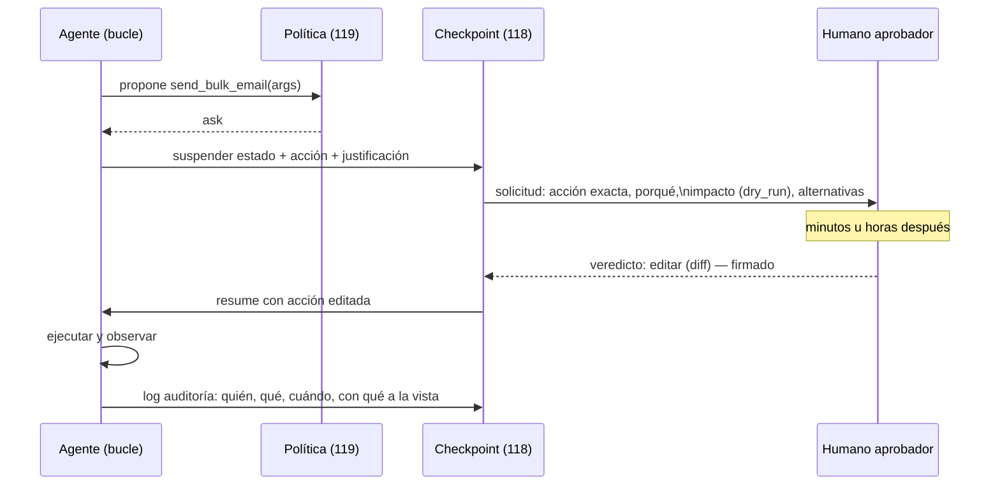

# 120 — Human-in-the-loop y aprobaciones

> [← Clase anterior](../../../classes/part-09-ai-agent-engineering/119-permisos-sandbox-y-minimo-privilegio/README.md) · [Índice de la parte](../README.md) · [Clase siguiente →](../../../classes/part-09-ai-agent-engineering/121-presupuestos-de-pasos-tokens-costo-y-tiempo/README.md)

**Parte:** 09 — Ingeniería de agentes de IA  
**Nivel:** avanzado · **Horas estimadas:** 6  
**Laboratorio:** `workflow` · **Estado:** `EXECUTABLE_CORE`

## 🎯 Propósito

Comprender **human-in-the-loop y aprobaciones** dentro de la evolución de la inteligencia
artificial, implementar un experimento mínimo verificable y distinguir qué parte
constituye evidencia frente a una afirmación todavía no comprobada.

## 📚 Resultados de aprendizaje

Al finalizar podrás:

1. Explicar human-in-the-loop y aprobaciones usando los conceptos `HITL`, `approval`, `interrupt`, `resume`.
2. Ejecutar el laboratorio con una semilla explícita y revisar su contrato JSON.
3. Identificar al menos un supuesto, una limitación y un riesgo de aplicación.
4. Comparar el enfoque con la etapa anterior de la ruta de aprendizaje.
5. Producir una evidencia reproducible y una conclusión que no exceda los datos.

## 🧩 Conceptos centrales

`HITL`, `approval`, `interrupt`, `resume`

## 🗺️ Ubicación en el mapa de la IA

Human-in-the-loop es la respuesta de ingeniería a un hecho empírico: los agentes se
equivocan, y algunas de sus acciones no se pueden deshacer. La matriz de permisos (119)
produce tres decisiones y una de ellas — `ask` — es exactamente esta clase: detener el
bucle, preservar el estado (118), presentar la acción a un humano y reanudar con su
veredicto. Bien colocada, la aprobación concentra el juicio humano donde el costo del
error lo exige; mal colocada, degenera en fatiga de clics que aprueba todo sin mirar.
Es también el mecanismo que los marcos de gobernanza (NIST AI RMF) piden como
"supervisión humana efectiva".

## 📖 Fundamentos

### 🧑‍⚖️ Definiciones y el patrón interrupt/resume

- **HITL (human-in-the-loop):** diseño donde ciertos pasos del sistema requieren
  decisión humana en tiempo de ejecución. Se distingue de *human-on-the-loop*
  (supervisión a posteriori con capacidad de abortar) y de *human-out-of-the-loop*
  (sin intervención).
- **Punto de aprobación:** hito bloqueante (115) asociado a una acción o clase de
  acciones; el flujo NO puede atravesarlo sin veredicto registrado.
- **Interrupt:** el runtime suspende el bucle en un punto consistente y persiste un
  checkpoint (118) con la acción propuesta y su contexto de justificación.
- **Resume:** al llegar el veredicto (aprobar / rechazar / editar), el runtime
  restaura el estado y continúa: la acción se ejecuta, se descarta con motivo, o se
  ejecuta la versión editada.

```text
bucle:
    accion = decidir(contexto)
    caso politica(accion):                        # matriz de la clase 119
        allow -> ejecutar y observar
        deny  -> observar la denegación con razones
        ask   -> checkpoint = suspender(estado, accion, justificacion)
                 veredicto = esperar_humano(checkpoint)   # minutos u horas
                 caso veredicto:
                     aprobar  -> ejecutar accion
                     editar   -> ejecutar accion'
                     rechazar -> observar el rechazo (motivo como observación)
```

La espera puede durar horas: por eso interrupt/resume es imposible sin persistencia —
el proceso puede morir y renacer entre la solicitud y el veredicto.

### 📋 Qué debe ver el aprobador

Una solicitud de aprobación es un artefacto con contrato, no un "¿procedo? s/n":

1. **La acción exacta** con argumentos literales (`send_email` con destinatarios y
   cuerpo completos, no "enviar un correo").
2. **El porqué:** el objetivo y las observaciones que llevaron a proponerla.
3. **El impacto:** clase de efecto, reversibilidad, alcance ("se enviará a 1.200
   clientes"), y el resultado del `dry_run` cuando exista (116).
4. **Las alternativas:** qué pasa si se rechaza (¿hay plan B? ¿la tarea queda
   bloqueada?).

Regla de calidad: si el aprobador no puede decidir en el tiempo previsto con lo que ve,
el defecto es de la solicitud, no del aprobador.

### 🎯 Dónde poner (y no poner) aprobaciones

Criterio económico: aprobar cuesta atención humana escasa; la aprobación se justifica
cuando `costo_error × probabilidad_error > costo_atencion`. En la práctica:

- **Sí:** efectos irreversibles (dinero, comunicaciones salientes, borrados), acciones
  fuera del guion previsto, umbrales cuantitativos (>N €, >N destinatarios), primera
  ejecución de un plan nuevo.
- **No:** acciones puras o reversibles dentro del workspace — para eso están la
  política `allow` y la auditoría.
- **Antídotos a la fatiga de aprobación:** lotes ("aprueba el plan completo de 6
  pasos"), umbrales que auto-aprueban lo trivial, presupuestos pre-aprobados (121), y
  medición de la tasa de rechazo — si el humano aprueba el 100 % desde hace un mes, el
  punto de aprobación está mal calibrado (o el agente ya es confiable y toca subir el
  umbral).

### 🧾 El veredicto como evidencia

Cada veredicto (quién, cuándo, qué versión de la acción, con qué información a la
vista) va al log de auditoría. Esto produce responsabilidad trazable y, además, un
dataset valiosísimo: los rechazos con motivo son ejemplos etiquetados de "acción que
parecía correcta y no lo era" — insumo directo para las evaluaciones de la clase 122
y para recalibrar la matriz de la 116.

## 🧮 Ejemplo trabajado

Agente de comunicación que prepara el aviso de una interrupción de servicio.

```text
paso 1  draft_notice(...)            política: allow (borrador, reversible)
paso 2  dry_run de send_bulk_email   observación: {"recipients": 1214, "preview": "..."}
paso 3  send_bulk_email(...)         política: ask  → INTERRUPT
        checkpoint_17 = {plan, borrador v3, dry_run, justificación}
        solicitud presentada:
          Acción: send_bulk_email a 1.214 clientes del segmento "afectados"
          Porqué: incidencia #4412 confirmada; ventana 02:00-04:00
          Impacto: irreversible; dry_run adjunto; sin plan B automático
          Veredicto esperado antes de: 18:00 (después escala a on-call)
[47 minutos después]
        veredicto: EDITAR — "excluir a los 89 clientes del segmento premium,
                   que reciben llamada personal; corregir hora a CEST"
        RESUME desde checkpoint_17:
paso 3' send_bulk_email(recipients=1125, body=v4)   ejecutada
        log: {approver: "mgarcia", verdict: "edit", diff: [...], t: "17:22"}
paso 4  verify_delivery()            observación: 1125 entregados
```

Obsérvese: (a) el dry-run del paso 2 es lo que hizo la solicitud decidible; (b) el
veredicto "editar" evitó el falso dilema aprobar-todo/rechazar-todo; (c) el estado
sobrevivió 47 minutos gracias al checkpoint; (d) la exclusión premium es conocimiento
que debería destilarse a memoria semántica (118) y quizá a la política (119). El
laboratorio `workflow` ejecuta el esqueleto: `waiting_approval` es el interrupt,
`approved: true` el veredicto registrado, y `completed` solo existe después de él.

## 📊 Propiedades y comparación

| Propiedad | Sin HITL (auto) | Aprobación por acción | Aprobación por plan/lote | On-the-loop (post-hoc) |
|---|---|---|---|---|
| Latencia añadida | ninguna | alta (por cada ask) | media (una por lote) | ninguna |
| Protección ante irreversibles | política/sandbox solamente | máxima | alta (si el lote es fiel) | nula (ya ocurrió) |
| Carga cognitiva humana | nula | alta → riesgo de fatiga | media | baja |
| Escalabilidad | total | limitada por humanos | buena | total |
| Uso correcto | efectos puros/reversibles | irreversibles de alto costo | planes homogéneos | efectos menores auditables |



## ⚠️ Errores conceptuales frecuentes

1. **"Aprobar todo lo importante = seguridad."** Sin calibración produce fatiga: el
   humano que aprueba 60 veces al día deja de leer. La seguridad efectiva combina
   pocos `ask` bien elegidos con `allow`+auditoría y `deny` firmes.
2. **"La aprobación sustituye a la política y al sandbox."** Es la tercera capa, no la
   única: un humano cansado aprueba una acción inyectada. Deny y sandbox no se
   negocian con clics.
3. **"Rechazar mata la tarea."** El rechazo con motivo es una observación que entra al
   contexto: el agente replantea (115) o escala. Diseñar solo el camino feliz convierte
   cada rechazo en un estado zombi.
4. **"El humano decide con ver el nombre de la acción."** Sin argumentos literales,
   impacto y dry-run, la aprobación es teatro de seguridad: responsabilidad sin
   información.
5. **"Interrupt es pausar el proceso en memoria."** Si el veredicto tarda horas, el
   proceso habrá muerto. Sin checkpoint persistente no hay resume — HITL depende de la
   ingeniería de estado de la clase 118.

## 🚀 Del aprendizaje a la operación

El laboratorio simula la aprobación de forma síncrona e instantánea; producción añade:
cola de aprobaciones con SLA y escalado (¿quién decide a las 3 a. m.?), identidad
fuerte del aprobador (quién puede aprobar qué monto), veredicto "editar" con diff
auditable, expiración de solicitudes (una acción aprobada tarde puede ya no ser
válida), y métricas de calibración — tasa de rechazo por punto de aprobación, tiempo
hasta veredicto, correlación entre lo aprobado y los incidentes (122). Los rechazos
etiquetados alimentan la mejora de la matriz (119) y de los prompts del agente.

## 🧪 Laboratorio

```bash
python lab.py
```

El laboratorio llama a `ai_evolution.labs.run_lab("workflow")`. Esta
decisión evita 183 implementaciones divergentes: cada clase tiene un entrypoint
propio, pero los motores didácticos se prueban como una biblioteca común.

### 🔍 Evidencia esperada

- tipo de laboratorio y semilla;
- entradas o decisiones observables;
- resultado estructurado;
- lista `evidence` con hechos que pueden inspeccionarse;
- lista `limitations` que impide presentar la demo como producción.

## 📓 Notebooks

- [📓 `notebook.ipynb`](notebook.ipynb): recorrido guiado con la materia resumida.
- [✍️ `notebook_student.ipynb`](notebook_student.ipynb): ejercicios para resolver.
- [✅ `notebook_solution.ipynb`](notebook_solution.ipynb): solución de referencia explicada.

## 📝 Evaluación

| Criterio | Peso |
|---|---:|
| Comprensión conceptual | 25 % |
| Ejecución reproducible | 25 % |
| Interpretación basada en evidencia | 25 % |
| Riesgos, límites y mejora propuesta | 25 % |

Consulta [assessment.md](assessment.md) para preguntas y criterio de aceptación.

## ⚠️ Errores comunes

| Síntoma | Causa probable | Corrección |
|---|---|---|
| El código corre, pero no hay conclusión | Se confundió ejecución con aprendizaje | Explica qué demuestra y qué no demuestra |
| El resultado cambia sin explicación | No se registró semilla o configuración | Conserva semilla, versión y parámetros |
| Se promete uso real | Se extrapoló desde una demo educativa | Declara entorno, datos, límites y revisión humana |
| Se copia una métrica aislada | No existe baseline ni costo de error | Añade comparación y criterio de decisión |

## ❓ Preguntas frecuentes

**¿Debo usar una API comercial?**  
No. El núcleo funciona localmente. Las extensiones LIVE se documentan por separado.

**¿El laboratorio representa una implementación industrial?**  
No por sí solo. Enseña el contrato y el patrón; producción exige integración,
seguridad, observabilidad, pruebas y operación.

**¿Dónde profundizo?**  
Revisa las especializaciones enlazadas en el README raíz y la ruta siguiente.

## 🔗 Referencias

- [NIST AI Risk Management Framework (AI RMF 1.0) (supervisión humana efectiva como control de gobernanza)](https://www.nist.gov/itl/ai-risk-management-framework)
- [Anthropic Engineering — "Building effective agents" (checkpoints humanos y guardrails en agentes)](https://www.anthropic.com/engineering/building-effective-agents)
- [LangGraph — Human-in-the-loop (interrupt/resume sobre checkpoints persistentes)](https://docs.langchain.com/oss/python/langgraph/interrupts)
- [Amershi et al. (2014), "Power to the People: The Role of Humans in Interactive Machine Learning", DOI:10.1609/aimag.v35i4.2513](https://doi.org/10.1609/aimag.v35i4.2513)
- [OWASP Top 10 for LLM Applications (LLM06 Excessive Agency: la aprobación como mitigación)](https://owasp.org/www-project-top-10-for-large-language-model-applications/)

---

## ⬅️ Clase anterior

[119 — Permisos, sandbox y mínimo privilegio](../../part-09-ai-agent-engineering/119-permisos-sandbox-y-minimo-privilegio/README.md)

## ➡️ Siguiente clase

[121 — Presupuestos de pasos, tokens, costo y tiempo](../../part-09-ai-agent-engineering/121-presupuestos-de-pasos-tokens-costo-y-tiempo/README.md)
