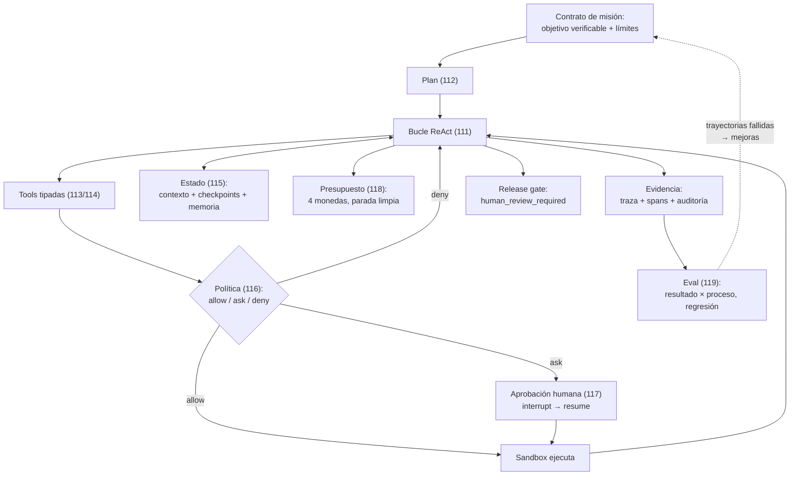

# 120 — Proyecto: agente individual operativo

> [← Clase anterior](../../../classes/part-09-ai-agent-engineering/119-evaluacion-y-depuracion-de-agentes/README.md) · [Índice de la parte](../README.md) · [Clase siguiente →](../../../classes/part-10-multi-agent-systems-and-interoperability/121-workflow-subagente-y-sistema-multiagente/README.md)

**Parte:** 09 — Ingeniería de agentes de IA  
**Nivel:** avanzado · **Horas estimadas:** 10  
**Laboratorio:** `capstone` · **Estado:** `EXECUTABLE_CORE`

## 🎯 Propósito

Comprender **proyecto: agente individual operativo** dentro de la evolución de la inteligencia
artificial, implementar un experimento mínimo verificable y distinguir qué parte
constituye evidencia frente a una afirmación todavía no comprobada.

## 📚 Resultados de aprendizaje

Al finalizar podrás:

1. Explicar proyecto: agente individual operativo usando los conceptos `agent`, `tools`, `memory`, `approval`, `evals`.
2. Ejecutar el laboratorio con una semilla explícita y revisar su contrato JSON.
3. Identificar al menos un supuesto, una limitación y un riesgo de aplicación.
4. Comparar el enfoque con la etapa anterior de la ruta de aprendizaje.
5. Producir una evidencia reproducible y una conclusión que no exceda los datos.

## 🧩 Conceptos centrales

`agent`, `tools`, `memory`, `approval`, `evals`

## 🗺️ Ubicación en el mapa de la IA

Esta clase cierra la parte 09 con un proyecto integrador: un agente individual que
reúne, en un solo sistema operable, todo lo construido — el bucle ReAct (111) sobre un
plan (112), con tools tipadas (113) correctamente clasificadas (114), estado que
sobrevive (115), permisos y sandbox (116), aprobación humana donde el efecto lo exige
(117), presupuesto en cuatro monedas (118) y un eval que lo vigile (119). El mensaje de
diseño es el de toda la parte: un agente operativo no es un modelo listo, es un sistema
de contención y evidencia alrededor de un modelo.

## 📖 Fundamentos

### 🧱 Arquitectura de referencia del agente individual

Un agente operativo mínimo tiene seis piezas, cada una con dueño en esta parte:

```text
1. Contrato de misión    objetivo verificable + límites + condición de parada (109/112)
2. Bucle de decisión     thought → action → observation con traza completa (111)
3. Capa de tools         tipadas, con clase de efecto, dry-run e idempotencia (113/114)
4. Capa de estado        contexto gestionado + checkpoints + memoria curada (115)
5. Capa de control       matriz de permisos + sandbox + ask humano + presupuesto (116-118)
6. Capa de evidencia     telemetría por span + log de auditoría + eval en CI (118/119)
```

La regla de oro de la integración: **las capas de control y evidencia no viven en el
prompt**. Son componentes deterministas del runtime que el modelo no puede persuadir;
el prompt las describe para que el agente coopere con ellas, no las implementa.

### ✅ Definición de "operativo" (criterios de aceptación)

Un agente es operativo cuando puede demostrar — con artefactos, no con una demo — que:

1. **Completa su misión** sobre un eval de tareas representativas con tasa de éxito
   honesta (resultado ✓ y proceso ✓) conocida y aceptada.
2. **Se detiene bien**: por éxito verificado, por presupuesto (con estado parcial y
   checkpoint) o por bloqueo (escalando a humano). Los tres finales están probados.
3. **No puede hacer lo prohibido**: las acciones fuera de la matriz se deniegan y las
   inyecciones de prueba en sus entradas terminan en deny auditado, no en efecto.
4. **Sobrevive a la interrupción**: matarlo a mitad de tarea y reanudar no duplica
   efectos (checkpoint + idempotencia demostrados).
5. **Deja evidencia**: cada tarea produce traza, spans con costo y log de decisiones
   suficientes para auditar QUÉ hizo y POR QUÉ sin re-ejecutar.
6. **Tiene puerta de salida**: el paso final de riesgo queda detrás de un gate de
   revisión humana — exactamente el `release_gate: human_review_required` del
   laboratorio.

### 🔩 Orden de construcción recomendado

El error típico del proyecto es empezar por el bucle "inteligente". El orden robusto
es el inverso: (1) contrato de misión y eval mínimo (¿qué es éxito?); (2) tools
tipadas con sus clases de efecto; (3) matriz de permisos y sandbox; (4) presupuesto y
telemetría; (5) el bucle; (6) memoria/checkpoints; (7) endurecer con el eval y las
trayectorias fallidas. Así cada capacidad nace ya contenida y medible — añadir
controles a un agente que "ya funcionaba" es lo que la industria no consigue hacer
a posteriori.

### 🧪 El capstone del laboratorio como esqueleto

El laboratorio `capstone` integra tres subsistemas y un gate: recuperación léxica
(la consulta "herramientas estado objetivo" rankea `agents` sobre `skills` y
`models` — parte 08 al servicio del contexto), el bucle agente (traza de `status` y
`sum` con verificación), la política de seguridad (allowlist `["read"]` denegando
`publish` y `delete` con razones) y `release_gate: human_review_required` — la
decisión final NO es del agente. Es el proyecto en miniatura: cada subsistema es
sustituible por su versión real conservando los contratos.

## 🧮 Ejemplo trabajado

Especificación completa (reducida) de un proyecto tipo: *agente de triaje de issues*.

```text
Misión      clasificar cada issue nuevo, reproducirlo si es bug y proponer
            severidad; éxito ⇔ etiqueta + reproducción (o motivo de no-repro)
            + severidad justificada, validadas por el eval
Tools       read_issue (pura) · search_code (pura) · run_snippet (sandbox,
            cuota 30 s) · label_issue (reversible, allow+log) ·
            post_comment (irreversible público, ASK) · close_issue (DENY)
Estado      checkpoint tras cada issue; memoria semántica: "el módulo X
            tiene flaky tests" (procedencia: observado 3 veces)
Control     presupuesto por issue: 12 pasos, 40k tokens, 0,25 USD, 5 min;
            sandbox: FS solo /workspace, red solo API del tracker
Evidencia   spans por paso; eval de 40 issues históricos etiquetados;
            tasa honesta actual 31/40; E-dominante: E4 (lee mal los
            stack traces truncados) → siguiente iteración
Gate        el comentario propuesto se publica solo tras aprobación;
            tasa de rechazo humano: 3/31 → los 3 rechazos ya son tareas
            nuevas del eval
```

Recorrido de una tarea: issue #512 → plan (reproducir → clasificar → redactar) →
`run_snippet` reproduce el error (observación real) → severidad "alta" anclada a la
observación → `post_comment` entra en ask → humano edita una frase → resume →
etiqueta aplicada → checkpoint → spans: 9 pasos, 28k tokens, 0,19 USD. Cada número de
esa línea final existe porque una clase de esta parte lo hizo medible.

## 📊 Propiedades y comparación

| Criterio | Demo de agente | Agente operativo (este proyecto) |
|---|---|---|
| Éxito | "funcionó cuando lo probé" | tasa honesta sobre eval reproducible |
| Parada | cuando termina o revienta | 3 finales diseñados y probados |
| Seguridad | el prompt dice "no hagas X" | matriz + sandbox + gate humano |
| Interrupción | se pierde todo | checkpoint + reanudar sin duplicar |
| Costo | desconocido | presupuestado y atribuido por tarea |
| Mejora | retocar el prompt y ojalá | trayectorias → causa raíz → re-eval |



## ⚠️ Errores conceptuales frecuentes

1. **"El proyecto es el bucle; lo demás son extras."** Es exactamente al revés: el
   bucle son 30 líneas; el proyecto es la contención y la evidencia. Un capstone sin
   matriz, presupuesto y eval es la demo de la clase 109 con más pasos.
2. **"Primero que funcione, luego lo aseguro."** Los controles a posteriori llegan
   tarde y rotos: las tools ya tienen más alcance del necesario y nadie sabe cuál
   recortar. Se construye contenido desde el primer commit.
3. **"Mi agente pasó el eval, es seguro."** El eval mide capacidades previstas; la
   seguridad la dan las capas que actúan ante lo imprevisto (sandbox, deny, gate).
   Son evidencias distintas y se demuestran por separado (criterios 1 y 3).
4. **"El gate humano final es un trámite."** Es la frontera entre demo educativa y
   sistema con consecuencias: mientras la tasa de rechazo humano no sea ~0 y
   explicada, el gate está haciendo exactamente su trabajo.
5. **"Integrar = pegar las piezas de las 11 clases."** Integrar es hacer que se
   alimenten: los rechazos del gate nutren el eval, el eval dicta la mejora, la
   telemetría calibra el presupuesto, la memoria destila lo aprendido. Sin esos
   circuitos, hay piezas yuxtapuestas, no un sistema.

## 🚀 Del aprendizaje a la operación

Lo que separa este capstone de un despliegue real es lo de siempre, ahora con lista
concreta: autenticación e identidad fuerte (quién encarga, quién aprueba), sandbox de
verdad (contenedor con FS/red acotados, no un diccionario de permisos), persistencia
transaccional de checkpoints y logs, SLO de latencia y disponibilidad, gestión de
versiones de prompt/modelo/tools con eval en CI como puerta de despliegue, y un
proceso de incidentes que convierta cada fallo en tarea del eval. El programa completo
te dio las piezas y sus contratos; la operación es mantener vivos los circuitos entre
ellas.

## 🧪 Laboratorio

```bash
python lab.py
```

El laboratorio llama a `ai_evolution.labs.run_lab("capstone")`. Esta
decisión evita 180 implementaciones divergentes: cada clase tiene un entrypoint
propio, pero los motores didácticos se prueban como una biblioteca común.

### 🔍 Evidencia esperada

- tipo de laboratorio y semilla;
- entradas o decisiones observables;
- resultado estructurado;
- lista `evidence` con hechos que pueden inspeccionarse;
- lista `limitations` que impide presentar la demo como producción.

## 📓 Notebooks

- [📓 `notebook.ipynb`](notebook.ipynb): recorrido guiado con la materia resumida.
- [✍️ `notebook_student.ipynb`](notebook_student.ipynb): ejercicios para resolver.
- [✅ `notebook_solution.ipynb`](notebook_solution.ipynb): solución de referencia explicada.

## 📝 Evaluación

| Criterio | Peso |
|---|---:|
| Comprensión conceptual | 25 % |
| Ejecución reproducible | 25 % |
| Interpretación basada en evidencia | 25 % |
| Riesgos, límites y mejora propuesta | 25 % |

Consulta [assessment.md](assessment.md) para preguntas y criterio de aceptación.

## ⚠️ Errores comunes

| Síntoma | Causa probable | Corrección |
|---|---|---|
| El código corre, pero no hay conclusión | Se confundió ejecución con aprendizaje | Explica qué demuestra y qué no demuestra |
| El resultado cambia sin explicación | No se registró semilla o configuración | Conserva semilla, versión y parámetros |
| Se promete uso real | Se extrapoló desde una demo educativa | Declara entorno, datos, límites y revisión humana |
| Se copia una métrica aislada | No existe baseline ni costo de error | Añade comparación y criterio de decisión |

## ❓ Preguntas frecuentes

**¿Debo usar una API comercial?**  
No. El núcleo funciona localmente. Las extensiones LIVE se documentan por separado.

**¿El laboratorio representa una implementación industrial?**  
No por sí solo. Enseña el contrato y el patrón; producción exige integración,
seguridad, observabilidad, pruebas y operación.

**¿Dónde profundizo?**  
Revisa las especializaciones enlazadas en el README raíz y la ruta siguiente.

## 🔗 Referencias

- [Anthropic Engineering — "Building effective agents" (la guía de diseño que este proyecto materializa)](https://www.anthropic.com/engineering/building-effective-agents)
- [Yao et al. (2022), "ReAct: Synergizing Reasoning and Acting in Language Models", arXiv:2210.03629](https://arxiv.org/abs/2210.03629)
- [Model Context Protocol — especificación (contratos de tools/resources/prompts para integrarse con ecosistema real)](https://modelcontextprotocol.io/)
- [OWASP Top 10 for LLM Applications (checklist de riesgos que el proyecto debe cubrir)](https://owasp.org/www-project-top-10-for-large-language-model-applications/)
- [NIST AI Risk Management Framework (AI RMF 1.0) (gobernanza del sistema completo)](https://www.nist.gov/itl/ai-risk-management-framework)
- [Russell y Norvig — *AIMA* (4e), cap. 2 (la definición de agente con la que empezó la parte)](https://aima.cs.berkeley.edu/)

---

## ⬅️ Clase anterior

[119 — Evaluación y depuración de agentes](../../part-09-ai-agent-engineering/119-evaluacion-y-depuracion-de-agentes/README.md)

## ➡️ Siguiente clase

[121 — Workflow, subagente y sistema multiagente](../../part-10-multi-agent-systems-and-interoperability/121-workflow-subagente-y-sistema-multiagente/README.md)
