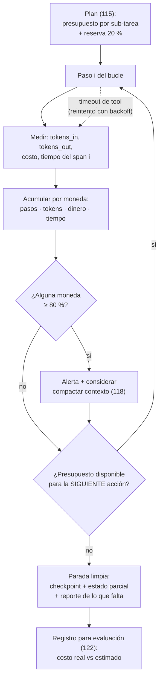

# 121 — Presupuestos de pasos, tokens, costo y tiempo

> [← Clase anterior](../../../classes/part-09-ai-agent-engineering/120-human-in-the-loop-y-aprobaciones/README.md) · [Índice de la parte](../README.md) · [Clase siguiente →](../../../classes/part-09-ai-agent-engineering/122-evaluacion-y-depuracion-de-agentes/README.md)

**Parte:** 09 — Ingeniería de agentes de IA  
**Nivel:** avanzado · **Horas estimadas:** 6  
**Laboratorio:** `observability` · **Estado:** `EXECUTABLE_CORE`

## 🎯 Propósito

Comprender **presupuestos de pasos, tokens, costo y tiempo** dentro de la evolución de la inteligencia
artificial, implementar un experimento mínimo verificable y distinguir qué parte
constituye evidencia frente a una afirmación todavía no comprobada.

## 📚 Resultados de aprendizaje

Al finalizar podrás:

1. Explicar presupuestos de pasos, tokens, costo y tiempo usando los conceptos `budget`, `tokens`, `cost`, `timeout`.
2. Ejecutar el laboratorio con una semilla explícita y revisar su contrato JSON.
3. Identificar al menos un supuesto, una limitación y un riesgo de aplicación.
4. Comparar el enfoque con la etapa anterior de la ruta de aprendizaje.
5. Producir una evidencia reproducible y una conclusión que no exceda los datos.

## 🧩 Conceptos centrales

`budget`, `tokens`, `cost`, `timeout`

## 🗺️ Ubicación en el mapa de la IA

Un modelo de una llamada tiene costo fijo; un agente tiene costo **abierto**: cada
iteración del bucle (114) vuelve a pagar el contexto acumulado y puede añadir pasos que
nadie previó. El presupuesto es al costo lo que la matriz de permisos (119) al riesgo:
el límite explícito que convierte "esperemos que no se dispare" en una garantía de
diseño. Esta clase da el vocabulario cuantitativo (pasos, tokens, dinero, tiempo) que
la parada del plan (115), los checkpoints (118) y la evaluación (122) necesitan para
ser operativos, y es requisito directo del proyecto integrador (123).

## 📖 Fundamentos

### 💰 Las cuatro monedas del presupuesto

- **Pasos:** número máximo de iteraciones del bucle (tool calls). Es el límite más
  simple y el primero que debe existir: acota cualquier bucle degenerado.
- **Tokens:** entrada + salida de cada llamada al modelo. Es la moneda del costo
  económico y del contexto (118). Ojo a la asimetría: el contexto se **re-paga** en
  cada iteración; los tokens de salida suelen costar varias veces más que los de
  entrada.
- **Dinero:** tokens × precio por token, más el costo de las tools (APIs de pago,
  cómputo). Es la moneda que entiende quien firma la factura.
- **Tiempo:** latencia total percibida y timeouts por operación. Un agente barato que
  tarda 40 minutos puede ser inaceptable; uno rápido que reintenta sin límite, carísimo.

Las cuatro se limitan por separado — la primera que se agote detiene la tarea — porque
no son intercambiables: un bucle de 3 pasos con contextos enormes revienta tokens sin
tocar el límite de pasos; mil pasos minúsculos hacen lo contrario.

### 🧮 El modelo de costo de un agente

Para un bucle de `n` pasos con contexto que crece linealmente (c₀ inicial, Δ tokens
añadidos por paso, s tokens de salida por paso):

```text
entrada del paso i  ≈ c0 + (i-1)·Δ
tokens de entrada   ≈ n·c0 + Δ·n·(n-1)/2        ← CUADRÁTICO en n
tokens de salida    ≈ n·s                        ← lineal en n
costo               = entrada·p_in + salida·p_out
```

La consecuencia de diseño: sin compactación (118), duplicar los pasos casi
cuadruplica los tokens de entrada. El presupuesto de tokens y la gestión de contexto
son la misma batalla vista desde dos clases.

### 📉 Presupuesto como contrato de tres fases

1. **Estimar (antes):** con el plan de la 112, presupuesto por sub-tarea + reserva
   (p. ej. 20 %). Si una sub-tarea no se puede estimar, se descompone otra vez.
2. **Medir (durante):** telemetría por paso — el laboratorio lo muestra como `spans`
   con tokens y estado; en producción, trazas OpenTelemetry con costo por span.
   Umbrales de alerta ANTES del corte (p. ej. avisar al 80 %).
3. **Actuar (al agotarse):** parada limpia con estado parcial (115), checkpoint (118)
   y reporte de qué falta. Nunca el corte abrupto a mitad de efecto: el presupuesto se
   comprueba ANTES de cada acción, no después.

### ⏱️ Timeouts y reintentos con presupuesto

Cada tool lleva su timeout; los reintentos (116) consumen presupuesto del mismo pozo, y
el backoff exponencial acota el tiempo total: `t_total ≤ Σ t_i · 2^(k-1)` para k
reintentos. Regla: el número de reintentos y su costo forman parte del presupuesto de
la sub-tarea, no son "gratis" por ser fallos.

## 🧮 Ejemplo trabajado

Presupuesto a mano para un agente que revisa un pull request (plan de 3 sub-tareas),
con precios de referencia p_in = 3 USD / millón de tokens y p_out = 15 USD / millón:

```text
Sub-tarea A  leer diff y contexto      3 pasos   c0=2.000, Δ=1.500, s=400
Sub-tarea B  analizar y comentar       4 pasos   (continúa el contexto)
Sub-tarea C  verificar tests           3 pasos

Estimación de tokens (bucle único de n=10, c0=2.000, Δ=1.500, s=400):
  entrada ≈ 10·2.000 + 1.500·(10·9/2) = 20.000 + 67.500 = 87.500 tokens
  salida  ≈ 10·400                                       = 4.000 tokens
Costo    ≈ 87.500/1e6·3 + 4.000/1e6·15
         ≈ 0,2625 + 0,06 = 0,3225 USD por revisión
Reserva 20 %              → presupuesto: 0,39 USD, 12 pasos, 110.000 tokens
Tiempo: 10 llamadas·6 s + tools 30 s ≈ 90 s → timeout de tarea: 3 min

Chequeo de sensibilidad (la parte que casi siempre se omite):
  con n=20 pasos: entrada ≈ 40.000 + 1.500·190 = 325.000 tokens (×3,7 el costo)
  → duplicar pasos NO duplica el costo: lo casi cuadruplica.
Decisión de diseño derivada: compactar al superar 8.000 tokens de contexto
  (Δ efectivo baja) y alertar al consumir el 80 % de cualquier moneda.
```

El laboratorio `observability` emite la versión mínima de la fase "medir": tres spans
con tokens (120 + 80 + 40 = 240) y duración total — los datos sobre los que un
presupuesto real corta o alerta.

## 📊 Propiedades y comparación

| Propiedad | Sin presupuesto | Solo límite de pasos | Presupuesto 4 monedas + telemetría |
|---|---|---|---|
| Peor caso de costo | no acotado | acotado en pasos, no en tokens | acotado en todas las monedas |
| Detección temprana | ninguna | al llegar al límite | alertas al 80 % por moneda |
| Parada | nunca o por crash | abrupta al límite | limpia: checkpoint + estado parcial |
| Atribución del gasto | imposible | parcial | por span/sub-tarea (quién gastó qué) |
| Costo de implementación | nulo | trivial | medio (telemetría + política) |



## ⚠️ Errores conceptuales frecuentes

1. **"El costo de un agente es proporcional a sus pasos."** Los tokens de entrada
   crecen cuadráticamente si el contexto no se compacta: el paso 20 puede costar 10
   veces más que el paso 2. La intuición lineal infra-presupuesta siempre.
2. **"Con limitar los pasos basta."** Las monedas no son intercambiables: pocos pasos
   con contexto gigante revientan tokens y dinero; muchos pasos baratos revientan
   tiempo. Se limitan las cuatro.
3. **"El presupuesto se comprueba al final."** Se comprueba ANTES de cada acción; si
   la próxima llamada no cabe, se para en un punto consistente. Comprobar después =
   cortar a mitad de efecto.
4. **"Agotar presupuesto es un fallo del agente."** Es un resultado previsto con
   salida diseñada: estado parcial + qué falta + costo consumido. El fallo sería no
   enterarse o morir sin reporte.
5. **"Los reintentos no cuentan porque son errores."** Cuentan doble: consumen la
   misma moneda y señalan un problema (tool inestable, timeout corto). Un presupuesto
   que no los mide oculta la causa más común de sobrecosto.

## 🚀 Del aprendizaje a la operación

El laboratorio entrega spans con tokens de demostración; operar exige medir de verdad:
exportar trazas a un collector (OpenTelemetry), atribuir costo por tarea/equipo/modelo,
mantener precios actualizados por proveedor, presupuestos por entorno (dev generoso,
prod estricto) y revisar mensualmente costo estimado vs real por tipo de tarea (122).
La madurez se nota en una pregunta: cuando el agente se detiene por presupuesto, ¿el
reporte permite decidir en un minuto si ampliar el presupuesto o arreglar el plan?

## 🧪 Laboratorio

```bash
python lab.py
```

El laboratorio llama a `ai_evolution.labs.run_lab("observability")`. Esta
decisión evita 183 implementaciones divergentes: cada clase tiene un entrypoint
propio, pero los motores didácticos se prueban como una biblioteca común.

### 🔍 Evidencia esperada

- tipo de laboratorio y semilla;
- entradas o decisiones observables;
- resultado estructurado;
- lista `evidence` con hechos que pueden inspeccionarse;
- lista `limitations` que impide presentar la demo como producción.

## 📓 Notebooks

- [📓 `notebook.ipynb`](notebook.ipynb): recorrido guiado con la materia resumida.
- [✍️ `notebook_student.ipynb`](notebook_student.ipynb): ejercicios para resolver.
- [✅ `notebook_solution.ipynb`](notebook_solution.ipynb): solución de referencia explicada.

## 📝 Evaluación

| Criterio | Peso |
|---|---:|
| Comprensión conceptual | 25 % |
| Ejecución reproducible | 25 % |
| Interpretación basada en evidencia | 25 % |
| Riesgos, límites y mejora propuesta | 25 % |

Consulta [assessment.md](assessment.md) para preguntas y criterio de aceptación.

## ⚠️ Errores comunes

| Síntoma | Causa probable | Corrección |
|---|---|---|
| El código corre, pero no hay conclusión | Se confundió ejecución con aprendizaje | Explica qué demuestra y qué no demuestra |
| El resultado cambia sin explicación | No se registró semilla o configuración | Conserva semilla, versión y parámetros |
| Se promete uso real | Se extrapoló desde una demo educativa | Declara entorno, datos, límites y revisión humana |
| Se copia una métrica aislada | No existe baseline ni costo de error | Añade comparación y criterio de decisión |

## ❓ Preguntas frecuentes

**¿Debo usar una API comercial?**  
No. El núcleo funciona localmente. Las extensiones LIVE se documentan por separado.

**¿El laboratorio representa una implementación industrial?**  
No por sí solo. Enseña el contrato y el patrón; producción exige integración,
seguridad, observabilidad, pruebas y operación.

**¿Dónde profundizo?**  
Revisa las especializaciones enlazadas en el README raíz y la ruta siguiente.

## 🔗 Referencias

- [OpenTelemetry — documentación oficial (trazas, spans y atributos: el estándar de la fase "medir")](https://opentelemetry.io/docs/) — uso: marco normativo de referencia
- [Anthropic Engineering — "Effective context engineering for AI agents" (el contexto que se re-paga y su compactación)](https://www.anthropic.com/engineering/effective-context-engineering-for-ai-agents) — uso: referencia consultada en su fuente original
- [Anthropic Engineering — "Building effective agents" (costo y latencia como trade-off explícito de los agentes)](https://www.anthropic.com/engineering/building-effective-agents) — uso: referencia consultada en su fuente original
- [Yao et al. (2022), "ReAct", arXiv:2210.03629 (el bucle cuyo costo se presupuesta)](https://arxiv.org/abs/2210.03629) — uso: fuente primaria del mecanismo estudiado
- [Kaplan et al. (2020), "Scaling Laws for Neural Language Models", arXiv:2001.08361 (relación cómputo-costo en LLMs)](https://arxiv.org/abs/2001.08361) — uso: fuente primaria del mecanismo estudiado

<!-- papers:inicio -->

---

## 📜 Papers que fundamentan esta clase

> Bloque generado por `python scripts/link_papers_to_classes.py`. La fuente es [`papers/catalog/papers.json`](../../../papers/catalog/papers.json).

| Paper | Año | Qué desbloqueó | Miniatura |
|---|---:|---|---|
| [P137 · Principios del metarrazonamiento](../../../papers/foundational/P137_metarrazonamiento/README.md) | 1991 | Convierte «cuánto pensar» en una decisión que se toma con el mismo criterio que cualquier otra: comparando el valor esperado de deliberar con lo que deliberar cuesta. | [notebook](../../../notebooks/papers/P137_metarrazonamiento.ipynb) |

Cada ficha explica el problema anterior, la matemática mínima, los límites y los errores de atribución más frecuentes. Para leerlas con método: [cómo leer un paper de IA](../../../papers/guides/COMO_LEER_UN_PAPER_DE_IA.md) · [anexos matemáticos](../../../papers/annexes/README.md).
<!-- papers:fin -->
---

## ⬅️ Clase anterior

[120 — Human-in-the-loop y aprobaciones](../../part-09-ai-agent-engineering/120-human-in-the-loop-y-aprobaciones/README.md)

## ➡️ Siguiente clase

[122 — Evaluación y depuración de agentes](../../part-09-ai-agent-engineering/122-evaluacion-y-depuracion-de-agentes/README.md)
