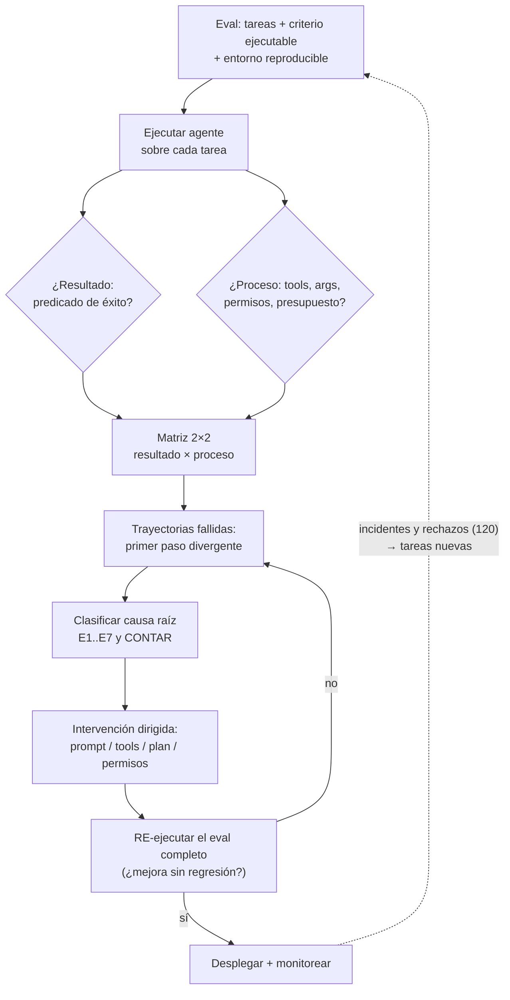

# 122 — Evaluación y depuración de agentes

> [← Clase anterior](../../../classes/part-09-ai-agent-engineering/121-presupuestos-de-pasos-tokens-costo-y-tiempo/README.md) · [Índice de la parte](../README.md) · [Clase siguiente →](../../../classes/part-09-ai-agent-engineering/123-proyecto-agente-individual-operativo/README.md)

**Parte:** 09 — Ingeniería de agentes de IA  
**Nivel:** avanzado · **Horas estimadas:** 6  
**Laboratorio:** `evaluation` · **Estado:** `EXECUTABLE_CORE`

## 🎯 Propósito

Comprender **evaluación y depuración de agentes** dentro de la evolución de la inteligencia
artificial, implementar un experimento mínimo verificable y distinguir qué parte
constituye evidencia frente a una afirmación todavía no comprobada.

## 📚 Resultados de aprendizaje

Al finalizar podrás:

1. Explicar evaluación y depuración de agentes usando los conceptos `trajectory`, `tool calls`, `success`, `regression`.
2. Ejecutar el laboratorio con una semilla explícita y revisar su contrato JSON.
3. Identificar al menos un supuesto, una limitación y un riesgo de aplicación.
4. Comparar el enfoque con la etapa anterior de la ruta de aprendizaje.
5. Producir una evidencia reproducible y una conclusión que no exceda los datos.

## 🧩 Conceptos centrales

`trajectory`, `tool calls`, `success`, `regression`

## 🗺️ Ubicación en el mapa de la IA

Evaluar un clasificador es comparar predicciones con etiquetas; evaluar un agente es
juzgar **trayectorias**: secuencias de decisiones no deterministas donde hay muchas
formas válidas de acertar y de fallar. Esta clase cierra el arco de la parte 09: todo
lo construido — trazas (114), planes (115), permisos (119), presupuestos (121) — se
convierte aquí en dato evaluable. Sin esta disciplina, cada cambio de prompt o de
modelo es una apuesta a ciegas; con ella, los agentes entran al ciclo de mejora que el
ML clásico ya conocía (partes 03-04) y que el proyecto 120 exige demostrar.

## 📖 Fundamentos

### 🎯 Evaluación de resultado vs evaluación de proceso

- **De resultado (outcome):** ¿el estado final del entorno satisface el objetivo? Se
  mide con un predicado verificable (los tests pasan, el archivo existe y valida, la
  respuesta coincide con la referencia). Es la métrica que importa al usuario; ignora
  el camino.
- **De proceso (trajectory):** ¿el CÓMO fue correcto? — herramientas pertinentes,
  argumentos válidos, sin pasos redundantes, permisos respetados, presupuesto
  razonable, sin fabricar observaciones. Detecta agentes que aciertan de casualidad
  (resultado ✓, proceso ✗ → fallará pronto) y agentes que fallan por una sola
  decisión reparable (resultado ✗, proceso casi ✓).

Ambas se necesitan: optimizar solo el resultado premia atajos frágiles o inseguros;
optimizar solo el proceso produce burocracia que no resuelve. La matriz 2×2
resultado×proceso es la primera herramienta de diagnóstico.

### 📊 Métricas sobre un conjunto de tareas

Un *eval* de agente = conjunto de tareas con criterio de éxito ejecutable + entorno
reproducible (semillas, datos fijos, tools simuladas). Métricas típicas:

```text
tasa de éxito        éxitos / tareas          (con IC: pocas tareas = mucha varianza)
pass@k               éxito en alguna de k ejecuciones (mide inestabilidad)
costo por éxito      $ total / éxitos          (une 118 con calidad)
pasos vs óptimo      pasos usados / pasos del experto
violaciones          asks saltados, denies intentados, budget excedido
```

Cuando el criterio no es un predicado simple (¿el resumen es fiel?), se usa
**LLM-as-judge** con rúbrica explícita — útil y escalable, pero es un evaluador con
sesgos que debe calibrarse contra juicio humano en una muestra.

### 🔬 Depuración: leer trayectorias

La depuración de agentes es análisis de trazas. Método sistemático:

1. Reunir las trayectorias fallidas del eval (no anécdotas de demo).
2. Localizar en cada una el **primer paso divergente**: la primera decisión que un
   experto no habría tomado (la observación posterior suele ser consecuencia).
3. Clasificar la causa raíz en una taxonomía estable:

```text
E1 instrucciones      objetivo/limites mal especificados en el prompt
E2 selección de tool  tool equivocada o descripción de tool ambigua (116)
E3 argumentos         schema correcto, valores incorrectos
E4 interpretación     la observación se leyó mal (o se ignoró)
E5 planificación      descomposición u orden defectuosos (115)
E6 parada             terminó antes de tiempo o no supo parar (112/118)
E7 entorno            la tool falló; el agente no tuvo culpa
```

4. Contar: la categoría más frecuente dicta la intervención (¿reescribir descripciones
   de tools? ¿mejorar el plan? ¿arreglar la tool?). Arreglar y **re-ejecutar el eval
   completo**: sin re-ejecución no hay evidencia de mejora, solo esperanza.

### 📉 Regresión: el eval como guardián del cambio

Todo cambio — modelo nuevo, prompt retocado, tool añadida — puede mejorar unas tareas
y romper otras (las mejoras rara vez son uniformes). El eval se ejecuta ANTES de
desplegar el cambio, como los tests en CI: se compara tasa de éxito global Y por
categoría de tarea, costo por éxito, y violaciones. Los rechazos humanos de la 117 y
los incidentes reales se destilan continuamente en tareas nuevas del eval — el
conjunto crece con cada fallo que duela. Esta práctica es lo que la industria llama
**evaluation-driven development (EDD)**: el eval en CI como *gate* de despliegue — si
no se puede medir, no se despliega. El estándar 2026 invierte el orden clásico: el eval
se escribe (o se amplía) *antes* del cambio, exactamente como TDD hizo con los tests.

## 🧮 Ejemplo trabajado

El laboratorio `evaluation` entrega la matriz mínima de un detector dentro de un eval:
tp=3, fp=1, fn=1 → precision = 3/(3+1) = 0,75; recall = 3/(3+1) = 0,75. La lectura
importa más que el número: con 8 ejemplos, el intervalo de confianza es enorme —
`limitations` lo declara. Ahora la versión agente: eval de 20 tareas de "corregir un
bug con tests":

```text
resultado ✓ proceso ✓   11   comportamiento deseado
resultado ✓ proceso ✗    3   p. ej. borró el test que fallaba y "pasó todo"
resultado ✗ proceso ✓    4   plan correcto; falló E7 (flaky test) en 2, E3 en 2
resultado ✗ proceso ✗    2   E5: descomposición errónea desde el paso 1

tasa de éxito ingenua: 14/20 = 70 %
tasa de éxito honesta (✓✓): 11/20 = 55 %   ← la que se reporta
primer paso divergente contado: E3 ×2, E5 ×2, E7 ×2, borrar-tests ×3
intervención elegida: prohibir editar tests vía permisos (119) — convierte
  los 3 "✓✗" en fallos visibles — y reintento con backoff para E7.
re-ejecución tras el cambio: ✓✓ = 14/20 = 70 % real, violaciones = 0.
```

El caso "borró el test" ilustra por qué el resultado solo no basta: la métrica ingenua
lo contaba como éxito; el eval de proceso lo convirtió en el defecto más urgente.

## 📊 Propiedades y comparación

| Propiedad | Eval de resultado | Eval de proceso | Demo manual |
|---|---|---|---|
| Qué responde | ¿lo logró? | ¿cómo lo logró? | ¿me gustó una vez? |
| Automatizable | alta (predicados) | media (reglas + judge) | nula |
| Detecta éxito por casualidad | no | sí | no |
| Detecta regresiones | sí, si se re-ejecuta | sí, con taxonomía | no |
| Costo de construcción | medio (tareas + criterio) | alto (rúbricas por paso) | nulo (por eso engaña) |
| Riesgo principal | premiar atajos frágiles | burocratizar el camino | generalizar de n=1 |



## ⚠️ Errores conceptuales frecuentes

1. **"Funcionó en mi demo, está listo."** Una trayectoria no es evidencia: los agentes
   son no deterministas y las tareas reales varían. Sin conjunto de tareas y
   re-ejecución, solo hay anécdota.
2. **"La tasa de éxito lo resume todo."** Oculta los éxitos por atajo (proceso ✗), el
   costo por éxito y las violaciones de seguridad. Un 90 % que borra tests para "pasar"
   es peor que un 70 % honesto.
3. **"El error está donde el agente se rindió."** El fallo visible suele ser síntoma;
   la causa vive en el primer paso divergente, a menudo varios pasos antes. Depurar
   desde el final invierte el diagnóstico.
4. **"LLM-as-judge resuelve la evaluación."** Es un evaluador útil pero sesgado
   (posición, verbosidad, auto-preferencia); sin calibración contra humanos en una
   muestra, automatiza un criterio no validado.
5. **"Mejoré el prompt: los casos que probé van mejor."** Sin re-ejecutar el eval
   completo no se ve la regresión en los casos que no probaste — el cambio de prompt es
   el commit sin CI de los agentes.

## 🚀 Del aprendizaje a la operación

El laboratorio calcula precision/recall sobre 8 ejemplos sintéticos; un eval operativo
exige: 50-200 tareas por capacidad con entorno reproducible (tools simuladas o
sandbox), ejecución en CI ante cada cambio de prompt/modelo/tool, panel con tasa de
éxito por categoría, costo por éxito (121) y violaciones (116-117), calibración
periódica del judge contra revisión humana, y el circuito incidente → tarea nueva del
eval. La señal de madurez: ante "¿podemos cambiar al modelo X?", la respuesta es una
tabla comparativa del eval, no una opinión.

## 🧪 Laboratorio

```bash
python lab.py
```

El laboratorio llama a `ai_evolution.labs.run_lab("evaluation")`. Esta
decisión evita 183 implementaciones divergentes: cada clase tiene un entrypoint
propio, pero los motores didácticos se prueban como una biblioteca común.

### 🔍 Evidencia esperada

- tipo de laboratorio y semilla;
- entradas o decisiones observables;
- resultado estructurado;
- lista `evidence` con hechos que pueden inspeccionarse;
- lista `limitations` que impide presentar la demo como producción.

## 📓 Notebooks

- [📓 `notebook.ipynb`](notebook.ipynb): recorrido guiado con la materia resumida.
- [✍️ `notebook_student.ipynb`](notebook_student.ipynb): ejercicios para resolver.
- [✅ `notebook_solution.ipynb`](notebook_solution.ipynb): solución de referencia explicada.

## 📝 Evaluación

| Criterio | Peso |
|---|---:|
| Comprensión conceptual | 25 % |
| Ejecución reproducible | 25 % |
| Interpretación basada en evidencia | 25 % |
| Riesgos, límites y mejora propuesta | 25 % |

Consulta [assessment.md](assessment.md) para preguntas y criterio de aceptación.

## ⚠️ Errores comunes

| Síntoma | Causa probable | Corrección |
|---|---|---|
| El código corre, pero no hay conclusión | Se confundió ejecución con aprendizaje | Explica qué demuestra y qué no demuestra |
| El resultado cambia sin explicación | No se registró semilla o configuración | Conserva semilla, versión y parámetros |
| Se promete uso real | Se extrapoló desde una demo educativa | Declara entorno, datos, límites y revisión humana |
| Se copia una métrica aislada | No existe baseline ni costo de error | Añade comparación y criterio de decisión |

## ❓ Preguntas frecuentes

**¿Debo usar una API comercial?**  
No. El núcleo funciona localmente. Las extensiones LIVE se documentan por separado.

**¿El laboratorio representa una implementación industrial?**  
No por sí solo. Enseña el contrato y el patrón; producción exige integración,
seguridad, observabilidad, pruebas y operación.

**¿Dónde profundizo?**  
Revisa las especializaciones enlazadas en el README raíz y la ruta siguiente.

## 🔗 Referencias

- [Liu et al. (2023), "AgentBench: Evaluating LLMs as Agents", arXiv:2308.03688 (benchmark multi-entorno de agentes)](https://arxiv.org/abs/2308.03688)
- [Jimenez et al. (2023), "SWE-bench: Can Language Models Resolve Real-World GitHub Issues?", arXiv:2310.06770 (eval de resultado con tests como predicado)](https://arxiv.org/abs/2310.06770)
- [Zheng et al. (2023), "Judging LLM-as-a-Judge with MT-Bench and Chatbot Arena", arXiv:2306.05685 (sesgos y calibración del juez LLM)](https://arxiv.org/abs/2306.05685)
- [Anthropic Engineering — "Building effective agents" (medir y simplificar antes de complejizar)](https://www.anthropic.com/engineering/building-effective-agents)
- [Yao et al. (2022), "ReAct", arXiv:2210.03629 (análisis de errores por tipo sobre trayectorias)](https://arxiv.org/abs/2210.03629)
- [OpenTelemetry — documentación oficial (las trazas que hacen posible el análisis de trayectorias)](https://opentelemetry.io/docs/)

<!-- papers:inicio -->

---

## 📜 Papers que fundamentan esta clase

> Bloque generado por `python scripts/link_papers_to_classes.py`. La fuente es [`papers/catalog/papers.json`](../../../papers/catalog/papers.json).

| Paper | Año | Qué desbloqueó | Miniatura |
|---|---:|---|---|
| [P16 · Sistemas agentic contemporáneos: memoria, reflexión, multiagente e interoperabilidad](../../../papers/foundational/P16_agentic_systems/README.md) | 2023 | El agente deja de ser un bucle y pasa a ser un sistema: memoria, reflexión, planificación, presupuesto, múltiples agentes y protocolos de interoperabilidad. | [notebook](../../../notebooks/papers/P16_agentic_systems.ipynb) |
| [P30 · Reflexion: agentes de lenguaje con refuerzo verbal](../../../papers/foundational/P30_reflexion/README.md) | 2023 | El agente aprende entre intentos sin tocar un solo peso: el refuerzo ocurre en el contexto, en lenguaje natural. | [notebook](../../../notebooks/papers/P30_reflexion.ipynb) |
| [P51 · SWE-bench: ¿pueden los modelos resolver incidencias reales de GitHub?](../../../papers/foundational/P51_swebench/README.md) | 2023 | Cambia el criterio de evaluación: no si el código parece bien, sino si los tests del repositorio real pasan. | [notebook](../../../notebooks/papers/P51_swebench.ipynb) |

Cada ficha explica el problema anterior, la matemática mínima, los límites y los errores de atribución más frecuentes. Para leerlas con método: [cómo leer un paper de IA](../../../papers/guides/COMO_LEER_UN_PAPER_DE_IA.md) · [anexos matemáticos](../../../papers/annexes/README.md).
<!-- papers:fin -->
---

## ⬅️ Clase anterior

[121 — Presupuestos de pasos, tokens, costo y tiempo](../../part-09-ai-agent-engineering/121-presupuestos-de-pasos-tokens-costo-y-tiempo/README.md)

## ➡️ Siguiente clase

[123 — Proyecto: agente individual operativo](../../part-09-ai-agent-engineering/123-proyecto-agente-individual-operativo/README.md)
