# 🤖 Parte 09 — Ingeniería de agentes de IA

**Nivel:** avanzado · **Duración sugerida:** 6–7 semanas ·
**Clases:** 12

Diferencia agentes de prompts y automatizaciones, y construye agentes capaces de elegir herramientas, mantener estado, pedir aprobación y demostrar resultados.

## 🧭 Secuencia de la parte

```mermaid
flowchart LR
    L112["112<br/>De modelo y<br/>automatización a agente"]
    L113["113<br/>Anatomía: instrucciones, herramientas,<br/>estado y salida"]
    L114["114<br/>Ciclo ReAct y<br/>observación del entorno"]
    L115["115<br/>Planificación y descomposición<br/>de tareas"]
    L116["116<br/>Herramientas tipadas y<br/>efectos laterales"]
    L117["117<br/>Prompt, recurso, tool,<br/>skill, workflow y<br/>agente"]
    L118["118<br/>Memoria, contexto y<br/>continuidad"]
    L119["119<br/>Permisos, sandbox y<br/>mínimo privilegio"]
    L120["120<br/>Human-in-the-loop y aprobaciones"]
    L121["121<br/>Presupuestos de pasos,<br/>tokens, costo y<br/>tiempo"]
    L122["122<br/>Evaluación y depuración<br/>de agentes"]
    L123["123<br/>Proyecto: agente individual<br/>operativo"]
    L112 --> L113
    L113 --> L114
    L114 --> L115
    L115 --> L116
    L116 --> L117
    L117 --> L118
    L118 --> L119
    L119 --> L120
    L120 --> L121
    L121 --> L122
    L122 --> L123
```

## 📚 Clases

| ID | Tema | Laboratorio | Horas |
|---:|---|---|---:|
| 112 | [De modelo y automatización a agente](112-de-modelo-y-automatizacion-a-agente/README.md) | `agent` | 6 |
| 113 | [Anatomía: instrucciones, herramientas, estado y salida](113-anatomia-instrucciones-herramientas-estado-y-salida/README.md) | `agent` | 6 |
| 114 | [Ciclo ReAct y observación del entorno](114-ciclo-react-y-observacion-del-entorno/README.md) | `agent` | 6 |
| 115 | [Planificación y descomposición de tareas](115-planificacion-y-descomposicion-de-tareas/README.md) | `workflow` | 6 |
| 116 | [Herramientas tipadas y efectos laterales](116-herramientas-tipadas-y-efectos-laterales/README.md) | `agent` | 6 |
| 117 | [Prompt, recurso, tool, skill, workflow y agente](117-prompt-recurso-tool-skill-workflow-y-agente/README.md) | `agent` | 6 |
| 118 | [Memoria, contexto y continuidad](118-memoria-contexto-y-continuidad/README.md) | `agent` | 6 |
| 119 | [Permisos, sandbox y mínimo privilegio](119-permisos-sandbox-y-minimo-privilegio/README.md) | `safety` | 6 |
| 120 | [Human-in-the-loop y aprobaciones](120-human-in-the-loop-y-aprobaciones/README.md) | `workflow` | 6 |
| 121 | [Presupuestos de pasos, tokens, costo y tiempo](121-presupuestos-de-pasos-tokens-costo-y-tiempo/README.md) | `observability` | 6 |
| 122 | [Evaluación y depuración de agentes](122-evaluacion-y-depuracion-de-agentes/README.md) | `evaluation` | 6 |
| 123 | [Proyecto: agente individual operativo](123-proyecto-agente-individual-operativo/README.md) | `capstone` | 10 |

## 📝 Evaluación de la parte

- 40 % laboratorios y notebooks.
- 25 % explicaciones y comparación de enfoques.
- 20 % evaluación de riesgos y limitaciones.
- 15 % mini-proyecto o integración.

[⬅️ Parte 08 — Recuperación, contexto, memoria y conocimiento](../part-08-retrieval-context-memory-and-knowledge/README.md) · [🏠 Volver al programa](../../README.md) · [➡️ Parte 10 — Sistemas multiagente e interoperabilidad](../part-10-multi-agent-systems-and-interoperability/README.md)
