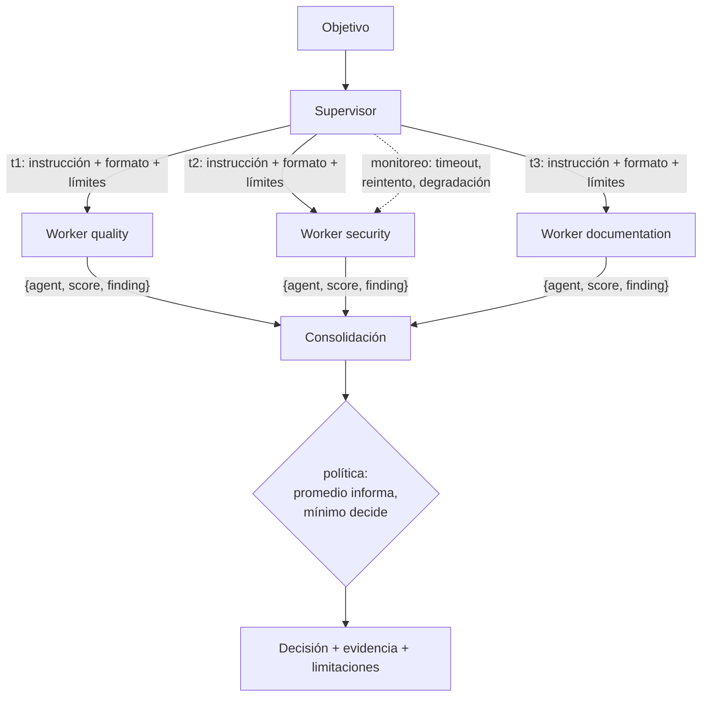

# 124 — Supervisor-workers

> [← Clase anterior](../../../classes/part-10-multi-agent-systems-and-interoperability/123-handoffs-y-transferencia-de-contexto/README.md) · [Índice de la parte](../README.md) · [Clase siguiente →](../../../classes/part-10-multi-agent-systems-and-interoperability/125-paralelismo-fan-out-y-map-reduce/README.md)

**Parte:** 10 — Sistemas multiagente e interoperabilidad  
**Nivel:** experto · **Horas estimadas:** 6  
**Laboratorio:** `multiagent` · **Estado:** `EXECUTABLE_CORE`

## 🎯 Propósito

Comprender **supervisor-workers** dentro de la evolución de la inteligencia
artificial, implementar un experimento mínimo verificable y distinguir qué parte
constituye evidencia frente a una afirmación todavía no comprobada.

## 📚 Resultados de aprendizaje

Al finalizar podrás:

1. Explicar supervisor-workers usando los conceptos `supervisor`, `workers`, `tasks`, `consolidation`.
2. Ejecutar el laboratorio con una semilla explícita y revisar su contrato JSON.
3. Identificar al menos un supuesto, una limitación y un riesgo de aplicación.
4. Comparar el enfoque con la etapa anterior de la ruta de aprendizaje.
5. Producir una evidencia reproducible y una conclusión que no exceda los datos.

## 🧩 Conceptos centrales

`supervisor`, `workers`, `tasks`, `consolidation`

## 🗺️ Ubicación en el mapa de la IA

Supervisor-workers (también *orchestrator-workers*) es la arquitectura multiagente más
usada en producción: un agente coordina y varios ejecutan. Combina lo aprendido en
router (122) y handoffs (123) bajo un control central, y es el diseño del sistema de
investigación multiagente de Anthropic (un *lead agent* Opus con subagentes Sonnet).
Las clases siguientes lo extienden: fan-out paralelo (125), crítica (126) y blackboard
(127) como alternativa descentralizada.

## 📖 Fundamentos

### 🧭 Roles y responsabilidades

**Supervisor** (orquestador): recibe el objetivo, lo **descompone** en tareas, las
**asigna** a workers con instrucciones explícitas, **monitorea** el progreso y
**consolida** los resultados en una respuesta única. No ejecuta el trabajo de dominio:
su especialidad es la coordinación.

**Worker**: ejecuta una tarea acotada con su propio contexto y herramientas, y
devuelve un resultado con **contrato común** (mismo esquema para todos), condición
necesaria para que la consolidación sea comparable y automatizable.

### 🔄 El ciclo completo

```text
1. DESCOMPONER   objetivo → [t1, t2, ..., tn]
   cada tarea: descripción, salida esperada, herramientas, presupuesto, límites
2. ASIGNAR       ti → worker_j  (por especialidad, carga o disponibilidad)
3. EJECUTAR      workers en secuencia o en paralelo (clase 125)
4. MONITOREAR    timeouts, fallos parciales, resultados vacíos
   → reintentar, reasignar o degradar (continuar sin ese resultado, marcándolo)
5. CONSOLIDAR    resultados → decisión/síntesis
   políticas: promedio, mínimo (el peor manda), ponderada, veto por criticidad
6. RENDIR CUENTAS  respuesta final + evidencia por worker + limitaciones
```

La lección empírica de Anthropic sobre el paso 2 es la más citada: los primeros
prototipos fallaban porque el lead daba instrucciones vagas ("investiga X") y los
subagentes duplicaban trabajo o divergían. La corrección: cada asignación lleva
**objetivo, formato de salida, herramientas permitidas y límites de esfuerzo**
explícitos. La descomposición es en sí una tarea cognitiva difícil — y el punto único
de fallo del patrón.

### ⚖️ Políticas de consolidación

Con scores `s₁…sₙ` del contrato común:

- **Promedio**: `overall = Σsᵢ/n` — resume, pero un aspecto crítico bajo queda
  enmascarado por los demás.
- **Mínimo (weakest link)**: la decisión la fija el peor aspecto — adecuada cuando
  cualquier fallo bloquea (seguridad, cumplimiento).
- **Ponderada**: `Σwᵢsᵢ` con pesos por criticidad declarados de antemano.
- **Veto**: ciertos workers (p. ej. seguridad) pueden bloquear sin importar el resto.

El laboratorio usa promedio *informativo* + decisión por mínimo: reporta
`overall = 0.7667` pero decide "mejorar seguridad" porque `security = 0.6 < 0.7`.
Reportar ambos es deliberado: el promedio comunica el estado global; el mínimo, la
acción.

## 🧮 Ejemplo trabajado

Objetivo: "evaluar preparación del repositorio `demo` para publicarse".

```text
Descomposición del supervisor:
  t1 → worker quality:       "¿hay tests y pasan?"          límite: 1 pasada
  t2 → worker security:      "¿hay threat model y secretos?" límite: 1 pasada
  t3 → worker documentation: "¿hay guías de uso?"           límite: 1 pasada

Contratos devueltos (mismo esquema {agent, score, finding}):
  quality:       0.8  "tests presentes"
  security:      0.6  "falta threat model"
  documentation: 0.9  "guías presentes"

Consolidación:
  overall = (0.8 + 0.6 + 0.9) / 3 = 0.7667
  regla de decisión: min(scores) = 0.6 < 0.7 → "mejorar seguridad"
```

Variante con fallo parcial: si `security` no responde (timeout), las opciones del
supervisor son (a) reintentar con presupuesto reducido, (b) degradar y decidir con 2/3
marcando la ausencia en `limitations`, o (c) abortar. Para un criterio de veto como
seguridad, (b) es peligrosa: la política correcta suele ser reintentar y, si persiste,
escalar — nunca decidir "aprobado" con el worker de veto ausente.

## 📊 Propiedades y comparación

| Propiedad | Supervisor-workers | Router (122) | Blackboard (127) | Debate (126) |
|---|---|---|---|---|
| Control | Central, jerárquico | Central, previo | Descentralizado | Entre pares |
| Punto único de fallo | El supervisor | El router | El medio compartido | El juez/votación |
| Descomposición | Explícita, del supervisor | No hay (1 tarea → 1 ruta) | Emergente | No hay |
| Consolidación | Política declarada | No aplica | Incremental en el medio | Votación/convergencia |
| Escalabilidad | n workers, coste lineal | n especialistas | n contribuyentes | Cara (rondas × agentes) |
| Depuración | Media: traza en árbol | Fácil | Difícil | Media |



## ⚠️ Errores conceptuales frecuentes

1. **Instrucciones vagas a los workers.** "Investiga X" produce duplicación y
   divergencia; cada asignación necesita objetivo, formato, herramientas y límites
   (lección central del sistema de Anthropic).
2. **Consolidar por promedio a secas.** Un 0.77 global puede ocultar un 0.6 en
   seguridad; la política de decisión debe declararse antes de ver los datos.
3. **El supervisor hace el trabajo de dominio.** Si el supervisor "corrige" a los
   workers, se convierte en cuello de botella y sesga la consolidación; su rol es coordinar.
4. **Ignorar fallos parciales.** Un worker caído no es un score 0: es un dato ausente,
   y tratarlo como 0 corrompe promedio y mínimo por igual.
5. **Contratos heterogéneos.** Si cada worker devuelve un formato distinto, la
   consolidación se vuelve un parser frágil; el contrato común es prerrequisito, no adorno.

## 🚀 Del aprendizaje a la operación

Faltan para producción: workers LLM reales con varianza (misma tarea, resultados
distintos → ejecutar k réplicas o validar salidas); presupuestos duros por worker y
global con corte; trazas anidadas supervisor→worker para atribuir coste y errores;
persistencia del estado de la orquesta para reanudar tras caída (clase 132); y
evaluación de extremo a extremo, porque optimizar cada worker por separado no
garantiza mejorar la decisión final.

## 🧪 Laboratorio

```bash
python lab.py
```

El laboratorio llama a `ai_evolution.labs.run_lab("multiagent")`. Esta
decisión evita 180 implementaciones divergentes: cada clase tiene un entrypoint
propio, pero los motores didácticos se prueban como una biblioteca común.

### 🔍 Evidencia esperada

- tipo de laboratorio y semilla;
- entradas o decisiones observables;
- resultado estructurado;
- lista `evidence` con hechos que pueden inspeccionarse;
- lista `limitations` que impide presentar la demo como producción.

## 📓 Notebooks

- [📓 `notebook.ipynb`](notebook.ipynb): recorrido guiado con la materia resumida.
- [✍️ `notebook_student.ipynb`](notebook_student.ipynb): ejercicios para resolver.
- [✅ `notebook_solution.ipynb`](notebook_solution.ipynb): solución de referencia explicada.

## 📝 Evaluación

| Criterio | Peso |
|---|---:|
| Comprensión conceptual | 25 % |
| Ejecución reproducible | 25 % |
| Interpretación basada en evidencia | 25 % |
| Riesgos, límites y mejora propuesta | 25 % |

Consulta [assessment.md](assessment.md) para preguntas y criterio de aceptación.

## ⚠️ Errores comunes

| Síntoma | Causa probable | Corrección |
|---|---|---|
| El código corre, pero no hay conclusión | Se confundió ejecución con aprendizaje | Explica qué demuestra y qué no demuestra |
| El resultado cambia sin explicación | No se registró semilla o configuración | Conserva semilla, versión y parámetros |
| Se promete uso real | Se extrapoló desde una demo educativa | Declara entorno, datos, límites y revisión humana |
| Se copia una métrica aislada | No existe baseline ni costo de error | Añade comparación y criterio de decisión |

## ❓ Preguntas frecuentes

**¿Debo usar una API comercial?**  
No. El núcleo funciona localmente. Las extensiones LIVE se documentan por separado.

**¿El laboratorio representa una implementación industrial?**  
No por sí solo. Enseña el contrato y el patrón; producción exige integración,
seguridad, observabilidad, pruebas y operación.

**¿Dónde profundizo?**  
Revisa las especializaciones enlazadas en el README raíz y la ruta siguiente.

## 🔗 Referencias

- [Anthropic — How we built our multi-agent research system (2025)](https://www.anthropic.com/engineering/multi-agent-research-system): arquitectura lead agent + subagentes, lecciones de instrucciones explícitas y coste.
- [Anthropic — Building effective agents (2024)](https://www.anthropic.com/engineering/building-effective-agents): el workflow *orchestrator-workers*.
- [Wu et al., *AutoGen* (arXiv:2308.08155)](https://arxiv.org/abs/2308.08155): patrones de chat en grupo con un manager que coordina agentes.
- [LangGraph — Subgraphs](https://docs.langchain.com/oss/python/langgraph/use-subgraphs): supervisores y workers como grafos anidados con estado propio.
- Wooldridge, M., *An Introduction to MultiAgent Systems*, 2.ª ed., Wiley, 2009: asignación de tareas y cooperación (Contract Net como antecedente).

---

## ⬅️ Clase anterior

[123 — Handoffs y transferencia de contexto](../../part-10-multi-agent-systems-and-interoperability/123-handoffs-y-transferencia-de-contexto/README.md)

## ➡️ Siguiente clase

[125 — Paralelismo, fan-out y map-reduce](../../part-10-multi-agent-systems-and-interoperability/125-paralelismo-fan-out-y-map-reduce/README.md)
