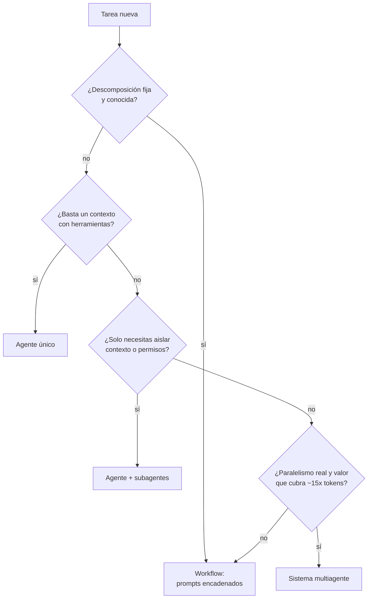

# 124 — Workflow, subagente y sistema multiagente

> [← Clase anterior](../../../classes/part-09-ai-agent-engineering/123-proyecto-agente-individual-operativo/README.md) · [Índice de la parte](../README.md) · [Clase siguiente →](../../../classes/part-10-multi-agent-systems-and-interoperability/125-router-y-especialistas/README.md)

**Parte:** 10 — Sistemas multiagente e interoperabilidad  
**Nivel:** experto · **Horas estimadas:** 6  
**Laboratorio:** `multiagent` · **Estado:** `EXECUTABLE_CORE`

## 🎯 Propósito

Comprender **workflow, subagente y sistema multiagente** dentro de la evolución de la inteligencia
artificial, implementar un experimento mínimo verificable y distinguir qué parte
constituye evidencia frente a una afirmación todavía no comprobada.

## 📚 Resultados de aprendizaje

Al finalizar podrás:

1. Explicar workflow, subagente y sistema multiagente usando los conceptos `workflow`, `subagent`, `multi-agent`, `delegation`.
2. Ejecutar el laboratorio con una semilla explícita y revisar su contrato JSON.
3. Identificar al menos un supuesto, una limitación y un riesgo de aplicación.
4. Comparar el enfoque con la etapa anterior de la ruta de aprendizaje.
5. Producir una evidencia reproducible y una conclusión que no exceda los datos.

## 🧩 Conceptos centrales

`workflow`, `subagent`, `multi-agent`, `delegation`

## 🗺️ Ubicación en el mapa de la IA

Esta clase abre la Parte 10 y define su vocabulario base. En la Parte 9 construiste un
agente individual (bucle percibir → decidir → actuar con herramientas); aquí clasificas
las arquitecturas que aparecen cuando una sola instancia de LLM ya no basta: workflows
orquestados por código, subagentes delegados y sistemas multiagente propiamente dichos.
Distinguirlos con precisión es el prerrequisito de todo lo que sigue: router (125),
handoffs (126), supervisor-workers (127) y los protocolos de interoperabilidad (129-131).

## 📖 Fundamentos

### 🧱 Tres arquitecturas, tres contratos de control

**Workflow**: sistema donde el *código* define el flujo de control. Los pasos —incluidas
las llamadas al LLM— están encadenados por lógica predeterminada (secuencia, ramas,
reintentos). El LLM rellena pasos; no decide qué paso viene después. Anthropic
("Building effective agents", 2024) reserva el término *agente* para sistemas donde el
LLM "dirige dinámicamente sus propios procesos y uso de herramientas".

**Subagente**: un agente (o llamada LLM con contexto propio) invocado *por otro agente*
como si fuera una herramienta. La relación es jerárquica y síncrona en su contrato:
el llamador formula una tarea, el subagente trabaja con su propia ventana de contexto
y devuelve un resultado resumido. El llamador conserva la propiedad de la conversación.

**Sistema multiagente**: varios agentes con objetivos, contextos y bucles de decisión
propios que se coordinan mediante mensajes o memoria compartida. Ningún componente ve
todo el estado; la coordinación (quién hace qué, cuándo termina, cómo se resuelven
conflictos) es un problema de diseño explícito — el objeto de estudio clásico de
Wooldridge, *An Introduction to MultiAgent Systems* (2.ª ed., Wiley, 2009).

### 🔁 Delegación: la operación común

Las tres arquitecturas comparten una primitiva: **delegación** — transferir una subtarea
con (a) una especificación, (b) un presupuesto (tokens, pasos, tiempo) y (c) un contrato
de retorno. Difieren en *quién* delega y *quién* controla el flujo:

```text
                 ¿Quién decide el siguiente paso?   ¿Cuántos contextos LLM?
workflow         el código (grafo fijo)             1..n, sin autonomía
subagente        el agente padre                    padre + hijos aislados
multiagente      cada agente, negociando            n contextos autónomos
```

### 🚫 Cuándo NO usar multiagente

La guía de Anthropic es explícita: *"busca la solución más simple posible y solo
incrementa la complejidad cuando sea necesario"*. Señales de que un multiagente es
sobre-ingeniería:

1. **La tarea es descomponible de forma fija** → un workflow con prompts encadenados
   es más barato, más depurable y determinista.
2. **Solo necesitas aislar contexto** (p. ej. búsquedas largas que ensucian la ventana)
   → basta un subagente.
3. **No hay paralelismo real ni especialización de herramientas** → n agentes añaden
   latencia y coste sin beneficio.
4. **Dominios de escritura fuertemente acoplados** (editar el mismo código a la vez):
   Anthropic reporta en su sistema de investigación multiagente que la coordinación
   entre agentes que escriben sobre el mismo artefacto sigue siendo un problema abierto.
5. **Coste**: el sistema multiagente de Anthropic consume ≈ **15×** los tokens de un
   chat simple; solo se justifica si el valor de la tarea lo cubre.

El argumento a favor, cuando aplica: paralelismo de exploración (búsqueda amplia),
separación de contextos que exceden una ventana, y especialización de permisos y
herramientas por rol. AutoGen (Wu et al., arXiv:2308.08155) formaliza esto como
*conversaciones* entre agentes conversables y programables.

### 📇 El catálogo canónico de patrones agénticos

La industria converge en dos catálogos que conviene saber nombrar, porque son el
vocabulario de entrevistas, papers y documentación de frameworks. Las clases 125-130 los
enseñan uno a uno; esta tabla es el diccionario:

| Patrón (nombre canónico) | Fuente | Clase de este programa |
|---|---|---|
| Prompt chaining | Anthropic (workflow) | 121 (workflow) |
| Routing | Anthropic (workflow) | 122 — router y especialistas |
| Parallelization | Anthropic (workflow) | 125 — fan-out y map-reduce |
| Orchestrator-workers | Anthropic (workflow) | 124 — supervisor-workers |
| Evaluator-optimizer | Anthropic (workflow) | 126 — crítica y revisión |
| Reflection | Ng (patrón agéntico) | 126 — crítica, revisión y debate |
| Tool use | Ng (patrón agéntico) | 113 — herramientas tipadas |
| Planning | Ng (patrón agéntico) | 112 — planificación y descomposición |
| Multi-agent collaboration | Ng (patrón agéntico) | 121-128 (esta parte completa) |

### 🕸️ Graph engineering: el flujo como grafo explícito

Hay una cuarta forma de organizar el control que no aparece en la tabla de tres
arquitecturas porque las atraviesa: **graph engineering** (también *flow engineering*) —
formalizar el sistema como un **grafo de estados explícito** en vez de como bucle
imperativo. Sus elementos:

```text
nodos     agentes o funciones (llamadas LLM, tools, código puro)
aristas   transiciones de control — incluidas ARISTAS CONDICIONALES
          (la siguiente arista se elige en runtime según el estado)
estado    un objeto TIPADO y compartido que fluye por las aristas
extras    checkpointing (persistencia y reanudación, clase 118),
          puntos de interrupción para aprobación humana (clase 120),
          fan-out/fan-in nativos (clase 128)
```

La diferencia con el workflow clásico: el grafo no es un guion rígido — las aristas
condicionales le devuelven al modelo decisión *local* (qué rama tomar) mientras el
ingeniero conserva la decisión *global* (qué ramas existen). La diferencia con el agente
puro: la trayectoria posible está acotada por construcción, lo que hace el sistema
auditable, testeable por nodo y reanudable. LangGraph, el ADK de Google y CrewAI Flows
implementan exactamente esta abstracción; el proyecto de la clase 135 (sistema
multiagente durable) la ejercita con checkpoints. Regla de decisión: bucle libre cuando
la trayectoria es genuinamente impredecible; grafo cuando puedes enumerar los estados
legales — y en producción casi siempre puedes.

## 🧮 Ejemplo trabajado

Tarea: "evaluar si el repositorio `demo` está listo para publicarse".

**Como workflow** (control en el código): `lint → tests → docs → informe`. 4 llamadas
LLM fijas. Si `tests` falla, el código decide reintentar. Coste ≈ 4 × (600 tokens
entrada + 300 salida) ≈ 3 600 tokens.

**Como subagentes**: un agente evaluador delega "revisar seguridad" a un subagente con
su propio contexto (lee 20 archivos, ~30 000 tokens) y recibe solo el resumen
(300 tokens). La ventana del padre queda protegida: paga 300, no 30 000.

**Como multiagente** (lo que ejecuta `run_lab("multiagent")`): tres workers
(`quality`, `security`, `documentation`) producen contratos comparables
`{agent, score, finding}` y un supervisor consolida:

```text
quality: 0.8   security: 0.6   documentation: 0.9
overall = (0.8 + 0.6 + 0.9) / 3 = 2.3 / 3 ≈ 0.7667
decisión = "mejorar seguridad"  (mínimo por debajo del umbral 0.7)
```

Nota la decisión de diseño: el supervisor conserva los *hallazgos*, no solo el
promedio. Un promedio de 0.7667 ocultaría que seguridad está en 0.6.

## 📊 Propiedades y comparación

| Propiedad | Workflow | Subagente | Multiagente |
|---|---|---|---|
| Control de flujo | Código (determinista) | Agente padre | Distribuido/negociado |
| Contextos LLM | Compartido o por paso | Aislados, jerárquicos | Aislados, autónomos |
| Depuración | Fácil (traza lineal) | Media (árbol de llamadas) | Difícil (no determinista) |
| Coste en tokens | Bajo (≈1×) | Medio (≈3-4×) | Alto (≈15× según Anthropic) |
| Paralelismo | Solo el planificado | Fan-out del padre | Nativo |
| Caso ideal | Tarea descomponible fija | Aislar contexto/permisos | Exploración amplia paralela |



## ⚠️ Errores conceptuales frecuentes

1. **"Más agentes = más inteligencia."** Falso: n agentes con el mismo modelo no saben
   más que uno; ganan paralelismo y aislamiento de contexto, y pagan coordinación.
2. **Llamar "multiagente" a un workflow con varios prompts.** Si el código fija el
   orden y nadie decide dinámicamente, es un workflow: más barato de operar y depurar.
3. **Creer que el subagente comparte memoria con el padre.** Su valor es justo el
   contrario: contexto aislado; solo viaja lo que el contrato de retorno especifica.
4. **Ignorar el coste de coordinación.** Todo mensaje entre agentes es re-tokenizado
   y re-procesado; el estado compartido implícito de un proceso único desaparece.
5. **Extrapolar la demo local a producción.** Los workers del laboratorio son funciones
   deterministas; con LLM reales aparecen fallos parciales, divergencia y no determinismo.

## 🚀 Del aprendizaje a la operación

Entre este laboratorio y un sistema real faltan: workers que son LLM con herramientas y
fallos parciales (reintentos, timeouts, resultados vacíos); trazabilidad por agente
(spans anidados, coste por rol); presupuestos de tokens con corte duro; evaluación del
sistema completo y no solo de cada agente; y una decisión de negocio explícita de que
el valor marginal justifica ~15× el coste de un agente único.

## 🧪 Laboratorio

```bash
python lab.py
```

El laboratorio llama a `ai_evolution.labs.run_lab("multiagent")`. Esta
decisión evita 183 implementaciones divergentes: cada clase tiene un entrypoint
propio, pero los motores didácticos se prueban como una biblioteca común.

### 🔍 Evidencia esperada

- tipo de laboratorio y semilla;
- entradas o decisiones observables;
- resultado estructurado;
- lista `evidence` con hechos que pueden inspeccionarse;
- lista `limitations` que impide presentar la demo como producción.

## 📓 Notebooks

- [📓 `notebook.ipynb`](notebook.ipynb): recorrido guiado con la materia resumida.
- [✍️ `notebook_student.ipynb`](notebook_student.ipynb): ejercicios para resolver.
- [✅ `notebook_solution.ipynb`](notebook_solution.ipynb): solución de referencia explicada.

## 📝 Evaluación

| Criterio | Peso |
|---|---:|
| Comprensión conceptual | 25 % |
| Ejecución reproducible | 25 % |
| Interpretación basada en evidencia | 25 % |
| Riesgos, límites y mejora propuesta | 25 % |

Consulta [assessment.md](assessment.md) para preguntas y criterio de aceptación.

## ⚠️ Errores comunes

| Síntoma | Causa probable | Corrección |
|---|---|---|
| El código corre, pero no hay conclusión | Se confundió ejecución con aprendizaje | Explica qué demuestra y qué no demuestra |
| El resultado cambia sin explicación | No se registró semilla o configuración | Conserva semilla, versión y parámetros |
| Se promete uso real | Se extrapoló desde una demo educativa | Declara entorno, datos, límites y revisión humana |
| Se copia una métrica aislada | No existe baseline ni costo de error | Añade comparación y criterio de decisión |

## ❓ Preguntas frecuentes

**¿Debo usar una API comercial?**  
No. El núcleo funciona localmente. Las extensiones LIVE se documentan por separado.

**¿El laboratorio representa una implementación industrial?**  
No por sí solo. Enseña el contrato y el patrón; producción exige integración,
seguridad, observabilidad, pruebas y operación.

**¿Dónde profundizo?**  
Revisa las especializaciones enlazadas en el README raíz y la ruta siguiente.

## 🔗 Referencias

- [Anthropic — Building effective agents (2024)](https://www.anthropic.com/engineering/building-effective-agents): taxonomía workflow vs. agente y el principio de simplicidad.
- [Anthropic — How we built our multi-agent research system (2025)](https://www.anthropic.com/engineering/multi-agent-research-system): datos reales de coste (~15×) y lecciones de orquestador-workers.
- [Wu et al., *AutoGen: Enabling Next-Gen LLM Applications via Multi-Agent Conversation* (arXiv:2308.08155)](https://arxiv.org/abs/2308.08155): framework seminal de agentes conversables.
- Wooldridge, M., *An Introduction to MultiAgent Systems*, 2.ª ed., Wiley, 2009: fundamento clásico pre-LLM de agencia y coordinación.
- [LangGraph — Subgraphs](https://docs.langchain.com/oss/python/langgraph/use-subgraphs): implementación de subagentes como grafos anidados.
- [LangGraph — Overview](https://docs.langchain.com/oss/python/langgraph/overview): grafos de estados con aristas condicionales, checkpointing e interrupciones (graph engineering como abstracción de primera clase).
- [Andrew Ng — Agentic Design Patterns (The Batch, deeplearning.ai)](https://www.deeplearning.ai/the-batch/how-agents-can-improve-llm-performance/): los cuatro patrones — Reflection, Tool use, Planning, Multi-agent collaboration.

<!-- papers:inicio -->

---

## 📜 Papers que fundamentan esta clase

> Bloque generado por `python scripts/link_papers_to_classes.py`. La fuente es [`papers/catalog/papers.json`](../../../papers/catalog/papers.json).

| Paper | Año | Qué desbloqueó | Miniatura |
|---|---:|---|---|
| [P16 · Sistemas agentic contemporáneos: memoria, reflexión, multiagente e interoperabilidad](../../../papers/foundational/P16_agentic_systems/README.md) | 2023 | El agente deja de ser un bucle y pasa a ser un sistema: memoria, reflexión, planificación, presupuesto, múltiples agentes y protocolos de interoperabilidad. | [notebook](../../../notebooks/papers/P16_agentic_systems.ipynb) |

Cada ficha explica el problema anterior, la matemática mínima, los límites y los errores de atribución más frecuentes. Para leerlas con método: [cómo leer un paper de IA](../../../papers/guides/COMO_LEER_UN_PAPER_DE_IA.md) · [anexos matemáticos](../../../papers/annexes/README.md).
<!-- papers:fin -->
---

## ⬅️ Clase anterior

[123 — Proyecto: agente individual operativo](../../part-09-ai-agent-engineering/123-proyecto-agente-individual-operativo/README.md)

## ➡️ Siguiente clase

[125 — Router y especialistas](../../part-10-multi-agent-systems-and-interoperability/125-router-y-especialistas/README.md)
