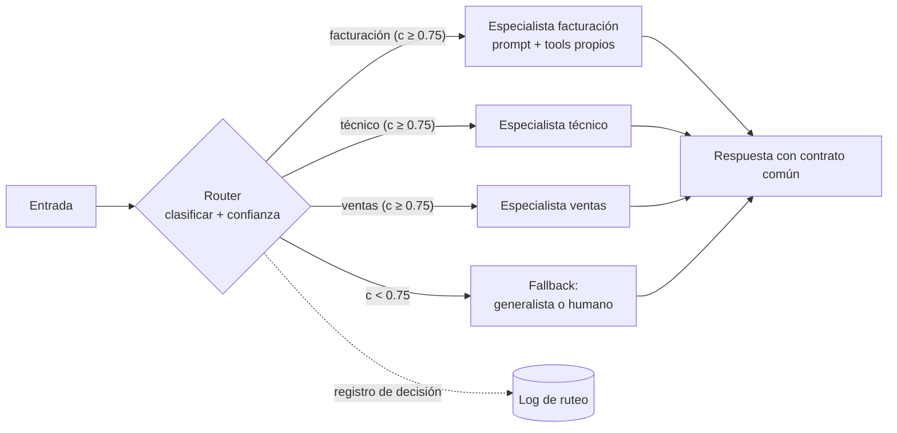

# 125 — Router y especialistas

> [← Clase anterior](../../../classes/part-10-multi-agent-systems-and-interoperability/124-workflow-subagente-y-sistema-multiagente/README.md) · [Índice de la parte](../README.md) · [Clase siguiente →](../../../classes/part-10-multi-agent-systems-and-interoperability/126-handoffs-y-transferencia-de-contexto/README.md)

**Parte:** 10 — Sistemas multiagente e interoperabilidad  
**Nivel:** experto · **Horas estimadas:** 6  
**Laboratorio:** `multiagent` · **Estado:** `EXECUTABLE_CORE`

## 🎯 Propósito

Comprender **router y especialistas** dentro de la evolución de la inteligencia
artificial, implementar un experimento mínimo verificable y distinguir qué parte
constituye evidencia frente a una afirmación todavía no comprobada.

## 📚 Resultados de aprendizaje

Al finalizar podrás:

1. Explicar router y especialistas usando los conceptos `router`, `specialists`, `classification`, `dispatch`.
2. Ejecutar el laboratorio con una semilla explícita y revisar su contrato JSON.
3. Identificar al menos un supuesto, una limitación y un riesgo de aplicación.
4. Comparar el enfoque con la etapa anterior de la ruta de aprendizaje.
5. Producir una evidencia reproducible y una conclusión que no exceda los datos.

## 🧩 Conceptos centrales

`router`, `specialists`, `classification`, `dispatch`

## 🗺️ Ubicación en el mapa de la IA

El patrón *routing* es la primera arquitectura de coordinación que aparece al pasar de
un agente único a varios: en lugar de un generalista que lo hace todo, un clasificador
dirige cada entrada al especialista adecuado. Es la versión agéntica del *mixture of
experts* clásico y la base sobre la que se montan handoffs (126) y supervisor-workers
(127). Anthropic lo cataloga como uno de los cinco workflows fundamentales en
"Building effective agents".

## 📖 Fundamentos

### 🚦 Definición del patrón

**Router**: componente que clasifica una entrada y la despacha a exactamente uno (o un
subconjunto) de n **especialistas**. Formalmente es una función
`route: entrada → {e₁, …, eₙ, fallback}` seguida de `dispatch`, la invocación del
especialista elegido con el contexto pertinente.

**Especialista**: agente o cadena de prompts optimizada para una clase de tarea:
prompt propio, herramientas propias, modelo propio (a menudo más pequeño y barato) y
criterios de éxito propios. La ventaja central es la **separación de preocupaciones**:
cada prompt se optimiza sin degradar a los demás — el síntoma típico del generalista es
que mejorar la instrucción para un caso empeora otro.

### ⚙️ Mecanismo paso a paso

```text
1. clasificar(entrada) → etiqueta + confianza
   - por reglas (regex, palabras clave): barato, frágil, auditable
   - por modelo (LLM o clasificador entrenado): flexible, con coste y error
2. si confianza < umbral → fallback (generalista o escalada humana)
3. dispatch: construir el contexto del especialista (solo lo pertinente)
4. ejecutar especialista → respuesta con contrato común
5. registrar (entrada, etiqueta, confianza, especialista, resultado) para auditoría
```

El paso 5 no es opcional en la práctica: sin registro de decisiones de ruteo no se
puede medir la **exactitud del router**, que acota el rendimiento de todo el sistema:
si el router acierta con probabilidad `p_r` y el especialista correcto resuelve con
`p_e`, el éxito global es a lo sumo `p_r · p_e` (más lo que rescate el fallback).

### 🧮 El router como clasificador

Todo lo que sabes de clasificación (Parte 3) aplica: matriz de confusión entre
etiquetas, precisión/cobertura por clase, y clases desbalanceadas. Dos diseños
frecuentes:

- **Router de una pasada**: una llamada LLM con las etiquetas enumeradas en el prompt
  y salida estructurada `{"route": "...", "confidence": ...}`. La confianza
  autodeclarada de un LLM no está calibrada: trátala como heurística, no probabilidad.
- **Router en cascada**: reglas primero (coste ~0), modelo solo para lo ambiguo.
  Reduce coste y latencia media manteniendo cobertura.

## 🧮 Ejemplo trabajado

Mesa de ayuda con 3 especialistas: `facturación`, `técnico`, `ventas`, y fallback
humano. Router LLM con umbral de confianza 0.75. Sobre 200 tickets etiquetados a mano:

```text
Matriz de confusión del router (filas = real, columnas = predicho):

              factur.  técnico  ventas   → cobertura por clase
facturación      72       6        2        72/80 = 0.90
técnico           4      88        0        88/92 = 0.957
ventas            5       3       20        20/28 = 0.714

exactitud global = (72 + 88 + 20) / 200 = 180/200 = 0.90
```

Si el especialista correcto resuelve el 92 % de los casos que recibe, el techo del
sistema es `0.90 × 0.92 ≈ 0.828`. Diagnóstico: `ventas` (clase minoritaria, 28/200)
arrastra la exactitud; 5 de sus errores van a `facturación`. Acciones ordenadas por
coste: añadir 2-3 ejemplos de `ventas` al prompt del router; bajar el umbral de
confianza solo para `ventas`; o fusionar `ventas` con `facturación` si comparten
herramientas. Nunca "añadir más especialistas": eso multiplica las fronteras de
confusión.

## 📊 Propiedades y comparación

| Diseño | Coste por entrada | Latencia añadida | Exactitud típica | Auditabilidad |
|---|---|---|---|---|
| Reglas (regex/keywords) | ~0 | ~0 | Alta en dominios cerrados, frágil fuera | Total |
| Clasificador entrenado | Bajo | Baja | Alta con datos etiquetados | Alta |
| Router LLM una pasada | 1 llamada extra | 1 RTT | Buena sin datos, sin calibrar | Media (registrar) |
| Cascada reglas→LLM | Bajo en media | Baja en media | La mejor relación coste/exactitud | Alta |
| Sin router (generalista) | 0 | 0 | Degrada al crecer los casos | — |



## ⚠️ Errores conceptuales frecuentes

1. **Confiar en la confianza autodeclarada del LLM.** No está calibrada: un 0.9 no
   significa 90 % de acierto. Calibra contra un conjunto etiquetado antes de fijar umbrales.
2. **Router sin fallback.** Toda entrada fuera de distribución acaba forzada en la
   clase menos mala; el fallback explícito convierte ese error silencioso en escalada visible.
3. **Multiplicar especialistas ante cada error.** Cada especialista nuevo añade
   fronteras de decisión; primero mide la matriz de confusión y arregla la frontera que falla.
4. **Evaluar solo a los especialistas.** El techo del sistema es `p_router × p_especialista`;
   un especialista perfecto no compensa un router del 70 %.
5. **Pasar todo el contexto al especialista.** El dispatch debe filtrar: contexto
   completo anula la ventaja de coste y contamina el prompt especializado.

## 🚀 Del aprendizaje a la operación

En producción faltan: un conjunto de evaluación etiquetado y su re-etiquetado
periódico (las distribuciones de entrada derivan); monitoreo de la tasa de fallback
(su subida es el primer síntoma de deriva); política para entradas multi-intención
(¿dividir el ticket o ruta dominante?); y pruebas de regresión del router cada vez que
se edita el prompt de un especialista, porque las etiquetas viven en el mismo espacio.

## 🧪 Laboratorio

```bash
python lab.py
```

El laboratorio llama a `ai_evolution.labs.run_lab("multiagent")`. Esta
decisión evita 183 implementaciones divergentes: cada clase tiene un entrypoint
propio, pero los motores didácticos se prueban como una biblioteca común.

### 🔍 Evidencia esperada

- tipo de laboratorio y semilla;
- entradas o decisiones observables;
- resultado estructurado;
- lista `evidence` con hechos que pueden inspeccionarse;
- lista `limitations` que impide presentar la demo como producción.

## 📓 Notebooks

- [📓 `notebook.ipynb`](notebook.ipynb): recorrido guiado con la materia resumida.
- [✍️ `notebook_student.ipynb`](notebook_student.ipynb): ejercicios para resolver.
- [✅ `notebook_solution.ipynb`](notebook_solution.ipynb): solución de referencia explicada.

## 📝 Evaluación

| Criterio | Peso |
|---|---:|
| Comprensión conceptual | 25 % |
| Ejecución reproducible | 25 % |
| Interpretación basada en evidencia | 25 % |
| Riesgos, límites y mejora propuesta | 25 % |

Consulta [assessment.md](assessment.md) para preguntas y criterio de aceptación.

## ⚠️ Errores comunes

| Síntoma | Causa probable | Corrección |
|---|---|---|
| El código corre, pero no hay conclusión | Se confundió ejecución con aprendizaje | Explica qué demuestra y qué no demuestra |
| El resultado cambia sin explicación | No se registró semilla o configuración | Conserva semilla, versión y parámetros |
| Se promete uso real | Se extrapoló desde una demo educativa | Declara entorno, datos, límites y revisión humana |
| Se copia una métrica aislada | No existe baseline ni costo de error | Añade comparación y criterio de decisión |

## ❓ Preguntas frecuentes

**¿Debo usar una API comercial?**  
No. El núcleo funciona localmente. Las extensiones LIVE se documentan por separado.

**¿El laboratorio representa una implementación industrial?**  
No por sí solo. Enseña el contrato y el patrón; producción exige integración,
seguridad, observabilidad, pruebas y operación.

**¿Dónde profundizo?**  
Revisa las especializaciones enlazadas en el README raíz y la ruta siguiente.

## 🔗 Referencias

- [Anthropic — Building effective agents (2024)](https://www.anthropic.com/engineering/building-effective-agents): el patrón *routing* dentro de los workflows fundamentales.
- [Anthropic — How we built our multi-agent research system (2025)](https://www.anthropic.com/engineering/multi-agent-research-system): delegación a especialistas con instrucciones explícitas.
- [Jacobs et al., *Adaptive Mixtures of Local Experts*, Neural Computation, 1991](https://doi.org/10.1162/neco.1991.3.1.79): el antecedente clásico — gating network + expertos.
- [Wu et al., *AutoGen* (arXiv:2308.08155)](https://arxiv.org/abs/2308.08155): conversaciones dirigidas entre agentes especializados.
- Russell, S. y Norvig, P., *Artificial Intelligence: A Modern Approach*, 4.ª ed., cap. 2 (agentes y entornos): base conceptual de especialización por tarea.

<!-- papers:inicio -->

---

## 📜 Papers que fundamentan esta clase

> Bloque generado por `python scripts/link_papers_to_classes.py`. La fuente es [`papers/catalog/papers.json`](../../../papers/catalog/papers.json).

| Paper | Año | Qué desbloqueó | Miniatura |
|---|---:|---|---|
| [P21 · Mixtral: mezcla dispersa de expertos](../../../papers/foundational/P21_moe/README.md) | 2024 | Desacopla capacidad de cómputo: 47 000 millones de parámetros totales, 13 000 millones activos por token. | [notebook](../../../notebooks/papers/P21_moe.ipynb) |

Cada ficha explica el problema anterior, la matemática mínima, los límites y los errores de atribución más frecuentes. Para leerlas con método: [cómo leer un paper de IA](../../../papers/guides/COMO_LEER_UN_PAPER_DE_IA.md) · [anexos matemáticos](../../../papers/annexes/README.md).
<!-- papers:fin -->
---

## ⬅️ Clase anterior

[124 — Workflow, subagente y sistema multiagente](../../part-10-multi-agent-systems-and-interoperability/124-workflow-subagente-y-sistema-multiagente/README.md)

## ➡️ Siguiente clase

[126 — Handoffs y transferencia de contexto](../../part-10-multi-agent-systems-and-interoperability/126-handoffs-y-transferencia-de-contexto/README.md)
