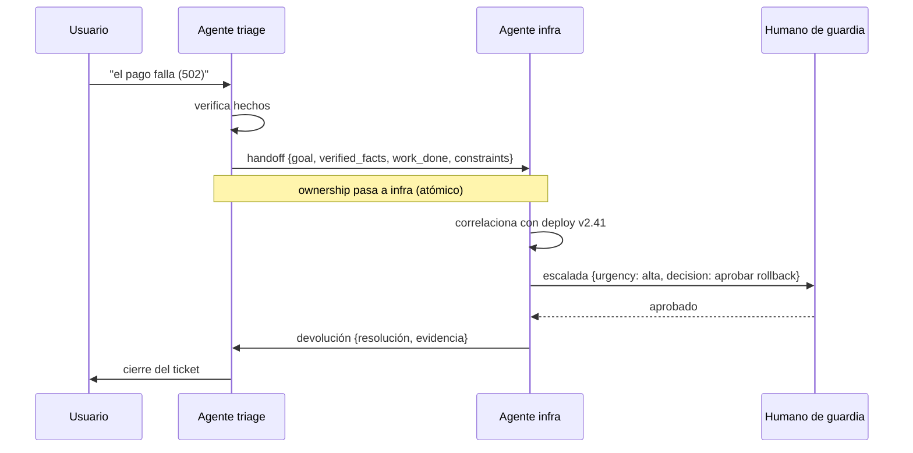

# 126 — Handoffs y transferencia de contexto

> [← Clase anterior](../../../classes/part-10-multi-agent-systems-and-interoperability/125-router-y-especialistas/README.md) · [Índice de la parte](../README.md) · [Clase siguiente →](../../../classes/part-10-multi-agent-systems-and-interoperability/127-supervisor-workers/README.md)

**Parte:** 10 — Sistemas multiagente e interoperabilidad  
**Nivel:** experto · **Horas estimadas:** 6  
**Laboratorio:** `multiagent` · **Estado:** `EXECUTABLE_CORE`

## 🎯 Propósito

Comprender **handoffs y transferencia de contexto** dentro de la evolución de la inteligencia
artificial, implementar un experimento mínimo verificable y distinguir qué parte
constituye evidencia frente a una afirmación todavía no comprobada.

## 📚 Resultados de aprendizaje

Al finalizar podrás:

1. Explicar handoffs y transferencia de contexto usando los conceptos `handoff`, `context`, `ownership`, `escalation`.
2. Ejecutar el laboratorio con una semilla explícita y revisar su contrato JSON.
3. Identificar al menos un supuesto, una limitación y un riesgo de aplicación.
4. Comparar el enfoque con la etapa anterior de la ruta de aprendizaje.
5. Producir una evidencia reproducible y una conclusión que no exceda los datos.

## 🧩 Conceptos centrales

`handoff`, `context`, `ownership`, `escalation`

## 🗺️ Ubicación en el mapa de la IA

El *handoff* resuelve la limitación del router (125): allí la decisión de a quién va la
tarea se toma *antes* de empezar; aquí un agente que ya está trabajando descubre que
otro debe continuar, y transfiere la conversación con su contexto. Es el mecanismo
central de frameworks como OpenAI Swarm/Agents SDK y de los traspasos humanos en
soporte, y prepara los protocolos entre organizaciones (A2A, clase 134), donde el
contexto viaja como artefactos explícitos entre sistemas que no comparten memoria.

## 📖 Fundamentos

### 🤝 Qué es un handoff

**Handoff**: transferencia de la *propiedad* (ownership) de una tarea en curso de un
agente A a un agente B, junto con el contexto mínimo suficiente para que B continúe sin
repetir trabajo ni re-preguntar al usuario. A diferencia del router, ocurre en medio de
la ejecución y lo inicia el propio agente al reconocer un límite de su competencia.

Tres elementos definen un handoff correcto:

1. **Ownership**: en todo momento exactamente un agente es dueño de la tarea. El
   traspaso es atómico: A deja de actuar cuando B acepta. Dos dueños simultáneos
   producen respuestas duplicadas o contradictorias; cero dueños, tareas huérfanas.
2. **Payload de contexto**: lo que viaja. No es "todo el historial": es una
   *destilación* con contrato — objetivo, estado, hechos verificados, trabajo hecho,
   trabajo pendiente y restricciones.
3. **Política de aceptación**: B puede aceptar, rechazar (devuelve a A o a un
   coordinador) o escalar. Sin política de rechazo, un handoff mal dirigido se pierde.

### 📦 El payload: contexto explícito con esquema

En un proceso único el contexto se comparte gratis; entre agentes hay que
serializarlo. Un esquema mínimo de payload JSON:

```json
{
  "task_id": "TCK-4812",
  "from_agent": "triage",
  "to_agent": "security",
  "reason": "hallazgo fuera de mi ámbito: posible CVE en dependencia",
  "goal": "evaluar impacto del CVE-2024-3094 en el servicio de pagos",
  "state": {
    "verified_facts": ["xz 5.6.0 presente en la imagen base",
                        "servicio expuesto solo en red interna"],
    "work_done": ["inventario de dependencias", "ticket clasificado"],
    "work_remaining": ["confirmar explotabilidad", "proponer mitigación"],
    "constraints": ["no desplegar cambios hasta aprobación", "SLA: 4h"]
  },
  "artifacts": [{"kind": "sbom", "uri": "reports/sbom-pagos.json"}],
  "handoff_at": "2026-07-30T14:12:00Z"
}
```

Reglas de diseño: separar **hechos verificados** de hipótesis (B no debe re-verificar
lo verificado ni fiarse de lo no verificado); referenciar artefactos grandes por URI en
lugar de incrustarlos; incluir `reason` para auditar por qué se transfirió; y versionar
el esquema, porque A y B pueden evolucionar por separado.

### 🪜 Escalada como caso especial

La **escalada** es un handoff hacia un nivel de mayor autoridad o capacidad (agente
senior, humano). Añade dos campos al contrato: *urgencia* y *qué decisión se pide*.
La escalada a humano (HITL) es la válvula de seguridad de todo sistema multiagente:
si la cadena de handoffs supera un límite (p. ej. 3 saltos) o entra en ciclo
(A→B→A→B…), un coordinador debe cortar y escalar.

## 🧮 Ejemplo trabajado

Ticket real de soporte con dos handoffs:

```text
t0  usuario → triage: "el pago falla desde ayer con error 502"
t1  triage verifica: servicio pagos degradado, no es error de usuario.
t2  HANDOFF triage → infra
    payload: goal="restaurar pagos", verified_facts=["502 desde 09:31",
    "deploy v2.41 a las 09:28"], work_done=["descartado error de cliente"],
    work_remaining=["correlacionar con deploy"], constraints=["SLA 4h"]
t3  infra correlaciona y confirma regresión en v2.41; el rollback exige
    aprobación de negocio → fuera de su autoridad.
t4  ESCALADA infra → humano de guardia
    payload añade: urgency="alta", decision_requested="aprobar rollback a v2.40"
t5  humano aprueba; infra ejecuta; ownership vuelve a triage para cerrar.
```

Cuenta de contexto: el historial completo en t2 son ~3 000 tokens; el payload
destilado, ~250. El handoff transfiere el 8 % del texto pero el 100 % de lo
accionable. Lo que se pierde (el tono del usuario, los callejones sin salida de
triage) es exactamente lo que B no necesita — y si lo necesitara, el artefacto
`transcript` puede viajar por URI.

## 📊 Propiedades y comparación

| Mecanismo | Cuándo se decide | Quién decide | Contexto transferido | Riesgo típico |
|---|---|---|---|---|
| Router (125) | Antes de ejecutar | Clasificador | El necesario para empezar | Ruteo erróneo inicial |
| Handoff | Durante la ejecución | El agente en curso | Destilado del trabajo hecho | Pérdida de contexto |
| Escalada | Durante, al topar límite | El agente o coordinador | Destilado + decisión pedida | Escalar tarde |
| Subagente (124) | Durante, como llamada | El padre (que espera) | Especificación de subtarea | El padre se bloquea |



## ⚠️ Errores conceptuales frecuentes

1. **"Transferir contexto = copiar todo el historial."** Copiarlo todo satura la
   ventana de B y entierra lo accionable; el payload es una destilación con esquema.
2. **Handoff sin transferencia de ownership.** Si A sigue respondiendo tras el
   traspaso, el usuario recibe dos voces; el traspaso debe ser atómico y registrado.
3. **Mezclar hechos verificados con hipótesis.** B hereda como cierto lo que A solo
   sospechaba; el esquema debe separarlos explícitamente.
4. **Sin política de rechazo ni límite de saltos.** Handoffs mal dirigidos rebotan en
   ciclos A→B→A; se necesita contador de saltos y corte con escalada.
5. **Confundir handoff con subagente.** El subagente devuelve el control al padre; en
   el handoff el control *no vuelve* — B es el nuevo dueño ante el usuario.

## 🚀 Del aprendizaje a la operación

Para operar handoffs reales faltan: persistencia del payload (si B cae, la tarea debe
recuperarse de un almacén, no de la memoria de A); idempotencia y deduplicación (el
mismo handoff entregado dos veces no debe duplicar trabajo); métricas de cadena
(saltos por tarea, tiempo en cada dueño, tasa de rechazo); y compatibilidad de esquema
entre versiones de agentes desplegadas a la vez.

## 🧪 Laboratorio

```bash
python lab.py
```

El laboratorio llama a `ai_evolution.labs.run_lab("multiagent")`. Esta
decisión evita 183 implementaciones divergentes: cada clase tiene un entrypoint
propio, pero los motores didácticos se prueban como una biblioteca común.

### 🔍 Evidencia esperada

- tipo de laboratorio y semilla;
- entradas o decisiones observables;
- resultado estructurado;
- lista `evidence` con hechos que pueden inspeccionarse;
- lista `limitations` que impide presentar la demo como producción.

## 📓 Notebooks

- [📓 `notebook.ipynb`](notebook.ipynb): recorrido guiado con la materia resumida.
- [✍️ `notebook_student.ipynb`](notebook_student.ipynb): ejercicios para resolver.
- [✅ `notebook_solution.ipynb`](notebook_solution.ipynb): solución de referencia explicada.

## 📝 Evaluación

| Criterio | Peso |
|---|---:|
| Comprensión conceptual | 25 % |
| Ejecución reproducible | 25 % |
| Interpretación basada en evidencia | 25 % |
| Riesgos, límites y mejora propuesta | 25 % |

Consulta [assessment.md](assessment.md) para preguntas y criterio de aceptación.

## ⚠️ Errores comunes

| Síntoma | Causa probable | Corrección |
|---|---|---|
| El código corre, pero no hay conclusión | Se confundió ejecución con aprendizaje | Explica qué demuestra y qué no demuestra |
| El resultado cambia sin explicación | No se registró semilla o configuración | Conserva semilla, versión y parámetros |
| Se promete uso real | Se extrapoló desde una demo educativa | Declara entorno, datos, límites y revisión humana |
| Se copia una métrica aislada | No existe baseline ni costo de error | Añade comparación y criterio de decisión |

## ❓ Preguntas frecuentes

**¿Debo usar una API comercial?**  
No. El núcleo funciona localmente. Las extensiones LIVE se documentan por separado.

**¿El laboratorio representa una implementación industrial?**  
No por sí solo. Enseña el contrato y el patrón; producción exige integración,
seguridad, observabilidad, pruebas y operación.

**¿Dónde profundizo?**  
Revisa las especializaciones enlazadas en el README raíz y la ruta siguiente.

## 🔗 Referencias

- [Anthropic — Building effective agents (2024)](https://www.anthropic.com/engineering/building-effective-agents): delegación y coordinación con la mínima complejidad necesaria.
- [OpenAI Agents SDK — Handoffs](https://openai.github.io/openai-agents-python/handoffs/): implementación de referencia del patrón handoff entre agentes.
- [A2A Protocol](https://a2a-protocol.org/latest/): transferencia de tareas y artefactos entre agentes de distintos proveedores.
- [Wu et al., *AutoGen* (arXiv:2308.08155)](https://arxiv.org/abs/2308.08155): conversaciones multiagente con traspaso de turno programable.
- Wooldridge, M., *An Introduction to MultiAgent Systems*, 2.ª ed., Wiley, 2009, caps. de comunicación y cooperación: actos de habla y protocolos de interacción. — uso: desarrollo extendido del tema

<!-- papers:inicio -->

---

## 📜 Papers que fundamentan esta clase

> Bloque generado por `python scripts/link_papers_to_classes.py`. La fuente es [`papers/catalog/papers.json`](../../../papers/catalog/papers.json).

| Paper | Año | Qué desbloqueó | Miniatura |
|---|---:|---|---|
| [P136 · El protocolo de red de contratos: comunicación y control en un resolutor distribuido](../../../papers/foundational/P136_red_de_contratos/README.md) | 1980 | Reparte tareas por anuncio, oferta y adjudicación, sin que nadie mantenga una lista de quién sabe hacer qué. | [notebook](../../../notebooks/papers/P136_red_de_contratos.ipynb) |

Cada ficha explica el problema anterior, la matemática mínima, los límites y los errores de atribución más frecuentes. Para leerlas con método: [cómo leer un paper de IA](../../../papers/guides/COMO_LEER_UN_PAPER_DE_IA.md) · [anexos matemáticos](../../../papers/annexes/README.md).
<!-- papers:fin -->
---

## ⬅️ Clase anterior

[125 — Router y especialistas](../../part-10-multi-agent-systems-and-interoperability/125-router-y-especialistas/README.md)

## ➡️ Siguiente clase

[127 — Supervisor-workers](../../part-10-multi-agent-systems-and-interoperability/127-supervisor-workers/README.md)
