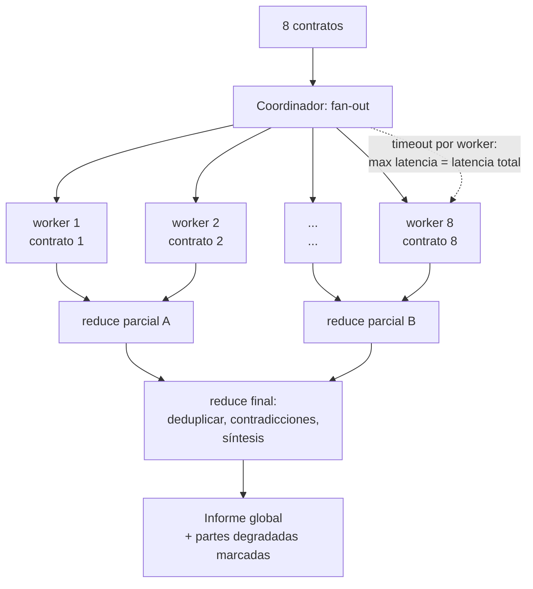

# 128 — Paralelismo, fan-out y map-reduce

> [← Clase anterior](../../../classes/part-10-multi-agent-systems-and-interoperability/127-supervisor-workers/README.md) · [Índice de la parte](../README.md) · [Clase siguiente →](../../../classes/part-10-multi-agent-systems-and-interoperability/129-critica-revision-y-debate-controlado/README.md)

**Parte:** 10 — Sistemas multiagente e interoperabilidad  
**Nivel:** experto · **Horas estimadas:** 6  
**Laboratorio:** `multiagent` · **Estado:** `EXECUTABLE_CORE`

## 🎯 Propósito

Comprender **paralelismo, fan-out y map-reduce** dentro de la evolución de la inteligencia
artificial, implementar un experimento mínimo verificable y distinguir qué parte
constituye evidencia frente a una afirmación todavía no comprobada.

## 📚 Resultados de aprendizaje

Al finalizar podrás:

1. Explicar paralelismo, fan-out y map-reduce usando los conceptos `parallel`, `fan-out`, `map-reduce`, `merge`.
2. Ejecutar el laboratorio con una semilla explícita y revisar su contrato JSON.
3. Identificar al menos un supuesto, una limitación y un riesgo de aplicación.
4. Comparar el enfoque con la etapa anterior de la ruta de aprendizaje.
5. Producir una evidencia reproducible y una conclusión que no exceda los datos.

## 🧩 Conceptos centrales

`parallel`, `fan-out`, `map-reduce`, `merge`

## 🗺️ Ubicación en el mapa de la IA

El paralelismo es el argumento económico más sólido a favor de los sistemas
multiagente: n workers con contextos independientes exploran a la vez lo que un agente
secuencial recorrería en n turnos. El patrón hereda directamente el modelo MapReduce
del procesamiento distribuido de datos (Dean y Ghemawat, 2004) y es la razón por la que
el sistema de investigación de Anthropic usa subagentes en paralelo. Su reverso es el
coste: aquí se aprende a calcularlo *antes* de pagar la factura.

## 📖 Fundamentos

### 🌪️ Fan-out / fan-in

**Fan-out**: un coordinador divide la entrada en n partes (o n variantes de la misma
pregunta) y lanza n workers *simultáneos e independientes* — sin dependencias entre
ellos, condición que hace al patrón trivialmente paralelizable.

**Fan-in (merge)**: los n resultados se reúnen en uno. La fusión es la parte difícil:
concatenar no es fusionar; hay que deduplicar, resolver contradicciones y sintetizar.

### 🗺️ Map-reduce sobre agentes

```text
map:     parte_i  →  worker_i(parte_i)  →  resultado_i     (paralelo, sin estado compartido)
reduce:  [resultado_1 ... resultado_n]  →  síntesis         (secuencial, a menudo otro LLM)
```

Requisitos que se heredan del MapReduce clásico:

- **Independencia del map**: worker_i no necesita ver a worker_j. Si la necesita, el
  problema no es map-reduce (usa blackboard, clase 130, o secuencia).
- **Reduce asociativo cuando sea posible**: si la fusión puede hacerse por pares
  (`reduce(reduce(a,b), c)`), se puede jerarquizar en árbol y el reduce no se convierte
  en cuello de botella de contexto.
- **Tolerancia a rezagados (stragglers)**: la latencia del fan-out es
  `max(latencia_i)`, no la media — un worker lento fija el tiempo total; timeout y
  degradación explícita ("síntesis con 7/8 partes, marcado en limitations").

### 💰 El costo de N agentes, calculado a mano

Modelo simple por llamada: `coste = t_in · p_in + t_out · p_out`, con `t` tokens y `p`
precio por token. Para un fan-out de n workers más un reduce:

```text
coste_total = n · (t_in_worker · p_in + t_out_worker · p_out)      [map]
            + (n · t_out_worker + t_prompt_reduce) · p_in          [reduce lee los n resultados]
            + t_out_reduce · p_out

latencia_total ≈ max_i(latencia_worker_i) + latencia_reduce
```

Dos consecuencias no obvias: (1) el coste crece **linealmente con n**, pero la
latencia casi no crece (paralelo) — pagas tokens para comprar tiempo; (2) la entrada
del reduce crece con n: con n grande el reduce desborda su ventana y hay que pasar a
reduce jerárquico (árbol binario: `⌈log₂ n⌉` niveles).

## 🧮 Ejemplo trabajado

Revisar 8 contratos (map: resumir riesgos de cada uno; reduce: informe global).
Precios de referencia: `p_in = 3 USD / MTok`, `p_out = 15 USD / MTok`.
Cada worker: 6 000 tokens de entrada (contrato + instrucción), 500 de salida.
Reduce: prompt de 400 tokens + las 8 salidas; produce 1 200 tokens.

```text
map:    8 × (6 000 × 3/1e6 + 500 × 15/1e6)
      = 8 × (0.0180 + 0.0075) = 8 × 0.0255 = 0.2040 USD
reduce: entrada = 400 + 8 × 500 = 4 400 tokens → 4 400 × 3/1e6   = 0.0132 USD
        salida  = 1 200 × 15/1e6                                  = 0.0180 USD
TOTAL   = 0.2040 + 0.0132 + 0.0180 = 0.2352 USD

secuencial equivalente (1 agente, mismos tokens de trabajo):
        misma lectura y escritura ≈ 8 × 0.0255 + síntesis ≈ 0.2352 USD → coste similar,
        PERO latencia: paralelo ≈ 1 worker + reduce ≈ 2 pasos;
                        secuencial ≈ 8 workers + síntesis ≈ 9 pasos  (≈4.5× más lento)
```

La conclusión honesta: cuando las partes son *disjuntas* (8 contratos distintos), el
fan-out casi no encarece y multiplica la velocidad. El sobrecoste real del multiagente
(el ~15× de Anthropic) aparece cuando los workers **comparten contexto** — cada uno
debe recibir su copia tokenizada — o cuando exploran redundantemente la misma pregunta.

## 📊 Propiedades y comparación

| Estrategia | Latencia | Coste tokens | Ventana del reduce | Cuándo usar |
|---|---|---|---|---|
| Secuencial (1 agente) | O(n) pasos | ≈1× | No aplica | Partes dependientes |
| Fan-out plano + reduce | O(1) + reduce | ≈1× (disjunto) a ~15× (compartido) | Crece O(n) | n pequeño-medio, partes disjuntas |
| Reduce jerárquico (árbol) | O(log n) | ligeramente > plano | Acotada por nivel | n grande |
| Réplicas del mismo prompt (k-voting) | O(1) | k× | Pequeña | Reducir varianza, no dividir trabajo |



## ⚠️ Errores conceptuales frecuentes

1. **"Paralelo = más barato."** Al revés: el coste en tokens es igual o mayor
   (contexto duplicado); lo que compra el paralelo es *latencia*.
2. **Concatenar en vez de fusionar.** El valor del reduce está en deduplicar y
   resolver contradicciones; pegar los n textos traslada el trabajo al lector.
3. **Ignorar al rezagado.** La latencia del fan-out es el `max`, no la media; sin
   timeout, un worker colgado congela el sistema entero.
4. **Fan-out sobre partes dependientes.** Si worker_j necesita la salida de worker_i,
   los resultados serán inconsistentes; map exige independencia.
5. **Reduce monolítico con n grande.** La entrada del reduce crece O(n) y desborda la
   ventana; a partir de cierto n el reduce debe ser jerárquico.

## 🚀 Del aprendizaje a la operación

En producción se añaden: límites de concurrencia reales (rate limits del proveedor
convierten tu fan-out de 50 en colas de 10); presupuesto global con corte anticipado;
*caching* de prompts compartidos para no pagar el mismo prefijo n veces; reduce con
citas a la parte de origen para poder auditar la síntesis; y métricas por oleada
(coste, latencia p95, tasa de degradación) para decidir n con datos y no por intuición.

## 🧪 Laboratorio

```bash
python lab.py
```

El laboratorio llama a `ai_evolution.labs.run_lab("multiagent")`. Esta
decisión evita 183 implementaciones divergentes: cada clase tiene un entrypoint
propio, pero los motores didácticos se prueban como una biblioteca común.

### 🔍 Evidencia esperada

- tipo de laboratorio y semilla;
- entradas o decisiones observables;
- resultado estructurado;
- lista `evidence` con hechos que pueden inspeccionarse;
- lista `limitations` que impide presentar la demo como producción.

## 📓 Notebooks

- [📓 `notebook.ipynb`](notebook.ipynb): recorrido guiado con la materia resumida.
- [✍️ `notebook_student.ipynb`](notebook_student.ipynb): ejercicios para resolver.
- [✅ `notebook_solution.ipynb`](notebook_solution.ipynb): solución de referencia explicada.

## 📝 Evaluación

| Criterio | Peso |
|---|---:|
| Comprensión conceptual | 25 % |
| Ejecución reproducible | 25 % |
| Interpretación basada en evidencia | 25 % |
| Riesgos, límites y mejora propuesta | 25 % |

Consulta [assessment.md](assessment.md) para preguntas y criterio de aceptación.

## ⚠️ Errores comunes

| Síntoma | Causa probable | Corrección |
|---|---|---|
| El código corre, pero no hay conclusión | Se confundió ejecución con aprendizaje | Explica qué demuestra y qué no demuestra |
| El resultado cambia sin explicación | No se registró semilla o configuración | Conserva semilla, versión y parámetros |
| Se promete uso real | Se extrapoló desde una demo educativa | Declara entorno, datos, límites y revisión humana |
| Se copia una métrica aislada | No existe baseline ni costo de error | Añade comparación y criterio de decisión |

## ❓ Preguntas frecuentes

**¿Debo usar una API comercial?**  
No. El núcleo funciona localmente. Las extensiones LIVE se documentan por separado.

**¿El laboratorio representa una implementación industrial?**  
No por sí solo. Enseña el contrato y el patrón; producción exige integración,
seguridad, observabilidad, pruebas y operación.

**¿Dónde profundizo?**  
Revisa las especializaciones enlazadas en el README raíz y la ruta siguiente.

## 🔗 Referencias

- [Dean, J. y Ghemawat, S., *MapReduce: Simplified Data Processing on Large Clusters*, OSDI 2004](https://research.google/pubs/mapreduce-simplified-data-processing-on-large-clusters/): el modelo original de map/reduce y los rezagados.
- [Anthropic — How we built our multi-agent research system (2025)](https://www.anthropic.com/engineering/multi-agent-research-system): subagentes en paralelo, coste ~15× y lecciones de fan-out real.
- [Anthropic — Building effective agents (2024)](https://www.anthropic.com/engineering/building-effective-agents): el workflow *parallelization* (sectioning y voting).
- [Wu et al., *AutoGen* (arXiv:2308.08155)](https://arxiv.org/abs/2308.08155): ejecución concurrente de agentes conversables.
- [Anthropic — Pricing de la API](https://claude.com/pricing#api): precios por MTok para reproducir los cálculos de coste.

<!-- papers:inicio -->

---

## 📜 Papers que fundamentan esta clase

> Bloque generado por `python scripts/link_papers_to_classes.py`. La fuente es [`papers/catalog/papers.json`](../../../papers/catalog/papers.json).

| Paper | Año | Qué desbloqueó | Miniatura |
|---|---:|---|---|
| [P140 · MapReduce: procesamiento simplificado de datos en clústeres grandes](../../../papers/foundational/P140_mapreduce/README.md) | 2004 | Reduce el procesamiento distribuido a dos funciones puras y esconde el reparto, la tolerancia a fallos y la recogida de resultados detrás de ellas. | [notebook](../../../notebooks/papers/P140_mapreduce.ipynb) |

Cada ficha explica el problema anterior, la matemática mínima, los límites y los errores de atribución más frecuentes. Para leerlas con método: [cómo leer un paper de IA](../../../papers/guides/COMO_LEER_UN_PAPER_DE_IA.md) · [anexos matemáticos](../../../papers/annexes/README.md).
<!-- papers:fin -->
---

## ⬅️ Clase anterior

[127 — Supervisor-workers](../../part-10-multi-agent-systems-and-interoperability/127-supervisor-workers/README.md)

## ➡️ Siguiente clase

[129 — Crítica, revisión y debate controlado](../../part-10-multi-agent-systems-and-interoperability/129-critica-revision-y-debate-controlado/README.md)
