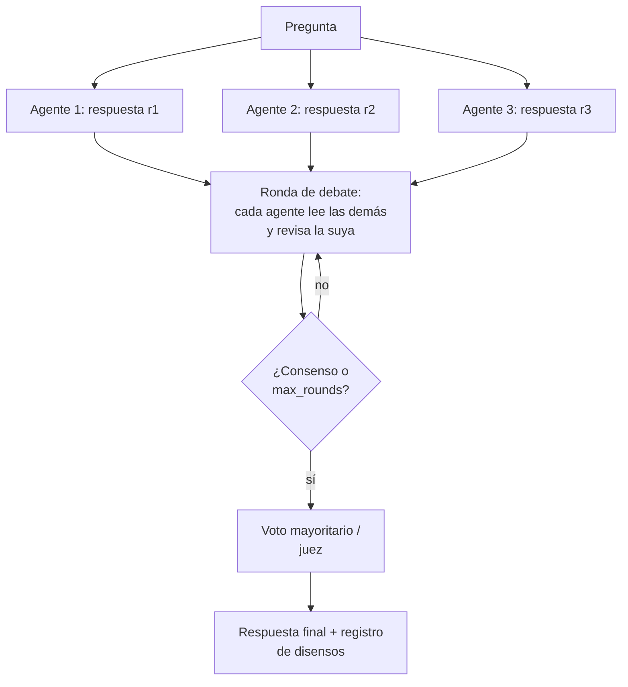

# 129 — Crítica, revisión y debate controlado

> [← Clase anterior](../../../classes/part-10-multi-agent-systems-and-interoperability/128-paralelismo-fan-out-y-map-reduce/README.md) · [Índice de la parte](../README.md) · [Clase siguiente →](../../../classes/part-10-multi-agent-systems-and-interoperability/130-blackboard-y-memoria-compartida/README.md)

**Parte:** 10 — Sistemas multiagente e interoperabilidad  
**Nivel:** experto · **Horas estimadas:** 6  
**Laboratorio:** `multiagent` · **Estado:** `EXECUTABLE_CORE`

## 🎯 Propósito

Comprender **crítica, revisión y debate controlado** dentro de la evolución de la inteligencia
artificial, implementar un experimento mínimo verificable y distinguir qué parte
constituye evidencia frente a una afirmación todavía no comprobada.

## 📚 Resultados de aprendizaje

Al finalizar podrás:

1. Explicar crítica, revisión y debate controlado usando los conceptos `critic`, `reviewer`, `debate`, `convergence`.
2. Ejecutar el laboratorio con una semilla explícita y revisar su contrato JSON.
3. Identificar al menos un supuesto, una limitación y un riesgo de aplicación.
4. Comparar el enfoque con la etapa anterior de la ruta de aprendizaje.
5. Producir una evidencia reproducible y una conclusión que no exceda los datos.

## 🧩 Conceptos centrales

`critic`, `reviewer`, `debate`, `convergence`

## 🗺️ Ubicación en el mapa de la IA

Hasta aquí los agentes cooperaban dividiendo trabajo; en esta clase cooperan
*contradiciéndose*. Los patrones generador-crítico y debate multiagente atacan el punto
débil de los LLM — errores plausibles que el propio modelo no detecta — usando una
segunda pasada adversarial. Es la versión operativa de la auto-verificación estudiada
en la Parte 6 (reflexión, self-consistency) y el antecedente de los sistemas de
supervisión escalable que se investigan para alineamiento.

## 📖 Fundamentos

### 🧑‍⚖️ Generador-crítico (reviewer)

Dos roles con incentivos distintos: el **generador** produce una solución; el
**crítico** la examina con una rúbrica explícita y produce un veredicto estructurado
(`aprobar / revisar`, hallazgos, severidad). Si hay revisión, el generador itera con el
feedback. El bucle termina por aprobación o por presupuesto (`max_rounds`).

Claves de diseño: el crítico debe tener **rúbrica** (sin ella degenera en "se ve
bien"); contexto *limpio* (evaluar la solución, no la conversación que la produjo); y
conviene que sea un modelo o prompt distinto — un modelo revisando su propia salida
hereda sus mismos puntos ciegos (sesgo de auto-consistencia).

### 🗣️ Debate multiagente (Du et al., arXiv:2305.14325)

Protocolo del paper *Improving Factuality and Reasoning in Language Models through
Multiagent Debate*:

```text
1. n agentes responden la misma pregunta de forma independiente
2. durante r rondas: cada agente lee las respuestas de los demás
   y produce una respuesta revisada (puede mantener o cambiar la suya)
3. respuesta final: consenso o voto mayoritario
```

Resultados reportados: mejora la exactitud aritmética, de razonamiento y la
factualidad frente a un agente único y frente a self-consistency con el mismo número
de muestras; los agentes convergen con las rondas. Limitaciones honestas: coste
`n × r` llamadas; la convergencia no garantiza corrección (pueden converger al mismo
error, especialmente si comparten modelo y sesgos); y con contextos largos los agentes
tienden a la conformidad — el paper usa prompts que fomentan mantener el desacuerdo
("stubborn") para evitar el colapso prematuro.

### 🗳️ Votación y agregación

Para respuestas discretas, **voto mayoritario**: con n votantes independientes cada uno
con probabilidad p > 0.5 de acertar, la probabilidad de que la mayoría acierte crece
con n (teorema del jurado de Condorcet). La letra pequeña es la palabra
*independientes*: k réplicas del mismo modelo con el mismo prompt están correlacionadas;
el voto reduce varianza (errores aleatorios) pero **no** sesgo (errores sistemáticos).
Variantes: voto ponderado por confianza calibrada, y juez LLM (un árbitro lee el debate
y decide — reintroduce un punto único de fallo con sus propios sesgos).

## 🧮 Ejemplo trabajado

Pregunta con respuesta discreta y 3 debatientes (p = 0.7 de acierto individual,
independencia asumida):

```text
P(mayoría acierta) = P(3 aciertan) + P(exactamente 2 aciertan)
  = 0.7³ + 3 × 0.7² × 0.3
  = 0.343 + 3 × 0.49 × 0.3
  = 0.343 + 0.441 = 0.784
```

Con n = 5: `0.7⁵ + 5·0.7⁴·0.3 + 10·0.7³·0.3² = 0.16807 + 0.36015 + 0.3087 ≈ 0.837`.
Ganancia de 3 → 5 votantes: +5.3 puntos, pagando 2 llamadas más (y el efecto marginal
decrece). Ahora la letra pequeña: si los 3 debatientes comparten un sesgo (p. ej. el
mismo error aritmético típico del modelo base), sus errores no son independientes y la
fórmula sobreestima. Caso extremo: correlación total → P(mayoría) = p = 0.7; todo el
coste extra compró nada. Por eso Du et al. combinan votación con *rondas de debate*:
leer argumentos ajenos puede corregir el error sistemático, cosa que el voto puro no hace.

## 📊 Propiedades y comparación

| Mecanismo | Coste (llamadas) | Ataca varianza | Ataca sesgo | Requiere respuesta discreta |
|---|---|---|---|---|
| Agente único | 1 | No | No | No |
| Self-consistency (k muestras + voto) | k | Sí | No | Sí (o normalizable) |
| Generador-crítico (r rondas) | 2r | Algo | Sí, si la rúbrica lo cubre | No |
| Debate n agentes × r rondas (Du et al.) | n·r | Sí | Parcialmente (argumentos cruzados) | Para el voto final, sí |
| Juez LLM sobre debate | n·r + 1 | Sí | Desplaza el sesgo al juez | No |



## ⚠️ Errores conceptuales frecuentes

1. **"El debate garantiza la verdad."** Los agentes pueden converger al mismo error si
   comparten modelo y sesgos; la convergencia mide acuerdo, no corrección.
2. **Aplicar Condorcet a votantes correlacionados.** Réplicas del mismo modelo no son
   independientes; la mejora real es menor que la fórmula y puede ser nula.
3. **Crítico sin rúbrica.** "Revisa esto" produce aprobaciones vacías o quisquillosidad
   aleatoria; el crítico necesita criterios y formato de veredicto.
4. **Confundir reducción de varianza con reducción de sesgo.** El voto elimina errores
   aleatorios; los sistemáticos requieren argumentos cruzados, herramientas o evidencia externa.
5. **Rondas ilimitadas.** Sin `max_rounds` el coste crece y los agentes tienden a la
   conformidad; el corte por presupuesto con registro del disenso es parte del protocolo.

## 🚀 Del aprendizaje a la operación

Para usar crítica/debate en serio faltan: medir en *tu* tarea si el uplift justifica
n·r llamadas (en muchas tareas un agente con herramientas gana al debate sin ellas);
diversidad real de los debatientes (modelos o prompts distintos) para des-correlacionar
errores; límites anti-conformidad y registro de disensos como señal de incertidumbre;
y un canal de verificación externa (tests, retrieval) — el debate opina, la evidencia
decide.

## 🧪 Laboratorio

```bash
python lab.py
```

El laboratorio llama a `ai_evolution.labs.run_lab("multiagent")`. Esta
decisión evita 183 implementaciones divergentes: cada clase tiene un entrypoint
propio, pero los motores didácticos se prueban como una biblioteca común.

### 🔍 Evidencia esperada

- tipo de laboratorio y semilla;
- entradas o decisiones observables;
- resultado estructurado;
- lista `evidence` con hechos que pueden inspeccionarse;
- lista `limitations` que impide presentar la demo como producción.

## 📓 Notebooks

- [📓 `notebook.ipynb`](notebook.ipynb): recorrido guiado con la materia resumida.
- [✍️ `notebook_student.ipynb`](notebook_student.ipynb): ejercicios para resolver.
- [✅ `notebook_solution.ipynb`](notebook_solution.ipynb): solución de referencia explicada.

## 📝 Evaluación

| Criterio | Peso |
|---|---:|
| Comprensión conceptual | 25 % |
| Ejecución reproducible | 25 % |
| Interpretación basada en evidencia | 25 % |
| Riesgos, límites y mejora propuesta | 25 % |

Consulta [assessment.md](assessment.md) para preguntas y criterio de aceptación.

## ⚠️ Errores comunes

| Síntoma | Causa probable | Corrección |
|---|---|---|
| El código corre, pero no hay conclusión | Se confundió ejecución con aprendizaje | Explica qué demuestra y qué no demuestra |
| El resultado cambia sin explicación | No se registró semilla o configuración | Conserva semilla, versión y parámetros |
| Se promete uso real | Se extrapoló desde una demo educativa | Declara entorno, datos, límites y revisión humana |
| Se copia una métrica aislada | No existe baseline ni costo de error | Añade comparación y criterio de decisión |

## ❓ Preguntas frecuentes

**¿Debo usar una API comercial?**  
No. El núcleo funciona localmente. Las extensiones LIVE se documentan por separado.

**¿El laboratorio representa una implementación industrial?**  
No por sí solo. Enseña el contrato y el patrón; producción exige integración,
seguridad, observabilidad, pruebas y operación.

**¿Dónde profundizo?**  
Revisa las especializaciones enlazadas en el README raíz y la ruta siguiente.

## 🔗 Referencias

- [Du et al., *Improving Factuality and Reasoning in Language Models through Multiagent Debate* (arXiv:2305.14325)](https://arxiv.org/abs/2305.14325): el protocolo de debate y sus resultados.
- [Wang et al., *Self-Consistency Improves Chain of Thought Reasoning in Language Models* (arXiv:2203.11171)](https://arxiv.org/abs/2203.11171): votación sobre k muestras, el baseline del debate.
- [Anthropic — Building effective agents (2024)](https://www.anthropic.com/engineering/building-effective-agents): el workflow *evaluator-optimizer* (generador-crítico).
- [Wu et al., *AutoGen* (arXiv:2308.08155)](https://arxiv.org/abs/2308.08155): patrones de conversación con roles críticos programables.
- [Irving et al., *AI safety via debate* (arXiv:1805.00899)](https://arxiv.org/abs/1805.00899): el debate como mecanismo de supervisión escalable.

<!-- papers:inicio -->

---

## 📜 Papers que fundamentan esta clase

> Bloque generado por `python scripts/link_papers_to_classes.py`. La fuente es [`papers/catalog/papers.json`](../../../papers/catalog/papers.json).

| Paper | Año | Qué desbloqueó | Miniatura |
|---|---:|---|---|
| [P30 · Reflexion: agentes de lenguaje con refuerzo verbal](../../../papers/foundational/P30_reflexion/README.md) | 2023 | El agente aprende entre intentos sin tocar un solo peso: el refuerzo ocurre en el contexto, en lenguaje natural. | [notebook](../../../notebooks/papers/P30_reflexion.ipynb) |

Cada ficha explica el problema anterior, la matemática mínima, los límites y los errores de atribución más frecuentes. Para leerlas con método: [cómo leer un paper de IA](../../../papers/guides/COMO_LEER_UN_PAPER_DE_IA.md) · [anexos matemáticos](../../../papers/annexes/README.md).
<!-- papers:fin -->
---

## ⬅️ Clase anterior

[128 — Paralelismo, fan-out y map-reduce](../../part-10-multi-agent-systems-and-interoperability/128-paralelismo-fan-out-y-map-reduce/README.md)

## ➡️ Siguiente clase

[130 — Blackboard y memoria compartida](../../part-10-multi-agent-systems-and-interoperability/130-blackboard-y-memoria-compartida/README.md)
