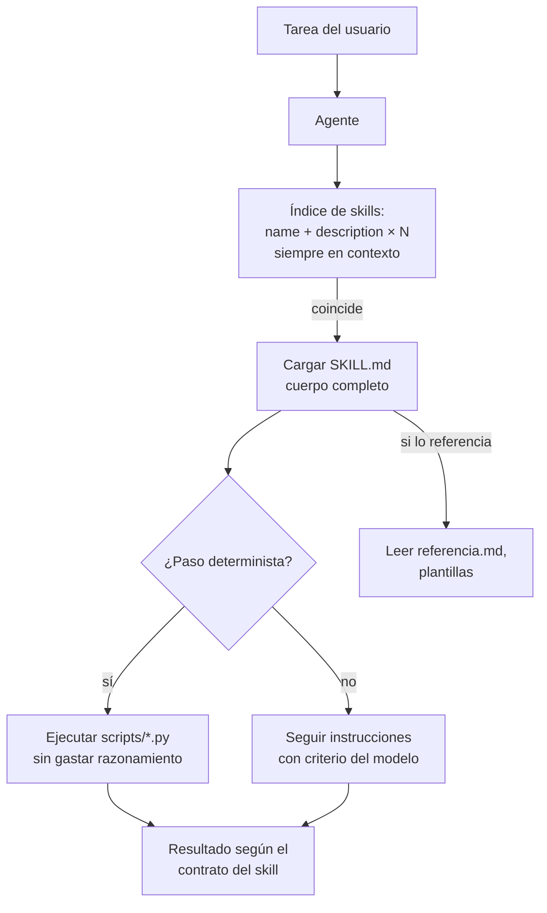

# 130 — Agent Skills como capacidades portables

> [← Clase anterior](../../../classes/part-10-multi-agent-systems-and-interoperability/129-mcp-tools-resources-y-prompts/README.md) · [Índice de la parte](../README.md) · [Clase siguiente →](../../../classes/part-10-multi-agent-systems-and-interoperability/131-a2a-descubrimiento-e-interoperabilidad/README.md)

**Parte:** 10 — Sistemas multiagente e interoperabilidad  
**Nivel:** experto · **Horas estimadas:** 6  
**Laboratorio:** `agent` · **Estado:** `EXECUTABLE_CORE`

## 🎯 Propósito

Comprender **agent skills como capacidades portables** dentro de la evolución de la inteligencia
artificial, implementar un experimento mínimo verificable y distinguir qué parte
constituye evidencia frente a una afirmación todavía no comprobada.

## 📚 Resultados de aprendizaje

Al finalizar podrás:

1. Explicar agent skills como capacidades portables usando los conceptos `Agent Skills`, `instructions`, `scripts`, `portability`.
2. Ejecutar el laboratorio con una semilla explícita y revisar su contrato JSON.
3. Identificar al menos un supuesto, una limitación y un riesgo de aplicación.
4. Comparar el enfoque con la etapa anterior de la ruta de aprendizaje.
5. Producir una evidencia reproducible y una conclusión que no exceda los datos.

## 🧩 Conceptos centrales

`Agent Skills`, `instructions`, `scripts`, `portability`

## 🗺️ Ubicación en el mapa de la IA

MCP (129) estandarizó cómo un agente *accede* a herramientas y datos; los **Agent
Skills** (Anthropic, 2025) estandarizan cómo se le entrega *conocimiento
procedimental*: instrucciones, scripts y recursos empaquetados en carpetas que
cualquier agente compatible puede descubrir y cargar cuando la tarea lo pide. Es la
pieza "know-how portable" del stack de interoperabilidad: los contratos (128) definen
qué prometes, MCP conecta capacidades externas, los skills empaquetan la experiencia
de cómo ejecutar una tarea bien.

## 📖 Fundamentos

### 📁 Anatomía de un skill

Un skill es una carpeta con un archivo obligatorio `SKILL.md` y recursos opcionales:

```text
mi-skill/
├── SKILL.md            # obligatorio: frontmatter YAML + instrucciones
├── referencia.md       # docs adicionales que se cargan bajo demanda
├── scripts/
│   └── procesar.py     # código ejecutable determinista
└── plantillas/
    └── informe.md
```

`SKILL.md` tiene dos partes: **frontmatter YAML** con al menos `name` y `description`
(la descripción declara *qué hace* y *cuándo usarlo* — es lo único que el agente ve
antes de decidir cargarlo), y el **cuerpo** en Markdown con las instrucciones,
convenciones y ejemplos.

### 🪆 Divulgación progresiva (progressive disclosure)

El mecanismo central es cargar en tres niveles para no pagar contexto por adelantado:

```text
Nivel 1  metadatos (name + description)        ~decenas de tokens, siempre en contexto
Nivel 2  cuerpo de SKILL.md                    se carga si la tarea coincide
Nivel 3  archivos referenciados y scripts      se leen/ejecutan solo si hacen falta
```

Así, un agente puede tener cientos de skills instalados pagando solo los metadatos;
el costo del detalle se paga únicamente cuando el skill se activa. Es la misma idea
que la jerarquía de memoria: contexto caro → índice barato + carga bajo demanda.

### 📜 Instrucciones vs. scripts

Un skill mezcla dos formas de conocimiento con propiedades opuestas:

- **Instrucciones (Markdown)**: flexibles, el LLM las interpreta y adapta; pero cada
  ejecución re-consume tokens y puede desviarse.
- **Scripts (código)**: deterministas, baratos de ejecutar y verificables; pero
  rígidos. La guía práctica: lo que deba ser *siempre igual* (parsear un formato,
  validar, transformar) va a script; lo que requiera *criterio* (redactar, decidir,
  adaptar al caso) va a instrucciones.

### 🚚 Portabilidad y seguridad

La portabilidad viene de que el paquete es archivos planos sin dependencia del host:
el mismo skill funciona en Claude Code, en la API (via herramientas de ejecución de
código) o en cualquier agente que implemente el patrón: descubrir carpetas, indexar
metadatos, cargar bajo demanda. El reverso: un skill es *contenido que se convierte
en instrucciones* — instalar un skill de terceros equivale a inyectar prompts y
código en tu agente. Se audita como código: procedencia, revisión del cuerpo y de los
scripts, permisos mínimos del entorno de ejecución.

## 🧮 Ejemplo trabajado

Skill para el caso del laboratorio (evaluar preparación de un repositorio):

```markdown
---
name: repo-readiness-review
description: Evalúa si un repositorio está listo para publicarse (calidad,
  seguridad, documentación). Úsalo cuando pidan "revisar el repo",
  "¿está listo para publicar?" o auditorías pre-release.
---

# Revisión de preparación de repositorio

1. Ejecuta `scripts/inventario.py <ruta>` → JSON con tests, docs y config detectados.
2. Evalúa TRES aspectos, cada uno con el contrato {agent, score, finding}:
   - quality: tests presentes y ejecutables (script, no criterio)
   - security: threat model, secretos, dependencias (criterio + script)
   - documentation: guías de uso e instalación (criterio)
3. Decisión: si algún score < 0.7 → "mejorar <aspecto>"; si no → "aprobar".
4. Reporta SIEMPRE evidencia por aspecto y limitaciones de la revisión.
```

Traza de uso con divulgación progresiva:

```text
t0  el agente tiene 40 skills; en contexto: 40 × ~30 tokens de metadatos ≈ 1 200
t1  usuario: "¿el repo demo está listo para publicar?"
t2  match con la description → carga el cuerpo (~350 tokens)
t3  ejecuta scripts/inventario.py (0 tokens de razonamiento: es determinista)
t4  aplica los criterios 2-4 con el JSON del script como evidencia
```

Sin skills, ese conocimiento viviría en el prompt de sistema (pagado en *todas* las
conversaciones) o en la cabeza del usuario (no portable). Con el skill: 1 200 tokens
fijos por 40 capacidades y ~350 solo cuando se usa.

## 📊 Propiedades y comparación

| Mecanismo | Qué transporta | Cuándo se paga el contexto | Determinismo | Portabilidad |
|---|---|---|---|---|
| Prompt de sistema | Instrucciones globales | Siempre, en cada llamada | No | Baja (por app) |
| Fine-tuning | Conocimiento en pesos | Entrenamiento (caro, lento) | No | Nula (por modelo) |
| Tool / servidor MCP (129) | Capacidad ejecutable externa | Definición de tools en contexto | Sí (la tool) | Alta (protocolo) |
| **Agent Skill** | Know-how: instrucciones + scripts + recursos | Metadatos siempre; detalle bajo demanda | Mixto (scripts sí) | Alta (archivos planos) |
| RAG (parte 8) | Conocimiento declarativo | Por consulta | No | Media |



## ⚠️ Errores conceptuales frecuentes

1. **"Un skill es un prompt largo."** Es un paquete con metadatos de activación,
   carga progresiva y código ejecutable; la diferencia operativa es que no pagas su
   contenido hasta usarlo.
2. **Confundir skills con tools/MCP.** La tool da *acceso* a una capacidad externa;
   el skill da el *procedimiento* para usar bien las capacidades que ya hay. Se
   complementan: un skill puede orquestar tools MCP.
3. **Descriptions vagas.** "Ayuda con documentos" no permite decidir la activación;
   la description debe decir qué hace y con qué disparadores — es la interfaz pública
   del skill.
4. **Meter en instrucciones lo que debería ser script.** Pedirle al LLM que "cuente
   las líneas del CSV" es caro y falible; un script lo hace gratis y siempre igual.
5. **Instalar skills de terceros sin auditar.** Son instrucciones + código que se
   inyectan al agente: el modelo de amenazas es el de instalar software, no el de
   leer un documento.

## 🚀 Del aprendizaje a la operación

En una organización real los skills necesitan: un registro con versionado y
propietario por skill (como las imágenes de contenedor); pruebas de regresión (¿el
skill sigue produciendo el contrato esperado tras editar las instrucciones?);
política de permisos para sus scripts (mínimo privilegio en el entorno de
ejecución); telemetría de activación (¿qué skills se usan, cuáles se activan por
error?); y un proceso de revisión de seguridad para skills de terceros antes de
distribuirlos a la flota de agentes.

## 🧪 Laboratorio

```bash
python lab.py
```

El laboratorio llama a `ai_evolution.labs.run_lab("agent")`. Esta
decisión evita 180 implementaciones divergentes: cada clase tiene un entrypoint
propio, pero los motores didácticos se prueban como una biblioteca común.

### 🔍 Evidencia esperada

- tipo de laboratorio y semilla;
- entradas o decisiones observables;
- resultado estructurado;
- lista `evidence` con hechos que pueden inspeccionarse;
- lista `limitations` que impide presentar la demo como producción.

## 📓 Notebooks

- [📓 `notebook.ipynb`](notebook.ipynb): recorrido guiado con la materia resumida.
- [✍️ `notebook_student.ipynb`](notebook_student.ipynb): ejercicios para resolver.
- [✅ `notebook_solution.ipynb`](notebook_solution.ipynb): solución de referencia explicada.

## 📝 Evaluación

| Criterio | Peso |
|---|---:|
| Comprensión conceptual | 25 % |
| Ejecución reproducible | 25 % |
| Interpretación basada en evidencia | 25 % |
| Riesgos, límites y mejora propuesta | 25 % |

Consulta [assessment.md](assessment.md) para preguntas y criterio de aceptación.

## ⚠️ Errores comunes

| Síntoma | Causa probable | Corrección |
|---|---|---|
| El código corre, pero no hay conclusión | Se confundió ejecución con aprendizaje | Explica qué demuestra y qué no demuestra |
| El resultado cambia sin explicación | No se registró semilla o configuración | Conserva semilla, versión y parámetros |
| Se promete uso real | Se extrapoló desde una demo educativa | Declara entorno, datos, límites y revisión humana |
| Se copia una métrica aislada | No existe baseline ni costo de error | Añade comparación y criterio de decisión |

## ❓ Preguntas frecuentes

**¿Debo usar una API comercial?**  
No. El núcleo funciona localmente. Las extensiones LIVE se documentan por separado.

**¿El laboratorio representa una implementación industrial?**  
No por sí solo. Enseña el contrato y el patrón; producción exige integración,
seguridad, observabilidad, pruebas y operación.

**¿Dónde profundizo?**  
Revisa las especializaciones enlazadas en el README raíz y la ruta siguiente.

## 🔗 Referencias

- [Agent Skills — documentación oficial](https://platform.claude.com/docs/en/agents-and-tools/agent-skills/overview): anatomía de SKILL.md y divulgación progresiva.
- [Anthropic — Equipping agents for the real world with Agent Skills (2025)](https://www.anthropic.com/engineering/equipping-agents-for-the-real-world-with-agent-skills): diseño y motivación del formato.
- [Anthropic — Introducing Agent Skills (2025)](https://www.anthropic.com/news/skills): anuncio y casos de uso.
- [Model Context Protocol](https://modelcontextprotocol.io/): la capa complementaria de acceso a herramientas que un skill puede orquestar.
- [Anthropic — Building effective agents (2024)](https://www.anthropic.com/engineering/building-effective-agents): principios de simplicidad que los skills empaquetan como práctica.

---

## ⬅️ Clase anterior

[129 — MCP: tools, resources y prompts](../../part-10-multi-agent-systems-and-interoperability/129-mcp-tools-resources-y-prompts/README.md)

## ➡️ Siguiente clase

[131 — A2A, descubrimiento e interoperabilidad](../../part-10-multi-agent-systems-and-interoperability/131-a2a-descubrimiento-e-interoperabilidad/README.md)
