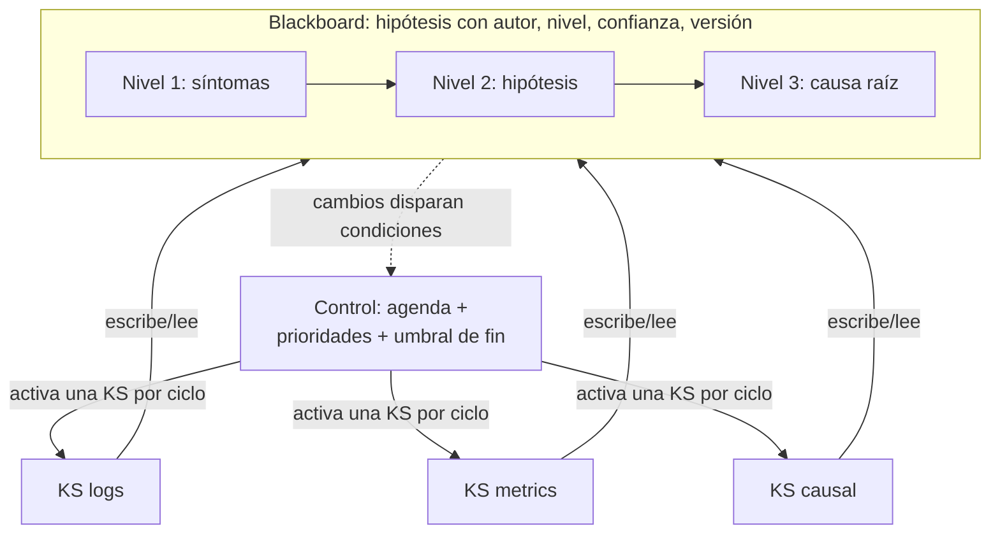

# 130 — Blackboard y memoria compartida

> [← Clase anterior](../../../classes/part-10-multi-agent-systems-and-interoperability/129-critica-revision-y-debate-controlado/README.md) · [Índice de la parte](../README.md) · [Clase siguiente →](../../../classes/part-10-multi-agent-systems-and-interoperability/131-contratos-de-roles-capacidades-y-resultados/README.md)

**Parte:** 10 — Sistemas multiagente e interoperabilidad  
**Nivel:** experto · **Horas estimadas:** 6  
**Laboratorio:** `multiagent` · **Estado:** `EXECUTABLE_CORE`

## 🎯 Propósito

Comprender **blackboard y memoria compartida** dentro de la evolución de la inteligencia
artificial, implementar un experimento mínimo verificable y distinguir qué parte
constituye evidencia frente a una afirmación todavía no comprobada.

## 📚 Resultados de aprendizaje

Al finalizar podrás:

1. Explicar blackboard y memoria compartida usando los conceptos `blackboard`, `shared memory`, `coordination`, `conflicts`.
2. Ejecutar el laboratorio con una semilla explícita y revisar su contrato JSON.
3. Identificar al menos un supuesto, una limitación y un riesgo de aplicación.
4. Comparar el enfoque con la etapa anterior de la ruta de aprendizaje.
5. Producir una evidencia reproducible y una conclusión que no exceda los datos.

## 🧩 Conceptos centrales

`blackboard`, `shared memory`, `coordination`, `conflicts`

## 🗺️ Ubicación en el mapa de la IA

El blackboard es la arquitectura multiagente más antigua que sigue viva: nació en los
años 70 con Hearsay-II (comprensión de habla) y HASP, décadas antes de los LLM. Frente
al control central de supervisor-workers (127) y a los mensajes punto a punto de los
handoffs (126), propone coordinación *indirecta*: los especialistas no se hablan entre
sí, colaboran leyendo y escribiendo sobre una memoria común. Hoy reaparece en los
sistemas agénticos como estado compartido (el *state* de LangGraph, archivos de
trabajo, scratchpads persistentes).

## 📖 Fundamentos

### 🧑‍🏫 La metáfora y los tres componentes

Varios expertos frente a una pizarra resuelven un problema que ninguno puede resolver
solo: cada uno escribe cuando ve algo que aportar, y lo escrito dispara las
contribuciones de los demás. Formalmente (Nii, 1986):

1. **Blackboard**: memoria compartida y estructurada, normalmente jerárquica (niveles
   de abstracción: en Hearsay-II, señal → sílabas → palabras → frases). Contiene
   *hipótesis* con atributos: autor, nivel, confianza, timestamp.
2. **Fuentes de conocimiento (KS)**: especialistas con un par
   `(condición de activación, acción)`: "si aparece una hipótesis de tipo X en el
   nivel Y, puedo producir Z". No se conocen entre sí — solo conocen el blackboard.
3. **Control**: decide qué KS activa cuando varias son aplicables (agenda con
   prioridades). Es la pieza que evita el caos: sin ella, todas las KS escribirían a
   la vez.

### 🔄 El ciclo de ejecución

```text
repetir hasta solución o presupuesto:
  1. cambios en el blackboard → se evalúan las condiciones de las KS
  2. KS aplicables entran en la agenda con una prioridad (heurística de control)
  3. el control elige UNA (o pocas) y la ejecuta
  4. la KS lee lo pertinente, computa y ESCRIBE nuevas hipótesis (no borra las ajenas)
  5. el nuevo estado re-dispara el ciclo  →  la solución se construye incrementalmente
```

El flujo de control es **oportunista**: no hay plan fijo; la secuencia emerge de qué
hipótesis aparecen. Es la diferencia esencial con supervisor-workers, donde la
descomposición se decide de antemano.

### ⚔️ Conflictos y consistencia

La memoria compartida introduce los problemas clásicos de concurrencia, en versión
epistémica:

- **Conflicto de escritura**: dos KS proponen hipótesis incompatibles (la palabra es
  "peso" vs "beso"). Resolución: ambas coexisten con confianza; niveles superiores
  desempatan con más contexto — el blackboard acumula alternativas, no las pisa.
- **Lectura obsoleta**: una KS computó sobre un estado que otra ya refinó. Mitigación:
  versionado de hipótesis y re-validación antes de escribir.
- **Deadlock epistémico**: nadie tiene condición activable (el sistema "se queda sin
  ideas"). Mitigación: KS de relajación o escalada a humano.
- En sistemas LLM se añade el **límite de ventana**: el blackboard crece y no cabe en
  el contexto de cada agente; hacen falta vistas (resúmenes por nivel) en lugar del
  volcado completo.

## 🧮 Ejemplo trabajado

Diagnóstico de un incidente con blackboard de 3 niveles (síntomas → hipótesis → causa)
y 3 KS: `logs` (síntomas desde logs), `metrics` (síntomas desde métricas), `causal`
(correlaciona síntomas en hipótesis de causa).

```text
t1  KS logs escribe:    s1 = "errores 502 desde 09:31" (conf 0.9, nivel síntoma)
t2  KS metrics escribe: s2 = "latencia p99 ×8 desde 09:30" (conf 0.85, síntoma)
t3  condición de KS causal se activa (≥2 síntomas correlacionados en el tiempo)
    escribe: h1 = "saturación del pool de conexiones" (conf 0.6, nivel hipótesis)
t4  KS logs (re-disparada por h1) busca evidencia dirigida:
    escribe: s3 = "pool exhausted en logs de la BD" (conf 0.95)
t5  KS causal refina: h1 sube a conf 0.9; escribe causa raíz al nivel superior
    control: umbral de solución alcanzado (conf ≥ 0.85 en nivel causa) → fin
```

Obsérvese t4: la hipótesis de una KS *dirigió* la búsqueda de otra sin que nadie las
coordinara explícitamente — eso es coordinación indirecta (estigmergia, como las
feromonas de las hormigas). Y en t3-t5 las hipótesis alternativas que hubiera
("deploy defectuoso", conf 0.4) siguen en la pizarra: si h1 se hubiera refutado, el
control habría vuelto a ellas.

## 📊 Propiedades y comparación

| Propiedad | Blackboard | Supervisor-workers (127) | Mensajería punto a punto (126) |
|---|---|---|---|
| Coordinación | Indirecta, por el medio | Directa, jerárquica | Directa, por pares |
| Plan | Emergente (oportunista) | Descompuesto a priori | Encadenado por traspaso |
| Acoplamiento entre agentes | Mínimo (no se conocen) | Medio (contrato con supervisor) | Alto (esquema por par) |
| Añadir un especialista | Trivial (nueva KS) | Tocar al supervisor | Tocar a los pares |
| Trazabilidad | Historia completa en el medio | Traza en árbol | Cadena de mensajes |
| Riesgo típico | Caos sin control / medio saturado | Cuello de botella supervisor | Pérdida de contexto |
| Ideal para | Problemas mal estructurados, evidencia incremental | Tareas descomponibles | Flujos con dueño claro |



## ⚠️ Errores conceptuales frecuentes

1. **"Memoria compartida = contexto compartido gratis."** En LLM cada lectura del
   blackboard se re-tokeniza en cada agente; el medio compartido no elimina el coste,
   lo estructura.
2. **Dejar que las KS borren o pisen hipótesis ajenas.** El blackboard acumula
   alternativas con confianza; sobrescribir destruye la capacidad de retroceder.
3. **Blackboard sin control.** Sin agenda ni prioridades todas las KS escriben a la
   vez y el medio se llena de ruido; el control es un componente, no un adorno.
4. **Confundir blackboard con un log de chat.** El chat es secuencial y sin estructura;
   el blackboard tiene niveles, tipos y confianzas que hacen las condiciones de
   activación computables.
5. **Ignorar la obsolescencia.** Una hipótesis leída puede haber sido refinada al
   escribir la respuesta; sin versionado, los agentes razonan sobre estados muertos.

## 🚀 Del aprendizaje a la operación

Un blackboard operativo exige: un almacén real con transacciones y versionado (no un
dict en memoria) que sobreviva reinicios (enlaza con la clase 135); control de acceso
por KS (quién puede escribir en qué nivel); vistas resumidas por agente para no
desbordar ventanas; poda y archivado del medio (crece sin límite); y métricas de
convergencia — ciclos sin progreso de confianza son la señal de deadlock epistémico
que debe escalar a humano.

## 🧪 Laboratorio

```bash
python lab.py
```

El laboratorio llama a `ai_evolution.labs.run_lab("multiagent")`. Esta
decisión evita 183 implementaciones divergentes: cada clase tiene un entrypoint
propio, pero los motores didácticos se prueban como una biblioteca común.

### 🔍 Evidencia esperada

- tipo de laboratorio y semilla;
- entradas o decisiones observables;
- resultado estructurado;
- lista `evidence` con hechos que pueden inspeccionarse;
- lista `limitations` que impide presentar la demo como producción.

## 📓 Notebooks

- [📓 `notebook.ipynb`](notebook.ipynb): recorrido guiado con la materia resumida.
- [✍️ `notebook_student.ipynb`](notebook_student.ipynb): ejercicios para resolver.
- [✅ `notebook_solution.ipynb`](notebook_solution.ipynb): solución de referencia explicada.

## 📝 Evaluación

| Criterio | Peso |
|---|---:|
| Comprensión conceptual | 25 % |
| Ejecución reproducible | 25 % |
| Interpretación basada en evidencia | 25 % |
| Riesgos, límites y mejora propuesta | 25 % |

Consulta [assessment.md](assessment.md) para preguntas y criterio de aceptación.

## ⚠️ Errores comunes

| Síntoma | Causa probable | Corrección |
|---|---|---|
| El código corre, pero no hay conclusión | Se confundió ejecución con aprendizaje | Explica qué demuestra y qué no demuestra |
| El resultado cambia sin explicación | No se registró semilla o configuración | Conserva semilla, versión y parámetros |
| Se promete uso real | Se extrapoló desde una demo educativa | Declara entorno, datos, límites y revisión humana |
| Se copia una métrica aislada | No existe baseline ni costo de error | Añade comparación y criterio de decisión |

## ❓ Preguntas frecuentes

**¿Debo usar una API comercial?**  
No. El núcleo funciona localmente. Las extensiones LIVE se documentan por separado.

**¿El laboratorio representa una implementación industrial?**  
No por sí solo. Enseña el contrato y el patrón; producción exige integración,
seguridad, observabilidad, pruebas y operación.

**¿Dónde profundizo?**  
Revisa las especializaciones enlazadas en el README raíz y la ruta siguiente.

## 🔗 Referencias

- [Nii, H. P., *The Blackboard Model of Problem Solving and the Evolution of Blackboard Architectures*, AI Magazine 7(2), 1986](https://doi.org/10.1609/aimag.v7i2.537): el survey clásico de la arquitectura.
- [Erman et al., *The Hearsay-II Speech-Understanding System*, ACM Computing Surveys 12(2), 1980](https://doi.org/10.1145/356810.356816): el sistema que originó el patrón.
- Wooldridge, M., *An Introduction to MultiAgent Systems*, 2.ª ed., Wiley, 2009: coordinación indirecta y entornos compartidos. — uso: desarrollo extendido del tema
- [LangGraph — Graph API (estado compartido)](https://docs.langchain.com/oss/python/langgraph/graph-api): el *state* tipado como blackboard moderno entre nodos.
- [Anthropic — How we built our multi-agent research system (2025)](https://www.anthropic.com/engineering/multi-agent-research-system): memoria y artefactos compartidos entre lead y subagentes.

<!-- papers:inicio -->

---

## 📜 Papers que fundamentan esta clase

> Bloque generado por `python scripts/link_papers_to_classes.py`. La fuente es [`papers/catalog/papers.json`](../../../papers/catalog/papers.json).

| Paper | Año | Qué desbloqueó | Miniatura |
|---|---:|---|---|
| [P135 · El sistema Hearsay-II: integrar conocimiento para resolver incertidumbre](../../../papers/foundational/P135_pizarra/README.md) | 1980 | Introduce la arquitectura de pizarra: fuentes de conocimiento independientes que publican hipótesis en una estructura compartida, sin llamarse entre sí. | [notebook](../../../notebooks/papers/P135_pizarra.ipynb) |

Cada ficha explica el problema anterior, la matemática mínima, los límites y los errores de atribución más frecuentes. Para leerlas con método: [cómo leer un paper de IA](../../../papers/guides/COMO_LEER_UN_PAPER_DE_IA.md) · [anexos matemáticos](../../../papers/annexes/README.md).
<!-- papers:fin -->
---

## ⬅️ Clase anterior

[129 — Crítica, revisión y debate controlado](../../part-10-multi-agent-systems-and-interoperability/129-critica-revision-y-debate-controlado/README.md)

## ➡️ Siguiente clase

[131 — Contratos de roles, capacidades y resultados](../../part-10-multi-agent-systems-and-interoperability/131-contratos-de-roles-capacidades-y-resultados/README.md)
