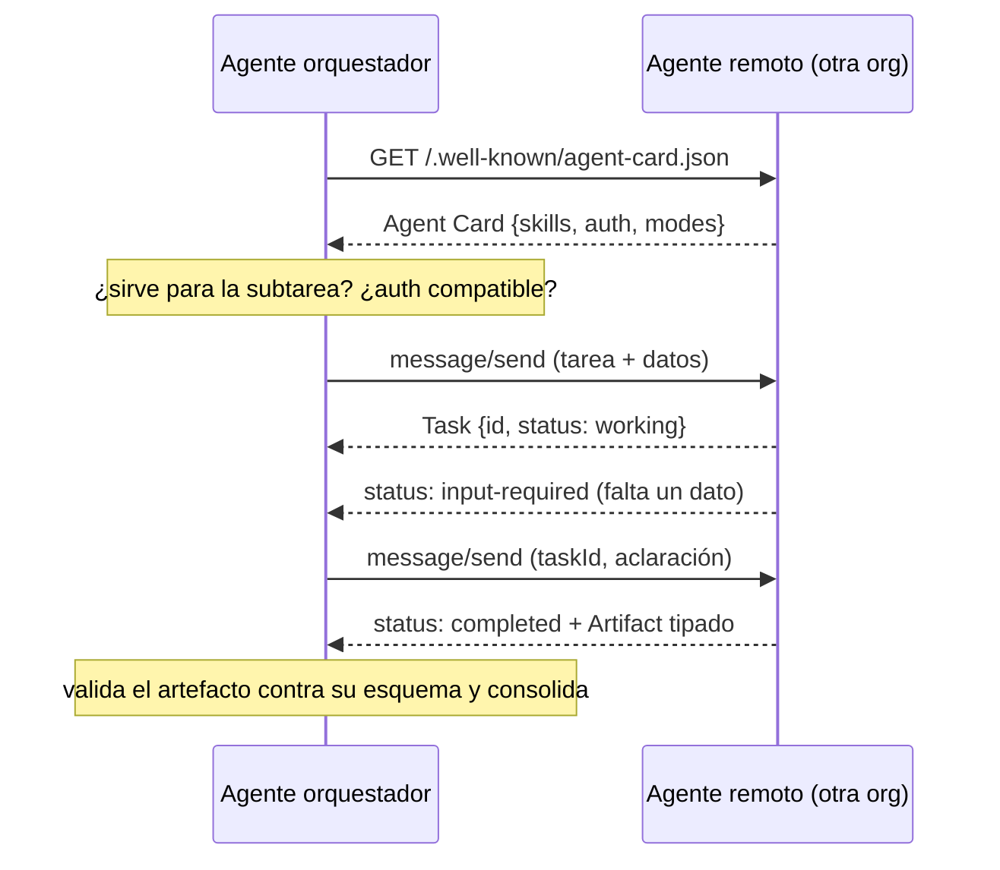

# 131 — A2A, descubrimiento e interoperabilidad

> [← Clase anterior](../../../classes/part-10-multi-agent-systems-and-interoperability/130-agent-skills-como-capacidades-portables/README.md) · [Índice de la parte](../README.md) · [Clase siguiente →](../../../classes/part-10-multi-agent-systems-and-interoperability/132-proyecto-sistema-multiagente-durable/README.md)

**Parte:** 10 — Sistemas multiagente e interoperabilidad  
**Nivel:** experto · **Horas estimadas:** 6  
**Laboratorio:** `multiagent` · **Estado:** `EXECUTABLE_CORE`

## 🎯 Propósito

Comprender **a2a, descubrimiento e interoperabilidad** dentro de la evolución de la inteligencia
artificial, implementar un experimento mínimo verificable y distinguir qué parte
constituye evidencia frente a una afirmación todavía no comprobada.

## 📚 Resultados de aprendizaje

Al finalizar podrás:

1. Explicar a2a, descubrimiento e interoperabilidad usando los conceptos `A2A`, `discovery`, `agent card`, `tasks`.
2. Ejecutar el laboratorio con una semilla explícita y revisar su contrato JSON.
3. Identificar al menos un supuesto, una limitación y un riesgo de aplicación.
4. Comparar el enfoque con la etapa anterior de la ruta de aprendizaje.
5. Producir una evidencia reproducible y una conclusión que no exceda los datos.

## 🧩 Conceptos centrales

`A2A`, `discovery`, `agent card`, `tasks`

## 🗺️ Ubicación en el mapa de la IA

Con MCP (129) un agente habla con sus herramientas; falta el otro eje: agentes de
*distintos proveedores y organizaciones* colaborando sin compartir framework, modelo
ni memoria. El protocolo **Agent2Agent (A2A)** — anunciado por Google en abril de
2025 con decenas de socios y donado después a la Linux Foundation — estandariza ese
eje: descubrimiento por Agent Card, tareas con ciclo de vida y artefactos como
resultados. Junto con los contratos (128), MCP (129) y los skills (130), completa el
stack de interoperabilidad que el proyecto integrador (132) ensambla.

## 📖 Fundamentos

### 🪪 Descubrimiento: la Agent Card

Cada agente A2A publica un documento JSON de metadatos — típicamente en una URL
conocida (`/.well-known/agent-card.json`) — que declara identidad, endpoint,
capacidades y esquemas de autenticación:

```json
{
  "name": "repo-review-agent",
  "description": "Evalúa la preparación de repositorios para publicación",
  "url": "https://agents.example.com/a2a/v1",
  "version": "1.2.0",
  "capabilities": {"streaming": true, "pushNotifications": false},
  "skills": [{
    "id": "repo-readiness",
    "name": "Revisión de preparación",
    "description": "Audita calidad, seguridad y documentación de un repositorio",
    "inputModes": ["text/plain"],
    "outputModes": ["application/json"]
  }],
  "securitySchemes": {"bearer": {"type": "http", "scheme": "bearer"}}
}
```

La Agent Card es el contrato de la clase 128 hecho protocolo: un agente cliente la
lee, decide si el remoto sirve para su subtarea, negocia autenticación y sabe qué
formatos puede intercambiar — todo *antes* del primer mensaje.

### 🔄 Tareas, mensajes y artefactos

A2A modela la colaboración como **tareas** (tasks) con ciclo de vida explícito, sobre
JSON-RPC 2.0/HTTP (con streaming vía SSE para tareas largas):

```text
message/send  →  crea o continúa una tarea
estados: submitted → working → [input-required] → completed | failed | canceled

Task {id, contextId, status, history: [Message], artifacts: [Artifact]}
Message  = turnos cliente↔agente con parts (texto, archivos, datos estructurados)
Artifact = el RESULTADO entregable de la tarea (documento, JSON, imagen)
```

Decisiones de diseño importantes: (1) el estado `input-required` formaliza que el
agente remoto puede *pedir más información* a mitad de tarea — la conversación
multi-turno entre agentes es parte del protocolo, no un hack; (2) los **artefactos**
separan el resultado entregable de la charla que lo produjo (el análogo protocolar
del payload destilado de la clase 123); (3) los agentes colaboran como **cajas
opacas**: no exponen su razonamiento interno, ni su memoria, ni sus herramientas —
solo tareas, mensajes y artefactos. Esa opacidad es lo que permite que dos empresas
colaboren sin revelar secretos industriales.

### 🧭 A2A y MCP: complementarios, no competidores

Regla mnemotécnica oficial: un agente usa **MCP** para hablar con *sus herramientas*
(martillo, base de datos) y **A2A** para hablar con *otros agentes* (el mecánico al
que le encargas la reparación). MCP integra capacidades dentro de un agente; A2A
delega tareas entre agentes soberanos. Un mismo agente típicamente implementa ambos:
consume tools por MCP y ofrece sus servicios por A2A.

## 🧮 Ejemplo trabajado

Un agente orquestador de contrataciones delega la verificación de antecedentes a un
agente externo especializado:

```text
1. DESCUBRIR   GET https://checks.example.com/.well-known/agent-card.json
               → skill "background-check", outputModes: application/json,
                 auth: bearer  → apto para la subtarea

2. DELEGAR     message/send {message: {role: "user", parts: [
                 {kind: "text", text: "verificar antecedentes de <candidato>"},
                 {kind: "data", data: {consent_id: "C-2210"}}]}}
               ← Task {id: "T-77", status: "working"}

3. INTERACTUAR ← status: "input-required",
                 message: "¿el consentimiento cubre verificación internacional?"
               → message/send (taskId T-77): "sí, adjunto alcance"  → "working"

4. RESULTADO   ← status: "completed",
                 artifacts: [{name: "informe", parts: [{kind: "data",
                   data: {result: "sin_hallazgos", fuentes: 4}}]}]

5. CONSUMIR    el orquestador valida el artefacto contra su esquema esperado
               y lo consolida con el resto de su workflow de contratación
```

Nótese lo que NO viajó: ni el modelo que usa el verificador, ni sus fuentes internas,
ni su prompt. Viajó una tarea, dos mensajes y un artefacto tipado. Si el remoto
hubiera tardado horas, `pushNotifications` habría evitado el polling.

## 📊 Propiedades y comparación

| Dimensión | A2A | MCP (129) | Handoff interno (123) |
|---|---|---|---|
| Eje | Agente ↔ agente (pares soberanos) | Agente ↔ herramienta/contexto | Agente ↔ agente (mismo sistema) |
| Descubrimiento | Agent Card en URL conocida | `tools/list` tras conectar | Registro interno |
| Unidad de trabajo | Task con ciclo de vida y artefactos | Invocación de tool (request/response) | Payload de contexto |
| Estado remoto | Opaco (caja negra) | El servidor expone primitivas | Compartible (misma organización) |
| Multi-turno | Sí (`input-required`) | No en la invocación individual | Sí (devoluciones) |
| Confianza | Entre organizaciones: auth + contratos | Host controla consentimiento | Intra-sistema |



## ⚠️ Errores conceptuales frecuentes

1. **"A2A compite con MCP."** Operan en ejes ortogonales: herramientas dentro del
   agente (MCP) vs. delegación entre agentes soberanos (A2A); los sistemas serios usan ambos.
2. **Tratar al agente remoto como una función.** Es una tarea con ciclo de vida:
   puede tardar, pedir más datos (`input-required`), fallar a medias o cancelarse; el
   cliente debe manejar todos esos estados.
3. **Confundir mensajes con artefactos.** La conversación es transporte; el
   entregable es el artefacto — consolidar desde los mensajes reintroduce el "teléfono roto".
4. **Confiar en la Agent Card sin verificar.** La card es una *declaración*
   publicitaria: la identidad se verifica con la autenticación y la calidad con
   conformance tests y SLA (clase 128), no leyendo el JSON.
5. **Asumir memoria compartida entre pares.** Cada agente es opaco; todo lo que el
   remoto debe saber viaja en la tarea. El `contextId` agrupa tareas relacionadas,
   no crea memoria común.

## 🚀 Del aprendizaje a la operación

Interoperar entre organizaciones añade lo que ningún protocolo resuelve por sí solo:
gestión de identidad y credenciales entre dominios (¿quién emite y rota los
tokens?); acuerdos legales y de datos detrás de cada delegación (el consentimiento
del ejemplo); registro y auditoría de tareas cross-org para disputas; timeouts y
compensaciones cuando el remoto falla a mitad de una tarea con efectos; y un registro
de agentes confiables con conformance testing — la versión operativa del "no confíes
en la Agent Card sin verificar".

## 🧪 Laboratorio

```bash
python lab.py
```

El laboratorio llama a `ai_evolution.labs.run_lab("multiagent")`. Esta
decisión evita 180 implementaciones divergentes: cada clase tiene un entrypoint
propio, pero los motores didácticos se prueban como una biblioteca común.

### 🔍 Evidencia esperada

- tipo de laboratorio y semilla;
- entradas o decisiones observables;
- resultado estructurado;
- lista `evidence` con hechos que pueden inspeccionarse;
- lista `limitations` que impide presentar la demo como producción.

## 📓 Notebooks

- [📓 `notebook.ipynb`](notebook.ipynb): recorrido guiado con la materia resumida.
- [✍️ `notebook_student.ipynb`](notebook_student.ipynb): ejercicios para resolver.
- [✅ `notebook_solution.ipynb`](notebook_solution.ipynb): solución de referencia explicada.

## 📝 Evaluación

| Criterio | Peso |
|---|---:|
| Comprensión conceptual | 25 % |
| Ejecución reproducible | 25 % |
| Interpretación basada en evidencia | 25 % |
| Riesgos, límites y mejora propuesta | 25 % |

Consulta [assessment.md](assessment.md) para preguntas y criterio de aceptación.

## ⚠️ Errores comunes

| Síntoma | Causa probable | Corrección |
|---|---|---|
| El código corre, pero no hay conclusión | Se confundió ejecución con aprendizaje | Explica qué demuestra y qué no demuestra |
| El resultado cambia sin explicación | No se registró semilla o configuración | Conserva semilla, versión y parámetros |
| Se promete uso real | Se extrapoló desde una demo educativa | Declara entorno, datos, límites y revisión humana |
| Se copia una métrica aislada | No existe baseline ni costo de error | Añade comparación y criterio de decisión |

## ❓ Preguntas frecuentes

**¿Debo usar una API comercial?**  
No. El núcleo funciona localmente. Las extensiones LIVE se documentan por separado.

**¿El laboratorio representa una implementación industrial?**  
No por sí solo. Enseña el contrato y el patrón; producción exige integración,
seguridad, observabilidad, pruebas y operación.

**¿Dónde profundizo?**  
Revisa las especializaciones enlazadas en el README raíz y la ruta siguiente.

## 🔗 Referencias

- [A2A Protocol — sitio y especificación](https://a2a-protocol.org/latest/): Agent Cards, tasks, messages y artifacts.
- [Google Developers Blog — A2A: A New Era of Agent Interoperability (2025)](https://developers.googleblog.com/en/a2a-a-new-era-of-agent-interoperability/): anuncio, motivación y principios de diseño.
- [Linux Foundation — Agent2Agent Protocol Project (2025)](https://www.linuxfoundation.org/press/linux-foundation-launches-the-agent2agent-protocol-project-to-enable-secure-intelligent-communication-between-ai-agents): gobernanza abierta del protocolo.
- [Model Context Protocol](https://modelcontextprotocol.io/): el eje complementario agente↔herramientas.
- [JSON-RPC 2.0](https://www.jsonrpc.org/specification): la capa de mensajes común a ambos protocolos.

---

## ⬅️ Clase anterior

[130 — Agent Skills como capacidades portables](../../part-10-multi-agent-systems-and-interoperability/130-agent-skills-como-capacidades-portables/README.md)

## ➡️ Siguiente clase

[132 — Proyecto: sistema multiagente durable](../../part-10-multi-agent-systems-and-interoperability/132-proyecto-sistema-multiagente-durable/README.md)
