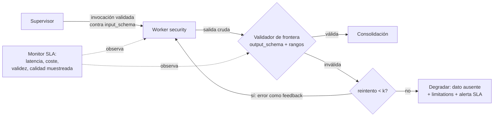

# 131 — Contratos de roles, capacidades y resultados

> [← Clase anterior](../../../classes/part-10-multi-agent-systems-and-interoperability/130-blackboard-y-memoria-compartida/README.md) · [Índice de la parte](../README.md) · [Clase siguiente →](../../../classes/part-10-multi-agent-systems-and-interoperability/132-mcp-tools-resources-y-prompts/README.md)

**Parte:** 10 — Sistemas multiagente e interoperabilidad  
**Nivel:** experto · **Horas estimadas:** 6  
**Laboratorio:** `multiagent` · **Estado:** `EXECUTABLE_CORE`

## 🎯 Propósito

Comprender **contratos de roles, capacidades y resultados** dentro de la evolución de la inteligencia
artificial, implementar un experimento mínimo verificable y distinguir qué parte
constituye evidencia frente a una afirmación todavía no comprobada.

## 📚 Resultados de aprendizaje

Al finalizar podrás:

1. Explicar contratos de roles, capacidades y resultados usando los conceptos `role`, `capabilities`, `schemas`, `SLA`.
2. Ejecutar el laboratorio con una semilla explícita y revisar su contrato JSON.
3. Identificar al menos un supuesto, una limitación y un riesgo de aplicación.
4. Comparar el enfoque con la etapa anterior de la ruta de aprendizaje.
5. Producir una evidencia reproducible y una conclusión que no exceda los datos.

## 🧩 Conceptos centrales

`role`, `capabilities`, `schemas`, `SLA`

## 🗺️ Ubicación en el mapa de la IA

Todos los patrones vistos (router, handoffs, supervisor, blackboard) funcionan solo si
los agentes acuerdan *qué puede hacer cada uno* y *qué forma tienen los resultados*.
Esta clase formaliza ese acuerdo como contratos: la ingeniería de software clásica
(design by contract, esquemas, SLA) aplicada a agentes no deterministas. Es el puente
directo a los protocolos de interoperabilidad: las tools de MCP (132), los skills
portables (133) y las Agent Cards de A2A (134) son, todos, contratos serializados.

## 📖 Fundamentos

### 📜 Tres capas de contrato

1. **Contrato de rol**: qué responsabilidad asume el agente y qué queda fuera
   (*scope*). Incluye autoridad (qué puede decidir solo, qué debe escalar) y
   obligaciones (registrar evidencia, declarar incertidumbre).
2. **Contrato de capacidades**: qué operaciones ofrece, con qué entradas y bajo qué
   límites. La forma práctica es un **esquema tipado** por operación — exactamente lo
   que hace una definición de tool: nombre, descripción, JSON Schema de argumentos.
3. **Contrato de resultados**: la forma y las garantías de la salida — esquema, rangos
   válidos, semántica de cada campo, y **qué se garantiza cuando falla** (un error
   tipado también es un resultado con contrato).

### 🧾 Esquemas: validación en las fronteras

Con agentes LLM la salida es texto probabilístico; el contrato se hace cumplir
validando en la frontera. JSON Schema es la lingua franca (lo usan MCP y las tool
definitions de los principales proveedores):

```json
{
  "name": "review_security",
  "description": "Evalúa la postura de seguridad de un repositorio",
  "input_schema": {
    "type": "object",
    "properties": {"repository": {"type": "string"}},
    "required": ["repository"]
  },
  "output_schema": {
    "type": "object",
    "properties": {
      "agent":   {"const": "security"},
      "score":   {"type": "number", "minimum": 0, "maximum": 1},
      "finding": {"type": "string", "minLength": 1}
    },
    "required": ["agent", "score", "finding"]
  }
}
```

Regla operativa: **validar a la entrada y a la salida de cada agente** (el clásico
"be liberal in what you accept" NO aplica entre agentes: tolerar salidas malformadas
propaga la corrupción al siguiente eslabón). Ante violación: reintentar con el error
como feedback, degradar o escalar — nunca "arreglar en silencio".

### ⏱️ SLA: garantías operativas

El esquema dice la *forma*; el **SLA** (Service Level Agreement) dice las *garantías*
medibles: latencia (p50/p95), tasa de éxito de validación, presupuesto máximo
(tokens/coste por invocación), frescura de los datos, y política ante incumplimiento
(reintento, proveedor alternativo, escalada). Para agentes se añade una garantía
inexistente en los servicios clásicos: **calidad de la respuesta** — se aproxima con
evaluaciones muestreadas (LLM-judge, tests), nunca se garantiza determinísticamente.
Un SLA de agente honesto promete distribución ("validez ≥ 99 %, utilidad media ≥ 4/5
sobre muestra evaluada"), no perfección por llamada.

### 🤝 Contratos y negociación

En sistemas abiertos los contratos permiten **descubrimiento** (publico mis
capacidades, otros deciden si me usan — la Agent Card de A2A) y **negociación** (el
Contract Net Protocol de Smith, 1980: anuncio de tarea → pujas → adjudicación),
antecedente directo de la asignación de tareas en marketplaces de agentes.

## 🧮 Ejemplo trabajado

El contrato del worker del laboratorio, y su verificación:

```text
ROL:          evaluar UN aspecto del repositorio; prohibido decidir el veredicto global
CAPACIDAD:    review_<aspecto>(repository: string) — 1 invocación, sin efectos laterales
RESULTADO:    {agent: const, score: [0,1], finding: string no vacía}
SLA didáctico: responde siempre; score determinista dada la misma entrada

Verificación sobre la salida real (seed=131):
  {"agent": "security", "score": 0.6, "finding": "falta threat model"}
  agent == "security"        ✓ (const)
  0 ≤ 0.6 ≤ 1                ✓ (rango)
  len(finding) = 18 ≥ 1      ✓ (no vacía)

Violaciones que el validador debe atrapar (y su tipo):
  {"agent": "security", "score": 1.4, ...}        → rango: score fuera de [0,1]
  {"agent": "security", "finding": "ok"}          → requerido: falta score
  {"agent": "Security", "score": 0.6, ...}        → const: 'Security' ≠ 'security'
  "El repo se ve bien en general"                 → tipo: texto libre, no objeto
```

El cuarto caso es el más frecuente con LLM reales: la salida "conversacional" que
ignora el formato. La respuesta correcta del sistema no es parsear con regex
heroicas: es reintentar adjuntando el error de validación, y degradar tras k intentos.

## 📊 Propiedades y comparación

| Nivel de contrato | Qué fija | Mecanismo | Cuándo falla | Respuesta al fallo |
|---|---|---|---|---|
| Rol | Alcance y autoridad | Prompt de sistema + permisos | Scope creep, decisión no autorizada | Auditoría, revocar acción |
| Capacidad (entrada) | Operaciones y argumentos | JSON Schema / tipos | Argumentos inválidos | Rechazo inmediato |
| Resultado (salida) | Forma y rangos | Validación en frontera | Salida malformada/fuera de rango | Reintento con feedback → degradar |
| SLA | Garantías medibles | Monitoreo + muestreo | Latencia/coste/calidad fuera de banda | Alerta, proveedor alternativo, escalada |



## ⚠️ Errores conceptuales frecuentes

1. **"El prompt es el contrato."** El prompt *pide*; el contrato se hace cumplir con
   validación en la frontera. Sin validador, el contrato es una esperanza.
2. **Tolerar salidas casi-válidas.** Arreglar en silencio un score de 1.4 a 1.0
   propaga datos corruptos con apariencia sana; la violación debe ser visible.
3. **SLA de perfección por llamada.** Un agente LLM no puede garantizar corrección
   determinista; el SLA honesto promete distribuciones sobre muestras evaluadas.
4. **Contratos sin caso de error.** "Qué devuelvo cuando no puedo" es parte del
   contrato; un error tipado es mejor resultado que un texto plausible inventado.
5. **Versionar el prompt pero no el esquema.** Los consumidores dependen del esquema;
   cambiarlo sin versión rompe a todos los pares silenciosamente.

## 🚀 Del aprendizaje a la operación

En producción, los contratos viven en un registro versionado (no en el código de cada
agente); la validación corre en ambos lados de cada frontera; el SLA se monitorea con
paneles y alertas (validez, latencia p95, coste por invocación, calidad muestreada);
los cambios de esquema siguen un protocolo de compatibilidad (añadir campo opcional ≠
cambiar tipo); y existe un proceso de *conformance testing* para aceptar un agente
nuevo en el sistema — precisamente lo que estandarizan MCP y A2A en las clases
siguientes.

## 🧪 Laboratorio

```bash
python lab.py
```

El laboratorio llama a `ai_evolution.labs.run_lab("multiagent")`. Esta
decisión evita 183 implementaciones divergentes: cada clase tiene un entrypoint
propio, pero los motores didácticos se prueban como una biblioteca común.

### 🔍 Evidencia esperada

- tipo de laboratorio y semilla;
- entradas o decisiones observables;
- resultado estructurado;
- lista `evidence` con hechos que pueden inspeccionarse;
- lista `limitations` que impide presentar la demo como producción.

## 📓 Notebooks

- [📓 `notebook.ipynb`](notebook.ipynb): recorrido guiado con la materia resumida.
- [✍️ `notebook_student.ipynb`](notebook_student.ipynb): ejercicios para resolver.
- [✅ `notebook_solution.ipynb`](notebook_solution.ipynb): solución de referencia explicada.

## 📝 Evaluación

| Criterio | Peso |
|---|---:|
| Comprensión conceptual | 25 % |
| Ejecución reproducible | 25 % |
| Interpretación basada en evidencia | 25 % |
| Riesgos, límites y mejora propuesta | 25 % |

Consulta [assessment.md](assessment.md) para preguntas y criterio de aceptación.

## ⚠️ Errores comunes

| Síntoma | Causa probable | Corrección |
|---|---|---|
| El código corre, pero no hay conclusión | Se confundió ejecución con aprendizaje | Explica qué demuestra y qué no demuestra |
| El resultado cambia sin explicación | No se registró semilla o configuración | Conserva semilla, versión y parámetros |
| Se promete uso real | Se extrapoló desde una demo educativa | Declara entorno, datos, límites y revisión humana |
| Se copia una métrica aislada | No existe baseline ni costo de error | Añade comparación y criterio de decisión |

## ❓ Preguntas frecuentes

**¿Debo usar una API comercial?**  
No. El núcleo funciona localmente. Las extensiones LIVE se documentan por separado.

**¿El laboratorio representa una implementación industrial?**  
No por sí solo. Enseña el contrato y el patrón; producción exige integración,
seguridad, observabilidad, pruebas y operación.

**¿Dónde profundizo?**  
Revisa las especializaciones enlazadas en el README raíz y la ruta siguiente.

## 🔗 Referencias

- [JSON Schema — especificación](https://json-schema.org/specification): el lenguaje estándar de los contratos de datos.
- [Model Context Protocol — Tools](https://modelcontextprotocol.io/specification/2025-06-18/server/tools): tools como contratos de capacidad con input/output schema.
- [A2A Protocol — Agent Cards](https://a2a-protocol.org/latest/): publicación de capacidades para descubrimiento entre agentes.
- [Smith, R. G., *The Contract Net Protocol*, IEEE Transactions on Computers C-29(12), 1980](https://doi.org/10.1109/TC.1980.1675516): negociación y adjudicación de tareas, el antecedente clásico.
- Meyer, B., *Object-Oriented Software Construction*, 2.ª ed., Prentice Hall, 1997: *design by contract* — precondiciones, postcondiciones e invariantes.

---

## ⬅️ Clase anterior

[130 — Blackboard y memoria compartida](../../part-10-multi-agent-systems-and-interoperability/130-blackboard-y-memoria-compartida/README.md)

## ➡️ Siguiente clase

[132 — MCP: tools, resources y prompts](../../part-10-multi-agent-systems-and-interoperability/132-mcp-tools-resources-y-prompts/README.md)
