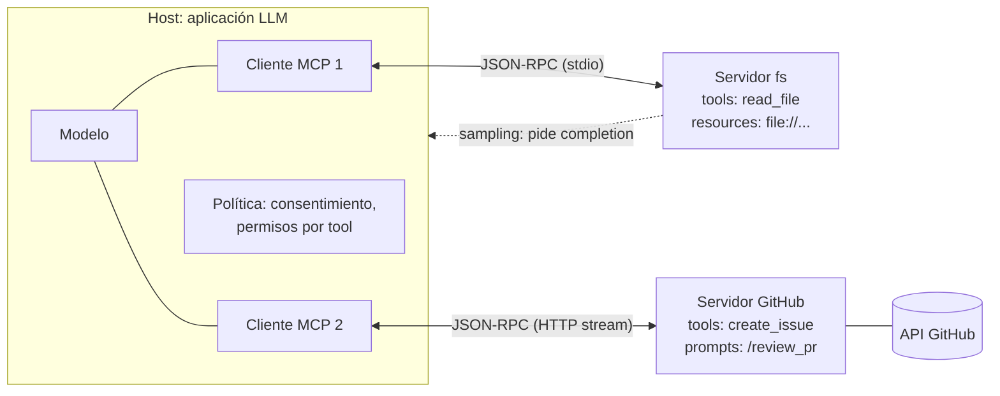

# 132 — MCP: tools, resources y prompts

> [← Clase anterior](../../../classes/part-10-multi-agent-systems-and-interoperability/131-contratos-de-roles-capacidades-y-resultados/README.md) · [Índice de la parte](../README.md) · [Clase siguiente →](../../../classes/part-10-multi-agent-systems-and-interoperability/133-agent-skills-como-capacidades-portables/README.md)

**Parte:** 10 — Sistemas multiagente e interoperabilidad  
**Nivel:** experto · **Horas estimadas:** 6  
**Laboratorio:** `workflow` · **Estado:** `EXECUTABLE_CORE`

## 🎯 Propósito

Comprender **mcp: tools, resources y prompts** dentro de la evolución de la inteligencia
artificial, implementar un experimento mínimo verificable y distinguir qué parte
constituye evidencia frente a una afirmación todavía no comprobada.

## 📚 Resultados de aprendizaje

Al finalizar podrás:

1. Explicar mcp: tools, resources y prompts usando los conceptos `MCP`, `tools`, `resources`, `prompts`.
2. Ejecutar el laboratorio con una semilla explícita y revisar su contrato JSON.
3. Identificar al menos un supuesto, una limitación y un riesgo de aplicación.
4. Comparar el enfoque con la etapa anterior de la ruta de aprendizaje.
5. Producir una evidencia reproducible y una conclusión que no exceda los datos.

## 🧩 Conceptos centrales

`MCP`, `tools`, `resources`, `prompts`

## 🗺️ Ubicación en el mapa de la IA

Antes de MCP, conectar m aplicaciones LLM con n fuentes de datos/herramientas exigía
m×n integraciones a medida. El Model Context Protocol (anunciado por Anthropic en
noviembre de 2024 y adoptado después por los principales proveedores) estandariza esa
frontera: un protocolo abierto para que cualquier cliente hable con cualquier
servidor de contexto — el problema pasa de m×n a m+n. Es la materialización de los
contratos de la clase 131, y el complemento "agente↔herramientas" del A2A
"agente↔agente" que verás en la 131.

## 📖 Fundamentos

### 🏗️ Arquitectura: host, cliente, servidor

- **Host**: la aplicación LLM (Claude Desktop, un IDE, tu agente) que orquesta y
  aplica las políticas de seguridad y consentimiento.
- **Cliente MCP**: componente dentro del host que mantiene una conexión 1:1 con cada
  servidor.
- **Servidor MCP**: programa que expone capacidades (tools, resources, prompts) sobre
  una fuente concreta: un sistema de archivos, GitHub, una base de datos.

La capa de mensajes es **JSON-RPC 2.0** con un ciclo de vida explícito:
`initialize` (negociación de versión y capacidades: cada lado declara qué soporta) →
operación (requests/responses y notificaciones) → cierre. Transportes estándar:
**stdio** (proceso local) y **HTTP con streaming** (remoto).

### 🧰 Las tres primitivas del servidor

| Primitiva | Quién decide usarla | Análogo | Ejemplo |
|---|---|---|---|
| **Tool** | El *modelo* (model-controlled) | Función POST con efectos | `create_issue`, `query_db` |
| **Resource** | La *aplicación* (app-controlled) | GET de solo lectura, direccionable por URI | `file:///repo/README.md` |
| **Prompt** | El *usuario* (user-controlled) | Plantilla parametrizada invocable | `/summarize_pr` |

- **Tools**: se descubren con `tools/list` (nombre, descripción, `inputSchema` en
  JSON Schema) y se invocan con `tools/call`. Pueden tener efectos laterales; por eso
  la spec exige consentimiento humano en el host para operaciones sensibles.
- **Resources**: datos identificados por URI que la aplicación inyecta como contexto
  (`resources/list`, `resources/read`, suscripciones a cambios). Sin efectos: leer no
  ejecuta.
- **Prompts**: plantillas con argumentos que el usuario invoca explícitamente
  (`prompts/list`, `prompts/get`) — flujos empaquetados por el autor del servidor.

La distinción de *quién controla cada primitiva* es la decisión de diseño central del
protocolo: separa lo que el modelo puede decidir hacer (tools, con permiso) de lo que
la app decide mostrar (resources) y de lo que el usuario decide lanzar (prompts).

### 🔁 Primitivas del cliente y seguridad

El protocolo es bidireccional. El servidor puede pedirle al host: **sampling**
(solicitar una completion al LLM del host — el servidor usa inteligencia sin tener
API key propia), **elicitation** (pedir información al usuario) y **logging**. El
host conserva el control: la spec obliga a que el usuario apruebe tools sensibles y a
que el servidor nunca vea la conversación completa; un servidor malicioso es parte
del modelo de amenazas (tool poisoning, exfiltración por descripciones), de ahí la
revisión de servidores de terceros antes de conectarlos.

## 🧮 Ejemplo trabajado

Flujo completo host ↔ servidor de archivos (mensajes abreviados):

```text
→ initialize        {protocolVersion, capabilities: {tools: {}, resources: {}}}
← initialize.result {serverInfo: "fs-server", capabilities: {tools: {listChanged}, resources: {}}}
→ notifications/initialized

→ tools/list
← [{name: "read_file",
    description: "Lee un archivo de texto del workspace",
    inputSchema: {type: "object",
                  properties: {path: {type: "string"}},
                  required: ["path"]}}]

  (el usuario pregunta: "¿qué dice el CHANGELOG?")
  el modelo decide invocar la tool; el host pide confirmación si es sensible

→ tools/call        {name: "read_file", arguments: {path: "CHANGELOG.md"}}
← result            {content: [{type: "text", text: "## v2.41 ..."}], isError: false}

  el host inyecta el contenido al contexto del modelo → respuesta al usuario
```

Los dos errores posibles viven en capas distintas y se señalizan distinto: error de
*protocolo* (tool inexistente → error JSON-RPC) y error de *ejecución* (archivo no
encontrado → `isError: true` dentro de un result válido, para que el modelo pueda
leerlo y reaccionar — reintentar con otra ruta, avisar al usuario).

## 📊 Propiedades y comparación

| Enfoque | Acoplamiento | Descubrimiento | Estandarización | Coste de integrar n fuentes |
|---|---|---|---|---|
| Function calling ad hoc por app | Alto (cada app define sus tools) | No | Por proveedor | O(m×n) |
| Plugins propietarios | Medio | Catálogo cerrado | Por plataforma | O(n) por plataforma |
| MCP | Bajo (protocolo abierto) | `tools/list` dinámico en runtime | JSON-RPC + spec versionada | O(m+n) |
| A2A (clase 134) | Bajo | Agent Card | Complementario: agente↔agente | O(m+n) |



## ⚠️ Errores conceptuales frecuentes

1. **"MCP es una librería de funciones."** Es un *protocolo* con ciclo de vida,
   negociación de capacidades y transporte; las tools son una de sus tres primitivas.
2. **Tratar resources como tools.** Un resource es lectura direccionable por URI que
   controla la *aplicación*; convertir todo en tools cede al modelo decisiones que no
   le corresponden.
3. **Ignorar la distinción de errores.** `isError: true` es un resultado que el modelo
   debe ver y manejar; el error JSON-RPC es fallo de protocolo para el cliente. Mezclarlos
   rompe la recuperación.
4. **Conectar servidores de terceros sin revisión.** Las descripciones de tools entran
   al contexto del modelo: un servidor malicioso puede inyectar instrucciones (tool
   poisoning); el host debe tratar los servidores como código no confiable.
5. **Suponer que el servidor ve la conversación.** El servidor solo recibe las
   invocaciones y lo que sampling le devuelve filtrado por el host; el aislamiento es
   una garantía del diseño.

## 🚀 Del aprendizaje a la operación

Operar MCP en serio implica: gestionar el ciclo de vida de los procesos servidor
(supervisión, reinicio); autenticación y autorización por servidor (OAuth en
transportes HTTP); presupuestos y auditoría por tool (quién invocó qué, con qué
argumentos); revisión de seguridad de cada servidor de terceros antes de habilitarlo;
y versionado — la spec evoluciona por fechas (p. ej. 2025-06-18) y la negociación de
`initialize` debe manejar clientes y servidores en versiones distintas.

## 🧪 Laboratorio

```bash
python lab.py
```

El laboratorio llama a `ai_evolution.labs.run_lab("workflow")`. Esta
decisión evita 183 implementaciones divergentes: cada clase tiene un entrypoint
propio, pero los motores didácticos se prueban como una biblioteca común.

### 🔍 Evidencia esperada

- tipo de laboratorio y semilla;
- entradas o decisiones observables;
- resultado estructurado;
- lista `evidence` con hechos que pueden inspeccionarse;
- lista `limitations` que impide presentar la demo como producción.

## 📓 Notebooks

- [📓 `notebook.ipynb`](notebook.ipynb): recorrido guiado con la materia resumida.
- [✍️ `notebook_student.ipynb`](notebook_student.ipynb): ejercicios para resolver.
- [✅ `notebook_solution.ipynb`](notebook_solution.ipynb): solución de referencia explicada.

## 📝 Evaluación

| Criterio | Peso |
|---|---:|
| Comprensión conceptual | 25 % |
| Ejecución reproducible | 25 % |
| Interpretación basada en evidencia | 25 % |
| Riesgos, límites y mejora propuesta | 25 % |

Consulta [assessment.md](assessment.md) para preguntas y criterio de aceptación.

## ⚠️ Errores comunes

| Síntoma | Causa probable | Corrección |
|---|---|---|
| El código corre, pero no hay conclusión | Se confundió ejecución con aprendizaje | Explica qué demuestra y qué no demuestra |
| El resultado cambia sin explicación | No se registró semilla o configuración | Conserva semilla, versión y parámetros |
| Se promete uso real | Se extrapoló desde una demo educativa | Declara entorno, datos, límites y revisión humana |
| Se copia una métrica aislada | No existe baseline ni costo de error | Añade comparación y criterio de decisión |

## ❓ Preguntas frecuentes

**¿Debo usar una API comercial?**  
No. El núcleo funciona localmente. Las extensiones LIVE se documentan por separado.

**¿El laboratorio representa una implementación industrial?**  
No por sí solo. Enseña el contrato y el patrón; producción exige integración,
seguridad, observabilidad, pruebas y operación.

**¿Dónde profundizo?**  
Revisa las especializaciones enlazadas en el README raíz y la ruta siguiente.

## 🔗 Referencias

- [Model Context Protocol — introducción](https://modelcontextprotocol.io/): documentación oficial del protocolo.
- [MCP — especificación (2025-06-18)](https://modelcontextprotocol.io/specification/2025-06-18): arquitectura, ciclo de vida, primitivas y requisitos de seguridad.
- [MCP — Tools](https://modelcontextprotocol.io/specification/2025-06-18/server/tools), [Resources](https://modelcontextprotocol.io/specification/2025-06-18/server/resources) y [Prompts](https://modelcontextprotocol.io/specification/2025-06-18/server/prompts): las tres primitivas del servidor.
- [Anthropic — Introducing the Model Context Protocol (2024)](https://www.anthropic.com/news/model-context-protocol): anuncio y motivación m×n → m+n.
- [JSON-RPC 2.0](https://www.jsonrpc.org/specification): la capa de mensajes sobre la que se define MCP.

---

## ⬅️ Clase anterior

[131 — Contratos de roles, capacidades y resultados](../../part-10-multi-agent-systems-and-interoperability/131-contratos-de-roles-capacidades-y-resultados/README.md)

## ➡️ Siguiente clase

[133 — Agent Skills como capacidades portables](../../part-10-multi-agent-systems-and-interoperability/133-agent-skills-como-capacidades-portables/README.md)
