# 🕸️ Parte 10 — Sistemas multiagente e interoperabilidad

**Nivel:** experto · **Duración sugerida:** 6–7 semanas ·
**Clases:** 12

Diseña equipos de agentes con contratos, delegación, protocolos, persistencia y coordinación entre runtimes y proveedores.

## 🧭 Secuencia de la parte

```mermaid
flowchart LR
    L121["121<br/>Workflow, subagente y<br/>sistema multiagente"]
    L122["122<br/>Router y especialistas"]
    L123["123<br/>Handoffs y transferencia<br/>de contexto"]
    L124["124<br/>Supervisor-workers"]
    L125["125<br/>Paralelismo, fan-out y<br/>map-reduce"]
    L126["126<br/>Crítica, revisión y<br/>debate controlado"]
    L127["127<br/>Blackboard y memoria<br/>compartida"]
    L128["128<br/>Contratos de roles,<br/>capacidades y resultados"]
    L129["129<br/>MCP: tools, resources<br/>y prompts"]
    L130["130<br/>Agent Skills como<br/>capacidades portables"]
    L131["131<br/>A2A, descubrimiento e<br/>interoperabilidad"]
    L132["132<br/>Proyecto: sistema multiagente<br/>durable"]
    L121 --> L122
    L122 --> L123
    L123 --> L124
    L124 --> L125
    L125 --> L126
    L126 --> L127
    L127 --> L128
    L128 --> L129
    L129 --> L130
    L130 --> L131
    L131 --> L132
```

## 📚 Clases

| ID | Tema | Laboratorio | Horas |
|---:|---|---|---:|
| 121 | [Workflow, subagente y sistema multiagente](121-workflow-subagente-y-sistema-multiagente/README.md) | `multiagent` | 6 |
| 122 | [Router y especialistas](122-router-y-especialistas/README.md) | `multiagent` | 6 |
| 123 | [Handoffs y transferencia de contexto](123-handoffs-y-transferencia-de-contexto/README.md) | `multiagent` | 6 |
| 124 | [Supervisor-workers](124-supervisor-workers/README.md) | `multiagent` | 6 |
| 125 | [Paralelismo, fan-out y map-reduce](125-paralelismo-fan-out-y-map-reduce/README.md) | `multiagent` | 6 |
| 126 | [Crítica, revisión y debate controlado](126-critica-revision-y-debate-controlado/README.md) | `multiagent` | 6 |
| 127 | [Blackboard y memoria compartida](127-blackboard-y-memoria-compartida/README.md) | `multiagent` | 6 |
| 128 | [Contratos de roles, capacidades y resultados](128-contratos-de-roles-capacidades-y-resultados/README.md) | `multiagent` | 6 |
| 129 | [MCP: tools, resources y prompts](129-mcp-tools-resources-y-prompts/README.md) | `workflow` | 6 |
| 130 | [Agent Skills como capacidades portables](130-agent-skills-como-capacidades-portables/README.md) | `agent` | 6 |
| 131 | [A2A, descubrimiento e interoperabilidad](131-a2a-descubrimiento-e-interoperabilidad/README.md) | `multiagent` | 6 |
| 132 | [Proyecto: sistema multiagente durable](132-proyecto-sistema-multiagente-durable/README.md) | `capstone` | 10 |

## 📝 Evaluación de la parte

- 40 % laboratorios y notebooks.
- 25 % explicaciones y comparación de enfoques.
- 20 % evaluación de riesgos y limitaciones.
- 15 % mini-proyecto o integración.

[⬅️ Parte 09 — Ingeniería de agentes de IA](../part-09-ai-agent-engineering/README.md) · [🏠 Volver al programa](../../README.md) · [➡️ Parte 11 — IA encarnada, robótica y uso de computadores](../part-11-embodied-ai-robotics-and-computer-use/README.md)
