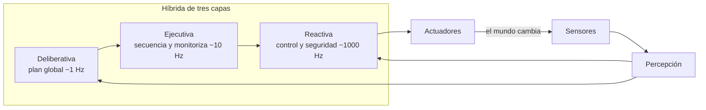

# 136 — Arquitectura percepción-planificación-acción

> [← Clase anterior](../../../classes/part-10-multi-agent-systems-and-interoperability/135-proyecto-sistema-multiagente-durable/README.md) · [Índice de la parte](../README.md) · [Clase siguiente →](../../../classes/part-11-embodied-ai-robotics-and-computer-use/137-sensores-actuadores-y-fusion/README.md)

**Parte:** 11 — IA encarnada, robótica y uso de computadores  
**Nivel:** experto · **Horas estimadas:** 6  
**Laboratorio:** `robotics` · **Estado:** `EXECUTABLE_CORE`

## 🎯 Propósito

Comprender **arquitectura percepción-planificación-acción** dentro de la evolución de la inteligencia
artificial, implementar un experimento mínimo verificable y distinguir qué parte
constituye evidencia frente a una afirmación todavía no comprobada.

## 📚 Resultados de aprendizaje

Al finalizar podrás:

1. Explicar arquitectura percepción-planificación-acción usando los conceptos `perception`, `planning`, `action`, `feedback`.
2. Ejecutar el laboratorio con una semilla explícita y revisar su contrato JSON.
3. Identificar al menos un supuesto, una limitación y un riesgo de aplicación.
4. Comparar el enfoque con la etapa anterior de la ruta de aprendizaje.
5. Producir una evidencia reproducible y una conclusión que no exceda los datos.

## 🧩 Conceptos centrales

`perception`, `planning`, `action`, `feedback`

## 🗺️ Ubicación en el mapa de la IA

La robótica obliga a la IA a cerrar el lazo con el mundo físico: ya no basta con
producir una respuesta, hay que percibir, decidir y actuar bajo ruido, latencia y
consecuencias irreversibles. Esta clase abre la Parte 11 con la pregunta
arquitectónica fundamental — ¿cómo se organiza un agente que actúa? — y su
respuesta condiciona todo lo que sigue: fusión sensorial (137), SLAM (138),
planificación (139) y control (140). El mismo dilema arquitectónico reaparece en
los agentes de *computer use* (141-144), donde la "percepción" es un screenshot y
la "acción" es un clic.

## 📖 Fundamentos

### 🔄 El ciclo percepción-planificación-acción

Un robot (o cualquier agente encarnado) opera en un lazo cerrado con su entorno:

```text
mundo --> sensores --> PERCEPCIÓN --> estado estimado
estado --> PLANIFICACIÓN --> plan / decisión
plan --> ACCIÓN (actuadores) --> el mundo cambia --> (feedback) --> sensores ...
```

- **Percepción**: transforma lecturas crudas de sensores (píxeles, distancias,
  encoders) en una representación del estado del mundo. Siempre es incompleta y
  ruidosa: el robot nunca conoce el estado real, solo una estimación.
- **Planificación**: decide qué hacer dado el estado estimado y un objetivo.
  Puede ir desde una regla reactiva (`si obstáculo, gira`) hasta búsqueda en un
  espacio de estados (A*, clase 139).
- **Acción**: convierte la decisión en comandos de actuadores (motores, pinzas,
  o un clic de ratón en computer use). La ejecución física introduce su propio
  error: las ruedas patinan, los motores tienen holgura.
- **Feedback**: el resultado de la acción vuelve por los sensores y corrige el
  siguiente ciclo. Sin retroalimentación el sistema opera en lazo abierto y el
  error se acumula sin límite.

### 🏛️ Sense-Plan-Act: el paradigma deliberativo

La arquitectura clásica (Shakey, SRI, años 70) es una tubería secuencial:
percibir todo → construir un modelo del mundo → planificar sobre el modelo →
ejecutar. Su fortaleza es el razonamiento global: puede garantizar planes
óptimos sobre su modelo. Sus debilidades históricas:

1. **Latencia**: si planificar toma segundos, el mundo cambió cuando el plan
   llega a los motores.
2. **Fragilidad del modelo**: todo error de percepción se propaga al plan.
3. **Cuello de botella único**: si el planificador falla, el robot se detiene.

### 🐜 Subsumption: el paradigma reactivo de Brooks

Rodney Brooks (1986) propuso invertir el diseño: en lugar de una tubería
vertical, capas horizontales de comportamiento, cada una conectando sensores a
actuadores directamente y sin modelo central del mundo ("the world is its own
best model"). Las capas superiores *subsumen* (inhiben o modulan) a las
inferiores:

```text
capa 2: explorar  ----inhibe---+
capa 1: vagar     ----inhibe---+--> actuadores
capa 0: evitar choques --------+
```

Cada capa es una máquina de estados finitos aumentada; el sistema es robusto
(si falla "explorar", "evitar choques" sigue funcionando) y de latencia mínima,
pero no puede razonar sobre objetivos de largo plazo ni garantizar optimalidad.

### 🧬 Arquitecturas híbridas de tres capas

La práctica moderna combina ambos extremos en una jerarquía por frecuencia:

- **Capa deliberativa** (~0.1-1 Hz): planificación global, misión, mapas.
- **Capa ejecutiva / secuenciador** (~1-10 Hz): descompone el plan en
  comportamientos, monitoriza fallos, replanifica.
- **Capa reactiva de control** (~100-1000 Hz): evitación de obstáculos, control
  de motores, paradas de emergencia.

ROS 2 materializa este patrón: nodos de percepción publican estimaciones,
`Nav2` planifica, y controladores de baja latencia cierran el lazo. La regla de
diseño clave: **la seguridad vive en la capa rápida**, nunca en la deliberativa.

## 🧮 Ejemplo trabajado

Robot aspirador en una rejilla 1D de 5 celdas: `[A, B, C, D, E]`. Está en `C`,
hay suciedad en `A` y `E`, y un obstáculo móvil aparece en `D` en el paso 3.

**Diseño sense-plan-act puro**: percibe todo, planifica la ruta óptima
`C→D→E (limpia)→D→C→B→A (limpia)` (6 movimientos, óptimo). En el paso 3 el
obstáculo bloquea `D`: el plan es inválido, el robot debe detenerse y
replanificar completo (`C→B→A→...`), pagando la latencia de planificación cada
vez que el mundo cambia.

**Diseño subsumption**: capa 0 = "si celda actual sucia, limpia";
capa 1 = "si obstáculo delante, invierte dirección"; capa 2 = "avanza en la
dirección actual". Paso a paso: `C→D`, obstáculo → invierte, `D→C→B→A`
(limpia), pared → invierte, `B→C→D→E` (limpia). Total 8 movimientos: subóptimo,
pero **nunca se detuvo** y no necesitó replanificar.

**Híbrido**: la capa deliberativa mantiene la ruta óptima; la capa reactiva
esquiva el obstáculo localmente y notifica al planificador solo si el desvío
supera un umbral. Se obtienen ~6-7 movimientos con robustez reactiva. Este
trade-off cuantificado (optimalidad vs. latencia vs. robustez) es el argumento
central de la clase.

## 📊 Propiedades y comparación

| Propiedad | Sense-Plan-Act | Subsumption (Brooks) | Híbrida (3 capas) |
|---|---|---|---|
| Modelo del mundo | Central y explícito | Ninguno | Por capa (global arriba, local abajo) |
| Latencia de reacción | Alta (segundos) | Mínima (ms) | ms en la capa reactiva |
| Optimalidad del plan | Sí, sobre su modelo | No garantizada | Aproximada |
| Robustez ante fallos parciales | Baja (cuello de botella) | Alta (capas independientes) | Alta |
| Objetivos de largo plazo | Naturales | Muy difíciles | Naturales |
| Ejemplo histórico | Shakey (SRI) | Genghis, Roomba temprano | ROS 2 + Nav2 |



## ⚠️ Errores conceptuales frecuentes

1. **"El robot conoce el estado del mundo."** Solo tiene una estimación ruidosa
   e incompleta; toda la arquitectura existe para gestionar esa incertidumbre.
2. **"Reactivo = primitivo, deliberativo = avanzado."** Son puntos de un
   trade-off latencia/optimalidad; un Roomba reactivo limpia casas reales que un
   planificador lento no limpiaría.
3. **"Subsumption no tiene representación."** No tiene *modelo central*; cada
   capa sí tiene estado interno (máquinas de estados finitas aumentadas).
4. **"Con un buen planificador no hace falta feedback."** En lazo abierto el
   error de actuación se acumula sin cota; el feedback es lo que hace viable
   actuar en el mundo físico.
5. **"Esto solo aplica a robots."** Un agente de computer use tiene exactamente
   el mismo lazo: screenshot (percepción) → decidir (planificación) → clic
   (acción) → nuevo screenshot (feedback).

## 🚀 Del aprendizaje a la operación

Entre esta simulación didáctica y un robot real median: drivers y sincronización
de sensores reales (timestamps, calibración), un middleware con garantías de
tiempo real (ROS 2 con DDS y QoS), watchdogs y paradas de emergencia
certificadas en la capa rápida, pruebas HIL (hardware-in-the-loop) y una
estrategia de degradación segura cuando la percepción se degrada. Ninguna de
esas piezas aparece en el laboratorio y todas son obligatorias en operación.

## 🧪 Laboratorio

```bash
python lab.py
```

El laboratorio llama a `ai_evolution.labs.run_lab("robotics")`. Esta
decisión evita 183 implementaciones divergentes: cada clase tiene un entrypoint
propio, pero los motores didácticos se prueban como una biblioteca común.

### 🔍 Evidencia esperada

- tipo de laboratorio y semilla;
- entradas o decisiones observables;
- resultado estructurado;
- lista `evidence` con hechos que pueden inspeccionarse;
- lista `limitations` que impide presentar la demo como producción.

## 📓 Notebooks

- [📓 `notebook.ipynb`](notebook.ipynb): recorrido guiado con la materia resumida.
- [✍️ `notebook_student.ipynb`](notebook_student.ipynb): ejercicios para resolver.
- [✅ `notebook_solution.ipynb`](notebook_solution.ipynb): solución de referencia explicada.

## 📝 Evaluación

| Criterio | Peso |
|---|---:|
| Comprensión conceptual | 25 % |
| Ejecución reproducible | 25 % |
| Interpretación basada en evidencia | 25 % |
| Riesgos, límites y mejora propuesta | 25 % |

Consulta [assessment.md](assessment.md) para preguntas y criterio de aceptación.

## ⚠️ Errores comunes

| Síntoma | Causa probable | Corrección |
|---|---|---|
| El código corre, pero no hay conclusión | Se confundió ejecución con aprendizaje | Explica qué demuestra y qué no demuestra |
| El resultado cambia sin explicación | No se registró semilla o configuración | Conserva semilla, versión y parámetros |
| Se promete uso real | Se extrapoló desde una demo educativa | Declara entorno, datos, límites y revisión humana |
| Se copia una métrica aislada | No existe baseline ni costo de error | Añade comparación y criterio de decisión |

## ❓ Preguntas frecuentes

**¿Debo usar una API comercial?**  
No. El núcleo funciona localmente. Las extensiones LIVE se documentan por separado.

**¿El laboratorio representa una implementación industrial?**  
No por sí solo. Enseña el contrato y el patrón; producción exige integración,
seguridad, observabilidad, pruebas y operación.

**¿Dónde profundizo?**  
Revisa las especializaciones enlazadas en el README raíz y la ruta siguiente.

## 🔗 Referencias

- [Brooks, R. (1986). A Robust Layered Control System for a Mobile Robot. IEEE J. Robotics and Automation. DOI 10.1109/JRA.1986.1087032](https://doi.org/10.1109/JRA.1986.1087032) — uso: fuente primaria del mecanismo estudiado
- [Siciliano, B. & Khatib, O. (eds.). Springer Handbook of Robotics, 2e — caps. de arquitecturas robóticas](https://link.springer.com/book/10.1007/978-3-319-32552-1) — uso: referencia consultada en su fuente original
- [Thrun, S., Burgard, W. & Fox, D. Probabilistic Robotics — cap. 1 (introducción al lazo percepción-acción)](https://mitpress.mit.edu/9780262201629/probabilistic-robotics/) — uso: referencia consultada en su fuente original
- [Russell, S. & Norvig, P. AIMA 4e — cap. 26, Robotics](https://aima.cs.berkeley.edu/) — uso: desarrollo extendido del tema
- [ROS 2 Documentation](https://docs.ros.org/en/rolling/) — uso: referencia consultada en su fuente original
- [Nav2 (Navigation2) Documentation](https://docs.nav2.org/) — uso: referencia consultada en su fuente original

<!-- papers:inicio -->

---

## 📜 Papers que fundamentan esta clase

> Bloque generado por `python scripts/link_papers_to_classes.py`. La fuente es [`papers/catalog/papers.json`](../../../papers/catalog/papers.json).

| Paper | Año | Qué desbloqueó | Miniatura |
|---|---:|---|---|
| [P97 · Un sistema de control por capas robusto para un robot móvil](../../../papers/foundational/P97_subsuncion/README.md) | 1986 | Demuestra que un robot puede comportarse de forma competente sin modelo del mundo, sin planificador y sin representación central. | [notebook](../../../notebooks/papers/P97_subsuncion.ipynb) |

Cada ficha explica el problema anterior, la matemática mínima, los límites y los errores de atribución más frecuentes. Para leerlas con método: [cómo leer un paper de IA](../../../papers/guides/COMO_LEER_UN_PAPER_DE_IA.md) · [anexos matemáticos](../../../papers/annexes/README.md).
<!-- papers:fin -->
<!-- bibliografia:inicio -->

---

## 📚 Bibliografía de apoyo

> Bloque generado por `python scripts/link_sources_to_classes.py`. Cada obra lleva su localizador verificado en [`sources/bibliography.json`](../../../sources/bibliography.json).

Los papers dicen **de dónde salió** el mecanismo. Estas obras lo **desarrollan** con el espacio que una clase no tiene: teoría completa, demostraciones y ejercicios.

| Obra | Edición | Localizador | Papel en esta clase |
|---|---|---|---|
| Sebastian Thrun — *Probabilistic Robotics* | 2005 | [ISBN 9780262201629](https://openlibrary.org/isbn/9780262201629) · [web de la obra](https://mitpress.mit.edu/9780262201629/probabilistic-robotics/) | citada en las referencias de esta clase · cap. 1 · obra de referencia de la parte 11 |
| Russell, Stuart J. y Norvig, Peter — *Artificial Intelligence: A Modern Approach* | 4.ª · 2020 | [ISBN 9780134610993](https://openlibrary.org/isbn/9780134610993) · [web de la obra](https://aima.cs.berkeley.edu/) | citada en las referencias de esta clase · cap. 26 |
<!-- bibliografia:fin -->

---

## ⬅️ Clase anterior

[135 — Proyecto: sistema multiagente durable](../../part-10-multi-agent-systems-and-interoperability/135-proyecto-sistema-multiagente-durable/README.md)

## ➡️ Siguiente clase

[137 — Sensores, actuadores y fusión](../../part-11-embodied-ai-robotics-and-computer-use/137-sensores-actuadores-y-fusion/README.md)
