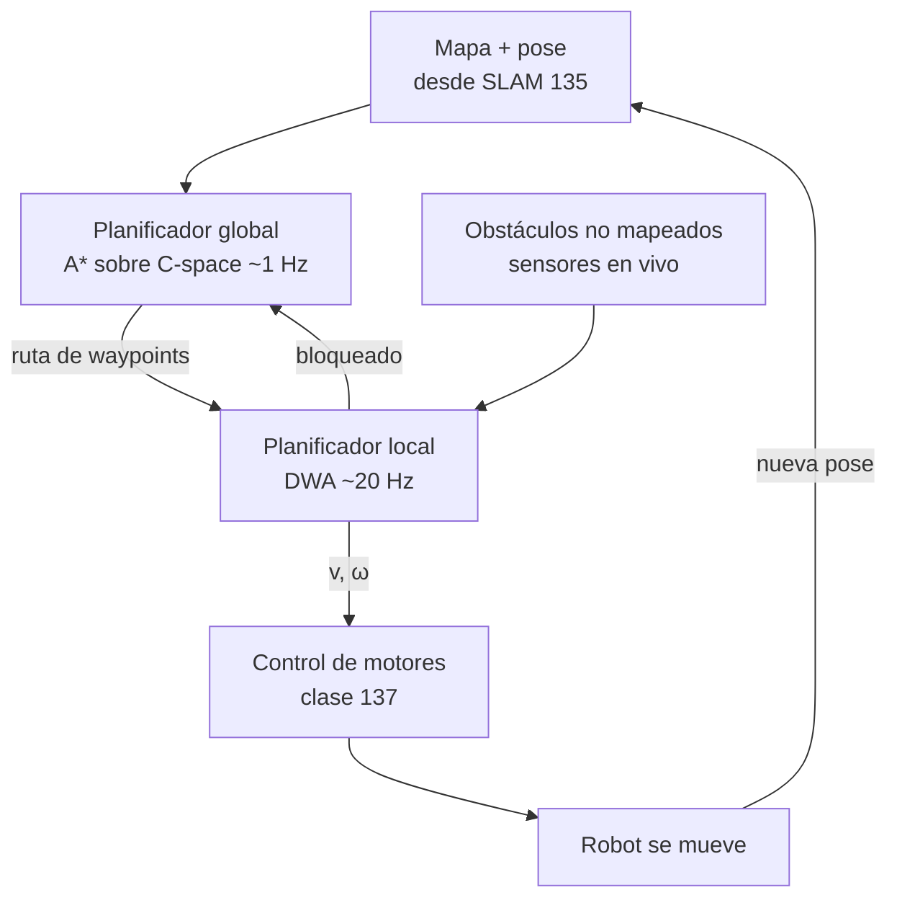

# 136 — Planificación de movimiento y navegación

> [← Clase anterior](../../../classes/part-11-embodied-ai-robotics-and-computer-use/135-localizacion-mapeo-y-slam/README.md) · [Índice de la parte](../README.md) · [Clase siguiente →](../../../classes/part-11-embodied-ai-robotics-and-computer-use/137-control-clasico-y-control-aprendido/README.md)

**Parte:** 11 — IA encarnada, robótica y uso de computadores  
**Nivel:** experto · **Horas estimadas:** 6  
**Laboratorio:** `search` · **Estado:** `EXECUTABLE_CORE`

## 🎯 Propósito

Comprender **planificación de movimiento y navegación** dentro de la evolución de la inteligencia
artificial, implementar un experimento mínimo verificable y distinguir qué parte
constituye evidencia frente a una afirmación todavía no comprobada.

## 📚 Resultados de aprendizaje

Al finalizar podrás:

1. Explicar planificación de movimiento y navegación usando los conceptos `path planning`, `navigation`, `obstacles`, `A*`.
2. Ejecutar el laboratorio con una semilla explícita y revisar su contrato JSON.
3. Identificar al menos un supuesto, una limitación y un riesgo de aplicación.
4. Comparar el enfoque con la etapa anterior de la ruta de aprendizaje.
5. Producir una evidencia reproducible y una conclusión que no exceda los datos.

## 🧩 Conceptos centrales

`path planning`, `navigation`, `obstacles`, `A*`

## 🗺️ Ubicación en el mapa de la IA

Con una pose y un mapa (clase 135), la pregunta siguiente es *cómo llegar de A
a B sin chocar*. La planificación de movimiento conecta la búsqueda clásica en
grafos (A*, herencia directa de la IA simbólica) con la geometría del mundo
físico a través del espacio de configuración, y añade la capa reactiva local
(DWA) que ejecuta el plan entre obstáculos móviles. Sus salidas alimentan el
control de bajo nivel (clase 137), y sus ideas reaparecen en los agentes
digitales: planificar una secuencia de clics es también búsqueda en un espacio
de estados.

## 📖 Fundamentos

### 📐 Espacio de configuración (C-space)

Una configuración `q` es el vector mínimo que fija la postura del robot (para
un robot móvil plano: `(x, y, θ)`; para un brazo de 6 ejes: 6 ángulos). El
**C-space** es el conjunto de todas las configuraciones; se divide en
`C_libre` (sin colisión) y `C_obs`. El truco fundamental: planificar en
C-space convierte a un robot con forma y tamaño en **un punto**, a cambio de
*inflar* los obstáculos con la geometría del robot (suma de Minkowski). Un
pasillo de 80 cm con un robot de 60 cm de diámetro se convierte en un pasillo
libre de 20 cm para un punto.

### ⭐ Búsqueda en rejilla: A*

Discretiza `C_libre` en celdas y busca el camino de coste mínimo. A* expande
nodos por prioridad `f(n) = g(n) + h(n)`:

```text
g(n): coste real acumulado desde el inicio hasta n
h(n): heurística — estimación del coste restante hasta la meta
      admisible si NUNCA sobreestima (p. ej. distancia euclídea)
```

Con heurística admisible (y consistente), A* es **completo y óptimo** en la
rejilla. Con `h=0` degenera en Dijkstra (más expansiones); con `h`
sobreestimada (A* ponderado) encuentra caminos más rápido pero pierde la
garantía de optimalidad. El coste práctico explota con la dimensión: una
rejilla de 100 celdas por eje tiene 10⁴ nodos en 2D, 10¹² en 6D — la
**maldición de la dimensionalidad**.

### 🌲 Métodos basados en muestreo: RRT y PRM

Para C-spaces de alta dimensión (brazos, drones) no se discretiza: se
muestrea.

```text
RRT (Rapidly-exploring Random Tree):
  1. árbol T inicializado en q_inicio
  2. repetir: muestrea q_rand en C-space
     q_near  <- nodo de T más cercano a q_rand
     q_new   <- avanza desde q_near hacia q_rand un paso δ
     si el segmento q_near→q_new está libre de colisión: añade q_new a T
  3. parar cuando T alcanza la región de la meta
```

RRT es **probabilísticamente completo** (si existe solución, la probabilidad
de encontrarla tiende a 1 con las muestras) pero **no óptimo**: produce
caminos dentados que requieren suavizado. RRT* añade recableado local y
converge a la solución óptima. PRM construye un grafo de muestras reutilizable
para múltiples consultas en el mismo mapa.

### 🚗 Navegación local: DWA (Dynamic Window Approach)

El plan global no basta: el mundo tiene obstáculos que el mapa no conocía. DWA
decide, a cada ciclo de control (~10-20 Hz), el par velocidad lineal/angular
`(v, ω)`:

1. **Ventana dinámica**: solo considera velocidades alcanzables en el próximo
   instante dado el estado actual y los límites de aceleración del robot.
2. Simula la trayectoria corta (1-3 s) de cada par `(v, ω)` candidato.
3. Puntúa cada trayectoria: avance hacia la meta + distancia a obstáculos +
   velocidad, y descarta las que colisionan.
4. Ejecuta el mejor par y repite.

La arquitectura resultante es el patrón estándar (Nav2): **planificador global
(A*) a ~1 Hz + planificador local (DWA/TEB/MPPI) a ~20 Hz**, exactamente la
jerarquía deliberativo/reactivo de la clase 133.

## 🧮 Ejemplo trabajado

Rejilla 5×5, inicio `S=(0,0)`, meta `G=(4,4)`, movimiento en 4 direcciones
(coste 1), obstáculos en `(1,1), (2,1), (3,1), (1,3), (2,3)`. Heurística:
distancia Manhattan `h = |4−x| + |4−y|` (admisible con 4 vecinos).

```text
   y=4  .  .  .  .  G        S=(0,0) abajo-izquierda
   y=3  .  #  #  .  .        # = obstáculo
   y=2  .  .  .  .  .
   y=1  .  #  #  #  .
   y=0  S  .  .  .  .
```

Expansión de A* (nodos con `f = g + h`): `S` tiene `f = 0 + 8 = 8`. Sus
vecinos `(1,0)` y `(0,1)` tienen `f = 1 + 7 = 8`. A* sigue expandiendo la
franja `f=8`: todo camino sin retrocesos mide exactamente 8 pasos... pero los
obstáculos obligan a comprobar cuál sobrevive. El muro `y=1` deja un único
hueco en `x=0` y `x=4`; el muro `y=3` deja huecos en `x=0`, `x=3` y `x=4`. Un
camino de coste 8: `(0,0)→(0,1)→(0,2)→(1,2)→(2,2)→(3,2)→(3,3)→(4,3)→(4,4)`
(sube por la izquierda, cruza el pasillo central `y=2` y sale por el hueco
`x=3`). A* lo encuentra expandiendo ~12-15 nodos de los 20 libres, sin visitar
las esquinas irrelevantes; Dijkstra (`h=0`) habría expandido prácticamente
todos. Verificación de optimalidad: la Manhattan pura es 8 y el camino mide 8
⇒ ningún desvío fue necesario y el resultado es óptimo.

## 📊 Propiedades y comparación

| Método | Completitud | Optimalidad | Coste | Dimensión práctica | Rol |
|---|---|---|---|---|---|
| Dijkstra | Completo (rejilla) | Óptimo | Alto (sin guía) | 2-3D | Global, base |
| A* | Completo (rejilla) | Óptimo con h admisible | Medio | 2-4D | Global estándar |
| RRT | Probabilística | No | Bajo por muestra | 6D+ | Global en alta dimensión |
| RRT* | Probabilística | Asintótica | Medio | 6D+ | Global con calidad |
| PRM | Probabilística | Con densidad | Precómputo alto | 6D+ | Multi-consulta |
| DWA | Local (no global) | No | Muy bajo por ciclo | 2D + dinámica | Local reactivo |



## ⚠️ Errores conceptuales frecuentes

1. **"A* planifica para el robot con su forma real."** A* planifica para un
   punto; la forma se maneja antes, inflando obstáculos en el C-space. Olvidar
   la inflación produce planes que rozan paredes.
2. **"RRT encuentra el camino óptimo."** RRT solo garantiza *encontrar* un
   camino (probabilísticamente); la optimalidad exige RRT* o post-procesado.
3. **"Una heurística mayor siempre acelera."** Solo mientras sea admisible;
   sobreestimar acelera pero puede devolver caminos subóptimos sin aviso.
4. **"Con un buen plan global sobra el planificador local."** El mapa siempre
   está incompleto o desactualizado; sin capa local el primer peatón invalida
   todo.
5. **"Camino geométrico = trayectoria ejecutable."** El camino ignora
   dinámica (velocidades, aceleraciones, radio de giro); convertirlo en
   trayectoria temporizada y factible es un paso adicional que DWA resuelve
   localmente.

## 🚀 Del aprendizaje a la operación

En producción se añaden: costmaps por capas con inflación y decaimiento
temporal (Nav2), replanificación continua con presupuesto de tiempo,
restricciones cinodinámicas reales (masa, fricción, límites de par),
recuperación ante bloqueos (comportamientos de escape), y validación
estadística de tasas de éxito/colisión en flotas simuladas antes de tocar un
robot físico. El salto de "A* en rejilla 5×5" a "robot en un almacén con
personas" está en esas capas, no en el algoritmo de búsqueda.

## 🧪 Laboratorio

```bash
python lab.py
```

El laboratorio llama a `ai_evolution.labs.run_lab("search")`. Esta
decisión evita 180 implementaciones divergentes: cada clase tiene un entrypoint
propio, pero los motores didácticos se prueban como una biblioteca común.

### 🔍 Evidencia esperada

- tipo de laboratorio y semilla;
- entradas o decisiones observables;
- resultado estructurado;
- lista `evidence` con hechos que pueden inspeccionarse;
- lista `limitations` que impide presentar la demo como producción.

## 📓 Notebooks

- [📓 `notebook.ipynb`](notebook.ipynb): recorrido guiado con la materia resumida.
- [✍️ `notebook_student.ipynb`](notebook_student.ipynb): ejercicios para resolver.
- [✅ `notebook_solution.ipynb`](notebook_solution.ipynb): solución de referencia explicada.

## 📝 Evaluación

| Criterio | Peso |
|---|---:|
| Comprensión conceptual | 25 % |
| Ejecución reproducible | 25 % |
| Interpretación basada en evidencia | 25 % |
| Riesgos, límites y mejora propuesta | 25 % |

Consulta [assessment.md](assessment.md) para preguntas y criterio de aceptación.

## ⚠️ Errores comunes

| Síntoma | Causa probable | Corrección |
|---|---|---|
| El código corre, pero no hay conclusión | Se confundió ejecución con aprendizaje | Explica qué demuestra y qué no demuestra |
| El resultado cambia sin explicación | No se registró semilla o configuración | Conserva semilla, versión y parámetros |
| Se promete uso real | Se extrapoló desde una demo educativa | Declara entorno, datos, límites y revisión humana |
| Se copia una métrica aislada | No existe baseline ni costo de error | Añade comparación y criterio de decisión |

## ❓ Preguntas frecuentes

**¿Debo usar una API comercial?**  
No. El núcleo funciona localmente. Las extensiones LIVE se documentan por separado.

**¿El laboratorio representa una implementación industrial?**  
No por sí solo. Enseña el contrato y el patrón; producción exige integración,
seguridad, observabilidad, pruebas y operación.

**¿Dónde profundizo?**  
Revisa las especializaciones enlazadas en el README raíz y la ruta siguiente.

## 🔗 Referencias

- [LaValle, S. M. Planning Algorithms (Cambridge UP, 2006) — libro completo gratuito](http://lavalle.pl/planning/)
- [Hart, P., Nilsson, N. & Raphael, B. (1968). A Formal Basis for the Heuristic Determination of Minimum Cost Paths. DOI 10.1109/TSSC.1968.300136](https://doi.org/10.1109/TSSC.1968.300136)
- [LaValle, S. M. (1998). Rapidly-Exploring Random Trees: A New Tool for Path Planning (informe técnico, Iowa State)](http://lavalle.pl/papers/Lav98c.pdf)
- [Fox, D., Burgard, W. & Thrun, S. (1997). The Dynamic Window Approach to Collision Avoidance. IEEE RAM. DOI 10.1109/100.580977](https://doi.org/10.1109/100.580977)
- [Russell, S. & Norvig, P. AIMA 4e — cap. 3 (búsqueda) y cap. 26 (robótica)](https://aima.cs.berkeley.edu/)
- [Nav2 — Navigation Concepts (planificador global y local)](https://docs.nav2.org/concepts/index.html)

---

## ⬅️ Clase anterior

[135 — Localización, mapeo y SLAM](../../part-11-embodied-ai-robotics-and-computer-use/135-localizacion-mapeo-y-slam/README.md)

## ➡️ Siguiente clase

[137 — Control clásico y control aprendido](../../part-11-embodied-ai-robotics-and-computer-use/137-control-clasico-y-control-aprendido/README.md)
