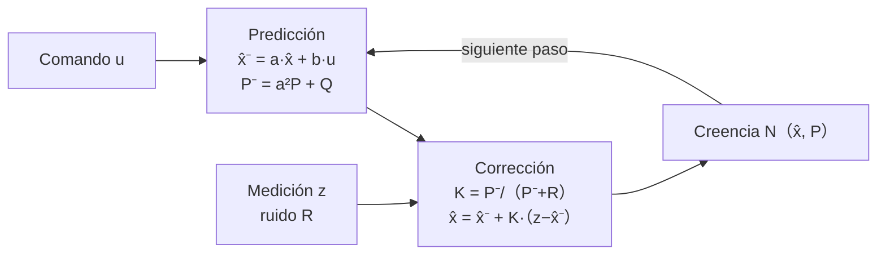

# 137 — Sensores, actuadores y fusión

> [← Clase anterior](../../../classes/part-11-embodied-ai-robotics-and-computer-use/136-arquitectura-percepcion-planificacion-accion/README.md) · [Índice de la parte](../README.md) · [Clase siguiente →](../../../classes/part-11-embodied-ai-robotics-and-computer-use/138-localizacion-mapeo-y-slam/README.md)

**Parte:** 11 — IA encarnada, robótica y uso de computadores  
**Nivel:** experto · **Horas estimadas:** 6  
**Laboratorio:** `robotics` · **Estado:** `EXECUTABLE_CORE`

## 🎯 Propósito

Comprender **sensores, actuadores y fusión** dentro de la evolución de la inteligencia
artificial, implementar un experimento mínimo verificable y distinguir qué parte
constituye evidencia frente a una afirmación todavía no comprobada.

## 📚 Resultados de aprendizaje

Al finalizar podrás:

1. Explicar sensores, actuadores y fusión usando los conceptos `sensors`, `actuators`, `fusion`, `calibration`.
2. Ejecutar el laboratorio con una semilla explícita y revisar su contrato JSON.
3. Identificar al menos un supuesto, una limitación y un riesgo de aplicación.
4. Comparar el enfoque con la etapa anterior de la ruta de aprendizaje.
5. Producir una evidencia reproducible y una conclusión que no exceda los datos.

## 🧩 Conceptos centrales

`sensors`, `actuators`, `fusion`, `calibration`

## 🗺️ Ubicación en el mapa de la IA

Toda la robótica descansa sobre una verdad incómoda: los sensores mienten un
poco y los actuadores obedecen a medias. Esta clase introduce el tratamiento
probabilístico de esa incertidumbre — calibración y fusión de sensores, con el
filtro de Kalman como pieza central — que la clase 136 dio por supuesto al
hablar de "percepción". Es el prerequisito directo de SLAM (138), donde la
fusión se extiende de un estado escalar a la pose y el mapa completos, y del
control (140), que necesita estimaciones limpias para cerrar el lazo.

## 📖 Fundamentos

### 📡 Sensores: qué miden y cómo fallan

- **Propioceptivos** (miden el propio robot): encoders de rueda, IMU
  (acelerómetro + giróscopo), sensores de corriente. Rápidos y siempre
  disponibles, pero **integran error**: la odometría deriva sin cota.
- **Exteroceptivos** (miden el mundo): LiDAR, cámaras, ultrasonido, GPS.
  Aportan referencias absolutas o relativas al entorno, pero sufren oclusión,
  ruido dependiente de la escena y frecuencias bajas.

Todo sensor se caracteriza por: rango, resolución, frecuencia, **sesgo**
(error sistemático, se corrige con calibración) y **varianza** (error
aleatorio, se gestiona con fusión). Modelo estándar de una medición:

```text
z = h(x) + b + v      donde  h(x): función de observación del estado real x
                             b: sesgo (calibrable), v ~ N(0, R): ruido
```

### ⚙️ Actuadores

Motores DC/BLDC con reductora, servomotores y actuadores lineales convierten
comandos en movimiento. Sus imperfecciones (holgura o *backlash*, saturación,
zona muerta, retardo) son la razón de que ordenar "avanza 1 m" no produzca
exactamente 1 m — y de que el feedback de la clase 136 sea imprescindible.

### 🧪 Calibración

Estimar y corregir el sesgo `b` y los parámetros de `h` con mediciones de
referencia (patrón de ajedrez para cámaras, superficie plana para IMU, giro de
360° para odometría). La calibración elimina error **sistemático**; jamás
elimina la varianza `R`.

### 🔀 Fusión de sensores: por qué promediar con pesos

Dos mediciones independientes del mismo escalar, con varianzas σ₁² y σ₂², se
combinan de forma óptima (mínima varianza) ponderando por la inversa de la
varianza:

```text
x̂ = (σ₂²·z₁ + σ₁²·z₂) / (σ₁² + σ₂²)        σ̂² = (σ₁²·σ₂²)/(σ₁²+σ₂²)  <  min(σ₁², σ₂²)
```

La fusión **siempre reduce la incertidumbre** por debajo del mejor sensor
individual. El filtro de Kalman generaliza esta idea a estados dinámicos.

### 📉 Filtro de Kalman (versión conceptual 1D)

Mantiene una creencia gaussiana `N(x̂, P)` y alterna dos pasos:

```text
PREDICCIÓN (usa el modelo de movimiento, crece la incertidumbre):
    x̂⁻ = a·x̂ + b·u              P⁻ = a²·P + Q

CORRECCIÓN (usa la medición, decrece la incertidumbre):
    K  = P⁻ / (P⁻ + R)           # ganancia de Kalman ∈ (0, 1)
    x̂  = x̂⁻ + K·(z − x̂⁻)         # se mueve hacia z según la confianza
    P  = (1 − K)·P⁻
```

Lectura de la ganancia: si el sensor es preciso (R pequeño), K→1 y la
estimación sigue a la medición; si el sensor es ruidoso (R grande), K→0 y
domina el modelo. `Q` es el ruido de proceso: cuánta incertidumbre añade cada
paso de movimiento.

### 🧮 Filtro complementario

Alternativa barata para fusionar dos sensores con errores en frecuencias
distintas (típico IMU): pasa-bajos sobre el sensor con deriva lenta y ruido
alto de corto plazo (acelerómetro), pasa-altos sobre el que deriva
(giróscopo):

```text
ángulo = α·(ángulo + gyro·dt) + (1−α)·ángulo_accel        α ≈ 0.98
```

Sin matrices ni covarianzas: es el 90 % de los drones de hobby.

## 🧮 Ejemplo trabajado

Robot en un pasillo (posición 1D en metros). Estado inicial `x̂=0, P=1`.
Modelo: avanza `u=1` m por paso (`a=1, b=1`), ruido de proceso `Q=0.25`.
Sensor de distancia con `R=1`. Medición en t=1: `z=1.2`.

**Paso 1 — Predicción:**

```text
x̂⁻ = 1·0 + 1·1 = 1.0
P⁻ = 1·1 + 0.25 = 1.25
```

**Paso 1 — Corrección con z=1.2:**

```text
K  = 1.25 / (1.25 + 1) = 0.5556
x̂  = 1.0 + 0.5556·(1.2 − 1.0) = 1.111
P  = (1 − 0.5556)·1.25 = 0.5556
```

La estimación (1.111) queda entre el modelo (1.0) y la medición (1.2), más
cerca de la medición porque `P⁻ > R`. La incertidumbre cayó de 1.25 a 0.556.

**Paso 2** con `z=2.3`: predicción `x̂⁻=2.111, P⁻=0.806`; ganancia
`K=0.806/1.806=0.446`; corrección `x̂=2.111+0.446·(2.3−2.111)=2.195`,
`P=0.446`. Nota cómo `P` converge hacia un valor estacionario (~0.42 en este
sistema): el filtro alcanza un equilibrio entre lo que aporta el modelo y lo
que aporta el sensor.

## 📊 Propiedades y comparación

| Método | Estado que maneja | Supuestos | Coste | Cuándo usarlo |
|---|---|---|---|---|
| Promedio ponderado | Estático | Gaussiano, sin dinámica | O(1) | Fusión puntual de 2+ sensores |
| Filtro complementario | 1 variable con deriva | Errores separables en frecuencia | O(1) | IMU de bajo coste, drones |
| Kalman (KF) | Vector, dinámica lineal | Lineal + gaussiano | O(n³) por paso | Odometría+GPS, tracking |
| EKF | No lineal suave | Linealización local válida | O(n³) | SLAM (clase 138), IMU 3D |
| Filtro de partículas | No lineal, multimodal | Muestreo suficiente | O(n·partículas) | Localización global ambigua |



## ⚠️ Errores conceptuales frecuentes

1. **"Un sensor caro elimina la necesidad de fusión."** Todo sensor tiene
   varianza y modos de fallo; fusionar dos sensores mediocres e independientes
   suele rendir más que uno excelente sin redundancia.
2. **"La calibración corrige el ruido."** Corrige el **sesgo** (sistemático);
   la varianza aleatoria solo se reduce con fusión o promediado temporal.
3. **"El filtro de Kalman predice el futuro."** Estima el estado *presente*
   combinando modelo y medición; la predicción es solo el paso intermedio.
4. **"K es un parámetro que se sintoniza a mano."** K se calcula en cada paso a
   partir de P y R; lo que se sintoniza son Q y R.
5. **"Si P converge, la estimación es correcta."** P pequeño significa
   *consistencia interna*; con un modelo o calibración erróneos el filtro
   converge con confianza a un valor equivocado (filtro sobreconfiado).

## 🚀 Del aprendizaje a la operación

En un sistema real faltan: sincronización temporal de sensores (timestamps,
interpolación, compensación de latencia), detección y rechazo de *outliers*
(un GPS multipath puede corromper el filtro entero), estimación honesta de Q y
R a partir de datos, transformaciones entre marcos de referencia (TF en ROS 2)
y monitorización de la salud de cada sensor con degradación controlada cuando
uno falla. La versión 1D a mano es el modelo mental; producción es gestión de
covarianzas en 15+ dimensiones con datos sucios.

## 🧪 Laboratorio

```bash
python lab.py
```

El laboratorio llama a `ai_evolution.labs.run_lab("robotics")`. Esta
decisión evita 183 implementaciones divergentes: cada clase tiene un entrypoint
propio, pero los motores didácticos se prueban como una biblioteca común.

### 🔍 Evidencia esperada

- tipo de laboratorio y semilla;
- entradas o decisiones observables;
- resultado estructurado;
- lista `evidence` con hechos que pueden inspeccionarse;
- lista `limitations` que impide presentar la demo como producción.

## 📓 Notebooks

- [📓 `notebook.ipynb`](notebook.ipynb): recorrido guiado con la materia resumida.
- [✍️ `notebook_student.ipynb`](notebook_student.ipynb): ejercicios para resolver.
- [✅ `notebook_solution.ipynb`](notebook_solution.ipynb): solución de referencia explicada.

## 📝 Evaluación

| Criterio | Peso |
|---|---:|
| Comprensión conceptual | 25 % |
| Ejecución reproducible | 25 % |
| Interpretación basada en evidencia | 25 % |
| Riesgos, límites y mejora propuesta | 25 % |

Consulta [assessment.md](assessment.md) para preguntas y criterio de aceptación.

## ⚠️ Errores comunes

| Síntoma | Causa probable | Corrección |
|---|---|---|
| El código corre, pero no hay conclusión | Se confundió ejecución con aprendizaje | Explica qué demuestra y qué no demuestra |
| El resultado cambia sin explicación | No se registró semilla o configuración | Conserva semilla, versión y parámetros |
| Se promete uso real | Se extrapoló desde una demo educativa | Declara entorno, datos, límites y revisión humana |
| Se copia una métrica aislada | No existe baseline ni costo de error | Añade comparación y criterio de decisión |

## ❓ Preguntas frecuentes

**¿Debo usar una API comercial?**  
No. El núcleo funciona localmente. Las extensiones LIVE se documentan por separado.

**¿El laboratorio representa una implementación industrial?**  
No por sí solo. Enseña el contrato y el patrón; producción exige integración,
seguridad, observabilidad, pruebas y operación.

**¿Dónde profundizo?**  
Revisa las especializaciones enlazadas en el README raíz y la ruta siguiente.

## 🔗 Referencias

- [Thrun, S., Burgard, W. & Fox, D. Probabilistic Robotics — caps. 2-3 (filtros bayesianos y de Kalman)](https://mitpress.mit.edu/9780262201629/probabilistic-robotics/)
- [Kalman, R. E. (1960). A New Approach to Linear Filtering and Prediction Problems. J. Basic Engineering. DOI 10.1115/1.3662552](https://doi.org/10.1115/1.3662552)
- [Siciliano, B. & Khatib, O. (eds.). Springer Handbook of Robotics, 2e — parte C, Sensing and Perception](https://link.springer.com/book/10.1007/978-3-319-32552-1)
- [KalmanFilter.NET — tutorial ilustrado del filtro de Kalman (Alex Becker)](https://www.kalmanfilter.net/default.aspx)
- [ROS 2 — robot_localization (fusión EKF/UKF en producción)](https://docs.ros.org/en/rolling/p/robot_localization/)

<!-- papers:inicio -->

---

## 📜 Papers que fundamentan esta clase

> Bloque generado por `python scripts/link_papers_to_classes.py`. La fuente es [`papers/catalog/papers.json`](../../../papers/catalog/papers.json).

| Paper | Año | Qué desbloqueó | Miniatura |
|---|---:|---|---|
| [P96 · Un nuevo enfoque para los problemas de filtrado y predicción lineales](../../../papers/foundational/P96_kalman/README.md) | 1960 | Fusiona un modelo del movimiento con un sensor ruidoso ponderando cada fuente por su propia incertidumbre, y lo hace de forma recursiva. | [notebook](../../../notebooks/papers/P96_kalman.ipynb) |

Cada ficha explica el problema anterior, la matemática mínima, los límites y los errores de atribución más frecuentes. Para leerlas con método: [cómo leer un paper de IA](../../../papers/guides/COMO_LEER_UN_PAPER_DE_IA.md) · [anexos matemáticos](../../../papers/annexes/README.md).
<!-- papers:fin -->
---

## ⬅️ Clase anterior

[136 — Arquitectura percepción-planificación-acción](../../part-11-embodied-ai-robotics-and-computer-use/136-arquitectura-percepcion-planificacion-accion/README.md)

## ➡️ Siguiente clase

[138 — Localización, mapeo y SLAM](../../part-11-embodied-ai-robotics-and-computer-use/138-localizacion-mapeo-y-slam/README.md)
