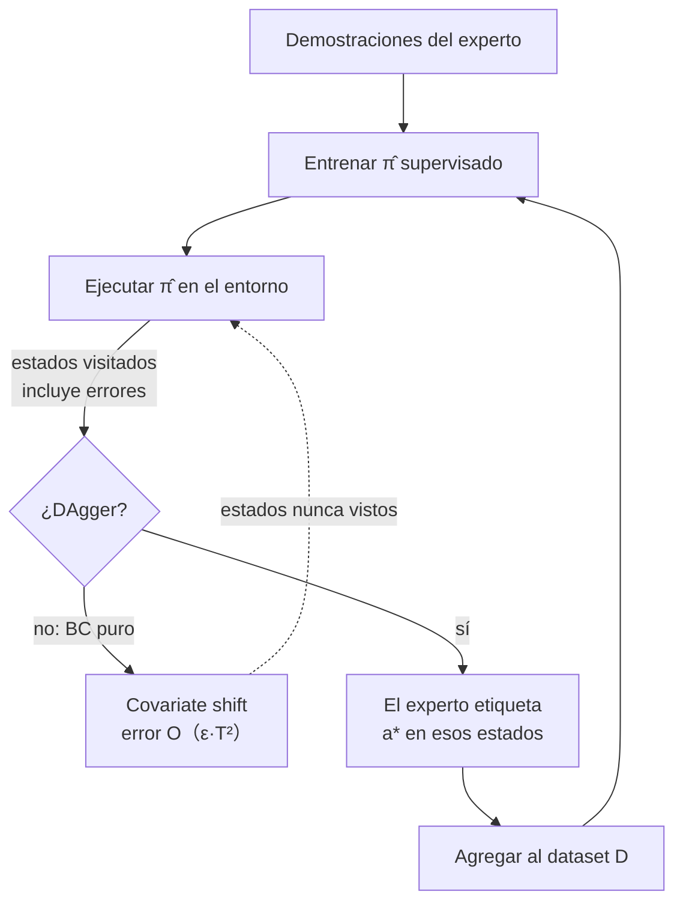

# 138 — Aprendizaje por imitación

> [← Clase anterior](../../../classes/part-11-embodied-ai-robotics-and-computer-use/137-control-clasico-y-control-aprendido/README.md) · [Índice de la parte](../README.md) · [Clase siguiente →](../../../classes/part-11-embodied-ai-robotics-and-computer-use/139-simulacion-sim-to-real-y-digital-twins/README.md)

**Parte:** 11 — IA encarnada, robótica y uso de computadores  
**Nivel:** experto · **Horas estimadas:** 6  
**Laboratorio:** `robotics` · **Estado:** `EXECUTABLE_CORE`

## 🎯 Propósito

Comprender **aprendizaje por imitación** dentro de la evolución de la inteligencia
artificial, implementar un experimento mínimo verificable y distinguir qué parte
constituye evidencia frente a una afirmación todavía no comprobada.

## 📚 Resultados de aprendizaje

Al finalizar podrás:

1. Explicar aprendizaje por imitación usando los conceptos `imitation`, `demonstrations`, `behavior cloning`, `DAgger`.
2. Ejecutar el laboratorio con una semilla explícita y revisar su contrato JSON.
3. Identificar al menos un supuesto, una limitación y un riesgo de aplicación.
4. Comparar el enfoque con la etapa anterior de la ruta de aprendizaje.
5. Producir una evidencia reproducible y una conclusión que no exceda los datos.

## 🧩 Conceptos centrales

`imitation`, `demonstrations`, `behavior cloning`, `DAgger`

## 🗺️ Ubicación en el mapa de la IA

Diseñar recompensas para RL (clase 137) es difícil y peligroso; a menudo es más
fácil *mostrar* la tarea que especificarla. El aprendizaje por imitación
convierte demostraciones humanas en políticas, y hoy es el motor de los
avances más visibles de la robótica de manipulación (ALOHA, Diffusion Policy,
modelos visión-lenguaje-acción como RT-2 u OpenVLA) y de la conducción
autónoma de extremo a extremo. Su patología central — el *covariate shift* —
y su cura — DAgger — son también el marco correcto para pensar por qué los
agentes LLM entrenados con trazas de demostración fallan al salirse del camino
conocido.

## 📖 Fundamentos

### 🎭 Formulación

Dado un conjunto de demostraciones `D = {(s_i, a_i)}` generadas por una
política experta `π*`, aprender `π̂` que imite al experto. A diferencia de RL,
no hay función de recompensa: la señal es "haz lo que hizo el experto".

### 📋 Behavioral Cloning (BC)

La aproximación directa: tratar la imitación como **aprendizaje supervisado**.

```text
π̂ = argmin_π  Σ_(s,a)∈D  L(π(s), a)     # regresión/clasificación estándar
```

Simple, estable y sorprendentemente eficaz con datos abundantes y buenos.
Su defecto estructural no es el modelo sino la **distribución de datos**.

### 🌊 Covariate shift y error compuesto

El experto solo visita estados "buenos": D cubre la trayectoria correcta y
casi nada alrededor. En ejecución, el más mínimo error lleva a `π̂` a un estado
ligeramente fuera de la distribución de entrenamiento; allí su error es mayor,
lo que la aleja aún más — un bucle de retroalimentación de errores. Ross y
Bagnell formalizaron el resultado: si el error de imitación por paso es ε, el
coste acumulado en un horizonte T crece como **O(ε·T²)** para BC, frente al
O(ε·T) que se obtendría si los errores no se compusieran. La intuición del
coche: el experto nunca demostró "cómo volver al carril desde el arcén",
porque nunca pisó el arcén.

### 🔁 DAgger (Dataset Aggregation)

DAgger (Ross, Gordon & Bagnell, 2011 — arXiv:1011.0686) ataca la causa:
recolectar datos **en la distribución de la política aprendida**.

```text
D <- demostraciones iniciales;  π̂_1 <- BC(D)
para i = 1..N:
    ejecuta π̂_i en el entorno y registra los estados visitados s
    pregunta al experto la acción correcta a* = π*(s) en ESOS estados
    D <- D ∪ {(s, a*)}
    π̂_{i+1} <- entrenar con D completo
```

Al etiquetar los estados que la política realmente visita — incluidos sus
errores — el experto enseña a *recuperarse*. Garantía: coste O(ε·T) (lineal,
no cuadrático). Coste práctico: exige un experto **interactivo** disponible
durante el entrenamiento, lo que es caro con humanos (variantes: expertos
algorítmicos en simulación, etiquetado offline, HG-DAgger con intervención
humana solo cuando hace falta).

### 🧰 El panorama moderno

- **Teleoperación de bajo coste** (ALOHA/ALOHA 2) hizo barato recolectar
  demostraciones bimanuales.
- **Políticas generativas** (Diffusion Policy, ACT) modelan distribuciones
  multimodales de acción — crucial cuando hay varias maneras válidas de hacer
  la tarea y promediar entre ellas produce una acción inválida.
- **Inverse RL** infiere la recompensa que explica al experto y luego optimiza
  con RL: más costoso, pero generaliza mejor la *intención*.

## 🧮 Ejemplo trabajado

Corredor discreto de 10 celdas (0-9); el experto camina siempre por la celda
"centrada" ideal y D contiene solo pares de las celdas de la ruta experta.
Una política BC imperfecta acierta la acción del experto con probabilidad
0.95 **dentro** de la distribución, pero en celdas nunca vistas actúa al azar
(0.5 de acierto).

Horizonte T=20 pasos. Probabilidad de completar sin salirse jamás:
`0.95²⁰ ≈ 0.36`. En el 64 % de los episodios la política pisa al menos una vez
una celda fuera de ruta — y ahí su acierto cae a 0.5, con lo que lo más
probable es alejarse todavía más: el error se compone. Resultado típico
observado: deriva sostenida tras el primer fallo.

Con una ronda de DAgger: la política se ejecuta, visita las celdas de error
(las adyacentes a la ruta), el experto etiqueta "vuelve al centro" en esas
celdas y se reentrena. Ahora las celdas vecinas están en distribución con
acierto 0.95, y un desvío de un paso se corrige con probabilidad alta en vez
de amplificarse: la tasa de episodios completados sube drásticamente (en el
notebook se simula: de ~35 % a >85 %). La lección cuantitativa: BC falla como
T² y DAgger lo devuelve a lineal.

## 📊 Propiedades y comparación

| Método | Señal | Experto interactivo | Error en horizonte T | Coste de datos | Cuándo |
|---|---|---|---|---|---|
| Behavioral Cloning | (s, a) del experto | No | O(ε·T²) | Bajo | Datos masivos, tarea corta |
| DAgger | Etiquetas en estados propios | Sí | O(ε·T) | Medio-alto | Simulador o experto barato |
| HG-DAgger / intervención | Correcciones puntuales | Parcial | ~O(ε·T) | Medio | Teleoperación real |
| Inverse RL | Recompensa inferida | No | Depende de RL | Alto (cómputo) | Generalizar intención |
| RL puro (ref.) | Recompensa diseñada | No | — | Muy alto (exploración) | Sin experto disponible |



## ⚠️ Errores conceptuales frecuentes

1. **"BC falla porque el modelo es pequeño."** Falla por la distribución de
   datos: un modelo perfecto en D sigue sin saber qué hacer fuera de D. Más
   capacidad no cura el covariate shift.
2. **"99 % de accuracy en validación ⇒ la política funciona."** La validación
   se mide en la distribución del experto; la ejecución ocurre en la de la
   política. Son distribuciones distintas por definición del problema.
3. **"DAgger necesita mejores demostraciones."** No: necesita etiquetas en
   *peores* estados — precisamente los que el experto nunca visitaría solo.
4. **"Más demostraciones del experto resuelven lo mismo que DAgger."** Añadir
   datos de la misma distribución no cubre los estados de error; reduce ε pero
   mantiene el T².
5. **"Imitación = copiar trayectorias."** Se aprende una política estado→acción
   (con recuperación incluida si los datos la contienen), no una repetición
   ciega de la secuencia demostrada.

## 🚀 Del aprendizaje a la operación

Para desplegar imitación real hacen falta: pipelines de teleoperación y
curación de demostraciones (calidad y cobertura importan más que cantidad),
métricas de éxito en tarea real y no solo pérdida de validación, detección de
salida de distribución en línea (para ceder el control antes del desastre),
reentrenos periódicos con las intervenciones humanas acumuladas (el patrón
HG-DAgger operativo) y evaluación con protocolos ciegos, porque la varianza
entre episodios de manipulación es enorme y invita al autoengaño.

## 🧪 Laboratorio

```bash
python lab.py
```

El laboratorio llama a `ai_evolution.labs.run_lab("robotics")`. Esta
decisión evita 180 implementaciones divergentes: cada clase tiene un entrypoint
propio, pero los motores didácticos se prueban como una biblioteca común.

### 🔍 Evidencia esperada

- tipo de laboratorio y semilla;
- entradas o decisiones observables;
- resultado estructurado;
- lista `evidence` con hechos que pueden inspeccionarse;
- lista `limitations` que impide presentar la demo como producción.

## 📓 Notebooks

- [📓 `notebook.ipynb`](notebook.ipynb): recorrido guiado con la materia resumida.
- [✍️ `notebook_student.ipynb`](notebook_student.ipynb): ejercicios para resolver.
- [✅ `notebook_solution.ipynb`](notebook_solution.ipynb): solución de referencia explicada.

## 📝 Evaluación

| Criterio | Peso |
|---|---:|
| Comprensión conceptual | 25 % |
| Ejecución reproducible | 25 % |
| Interpretación basada en evidencia | 25 % |
| Riesgos, límites y mejora propuesta | 25 % |

Consulta [assessment.md](assessment.md) para preguntas y criterio de aceptación.

## ⚠️ Errores comunes

| Síntoma | Causa probable | Corrección |
|---|---|---|
| El código corre, pero no hay conclusión | Se confundió ejecución con aprendizaje | Explica qué demuestra y qué no demuestra |
| El resultado cambia sin explicación | No se registró semilla o configuración | Conserva semilla, versión y parámetros |
| Se promete uso real | Se extrapoló desde una demo educativa | Declara entorno, datos, límites y revisión humana |
| Se copia una métrica aislada | No existe baseline ni costo de error | Añade comparación y criterio de decisión |

## ❓ Preguntas frecuentes

**¿Debo usar una API comercial?**  
No. El núcleo funciona localmente. Las extensiones LIVE se documentan por separado.

**¿El laboratorio representa una implementación industrial?**  
No por sí solo. Enseña el contrato y el patrón; producción exige integración,
seguridad, observabilidad, pruebas y operación.

**¿Dónde profundizo?**  
Revisa las especializaciones enlazadas en el README raíz y la ruta siguiente.

## 🔗 Referencias

- [Ross, S., Gordon, G. & Bagnell, J. A. (2011). A Reduction of Imitation Learning and Structured Prediction to No-Regret Online Learning (DAgger). AISTATS. arXiv:1011.0686](https://arxiv.org/abs/1011.0686)
- [Pomerleau, D. (1988). ALVINN: An Autonomous Land Vehicle in a Neural Network. NeurIPS — el BC seminal de conducción](https://proceedings.neurips.cc/paper/1988/hash/812b4ba287f5ee0bc9d43bbf5bbe87fb-Abstract.html)
- [Chi, C. et al. (2023). Diffusion Policy: Visuomotor Policy Learning via Action Diffusion. arXiv:2303.04137](https://arxiv.org/abs/2303.04137)
- [Zhao, T. et al. (2023). Learning Fine-Grained Bimanual Manipulation with Low-Cost Hardware (ALOHA/ACT). arXiv:2304.13705](https://arxiv.org/abs/2304.13705)
- [Sutton, R. & Barto, A. Reinforcement Learning: An Introduction, 2e — para contrastar con la señal de recompensa](http://incompleteideas.net/book/the-book-2nd.html)

---

## ⬅️ Clase anterior

[137 — Control clásico y control aprendido](../../part-11-embodied-ai-robotics-and-computer-use/137-control-clasico-y-control-aprendido/README.md)

## ➡️ Siguiente clase

[139 — Simulación, sim-to-real y digital twins](../../part-11-embodied-ai-robotics-and-computer-use/139-simulacion-sim-to-real-y-digital-twins/README.md)
