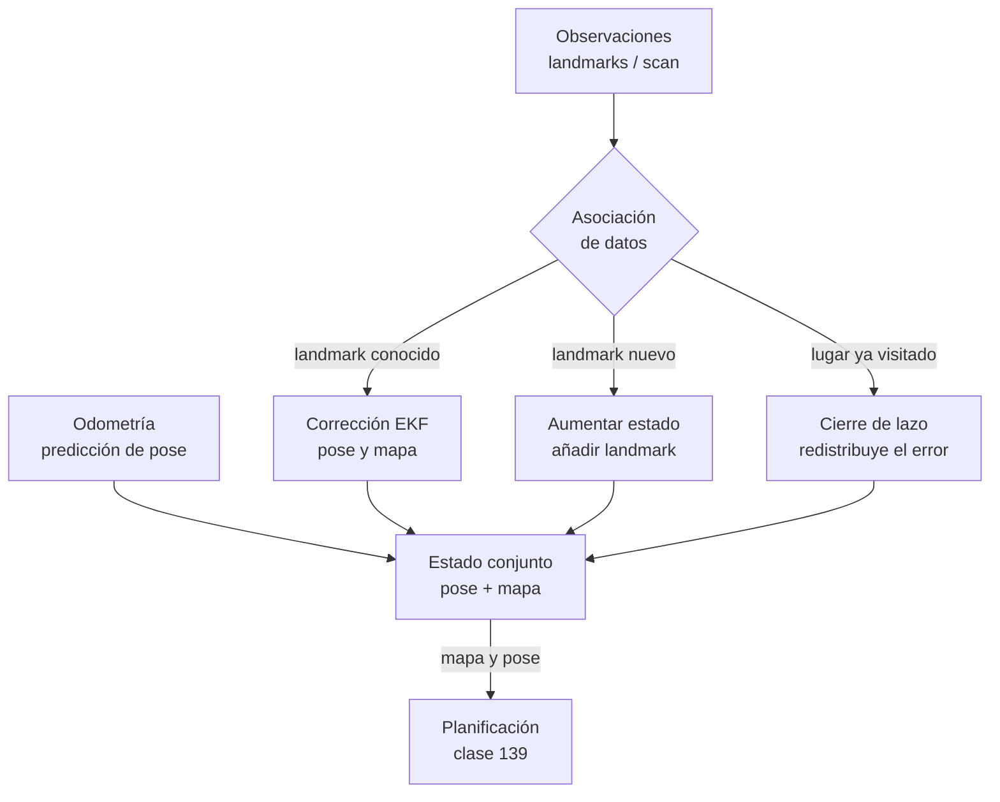

# 138 — Localización, mapeo y SLAM

> [← Clase anterior](../../../classes/part-11-embodied-ai-robotics-and-computer-use/137-sensores-actuadores-y-fusion/README.md) · [Índice de la parte](../README.md) · [Clase siguiente →](../../../classes/part-11-embodied-ai-robotics-and-computer-use/139-planificacion-de-movimiento-y-navegacion/README.md)

**Parte:** 11 — IA encarnada, robótica y uso de computadores  
**Nivel:** experto · **Horas estimadas:** 6  
**Laboratorio:** `robotics` · **Estado:** `EXECUTABLE_CORE`

## 🎯 Propósito

Comprender **localización, mapeo y slam** dentro de la evolución de la inteligencia
artificial, implementar un experimento mínimo verificable y distinguir qué parte
constituye evidencia frente a una afirmación todavía no comprobada.

## 📚 Resultados de aprendizaje

Al finalizar podrás:

1. Explicar localización, mapeo y slam usando los conceptos `localization`, `mapping`, `SLAM`, `uncertainty`.
2. Ejecutar el laboratorio con una semilla explícita y revisar su contrato JSON.
3. Identificar al menos un supuesto, una limitación y un riesgo de aplicación.
4. Comparar el enfoque con la etapa anterior de la ruta de aprendizaje.
5. Producir una evidencia reproducible y una conclusión que no exceda los datos.

## 🧩 Conceptos centrales

`localization`, `mapping`, `SLAM`, `uncertainty`

## 🗺️ Ubicación en el mapa de la IA

Con sensores calibrados y fusión (clase 137), el robot puede estimar *cuánto se
movió*; pero para navegar necesita saber *dónde está* y *cómo es el mundo*.
SLAM (Simultaneous Localization And Mapping) resuelve ambas preguntas a la vez
y es uno de los logros centrales de la robótica probabilística: sin él no hay
aspiradoras que mapean casas, ni coches autónomos, ni realidad aumentada
estable. La pose y el mapa que produce son la entrada directa de la
planificación de movimiento (clase 139).

## 📖 Fundamentos

### 🧭 Localización, mapeo y el problema del huevo y la gallina

- **Localización**: dado un mapa conocido, estimar la pose `(x, y, θ)` del
  robot a partir de sensores. Resoluble con filtros (Kalman, partículas —
  Monte Carlo Localization).
- **Mapeo**: dada una trayectoria conocida, construir el mapa (rejilla de
  ocupación o conjunto de landmarks).
- **SLAM**: ninguna de las dos cosas se conoce. Para localizarse hace falta el
  mapa; para mapear hace falta la pose. La solución es estimar **conjuntamente**
  la distribución `p(pose, mapa | observaciones, controles)`.

### 📉 Odometría y deriva

La odometría integra el movimiento (encoders, IMU): cada paso añade error, y el
error **se acumula sin cota**. Un error angular pequeño es el más dañino:
desvía toda la trayectoria posterior de forma proporcional a la distancia
recorrida (ver ejemplo trabajado). Por eso la odometría sola nunca basta: hace
falta *anclar* la trayectoria a referencias externas (landmarks) y, sobre todo,
**cerrar lazos**: reconocer un lugar ya visitado y corregir de golpe toda la
deriva acumulada.

### 📍 EKF-SLAM conceptual

EKF-SLAM extiende el filtro de Kalman (clase 137) a un estado aumentado que
contiene la pose del robot y las posiciones de los N landmarks:

```text
estado: X = [x, y, θ, l1x, l1y, l2x, l2y, ..., lNx, lNy]   dimensión 3+2N
creencia: N(X̂, P)  con P de tamaño (3+2N)×(3+2N)

por cada paso:
  1. PREDICCIÓN: propaga la pose con el modelo de movimiento; P crece.
  2. ASOCIACIÓN DE DATOS: ¿qué landmark corresponde a cada observación?
  3. CORRECCIÓN: la observación (distancia/ángulo a un landmark) corrige
     la pose Y el landmark; las correlaciones en P propagan la corrección
     al resto del mapa.
```

Dos propiedades clave: (1) la incertidumbre del mapa está **correlacionada**
con la de la pose — observar bien un landmark mejora la estimación de otros a
través de P; (2) el coste es O(N²) por paso por el tamaño de P, lo que motivó
alternativas (FastSLAM con partículas, graph-SLAM con optimización de grafos,
que es lo que usan los sistemas modernos como Cartographer u ORB-SLAM).

### 🔁 Cierre de lazo (loop closure)

Cuando el robot reconoce un lugar visitado (por apariencia o por geometría), se
añade una restricción entre dos poses lejanas en el tiempo. En graph-SLAM esa
restricción redistribuye el error por toda la trayectoria: el mapa "encaja" de
golpe. Un cierre de lazo **falso** (asociar mal dos lugares parecidos) es
catastrófico: corrompe el mapa entero. La asociación de datos es el talón de
Aquiles de todo SLAM.

### 🗺️ Representaciones del mapa

- **Rejilla de ocupación**: cada celda guarda p(ocupada); ideal para LiDAR 2D
  y planificación. Memoria proporcional al área.
- **Mapa de landmarks**: lista de puntos distintivos; compacto, requiere
  buenos detectores y asociación.
- **Mapas densos / nubes de puntos / mallas** (SLAM visual 3D): más ricos y
  más costosos.

## 🧮 Ejemplo trabajado

**Deriva por error angular.** Un robot recorre un cuadrado de 10 m de lado
usando solo odometría. Su giróscopo tiene un sesgo minúsculo: cada giro de 90°
lo ejecuta/mide como 91° (error de 1°).

Tras la primera esquina el rumbo lleva 1° de error; en 10 m de tramo la
desviación lateral es aproximadamente:

```text
desvío ≈ d·sin(ε) = 10·sin(1°) ≈ 0.175 m
```

Los errores angulares se suman esquina tras esquina (1°, 2°, 3°, 4°), y cada
tramo hereda el rumbo acumulado. Desvíos laterales por tramo: ~0.175, ~0.349,
~0.523, ~0.698 m. Al "cerrar" el cuadrado, el robot no vuelve al origen: queda
a **más de 1 m** del punto de partida (≈1.2 m combinando componentes), con un
error de rumbo final de 4°. Con 0.1° de sesgo por giro el error final sería
~0.12 m: la deriva escala linealmente con el sesgo, pero *nunca es cero*.

Si el robot observa un landmark conocido en el origen (una baliza en la esquina
de partida), la corrección tipo Kalman con esa observación reduce el error
final al nivel del ruido del sensor de la baliza (~centímetros): esto es, en
miniatura, un cierre de lazo.

## 📊 Propiedades y comparación

| Enfoque | Estado estimado | Coste por paso | Maneja ambigüedad | Uso típico |
|---|---|---|---|---|
| Odometría pura | Pose (sin mapa) | O(1) | No; deriva sin cota | Estimación a corto plazo |
| Localización MCL (partículas) | Pose con mapa dado | O(partículas) | Sí (multimodal) | Robot en mapa conocido |
| EKF-SLAM | Pose + N landmarks | O(N²) | No (unimodal) | Mapas pequeños de landmarks |
| FastSLAM | Partículas × mapas | O(P·log N) | Sí | Landmarks, mapas medianos |
| Graph-SLAM (moderno) | Grafo de poses | Optimización dispersa | Con robustez extra | Cartographer, ORB-SLAM |



## ⚠️ Errores conceptuales frecuentes

1. **"Con buenos encoders no hay deriva."** La deriva es estructural a la
   integración de ruido: mejores sensores la reducen, jamás la eliminan.
2. **"SLAM = construir un mapa."** Sin la estimación conjunta de la pose no es
   SLAM; el acoplamiento pose-mapa es precisamente la dificultad.
3. **"El GPS resuelve SLAM."** En interiores no hay GPS; en exteriores su error
   (metros, multipath) y su frecuencia no bastan para mapear con precisión —
   se usa como un sensor más dentro de la fusión.
4. **"Más landmarks siempre ayudan."** En EKF-SLAM el coste crece O(N²) y cada
   landmark añade riesgo de asociación errónea; la calidad y distintividad
   importan más que la cantidad.
5. **"Un cierre de lazo siempre mejora el mapa."** Uno falso lo corrompe por
   completo; los sistemas reales verifican geométricamente cada cierre antes
   de aceptarlo.

## 🚀 Del aprendizaje a la operación

Un SLAM operativo exige: asociación de datos robusta (descriptores visuales,
verificación geométrica), gestión de mapas de larga duración (el mundo cambia:
muebles, iluminación, estaciones), relocalizacón tras secuestro o reinicio,
presupuesto de cómputo en el robot (graph-SLAM disperso, no EKF denso) y
métricas de calidad del mapa (ATE/RPE contra ground truth). Herramientas como
Cartographer, RTAB-Map u ORB-SLAM3 encapsulan una década de ingeniería que el
modelo conceptual de esta clase solo esboza.

## 🧪 Laboratorio

```bash
python lab.py
```

El laboratorio llama a `ai_evolution.labs.run_lab("robotics")`. Esta
decisión evita 183 implementaciones divergentes: cada clase tiene un entrypoint
propio, pero los motores didácticos se prueban como una biblioteca común.

### 🔍 Evidencia esperada

- tipo de laboratorio y semilla;
- entradas o decisiones observables;
- resultado estructurado;
- lista `evidence` con hechos que pueden inspeccionarse;
- lista `limitations` que impide presentar la demo como producción.

## 📓 Notebooks

- [📓 `notebook.ipynb`](notebook.ipynb): recorrido guiado con la materia resumida.
- [✍️ `notebook_student.ipynb`](notebook_student.ipynb): ejercicios para resolver.
- [✅ `notebook_solution.ipynb`](notebook_solution.ipynb): solución de referencia explicada.

## 📝 Evaluación

| Criterio | Peso |
|---|---:|
| Comprensión conceptual | 25 % |
| Ejecución reproducible | 25 % |
| Interpretación basada en evidencia | 25 % |
| Riesgos, límites y mejora propuesta | 25 % |

Consulta [assessment.md](assessment.md) para preguntas y criterio de aceptación.

## ⚠️ Errores comunes

| Síntoma | Causa probable | Corrección |
|---|---|---|
| El código corre, pero no hay conclusión | Se confundió ejecución con aprendizaje | Explica qué demuestra y qué no demuestra |
| El resultado cambia sin explicación | No se registró semilla o configuración | Conserva semilla, versión y parámetros |
| Se promete uso real | Se extrapoló desde una demo educativa | Declara entorno, datos, límites y revisión humana |
| Se copia una métrica aislada | No existe baseline ni costo de error | Añade comparación y criterio de decisión |

## ❓ Preguntas frecuentes

**¿Debo usar una API comercial?**  
No. El núcleo funciona localmente. Las extensiones LIVE se documentan por separado.

**¿El laboratorio representa una implementación industrial?**  
No por sí solo. Enseña el contrato y el patrón; producción exige integración,
seguridad, observabilidad, pruebas y operación.

**¿Dónde profundizo?**  
Revisa las especializaciones enlazadas en el README raíz y la ruta siguiente.

## 🔗 Referencias

- [Thrun, S., Burgard, W. & Fox, D. Probabilistic Robotics — caps. 7-10 (localización y SLAM)](https://mitpress.mit.edu/9780262201629/probabilistic-robotics/)
- [Durrant-Whyte, H. & Bailey, T. (2006). Simultaneous Localization and Mapping: Part I. IEEE Robotics & Automation Magazine. DOI 10.1109/MRA.2006.1638022](https://doi.org/10.1109/MRA.2006.1638022)
- [Cadena, C. et al. (2016). Past, Present, and Future of SLAM. IEEE Trans. on Robotics. arXiv:1606.05830](https://arxiv.org/abs/1606.05830)
- [Siciliano, B. & Khatib, O. (eds.). Springer Handbook of Robotics, 2e — cap. de SLAM](https://link.springer.com/book/10.1007/978-3-319-32552-1)
- [Nav2 — documentación de localización y mapas](https://docs.nav2.org/)
- [Cartographer (Google) — documentación oficial](https://google-cartographer.readthedocs.io/en/latest/)

---

## ⬅️ Clase anterior

[137 — Sensores, actuadores y fusión](../../part-11-embodied-ai-robotics-and-computer-use/137-sensores-actuadores-y-fusion/README.md)

## ➡️ Siguiente clase

[139 — Planificación de movimiento y navegación](../../part-11-embodied-ai-robotics-and-computer-use/139-planificacion-de-movimiento-y-navegacion/README.md)
