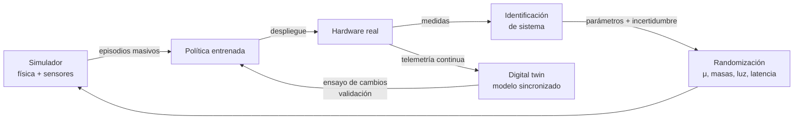

# 139 — Simulación, sim-to-real y digital twins

> [← Clase anterior](../../../classes/part-11-embodied-ai-robotics-and-computer-use/138-aprendizaje-por-imitacion/README.md) · [Índice de la parte](../README.md) · [Clase siguiente →](../../../classes/part-11-embodied-ai-robotics-and-computer-use/140-robots-colaborativos-y-seguridad-fisica/README.md)

**Parte:** 11 — IA encarnada, robótica y uso de computadores  
**Nivel:** experto · **Horas estimadas:** 6  
**Laboratorio:** `robotics` · **Estado:** `EXECUTABLE_CORE`

## 🎯 Propósito

Comprender **simulación, sim-to-real y digital twins** dentro de la evolución de la inteligencia
artificial, implementar un experimento mínimo verificable y distinguir qué parte
constituye evidencia frente a una afirmación todavía no comprobada.

## 📚 Resultados de aprendizaje

Al finalizar podrás:

1. Explicar simulación, sim-to-real y digital twins usando los conceptos `simulation`, `sim-to-real`, `digital twin`, `domain randomization`.
2. Ejecutar el laboratorio con una semilla explícita y revisar su contrato JSON.
3. Identificar al menos un supuesto, una limitación y un riesgo de aplicación.
4. Comparar el enfoque con la etapa anterior de la ruta de aprendizaje.
5. Producir una evidencia reproducible y una conclusión que no exceda los datos.

## 🧩 Conceptos centrales

`simulation`, `sim-to-real`, `digital twin`, `domain randomization`

## 🗺️ Ubicación en el mapa de la IA

Las políticas aprendidas de las clases 137-138 necesitan millones de episodios
de práctica; el hardware real es lento, caro y se rompe. La simulación resolvió
el cuello de botella de datos de la robótica moderna — casi toda política de
locomoción o manipulación actual nace en un simulador — pero abrió otro
problema: el **reality gap**. Esta clase cubre las técnicas que cruzan ese
hueco (domain randomization, identificación de sistema) y el concepto
industrial de **digital twin**, y es el puente directo hacia la evaluación
segura de agentes que actúan (clases 140 y 144: probar límites en un entorno
sintético antes de tocar el mundo).

## 📖 Fundamentos

### 🖥️ Por qué simular

Un simulador físico (MuJoCo, Isaac Lab/Gym, PyBullet, Gazebo) integra la
dinámica `s_{t+1} = f(s_t, a_t)` con modelos de contacto, fricción y sensores.
Aporta: (1) **escala** — miles de entornos en paralelo en GPU, años de
experiencia por día; (2) **seguridad** — los fallos no cuestan hardware ni
hieren a nadie; (3) **ground truth** — la pose exacta está disponible para
recompensas y métricas, sin SLAM ni ruido; (4) **reproducibilidad** — misma
semilla, mismo episodio (el mismo principio de los labs de este programa).

### 🕳️ El reality gap

La política sobreajusta a los detalles del simulador: coeficientes de fricción
exactos, latencia cero, dinámica de motores idealizada, texturas e iluminación
sintéticas. En el robot real todo eso difiere y el rendimiento se derrumba. El
gap tiene dos componentes: **dinámico** (física mal modelada: fricción,
holguras, latencias) y **perceptivo** (las imágenes reales no se parecen a las
renderizadas).

### 🎲 Domain randomization

Idea (Tobin et al., 2017 — arXiv:1703.06907): en lugar de hacer el simulador
perfecto, hacerlo **variado**. Se aleatorizan parámetros en cada episodio:

```text
perceptivo: texturas, colores, iluminación, posición de cámara, ruido de imagen
dinámico:   masas ±20 %, fricción, ganancias de motor, latencias, perturbaciones

hipótesis: si la política funciona bajo TODAS las variaciones,
la realidad es "una randomización más" dentro de la distribución vista.
```

Trade-off central: más randomización ⇒ más robustez pero política más
conservadora y entrenamiento más difícil (el óptimo para el peor caso es peor
que el óptimo para el caso exacto). Refinamientos: **automatic domain
randomization** (ampliar rangos progresivamente, OpenAI Rubik's Cube) y
**randomización dirigida** por datos reales.

### 📏 Identificación de sistema y calibración del simulador

El enfoque complementario: medir el hardware real (masas, inercias, respuesta
de motores con un escalón de par, latencia con timestamps) y ajustar el
simulador hasta que sus trayectorias coincidan con las reales sobre el mismo
comando. En la práctica se combinan: identificar lo medible y randomizar el
residuo de incertidumbre alrededor de lo identificado.

### 🏭 Digital twins

Un **gemelo digital** es un modelo virtual de un activo físico concreto
*sincronizado con sus datos reales* (telemetría en vivo o periódica). La
diferencia con un simulador genérico: el simulador modela *una clase* de
sistemas; el gemelo modela *esta* fábrica, *este* robot, con su estado actual.
Usos: ensayar cambios sin parar la línea, predecir mantenimiento, entrenar y
validar políticas contra la configuración exacta de la planta. Riesgo
específico: un gemelo desincronizado es peor que ninguno, porque presta una
confianza que ya no merece.

## 🧮 Ejemplo trabajado

Política de empuje de un bloque entrenada en simulación. La fricción real del
bloque es `μ_real = 0.42`, pero nadie la conoce con precisión.

- **Sim exacto pero mal calibrado**: se entrena con `μ_sim = 0.60` fijo. La
  política aprende a empujar con la fuerza justa para μ=0.6; con μ=0.42 el
  bloque se desliza de más y el éxito cae del 95 % (sim) al ~40 % (real).
- **Domain randomization**: se entrena con `μ ~ Uniforme(0.3, 0.8)` muestreado
  por episodio. La política no puede memorizar una fricción: aprende a empujar
  y **corregir mirando el resultado** (una forma de feedback robusto, clase
  133). Rendimiento: ~88 % para *cualquier* μ del rango — incluido el 0.42
  real que nunca vio explícitamente. Nota el precio: en μ=0.6 exacto rinde 88 %,
  menos que el 95 % del especialista.
- **Identificación + randomización fina**: se mide la fricción real con 10
  empujes instrumentados → estimación `μ̂ = 0.44 ± 0.05`. Se entrena con
  `μ ~ Uniforme(0.39, 0.49)`: robustez donde importa, sin pagar el precio de
  cubrir 0.3-0.8. Éxito real ~93 %.

La regla general que ilustra el ejemplo: **randomiza lo que no puedas medir;
mide lo que puedas; nunca confíes en un valor puntual**.

## 📊 Propiedades y comparación

| Estrategia | Necesita datos reales | Robustez al gap | Rendimiento pico | Coste | Cuándo |
|---|---|---|---|---|---|
| Sim exacto sin más | No | Muy baja | Alto (en sim) | Bajo | Nunca para desplegar |
| Domain randomization | No | Alta | Medio (conservador) | Medio (entrenar es más duro) | Incertidumbre grande |
| Identificación de sistema | Sí (medidas) | Media-alta | Alto | Medio (instrumentación) | Parámetros medibles |
| Ident. + randomización fina | Sí | Alta | Alto | Medio-alto | Estándar actual |
| Fine-tuning en el real | Sí (episodios reales) | Alta | Alto | Alto y arriesgado | Última milla |
| Digital twin | Sí (telemetría continua) | Alta para *ese* activo | Alto | Alto (sincronización) | Industria, flotas |



## ⚠️ Errores conceptuales frecuentes

1. **"Con un simulador suficientemente bueno no hay gap."** Siempre hay
   residuo no modelado (desgaste, temperatura, cables); la pregunta no es si
   existe gap sino si la política es robusta a él.
2. **"Domain randomization es añadir ruido a las acciones."** Es variar los
   *parámetros del entorno* entre episodios; el ruido de acción es otra
   técnica (y no sustituye a la randomización de dinámica).
3. **"Más randomización siempre es mejor."** Rangos absurdamente amplios
   producen políticas timoratas o entrenamientos que no convergen; el rango
   debe reflejar la incertidumbre real.
4. **"El 95 % de éxito en sim se transfiere."** El número de simulación es una
   cota superior optimista; sin evaluación en el objetivo real solo es una
   hipótesis.
5. **"Digital twin = simulador con buen marketing."** Sin sincronización con
   telemetría del activo concreto no hay gemelo; esa sincronización es
   justamente lo caro y lo valioso.

## 🚀 Del aprendizaje a la operación

Falta entre esta clase y producción: infraestructura de simulación paralela
(GPU, vectorización de entornos), un protocolo de evaluación real con criterios
de parada segura, curvas de transferencia (éxito sim vs éxito real por nivel de
randomización) que justifiquen decisiones con datos, monitorización de deriva
del gemelo digital respecto a su activo, y un ciclo de re-identificación
periódica: el robot de hoy no es el de hace seis meses — rodamientos, holguras
y motores envejecen.

## 🧪 Laboratorio

```bash
python lab.py
```

El laboratorio llama a `ai_evolution.labs.run_lab("robotics")`. Esta
decisión evita 180 implementaciones divergentes: cada clase tiene un entrypoint
propio, pero los motores didácticos se prueban como una biblioteca común.

### 🔍 Evidencia esperada

- tipo de laboratorio y semilla;
- entradas o decisiones observables;
- resultado estructurado;
- lista `evidence` con hechos que pueden inspeccionarse;
- lista `limitations` que impide presentar la demo como producción.

## 📓 Notebooks

- [📓 `notebook.ipynb`](notebook.ipynb): recorrido guiado con la materia resumida.
- [✍️ `notebook_student.ipynb`](notebook_student.ipynb): ejercicios para resolver.
- [✅ `notebook_solution.ipynb`](notebook_solution.ipynb): solución de referencia explicada.

## 📝 Evaluación

| Criterio | Peso |
|---|---:|
| Comprensión conceptual | 25 % |
| Ejecución reproducible | 25 % |
| Interpretación basada en evidencia | 25 % |
| Riesgos, límites y mejora propuesta | 25 % |

Consulta [assessment.md](assessment.md) para preguntas y criterio de aceptación.

## ⚠️ Errores comunes

| Síntoma | Causa probable | Corrección |
|---|---|---|
| El código corre, pero no hay conclusión | Se confundió ejecución con aprendizaje | Explica qué demuestra y qué no demuestra |
| El resultado cambia sin explicación | No se registró semilla o configuración | Conserva semilla, versión y parámetros |
| Se promete uso real | Se extrapoló desde una demo educativa | Declara entorno, datos, límites y revisión humana |
| Se copia una métrica aislada | No existe baseline ni costo de error | Añade comparación y criterio de decisión |

## ❓ Preguntas frecuentes

**¿Debo usar una API comercial?**  
No. El núcleo funciona localmente. Las extensiones LIVE se documentan por separado.

**¿El laboratorio representa una implementación industrial?**  
No por sí solo. Enseña el contrato y el patrón; producción exige integración,
seguridad, observabilidad, pruebas y operación.

**¿Dónde profundizo?**  
Revisa las especializaciones enlazadas en el README raíz y la ruta siguiente.

## 🔗 Referencias

- [Tobin, J. et al. (2017). Domain Randomization for Transferring Deep Neural Networks from Simulation to the Real World. IROS. arXiv:1703.06907](https://arxiv.org/abs/1703.06907)
- [Peng, X. B. et al. (2018). Sim-to-Real Transfer of Robotic Control with Dynamics Randomization. ICRA. arXiv:1710.06537](https://arxiv.org/abs/1710.06537)
- [OpenAI et al. (2019). Solving Rubik's Cube with a Robot Hand (automatic domain randomization). arXiv:1910.07113](https://arxiv.org/abs/1910.07113)
- [Todorov, E., Erez, T. & Tassa, Y. (2012). MuJoCo: A physics engine for model-based control. IROS. DOI 10.1109/IROS.2012.6386109](https://doi.org/10.1109/IROS.2012.6386109)
- [MuJoCo — documentación oficial](https://mujoco.readthedocs.io/en/stable/overview.html)
- [Gazebo — documentación oficial](https://gazebosim.org/docs)

---

## ⬅️ Clase anterior

[138 — Aprendizaje por imitación](../../part-11-embodied-ai-robotics-and-computer-use/138-aprendizaje-por-imitacion/README.md)

## ➡️ Siguiente clase

[140 — Robots colaborativos y seguridad física](../../part-11-embodied-ai-robotics-and-computer-use/140-robots-colaborativos-y-seguridad-fisica/README.md)
