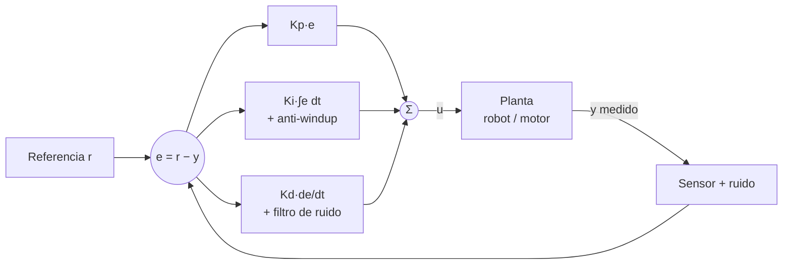

# 140 — Control clásico y control aprendido

> [← Clase anterior](../../../classes/part-11-embodied-ai-robotics-and-computer-use/139-planificacion-de-movimiento-y-navegacion/README.md) · [Índice de la parte](../README.md) · [Clase siguiente →](../../../classes/part-11-embodied-ai-robotics-and-computer-use/141-aprendizaje-por-imitacion/README.md)

**Parte:** 11 — IA encarnada, robótica y uso de computadores  
**Nivel:** experto · **Horas estimadas:** 6  
**Laboratorio:** `robotics` · **Estado:** `EXECUTABLE_CORE`

## 🎯 Propósito

Comprender **control clásico y control aprendido** dentro de la evolución de la inteligencia
artificial, implementar un experimento mínimo verificable y distinguir qué parte
constituye evidencia frente a una afirmación todavía no comprobada.

## 📚 Resultados de aprendizaje

Al finalizar podrás:

1. Explicar control clásico y control aprendido usando los conceptos `PID`, `control`, `policy`, `stability`.
2. Ejecutar el laboratorio con una semilla explícita y revisar su contrato JSON.
3. Identificar al menos un supuesto, una limitación y un riesgo de aplicación.
4. Comparar el enfoque con la etapa anterior de la ruta de aprendizaje.
5. Producir una evidencia reproducible y una conclusión que no exceda los datos.

## 🧩 Conceptos centrales

`PID`, `control`, `policy`, `stability`

## 🗺️ Ubicación en el mapa de la IA

La planificación (clase 139) produce trayectorias; el **control** es quien las
ejecuta cientos de veces por segundo contra la física real. El PID —
formulado hace un siglo — sigue gobernando la inmensa mayoría de lazos
industriales, y entender por qué funciona (y cuándo no) es requisito para
apreciar qué aporta el control aprendido por refuerzo, que hoy domina en
locomoción de cuadrúpedos y manipulación diestra. Esta clase une la robótica
con la Parte de RL del programa: una política aprendida *es* un controlador.

## 📖 Fundamentos

### 🎛️ El lazo de control y el error

Un controlador recibe una referencia `r(t)` (consigna) y el estado medido
`y(t)`, calcula el error `e(t) = r(t) − y(t)` y produce una acción `u(t)` que
empuja el sistema hacia la referencia. Métricas del lazo: tiempo de subida,
sobreimpulso (*overshoot*), tiempo de asentamiento y error estacionario.

### 🧮 PID: proporcional, integral, derivativo

```text
u(t) = Kp·e(t) + Ki·∫e(τ)dτ + Kd·de/dt

forma discreta (periodo Δt):
u_k = Kp·e_k + Ki·Σ(e_i·Δt) + Kd·(e_k − e_{k−1})/Δt
```

- **P**: reacciona al error presente. Solo-P deja **error estacionario** ante
  perturbaciones constantes (necesita error para generar acción) y demasiado
  Kp produce oscilación.
- **I**: acumula el pasado y elimina el error estacionario; en exceso causa
  sobreimpulso y *windup* (la integral se satura durante transitorios largos y
  luego descarga de golpe — se mitiga con anti-windup: limitar la integral).
- **D**: anticipa el futuro con la pendiente del error; amortigua
  oscilaciones, pero **amplifica el ruido** de medición (en la práctica se
  filtra o se deriva la medición, no el error).

**Sintonización**: reglas empíricas (Ziegler-Nichols: subir Kp hasta
oscilación sostenida en Ku con periodo Tu; usar `Kp=0.6Ku, Ki=1.2Ku/Tu,
Kd=0.075Ku·Tu`), o iterar P→PD→PID validando cada métrica. El ejemplo
trabajado muestra la iteración manual completa.

### ⚖️ Límites del control clásico

PID es lineal, monovariable (SISO) y sin modelo: excelente para lazos
individuales (temperatura, velocidad de una rueda), insuficiente cuando hay
fuertes acoplamientos no lineales (un cuadrúpedo con 12 articulaciones y
contactos intermitentes), restricciones activas o dinámica difícil de modelar.
El escalón intermedio es el control con modelo (LQR: óptimo para dinámica
lineal y coste cuadrático; MPC: optimiza en horizonte con restricciones).

### 🤖 Control aprendido (RL)

Una política `π(a|s)` entrenada con refuerzo (PPO, SAC) reemplaza al
controlador: el "diseño" se convierte en la definición de la función de
recompensa y del entorno de entrenamiento (simulación masiva, luego
sim-to-real — clase 142). Ventajas: maneja no linealidades, contactos y alta
dimensión; descubre estrategias no obvias. Costes: sin garantías formales de
estabilidad, hambre de datos, riesgo de *reward hacking*, y comportamiento
pobre fuera de la distribución de entrenamiento. El patrón operativo actual es
**híbrido**: la política RL genera consignas de alto nivel y PIDs de bajo
nivel las ejecutan en cada articulación, con envolventes de seguridad clásicas
alrededor (límites de par, watchdogs).

## 🧮 Ejemplo trabajado

Control de velocidad de crucero simplificado. Dinámica discreta
(`Δt = 0.1 s`): `v_{k+1} = v_k + 0.1·(u_k − 0.5·v_k)` (el término `−0.5·v`
es la fricción). Referencia `r = 10 m/s`, `v_0 = 0`.

**Intento 1 — solo P, `Kp = 1`**: en equilibrio `u = 0.5·v` (la acción debe
compensar la fricción). Con `u = 1·e`: `e = 0.5·v ⇒ 10 − v = 0.5·v ⇒
v_∞ = 6.67 m/s`. **Error estacionario de 3.33 m/s**: el P solo llega donde el
error genera exactamente la acción que pide la fricción.

**Intento 2 — `Kp = 5`**: `10 − v = 0.1·v ⇒ v_∞ = 9.09`. Menos error (0.91)
pero respuesta más brusca; con Kp muy grande y Δt finito el lazo discreto
llega a oscilar. Subir la ganancia *reduce* el error estacionario pero *nunca*
lo elimina.

**Intento 3 — PI, `Kp = 2, Ki = 1`**: la integral acumula el error y aporta en
equilibrio exactamente `u = 0.5·10 = 5` con `e = 0`. El error estacionario
desaparece; aparece un ligero sobreimpulso (~5-10 %) mientras la integral se
descarga. Si se observa windup al arrancar desde v=0 (integral crece durante
todo el transitorio), se limita la integral o se congela mientras `|e|` es
grande.

**Intento 4 — PID, añadir `Kd = 0.5`**: el término derivativo frena la
aproximación y recorta el sobreimpulso a ~1-2 % con tiempo de asentamiento
similar. Este es el flujo de sintonización manual estándar: P para velocidad
de respuesta, I para el error final, D para amortiguar.

## 📊 Propiedades y comparación

| Enfoque | Modelo requerido | Garantías | No linealidad / contactos | Coste de diseño | Uso típico |
|---|---|---|---|---|---|
| PID | Ninguno | Empíricas (por lazo) | Pobre | Horas | 90 % de lazos industriales |
| LQR | Lineal exacto | Óptimo (coste cuadrático) | No | Días (modelado) | Estabilización local |
| MPC | Modelo + restricciones | Restricciones garantizadas | Media | Semanas | Automoción, química |
| Política RL | Simulador | Ninguna formal | Excelente | Semanas + GPU | Locomoción, manipulación |
| Híbrido RL+PID | Simulador + lazos | Envolvente clásica | Excelente | Semanas | Cuadrúpedos comerciales |



## ⚠️ Errores conceptuales frecuentes

1. **"Subiendo Kp lo suficiente desaparece el error estacionario."** Solo lo
   reduce asintóticamente; eliminarlo ante perturbación constante requiere el
   término integral (o feedforward).
2. **"El término D predice el futuro del sistema."** Solo extrapola la
   pendiente del error; con medición ruidosa esa pendiente es basura
   amplificada — de ahí que muchos lazos industriales sean solo PI.
3. **"Una política RL entrenada es estable."** No hay garantía formal; la
   estabilidad empírica en simulación no se transfiere automáticamente al
   hardware ni a estados fuera de distribución.
4. **"PID está obsoleto frente a RL."** Los robots comerciales con RL lo usan
   *encima* de PIDs articulares; el clásico ejecuta, el aprendido decide.
5. **"Sintonizar = probar valores al azar."** Existe una lógica causal: P
   marca la agresividad, I el régimen final, D el amortiguamiento; cada
   síntoma (oscilación, error residual, sobreimpulso) señala el término a
   tocar.

## 🚀 Del aprendizaje a la operación

Entre este modelo didáctico y un controlador desplegado median: identificación
del sistema real (retardos, saturaciones, zonas muertas que el modelo lineal
ignora), ejecución con periodo garantizado (RT, prioridades), anti-windup y
*bumpless transfer* entre modos manual/automático, límites de seguridad
independientes del controlador (clase 143) y, para políticas RL, validación
sim-to-real con randomización de dominio (clase 142) más un plan de reversión
a control clásico cuando la política sale de su envolvente validada.

## 🧪 Laboratorio

```bash
python lab.py
```

El laboratorio llama a `ai_evolution.labs.run_lab("robotics")`. Esta
decisión evita 183 implementaciones divergentes: cada clase tiene un entrypoint
propio, pero los motores didácticos se prueban como una biblioteca común.

### 🔍 Evidencia esperada

- tipo de laboratorio y semilla;
- entradas o decisiones observables;
- resultado estructurado;
- lista `evidence` con hechos que pueden inspeccionarse;
- lista `limitations` que impide presentar la demo como producción.

## 📓 Notebooks

- [📓 `notebook.ipynb`](notebook.ipynb): recorrido guiado con la materia resumida.
- [✍️ `notebook_student.ipynb`](notebook_student.ipynb): ejercicios para resolver.
- [✅ `notebook_solution.ipynb`](notebook_solution.ipynb): solución de referencia explicada.

## 📝 Evaluación

| Criterio | Peso |
|---|---:|
| Comprensión conceptual | 25 % |
| Ejecución reproducible | 25 % |
| Interpretación basada en evidencia | 25 % |
| Riesgos, límites y mejora propuesta | 25 % |

Consulta [assessment.md](assessment.md) para preguntas y criterio de aceptación.

## ⚠️ Errores comunes

| Síntoma | Causa probable | Corrección |
|---|---|---|
| El código corre, pero no hay conclusión | Se confundió ejecución con aprendizaje | Explica qué demuestra y qué no demuestra |
| El resultado cambia sin explicación | No se registró semilla o configuración | Conserva semilla, versión y parámetros |
| Se promete uso real | Se extrapoló desde una demo educativa | Declara entorno, datos, límites y revisión humana |
| Se copia una métrica aislada | No existe baseline ni costo de error | Añade comparación y criterio de decisión |

## ❓ Preguntas frecuentes

**¿Debo usar una API comercial?**  
No. El núcleo funciona localmente. Las extensiones LIVE se documentan por separado.

**¿El laboratorio representa una implementación industrial?**  
No por sí solo. Enseña el contrato y el patrón; producción exige integración,
seguridad, observabilidad, pruebas y operación.

**¿Dónde profundizo?**  
Revisa las especializaciones enlazadas en el README raíz y la ruta siguiente.

## 🔗 Referencias

- [Åström, K. J. & Murray, R. M. Feedback Systems: An Introduction for Scientists and Engineers — PDF oficial gratuito (Caltech)](https://fbswiki.org/wiki/index.php/Feedback_Systems:_An_Introduction_for_Scientists_and_Engineers)
- [Gymnasium — entornos de control clásico (CartPole, Pendulum) para practicar control aprendido](https://gymnasium.farama.org/environments/classic_control/)
- [Sutton, R. & Barto, A. Reinforcement Learning: An Introduction, 2e — caps. 13 y 16 (políticas y aplicaciones de control)](http://incompleteideas.net/book/the-book-2nd.html)
- [Hwangbo, J. et al. (2019). Learning agile and dynamic motor skills for legged robots. Science Robotics. arXiv:1901.08652](https://arxiv.org/abs/1901.08652)
- [Siciliano, B. & Khatib, O. (eds.). Springer Handbook of Robotics, 2e — parte B, Design y Control](https://link.springer.com/book/10.1007/978-3-319-32552-1)
- [ros2_control — documentación oficial](https://control.ros.org/rolling/index.html)

---

## ⬅️ Clase anterior

[139 — Planificación de movimiento y navegación](../../part-11-embodied-ai-robotics-and-computer-use/139-planificacion-de-movimiento-y-navegacion/README.md)

## ➡️ Siguiente clase

[141 — Aprendizaje por imitación](../../part-11-embodied-ai-robotics-and-computer-use/141-aprendizaje-por-imitacion/README.md)
